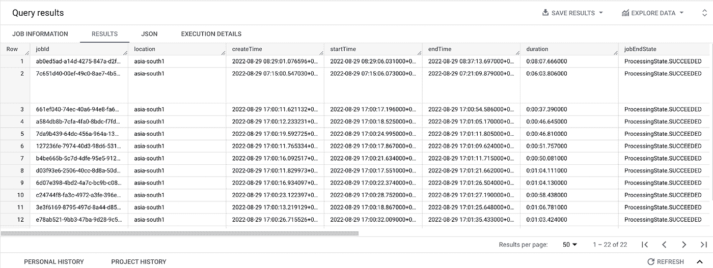

# 使用 GCP 大规模自动化 VOD 转码:第 2 部分

> 原文：<https://medium.com/google-cloud/automate-your-vod-transcoding-at-scale-with-gcp-part-2-b1da0e57823d?source=collection_archive---------1----------------------->

欢迎回到我的两部分博客的第二部分，用 GCP 大规模自动化你的视频点播转码。

我在第一部分开始时承诺涵盖端到端集成、自动化、安全性、日志记录和报告，展示了下面的架构图。

> ***图像:*** *转码自动化整体架构*

在第 1 部分中，我介绍了代码转换管道自动化，下面是整体架构部分。我们还构建了 cloud Pub/Sub 1 和 cloud Pub/Sub 2，它们在第 1 部分中没有用，但我们将在第 2 部分中使用它们。

如果你错过了这个博客系列的第一部分，那么我建议你先阅读第一部分，可以在[https://medium . com/Google-cloud/automate-your-VOD-transcoding-at-scale-with-GCP-part-1-87503 FDD 3 a9 f](/google-cloud/automate-your-vod-transcoding-at-scale-with-gcp-part-1-87503fdd3a9f)上找到，然后从这个博客开始。

# 第二部分:

在上一部分中，我介绍了自动化、日志记录和安全性(没有人工干预和使用 IAM 权限的原始访问)，在这一部分中，我将介绍集成、报告和可视化的其余部分。

# 转码开始状态:

我们在第 1 部分创建了一个发布/订阅主题(代码转换-开始-状态)，现在是时候将发布/订阅与 Google BigQuery (BQ)连接起来了，在这一部分，我们将从整体架构构建下面的部分。

# BigQuery (BQ)代码转换开始状态:

在创建 BQ 订阅之前，我们需要创建一个数据集和表。从谷歌云控制台进入 BQ，点击你的项目 id 旁边的三个点，然后点击创建数据集。

# 创建数据集:

在下面的示例中，我选择了 transcoding_jobs 作为数据集 ID，选择了 asia-south1 作为数据位置(您可以选择自己的数据集 ID 和数据位置),并保留了其余设置的默认配置。

# 创建转码-开始-状态表:

同样，单击数据集(transcoding_job)旁边的三个点，单击创建表格。

我使用代码转换-开始-状态作为表名，在 schema 上，点击编辑作为文本，并把 GitHub gist 中提供的 json 作为文本，然后点击创建表

[https://gist . github . com/nazir-kabani/bea 532 aa 37 a 0 C3 ad 86205 DD 83 f 0 f 397d](https://gist.github.com/nazir-kabani/bea532aa37a0c3ad86205dd83f0f397d)

# 发布/订阅 1 到 BQ 导出:

在我们为 BQ 导出创建发布/订阅之前，我们必须将 **BigQuery 表权限授予发布/订阅服务帐户**。

从 google cloud console，转到 IAM 点击添加，在新主体中添加发布/订阅服务帐户**(您的 ID 将类似于 service-{ Project-Number } @ GCP-sa-pubsub . IAM . gserviceaccount . com)**，在角色中添加 BigQuery 数据编辑器并保存。

现在，从谷歌云控制台进入发布/订阅->主题，打开转码-开始-状态。点击 EXPORT TO BIGQUERY

您将看到一个弹出窗口，决定是使用发布/订阅还是使用数据流，选择发布/订阅并单击继续。

在下一页上，选择您选择的 subscription-id，选择 transcoding_jobs 作为数据集，选择 transcoding-start-status 作为表，**选择 use topic schema，选择 drop unknown fields** ，然后单击 create。

就是这样。我们已经完成了将开始状态导出到 BQ 的代码转换，但是我们将在将代码转换完成状态导出到 BQ 后进行检查。

# 转码完成状态:

到目前为止容易吗？现在，让我们从整体架构构建以下部分架构，以将转码完成状态导出到 BQ。

在博客的第 1 部分，我们创建了一个名为代码转换-作业-通知的云发布/订阅 2 主题，并在代码转换器作业模板中使用了该主题。转码器 API 使用该主题发布作业完成后的转码作业状态，现在我们将使用该主题触发云函数 2 从转码器 API 获取作业完成元数据，并将作业完成元数据发布到云发布/订阅 3。

# 发布/订阅 3:

在构建第二个云函数之前，我们必须创建 Pub/Sub3，并在云函数 2 中使用它的主题 ID。

从 google cloud 控制台，转到发布/订阅->模式，然后单击创建模式。

给你的模式起一个你喜欢的名字，对于这个博客，我使用代码转换-完成-状态作为模式名。

选择 Avro 作为模式类型，并通过模式定义中 GitHub gist 下面的 json，然后单击 create。

[https://gist . github . com/nazir-kabani/9b 811d 1955 c 0 e 7803 de 7550090269092](https://gist.github.com/nazir-kabani/9b811d1955c0e7803de7550090269092)

现在，点击从模式页面创建主题**(不要转到主题页面创建)**。输入主题 ID 代码转换-完成-状态，然后点击创建主题。

# 云功能 2:

现在，我们将使用以下配置构建第二个云函数。

从 google cloud console，进入 cloud functions，点击 create function，给函数名取你喜欢的名字(我在这篇博客里用的是代码转换-作业-完成名)，选择代码转换器 API 和你的源输出桶可用的最近的地区。

在触发类型中，选择云发布/订阅，在选择云发布/订阅主题中选择转码-作业-通知，然后单击保存。

展开运行时、构建、连接和安全设置，进行以下更改，然后单击下一步。

*   在运行时下，将分配的内存更改为 1 GB
*   在连接下，选择允许内部流量和来自云负载平衡的流量

在下一个屏幕上，选择 Python 3.10 作为运行时环境，并从下面的 GitHub gist urls 复制/粘贴代码。(在粘贴代码之前，请不要忘记更改代码中的以下几行)。

*   更新第 40 行的项目 id
*   更新第 44 行中的输出时段名称
*   在第 46 和 47 行中更新 CDN 主机名或 IPv4 地址
*   更新第 62 行中的项目 id 和发布-订阅 3 主题名称(如果不同的话)

main . py—[https://gist . github . com/nazir-kabani/a 436 f 2e 9 ca 3 ed 1b 1276d 0 ced 14 EC 88 b 1](https://gist.github.com/nazir-kabani/a436f2e9ca3ed1b1276d0ced14ec88b1)

requirements . txt—[https://gist . github . com/nazir-kabani/d 702849967098 ABA 99 cf 63d 5 e 7 f 0833 f](https://gist.github.com/nazir-kabani/d702849967098aba99cf63d5e7f0833f)

接下来，单击部署。

# BigQuery (BQ)代码转换完成状态:

在前面的步骤中，我们已经创建了一个 transcoding_jobs 数据集和 transcoding-start-status 表。现在，我们将在同一数据集下创建一个转码完成状态表。

# 创建转码-完成-状态表:

单击数据集(transcoding_job)旁边的三个点，单击创建表格。

我使用代码转换-完成-状态作为表名，在 schema 上，点击 edit as text，将 GitHub gist 中提供的 json 作为文本，然后点击 create table。

[https://gist . github . com/nazir-kabani/fa 072136 cf 2f 8698 DCA 18313d 0 E0 e 49 f](https://gist.github.com/nazir-kabani/fa072136cf2f8698dca18313d0e0e49f)

# 发布/订阅 3 到 BQ 导出:

从谷歌云控制台进入发布/订阅->主题，打开转码-完成-状态。点击 EXPORT TO BIGQUERY

您将看到一个弹出窗口，决定是使用发布/订阅还是使用数据流，选择发布/订阅并单击继续。

在下一页中，选择您选择的 subscription-id，选择 transcoding_jobs 作为数据集，选择 transcoding-complete-status 作为表格，**选择 use topic schema，选择 drop unknown fields** ，然后单击 create。

# 连接表和构建仪表板:

就这样，现在我们完成了所有的集成，现在是时候在两个 BQ 表之间创建一个连接，并为代码转换作业创建一个单一窗口(在整体架构的下面)。

**在开始 BQ join 之前，我希望你上传大量的短视频(至少 4-5 个)到你的源存储桶，这样一旦你加入 BQ 表，它就会显示大量的填充有数据的行。**

# BQ 表连接:

从 google cloud console，进入 BQ，打开任意一个表，点击 new 选项卡中的查询。

**在更改项目名称、数据集名称和表名称**后运行以下查询(仅当您已经更改了我在博客中使用的名称)。

> 从“项目名称.代码转换 _ 作业.代码转换-完成-状态”中选择*
> 
> left join ` project-name . transcoding _ jobs . transcoding-start-status ` start
> 
> on start.jobId = complete.jobId

运行该查询后，您将在查询页面下方的 BQ 表中看到查询结果(类似于下图)。

# 使用 Data Studio 可视化数据:

本练习的最后一步是使用 Data Studio 可视化转码作业的数据。从查询结果上的 explore data 中，单击 explore with Data Studio，它将打开另一个带有 Data Studio 报告的窗口。

从这里，你可以使用数据工作室的帮助[https://support.google.com/datastudio/answer/6292570?建立你自己的报告 HL = en # zippy = % 2 CIN-this-article](https://support.google.com/datastudio/answer/6292570?hl=en#zippy=%2Cin-this-article)或者你可以使用我的模板([https://data studio . Google . com/reporting/0 a3 EC 04 b-581 b-4793-BCE 4-BD 9 fa 6 f 14 a 8d/preview](https://datastudio.google.com/reporting/0a3ec04b-581b-4793-bce4-bd9fa6f14a8d/preview))来构建你的报告，类似于下面的一个。

如需帮助，请参考帮助中心关于从模板页面创建报告的帮助文章。(【https://support.google.com/datastudio/answer/9851950? HL = en # zippy = % 2c in-this-article

# 庆祝🥳的时间到了

希望你一直陪着我，直到旅程结束，为你的 OTT 平台建立一个视频管道，给自己一个值得的奖励。

请与我分享您的反馈，并建议我应该在下一篇关于 GCP 媒体云产品的博客中包含哪些内容。

请查看 GCP 媒体云产品。

1.  代码转换器 API—[https://cloud.google.com/transcoder/docs](https://cloud.google.com/transcoder/docs)=
2.  直播 API—[https://cloud.google.com/livestream/docs](https://cloud.google.com/livestream/docs)
3.  视频拼接 API—[https://cloud.google.com/video-stitcher/docs](https://cloud.google.com/video-stitcher/docs)
4.  媒体 CDN—[https://cloud.google.com/media-cdn](https://cloud.google.com/media-cdn)

本博客的参考链接。

1.  本博客系列的第 1 部分—[https://medium . com/Google-cloud/automate-your-VOD-transcode-at-scale-with-GCP-part-1-87503 FDD 3 a9 f](/google-cloud/automate-your-vod-transcoding-at-scale-with-gcp-part-1-87503fdd3a9f)
2.  BQ 转码-开始-状态表方案—[https://gist . github . com/nazir-kabani/bea 532 aa 37 a 0 C3 ad 86205 DD 83 f 0 f 397d](https://gist.github.com/nazir-kabani/bea532aa37a0c3ad86205dd83f0f397d)
3.  Pub/Sub 3 转码-完成-状态-模式—[https://gist . github . com/nazir-kabani/9 b 811d 1955 c0e 7803 de 7550090269092](https://gist.github.com/nazir-kabani/9b811d1955c0e7803de7550090269092)
4.  云函数 2 main . py—[https://gist . github . com/nazir-kabani/a 436 f 2e 9 ca 3 ed 1 b 1276d 0 ced 14 EC 88 b 1](https://gist.github.com/nazir-kabani/a436f2e9ca3ed1b1276d0ced14ec88b1)
5.  云函数 2 requirements . txt—[https://gist . github . com/nazir-kabani/d 702849967098 ABA 99 cf 63 D5 e7f 0833 f](https://gist.github.com/nazir-kabani/d702849967098aba99cf63d5e7f0833f)
6.  BQ 转码-完成-状态表模式—[https://gist . github . com/nazir-kabani/fa 072136 cf 2f 8698 DCA 18313d 0 E0 e 49 f](https://gist.github.com/nazir-kabani/fa072136cf2f8698dca18313d0e0e49f)