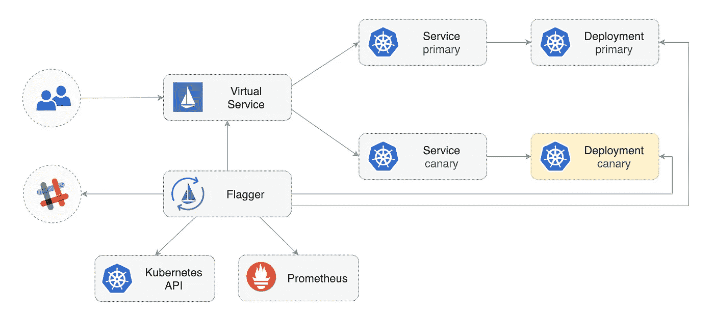
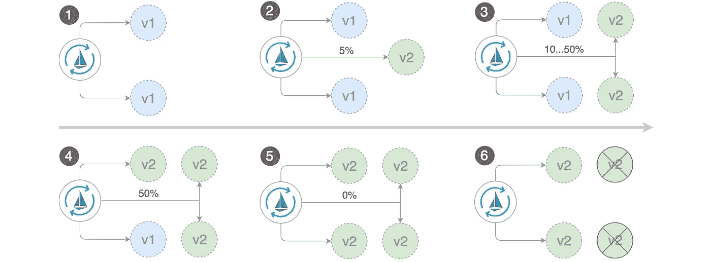
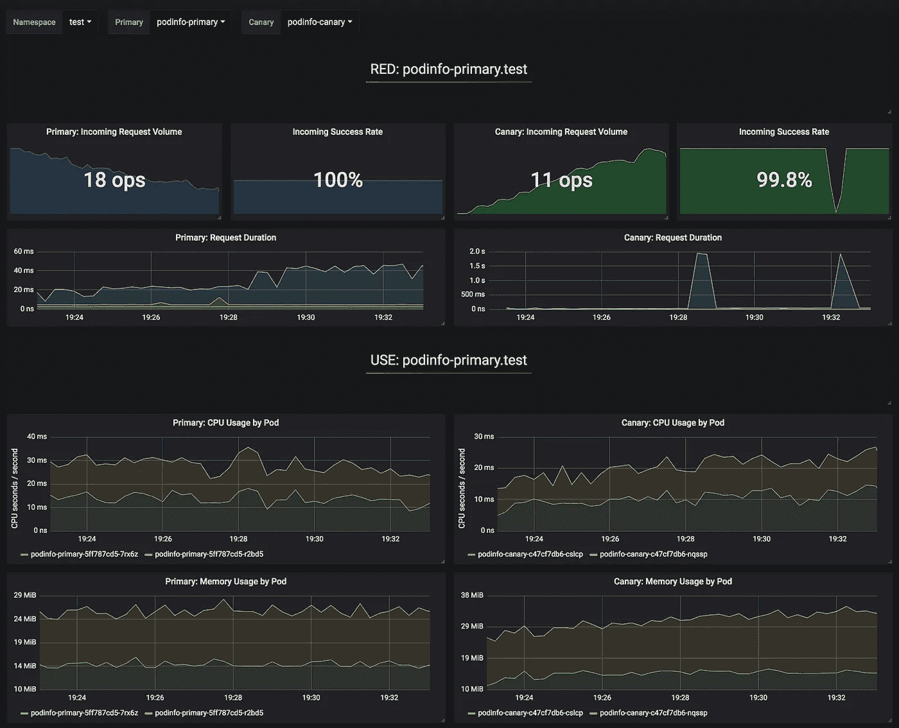
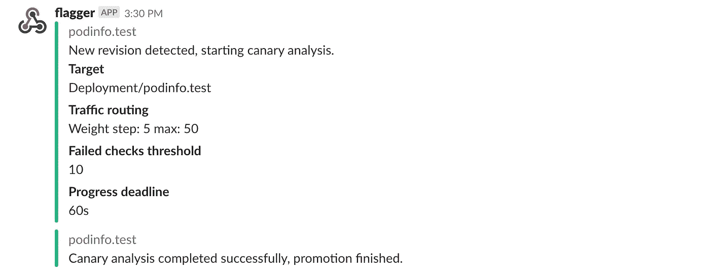
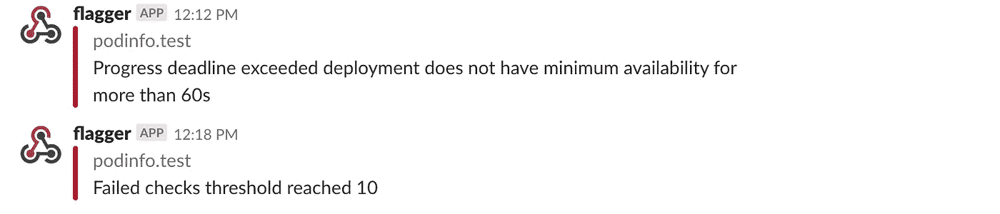

# 使用 Flagger 和 Istio 自动部署金丝雀

> 原文：<https://medium.com/google-cloud/automated-canary-deployments-with-flagger-and-istio-ac747827f9d1?source=collection_archive---------0----------------------->

连续交付被接受为企业软件实践，并且是成熟的连续集成原则的自然发展。然而，持续部署仍然非常少见，这可能是由于管理的复杂性以及担心失败的部署会影响系统可用性。

[Flagger](https://github.com/weaveworks/flagger) 是一个开源的 Kubernetes 运营商，旨在解决这种复杂性。它利用 Istio 的流量转移和 Prometheus 指标来分析应用在受控部署期间的行为，从而自动推广 canary 部署。

Flagger 可以针对以下部署策略运行自动化应用程序分析、升级和回滚:

*   金丝雀(渐进式交通转移)
*   A/B 测试(HTTP 头和 cookies 流量路由)
*   蓝色/绿色(流量开关或镜像)

对于 Canary 部署和 A/B 测试，您需要一个第 7 层流量管理解决方案，如服务网格(Istio、Linkerd、App Mesh)或入口控制器(Contour、NGINX、Gloo)。对于蓝/绿部署，不需要服务网格或入口控制器。

以下是在谷歌 Kubernetes 引擎(GKE)上设置和使用 Flagger 的分步指南。

# Kubernetes 集群设置

首先，您将使用 Istio 插件创建一个 GKE 集群(如果您没有 GCP 帐户，您可以在此注册[获得免费积分)。](https://cloud.google.com/free/)

登录 Google Cloud，创建一个项目并为其启用计费。安装 [gcloud](https://cloud.google.com/sdk/) 命令行实用程序，用`gcloud init`配置你的项目。

设置默认项目、计算区域和区域(用您自己的项目替换`PROJECT_ID`):

```
gcloud config set project PROJECT_ID
gcloud config set compute/region us-central1
gcloud config set compute/zone us-central1-a
```

启用 GKE 服务，并使用 HPA 和 Istio 附件创建集群:

```
gcloud services enable container.googleapis.comK8S_VERSION=$(gcloud beta container get-server-config --format=json | jq -r '.validMasterVersions[0]')gcloud beta container clusters create istio \
--cluster-version=${K8S_VERSION} \
--zone=us-central1-a \
--num-nodes=2 \
--machine-type=n1-standard-2 \
--disk-size=30 \
--enable-autorepair \
--no-enable-cloud-logging \
--no-enable-cloud-monitoring \
--addons=HorizontalPodAutoscaling,Istio \
--istio-config=auth=MTLS_PERMISSIVE
```

上面的命令将创建一个默认节点池，由两个`n1-standard-2` (vCPU: 2，RAM 7.5GB，DISK: 30GB)虚拟机组成。理想情况下，您会希望将 Istio 组件与您的工作负载隔离开来，但是在专用节点池上运行 Istio pods 并不容易。Istio 清单被认为是只读的，GKE 将撤消任何修改，如节点关联或 pod 反关联。

为`kubectl`设置凭证:

```
gcloud container clusters get-credentials istio
```

创建群集管理角色绑定:

```
kubectl create clusterrolebinding "cluster-admin-$(whoami)" \
--clusterrole=cluster-admin \
--user="$(gcloud config get-value core/account)"
```

安装[舵](https://docs.helm.sh/using_helm/#installing-helm)命令行工具:

```
brew install kubernetes-helm
```

家酿 2.0 现在也适用于 Linux。

为 Tiller 创建服务帐户和集群角色绑定:

```
kubectl -n kube-system create sa tiller && \
kubectl create clusterrolebinding tiller-cluster-rule \
--clusterrole=cluster-admin \
--serviceaccount=kube-system:tiller
```

在`kube-system`名称空间中部署 Tiller:

```
helm init --service-account tiller
```

你应该考虑在舵柄和舵柄之间使用 SSL，更多关于保护你的舵柄安装的信息，请参见 [docs.helm.sh](https://docs.helm.sh/using_helm/#securing-your-helm-installation) 。

通过以下方式验证您的设置:

```
kubectl -n istio-system get svc
```

几秒钟后，GCP 应该会为`istio-ingressgateway`服务分配一个外部 IP。

# Istio 入口网关设置

使用 Istio 入口 IP 创建一个名为`istio-gateway`的静态 IP 地址:

```
export GATEWAY_IP=$(kubectl -n istio-system get svc/istio-ingressgateway -ojson | jq -r .status.loadBalancer.ingress[0].ip)gcloud compute addresses create istio-gateway --addresses ${GATEWAY_IP} --region us-central1
```

接下来，你需要一个互联网域名和访问你的 DNS 注册。添加两条 A 记录(用您的域替换`example.com`):

```
istio.example.com   A ${GATEWAY_IP}
*.istio.example.com A ${GATEWAY_IP}
```

验证通配符 DNS 正在工作:

```
watch host test.istio.example.com
```

创建一个通用的 Istio 网关，在 HTTP:

```
**apiVersion**: networking.istio.io/v1alpha3
**kind**: Gateway
**metadata**:
  **name**: public-gateway
  **namespace**: istio-system
**spec**:
  **selector**:
    **istio**: ingressgateway
  **servers**:
    - **port**:
        **number**: 80
        **name**: http
        **protocol**: HTTP
      **hosts**:
        - "*"
```

将上述资源保存为 public-gateway.yaml，然后应用它:

```
kubectl apply -f ./public-gateway.yaml
```

没有 SSL，任何生产系统都不应该在互联网上公开服务。要使用 cert-manager、CloudDNS 和 Let's Encrypt 保护 Istio ingress 网关，请阅读 Flagger GKE [文档](https://docs.flagger.app/install/flagger-install-on-google-cloud)。

# 安装 Flagger

GKE Istio 附加组件不包括抓取 Istio 遥测服务的 Prometheus 实例。因为 Flagger 使用 Istio HTTP 指标来运行 canary 分析，所以您必须部署以下 Prometheus 配置，该配置类似于官方 Istio Helm 图表附带的配置。

```
kubectl -n istio-system apply -f \
https://storage.googleapis.com/gke-release/istio/release/1.0.6-gke.3/patches/install-prometheus.yaml
```

添加旗手头盔储存库:

```
helm repo add flagger [https://flagger.app](https://flagger.app)
```

在启用松弛通知的情况下，在`istio-system`名称空间中部署 Flagger:

```
helm upgrade -i flagger flagger/flagger \
--namespace=istio-system \
--set metricsServer=http://prometheus.istio-system:9090 \
--set slack.url=https://hooks.slack.com/services/YOUR-WEBHOOK-ID \
--set slack.channel=general \
--set slack.user=flagger
```

您可以在任何名称空间中安装 Flagger，只要它可以与端口 9090 上的 Istio Prometheus 服务对话。

Flagger 配有 Grafana 仪表板，用于金丝雀分析。在`istio-system`命名空间中安装 Grafana:

```
helm upgrade -i flagger-grafana flagger/grafana \
--namespace=istio-system \
--set url=http://prometheus.istio-system:9090 \
--set user=admin \
--set password=change-me
```

通过创建虚拟服务(用您的域替换`example.com`)通过公共网关公开 Grafana:

```
**apiVersion**: networking.istio.io/v1alpha3
**kind**: VirtualService
**metadata**:
  **name**: grafana
  **namespace**: istio-system
**spec**:
  **hosts**:
    - "grafana.istio.example.com"
  **gateways**:
    - public-gateway.istio-system.svc.cluster.local
  **http**:
    - **route**:
        - **destination**:
            **host**: flagger-grafana
```

将上述资源另存为 grafana-virtual-service.yaml，然后应用它:

```
kubectl apply -f ./grafana-virtual-service.yaml
```

在您的浏览器中导航到`http://grafana.istio.example.com`，您将被重定向到 Grafana 的登录页面。

# 使用 Flagger 部署 web 应用程序

Flagger 采用 Kubernetes 部署和可选的水平 pod 自动缩放器(HPA)，然后创建一系列对象(Kubernetes 部署、ClusterIP 服务和 Istio 虚拟服务)。这些对象在网格上公开应用程序，并驱动金丝雀分析和提升。



创建一个启用 Istio 边车注入的测试命名空间:

```
kubectl create ns test
kubectl label namespace test istio-injection=enabled
```

创建部署和水平窗格自动缩放器:

```
kubectl apply -k github.com/weaveworks/flagger//kustomize/podinfo
```

部署负载测试服务以在 canary 分析期间生成流量:

```
*helm* upgrade -i flagger-loadtester flagger/loadtester --namepace=test
```

创建 canary 自定义资源(用您自己的域替换`example.com`):

```
**apiVersion**: flagger.app/v1beta1
**kind**: Canary
**metadata**:
  **name**: podinfo
  **namespace**: test
**spec**:
  **targetRef**:
    **apiVersion**: apps/v1
    **kind**: Deployment
    **name**: podinfo
  **progressDeadlineSeconds**: 60
  **autoscalerRef**:
    **apiVersion**: autoscaling/v2beta1
    **kind**: HorizontalPodAutoscaler
    **name**: podinfo
  **service**:
    **port**: 9898
    **gateways**:
    - public-gateway.istio-system.svc.cluster.local
    **hosts**:
    - app.istio.example.com
    **trafficPolicy**:
      **tls**:
        # use ISTIO_MUTUAL when mTLS is enabled
        **mode**: DISABLE
  **analysis**:
    **interval**: 30s
    **threshold**: 10
    **maxWeight**: 50
    **stepWeight**: 5
    **metrics**:
    - **name**: request-success-rate
      **threshold**: 99
      **interval**: 30s
    - **name**: request-duration
      **threshold**: 500
      **interval**: 30s
    **webhooks**:
      - **name**: load-test
        **url**: [http://flagger-loadtester.test/](http://flagger-loadtester.test/)
        **timeout**: 5s
        **metadata**:
          **cmd**: "hey -z 1m -q 10 -c 2 [http://podinfo-canary.test:9898/](http://podinfo.test:9898/)"
```

将上述资源保存为 podinfo-canary.yaml，然后应用它:

```
kubectl apply -f ./podinfo-canary.yaml
```

如果成功，上述分析将运行五分钟，同时每半分钟验证一次 HTTP 指标。您可以使用公式:`interval * (maxWeight / stepWeight)`确定验证和升级 canary 部署所需的最短时间。加那利 CRD 油田在这里被记载[。](https://docs.flagger.app/usage/how-it-works)

几秒钟后，Flagger 将创建金丝雀对象:

```
**# applied** 
deployment.apps/podinfo
horizontalpodautoscaler.autoscaling/podinfo
canary.flagger.app/podinfo**# generated** 
deployment.apps/podinfo-primary
horizontalpodautoscaler.autoscaling/podinfo-primary
service/podinfo
service/podinfo-canary
service/podinfo-primary
destinationrule.networking.istio.io/podinfo-canary
destinationrule.networking.istio.io/podinfo-primary
virtualservice.networking.istio.io/podinfo
```

打开浏览器，导航到`app.istio.example.com`，你应该会看到[演示应用](https://github.com/stefanprodan/k8s-podinfo)的版本号。

# 自动化金丝雀分析和推广

Flagger 实现了一个控制循环，逐渐将流量转移到金丝雀，同时测量关键性能指标，如 HTTP 请求成功率、请求平均持续时间和 pod 运行状况。基于对 KPI 的分析，金丝雀被提升或中止，并且分析结果被发布到 Slack。



canary 部署由以下任何对象的更改触发:

*   部署 PodSpec(容器映像、命令、端口、环境等)
*   作为卷装载或映射到环境变量的配置映射
*   机密作为卷挂载或映射到环境变量

通过更新容器映像触发 canary 部署:

```
kubectl -n test set image deployment/podinfo \
podinfod=quay.io/stefanprodan/podinfo:3.1.1
```

Flagger 检测到部署版本发生了变化，并开始分析它:

```
kubectl -n test describe canary/podinfo

Events:

New revision detected podinfo.test
Scaling up podinfo.test
Waiting for podinfo.test rollout to finish: 0 of 1 updated replicas are available
Advance podinfo.test canary weight 5
Advance podinfo.test canary weight 10
Advance podinfo.test canary weight 15
Advance podinfo.test canary weight 20
Advance podinfo.test canary weight 25
Advance podinfo.test canary weight 30
Advance podinfo.test canary weight 35
Advance podinfo.test canary weight 40
Advance podinfo.test canary weight 45
Advance podinfo.test canary weight 50
Copying podinfo.test template spec to podinfo-primary.test
Waiting for podinfo-primary.test rollout to finish: 1 of 2 updated replicas are available
Promotion completed! Scaling down podinfo.test
```

在分析过程中，可以使用 Grafana 监控金丝雀的进程:



请注意，如果在 canary 分析期间对部署应用了新的更改，Flagger 将重新开始分析阶段。

列出集群中的所有金丝雀，包括:

```
watch kubectl get canaries --all-namespacesNAMESPACE   NAME      STATUS        WEIGHT   LASTTRANSITIONTIME
test        podinfo   Progressing   15       2019-01-16T14:05:07Z
prod        frontend  Succeeded     0        2019-01-15T16:15:07Z
prod        backend   Failed        0        2019-01-14T17:05:07Z
```

如果您启用了宽限通知，您应该会收到以下消息:



# 自动回滚

在 canary 分析期间，可能会生成合成的 HTTP 500 错误和高响应延迟，以测试 Flagger 是否暂停了部署。

创建一个 tester pod 并在其中执行:

```
kubectl -n test run tester \
--image=quay.io/stefanprodan/podinfo:1.2.1 \
-- ./podinfo --port=9898kubectl -n test exec -it tester-xx-xx sh
```

生成 HTTP 500 错误:

```
watch curl [http://podinfo-canary:9898/status/500](http://podinfo-canary:9898/status/500)
```

生成延迟:

```
watch curl [http://podinfo-canary:9898/delay/1](http://podinfo-canary:9898/delay/1)
```

当失败检查的数量达到 canary 分析阈值时，流量被路由回主节点，canary 被调整为零，部署被标记为失败。

canary 错误和延迟峰值已被记录为 Kubernetes 事件，并由 Flagger 以 JSON 格式记录:

```
kubectl -n istio-system logs deployment/flagger -f | jq .msg

Starting canary deployment for podinfo.test
Advance podinfo.test canary weight 5
Advance podinfo.test canary weight 10
Advance podinfo.test canary weight 15
Halt podinfo.test advancement success rate 69.17% < 99%
Halt podinfo.test advancement success rate 61.39% < 99%
Halt podinfo.test advancement success rate 55.06% < 99%
Halt podinfo.test advancement success rate 47.00% < 99%
Halt podinfo.test advancement success rate 37.00% < 99%
Halt podinfo.test advancement request duration 1.515s > 500ms
Halt podinfo.test advancement request duration 1.600s > 500ms
Halt podinfo.test advancement request duration 1.915s > 500ms
Halt podinfo.test advancement request duration 2.050s > 500ms
Halt podinfo.test advancement request duration 2.515s > 500ms
Rolling back podinfo.test failed checks threshold reached 10
Canary failed! Scaling down podinfo.test
```

如果您启用了可宽延时间通知，如果超过了进度截止日期，或者如果分析达到了最大失败检查数，您将收到一条消息:



# 流量镜像

对于执行读取操作的应用程序，Flagger 可以配置为使用流量镜像驱动 canary 释放。Istio 流量镜像将复制每个传入的请求，将一个请求发送到主服务器，另一个发送到 canary 服务。来自主服务器的响应被发送回用户，来自金丝雀的响应被丢弃。对这两个请求都收集了指标，因此只有当 canary 指标在阈值范围内时，部署才会继续。

注意，镜像应该用于那些**幂等的**或者能够被处理两次(一次由主服务器处理，一次由金丝雀服务器处理)的请求。

您可以通过将`stepWeight/maxWeight`替换为`iterations`并将`canaryAnalysis.mirror`设置为`true`来启用镜像:

```
**apiVersion**: flagger.app/v1beta1
**kind**: Canary
**spec**:
  **analysis**:
    **interval**: 1m
    **threshold**: 5
    **iterations:** 10
    **mirror:** true
    **metrics**:
    - **name**: request-success-rate
      **threshold**: 99
      **interval**: 1m
    - **name**: request-duration
      **threshold**: 500
      **interval**: 1m
    **webhooks**:
      - **name**: acceptance-test
        **type**: pre-rollout
        **url**: http://flagger-loadtester.test/
        **timeout**: 30s
        **metadata**:
          **type**: bash
          **cmd**: "curl -sd 't' podinfo-canary:9898/token | grep token"
      - **name**: load-test
        **url**: http://flagger-loadtester.test/
        **timeout**: 5s
        **metadata**:
          **cmd**: "hey -z 1m -q 10 -c 2 http://podinfo.test:9898/"
```

使用上述配置，Flagger 将通过以下步骤运行 canary 发布:

*   检测新版本(部署规范、机密或配置映射更改)
*   从零开始扩展金丝雀部署
*   等待 HPA 设置金丝雀最小复本
*   检查金丝雀豆荚健康状况
*   运行验收测试
*   如果测试失败，中止金丝雀释放
*   开始负载测试
*   将流量从主服务器镜像到金丝雀服务器
*   每分钟检查一次请求成功率和请求持续时间
*   如果达到度量检查失败阈值，则中止 canary 释放
*   达到迭代次数后停止流量镜像
*   将实时流量路由到金丝雀豆荚
*   提升金丝雀(更新主要机密、配置图和部署规范)
*   等待主部署展示完成
*   等待 HPA 设置主最小复本
*   检查主 pod 运行状况
*   将实时流量切换回主流量
*   缩放到零的金丝雀
*   发送带有金丝雀分析结果的通知

上述过程可以扩展为[自定义指标](https://docs.flagger.app/usage/metrics#custom-metrics)检查、 [webhooks](https://docs.flagger.app/usage/webhooks) 、[手动提升](https://docs.flagger.app/usage/webhooks#manual-gating)批准和 [Slack 或 MS 团队](https://docs.flagger.app/usage/alerting)通知。

# 包扎

在 Kubernetes 上运行像 Istio 这样的服务网格可以为您提供自动的度量、日志和跟踪，但是工作负载的部署仍然依赖于外部工具。Flagger 的目标是通过扩展 Istio 的[渐进式交付](https://redmonk.com/jgovernor/2018/08/06/towards-progressive-delivery/)功能来改变这种情况。

Flagger 与为 Kubernetes 制作的任何 CI/CD 解决方案兼容，canary 分析可以很容易地用 webhooks 扩展，用于运行系统集成/验收测试、负载测试或任何其他定制验证。由于 Flagger 是声明性的，并对 Kubernetes 事件做出反应，因此它可以与 [FluxCD](https://github.com/fluxcd/flux) 或 [JenkinsX](https://jenkins-x.io) 一起用于 GitOps 管道。如果你使用的是 JenkinsX，你可以使用 jx 插件安装 Flagger。

Flagger 由 [Weaveworks](https://www.weave.works) 赞助，并为 [Weave Cloud](https://www.weave.works/product/cloud/) 中的金丝雀部署提供动力。该项目正在 GKE、EKS 和采用 kubeadm 的裸机集群上进行测试。

如果您对改进 Flagger 有任何建议，请在 GitHub 上提交问题或 PR，地址为 [weaveworks/flagger](https://github.com/weaveworks/flagger) 。非常欢迎投稿！