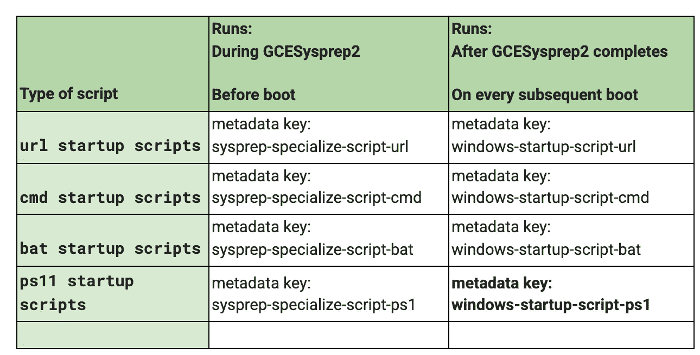
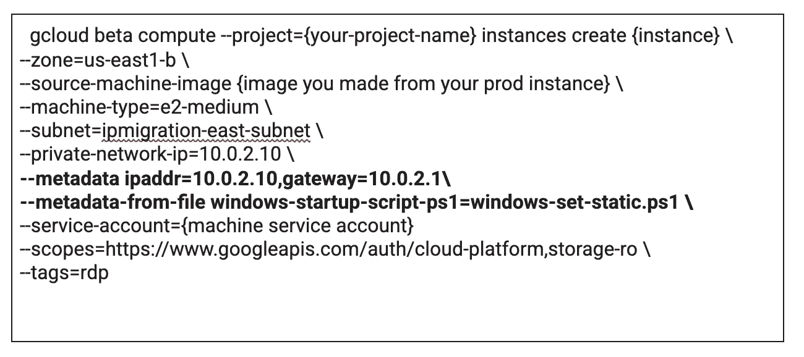
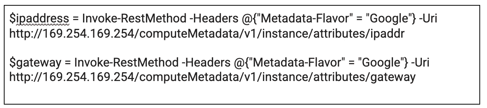
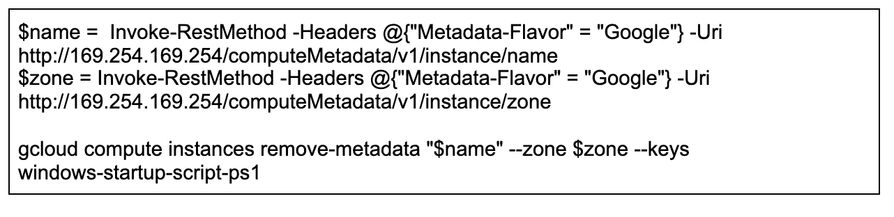

# GCP Windows 虚拟机的自动化、静态、重新 ip 化

> 原文：<https://medium.com/google-cloud/automated-static-re-ip-of-gcp-windows-vm-a30821b629f5?source=collection_archive---------1----------------------->

# 问题陈述

让我们把场景设在这里。您有一个实例被配置为在 GCP 地区使用静态 IP 地址。您的灾难恢复策略是在生产区域创建实例的映像，并在灾难恢复区域恢复它。生产子网和灾难恢复子网是不同的。

当您从该映像创建实例时，在模拟灾难恢复事件(希望是模拟)的过程中，您会惊恐地发现该实例无法在网络上通信，因为它被设置为原始静态 ip 地址，该地址不在它被恢复到的子网范围内。

这引发了许多话题，我不会在这里深入探讨。

1.  请使用 DHCP，以便云平台可以接管 IP 地址的分配，即使是“静态”的。
2.  创建映像是合适的备份方法吗？

# 我们如何解决这个问题？

GCP 上的实例有一个“来宾环境”。这些默认安装在所有谷歌提供的公共图像上。来宾环境是一组脚本、守护程序和二进制文件，它们读取元数据服务器的内容，以使虚拟机在计算引擎上正常运行。[元数据服务器](https://cloud.google.com/compute/docs/storing-retrieving-metadata)是用于将信息从客户端传输到客户操作系统的通信通道。

[这里有一个链接](https://cloud.google.com/compute/docs/images/guest-environment)，可以获得更多关于游客环境的信息。我们将广泛使用元数据服务器将所需的指标传递到虚拟机，以促进切换到新的静态 IP 地址的过程。

如果您愿意，可以更深入地研究代码。[这里有一个到 github repo 的链接](https://github.com/GoogleCloudPlatform/compute-image-windows)，它包含了主要在 powershell 中的 windows 代码。它包含可调用的函数，您可以利用这些函数来访问 windows 注册表、文件系统和 GCP 库，例如[运行时配置器](https://cloud.google.com/deployment-manager/runtime-configurator)。运行时配置器也是另一篇文章的主题，但是它可以帮助您同步环境的部署，以便在创建下一波基础设施时，所有的依赖项都已就绪。

回到手头的任务。这些如何帮助我们用新的静态 IP 部署一个实例？GCP 允许启动脚本运行，当一台机器启动时，非常好地记录[在这里](https://cloud.google.com/compute/docs/startupscript)。它们可以在云控制台、gcloud 命令行工具或 REST API 中提供。

它们可以传入:

1.  直接地
2.  作为谷歌云存储中文件的路径
3.  作为本地文件的路径

下表解释了时间和方式:

使用 Powershell 是因为它的丰富性，并且您需要它在 sysprep 完成后运行，因此将输入的用于标识脚本的元数据键是 **windows-startup-script-ps1。**这将指向一个本地 Powershell 文件，该文件将在第一次引导时以提升的管理员身份执行。它将在每次后续引导时运行，因此您需要在第一次也是唯一一次执行后将其从元数据服务器中删除。

# 获取脚本的参数

要使用新的 IP 地址设置实例，您需要提供以下信息:

*   IP 地址
*   门

要将它们传递到启动时以管理员身份运行的脚本中，请将它们放在元数据中。

## 向实例添加元数据

gcloud 命令的解释

*   我们使用的是 gcloud beta，所以我们可以直接从机器映像创建一个实例
*   我们传入 IP 和网关
*   metadata-from-file 参数在运行 gcloud 的实例上查找本地文件。该路径可以相对于您的工作目录。

注意:还可以使用以下命令向正在运行的实例添加任何随机元数据:

这不在本文讨论范围之内，但是您可以将脚本添加到一个正在运行的实例中，重新启动，它会改变它的 ip 地址。

# 从脚本访问实例元数据

您需要在脚本“windows-set-static.ps1”中获取“ipaddr”和“gateway”的元数据。

在 powershell 脚本中从元数据中获取这些值的命令如下:

注:169.254.169.254 是安装了[客户环境](https://cloud.google.com/compute/docs/images/guest-environment)的本地元数据服务器的地址。

从实例元数据中删除脚本的命令在最后完成，以防止后续执行:

**Powershell 脚本**

脚本可以在这里找到:[链接](https://github.com/barry-searle/win-crossregion-reip)

实例使用原始 ip 地址启动，该地址位于它无法通信的子网上。要解决这个问题，您需要:

*   启用 DHCP，以便它用本地 IP 地址和网关刷新 NIC
*   将适配器设置回静态
*   添加带有新 ip 地址和网关的新网络地址
*   将新网关也设置为 DNS 服务器地址(您可以将它作为另一段元数据传入)

Powershell 中实现这些目标的命令有:

*   set-netip 接口
*   新网络地址
*   获取网络路由
*   删除-网络路由
*   Set-DNSClientServerAddress

在我的环境中，这已经证明是一种很好的方法，但是在您的环境中，许多事情可能会有所不同，因此本文并不声称是该问题的最终解决方案。它概述了一种对我有效的可能方法。