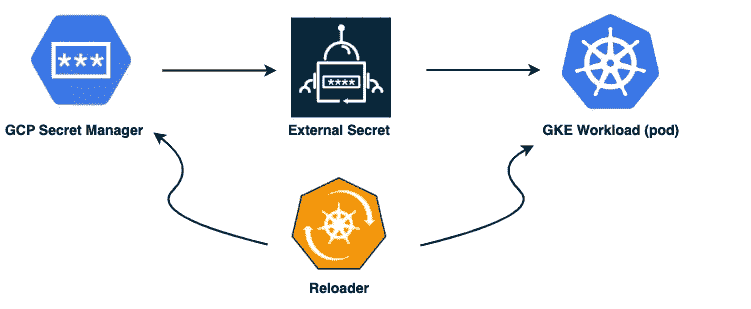
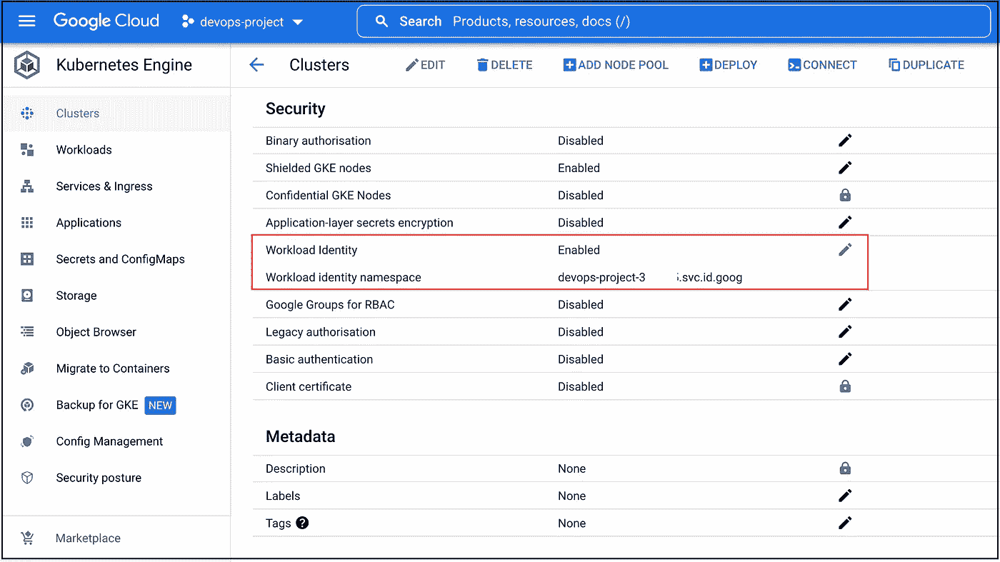
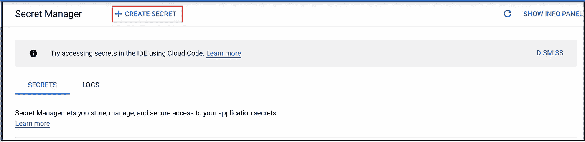
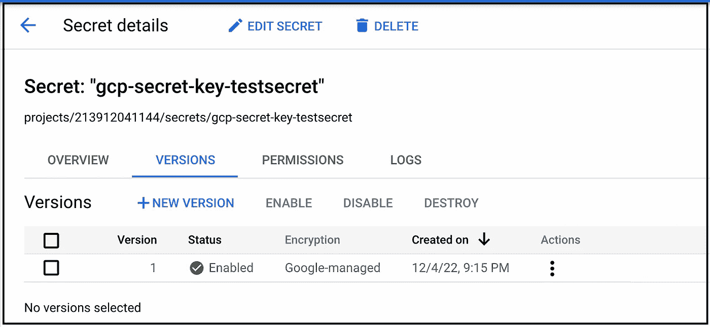
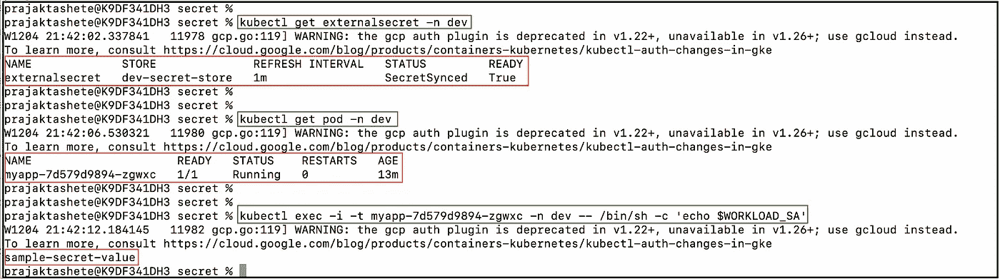
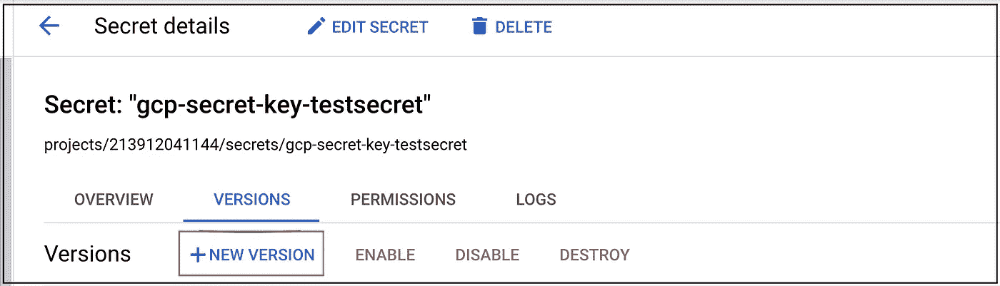
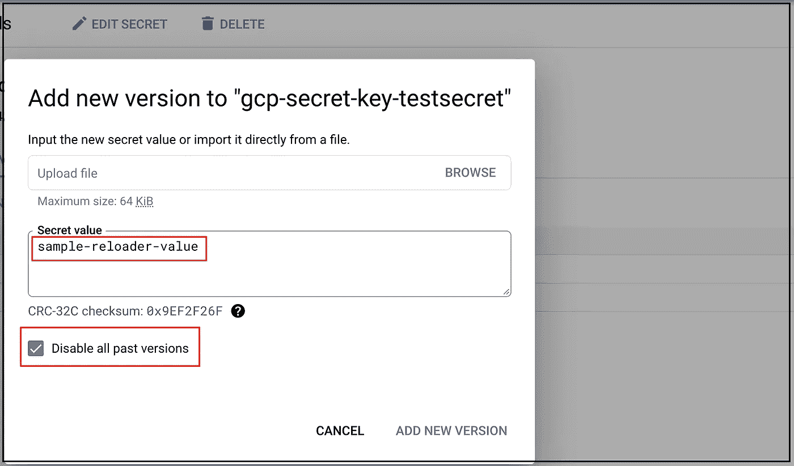
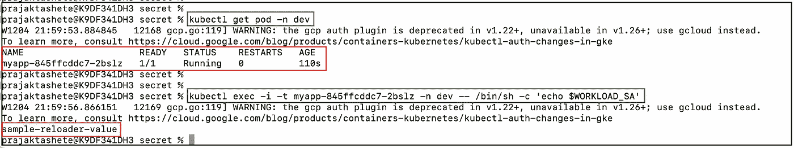

# GCP 机密和 GKE 工作负载之间的自动同步

> 原文：<https://medium.com/google-cloud/automated-sync-among-gcp-secrets-gke-workload-4797913576f2?source=collection_archive---------0----------------------->



在本文中，我们将使用**外部秘密操作符**集成 GCP 秘密管理器和 GKE(K8s)秘密，这是一个开源的 K8s 操作符。
我们还将涉及一个非常重要的需求，在使用 K8s 及其秘密时，我们可能至少会遇到一次，每当我们更新 Kubernetes 中作为环境变量传递的秘密时，我们都需要重启 pod 以获取更改。我们将通过使用名为 **Reloader 的控制器来解决这个问题。**

**执行步骤:**

要求 1:将 GCP 秘密管理器整合到 K8s 秘密中

**1。1.**创建新的私有 GKE 集群
**1。2.**在 **GCP 秘密管理器
1 中创建一个秘密。3.**在 GKE 集群
**1 上启用**工作负载标识**。4.**使用
**1 舵安装外部秘密操作器。5.**部署清单文件
1。6.验证

要求 2:秘密更新时滚动升级

**2。1.** Stakater 重装器安装
**2。2.**更新清单文件以使用 stakater reloader 注释
**2。3.**验证

现在让我们试着详细理解这两个要求。

## **要求 1:将 GCP 秘笈管理器整合到 K8s 秘笈**

我们需要储存在 GCP 秘密管理中的秘密在 GKE 舱中使用。为了完成这个要求，我们将使用**外部秘密操作符。**那么是什么呢？如何实施？下面是答案…来看看吧！！

**外部秘密运营商**是一个 Kubernetes 运营商，集成了外部秘密管理系统，如 [AWS Secrets Manager](https://aws.amazon.com/secrets-manager/) 、 [HashiCorp Vault](https://www.vaultproject.io/) 、 [Google Secrets Manager](https://cloud.google.com/secret-manager) 、 [Azure Key Vault](https://azure.microsoft.com/en-us/services/key-vault/) 、 [IBM Cloud Secrets Manager](https://www.ibm.com/cloud/secrets-manager) 等等。操作员从外部 API 读取信息，并自动将值注入到一个 [Kubernetes 秘密](https://kubernetes.io/docs/concepts/configuration/secret/)中。

ESO 是自定义 API 资源的集合——external secret、SecretStore 和 ClusterSecretStore，它们为存储和管理机密生命周期的外部 API 提供了用户友好的抽象。

现在我们已经理解了我们的第一个要求，让我们来完成它。
我们将从我们需要的**先决条件**开始:-

**1。1.创建新的私有 GKE 集群**
使用下面的 gcloud 命令创建集群并获取其凭证。

```
$ gcloud container clusters create dev-private-cluster-01 \
 --network <vpc-name>\
 --subnetwork <subnet-name> \
 --cluster-secondary-range-name <cluster-secondary-range-name> \
 --services-secondary-range-name <services-secondary-range-name> \
 --enable-private-nodes \
 --enable-ip-alias \
 --master-ipv4-cidr 172.16.0.16/28 \
 --enable-master-global-access - zone us-central1-b --num-nodes=1 --project=<PROJECT_ID> \
 --no-enable-master-authorized-networks --workload-pool=PROJECT_ID.svc.id.goog
```



**确保在 GKE 集群上启用工作负载标识**

获取群集的凭据:

```
$ gcloud container clusters get-credentials CLUSTER_NAME
```

将 CLUSTER_NAME 替换为启用了工作负载标识的集群的名称。
确保您已经配置了提供传出连接的云 NAT。
更多详情请查看云 NAT:
[https://cloud.google.com/nat/docs/overview](https://cloud.google.com/nat/docs/overview)

**1。2.在 GCP 秘密管理器中创建一个秘密** 从控制台创建秘密，我们需要通过我们在 GKE 内部运行的 pod 来访问它。以下是一些快照…



**点击创建密码按钮**


**填写秘密的细节**



注意:-我们将在后面的步骤中通过进入 GKE pod 来验证秘密的值，因为现在我们有一个样本值“样本-秘密-值”。

现在，我们已经准备好集群和 GCP 机密，我们将继续安装 ESO，并部署一些工作负载来访问机密。

**1。3.在 GKE 集群上启用工作负载标识**

在您的 Google Kubernetes 引擎(GKE)集群上启用和配置工作负载标识。工作负载身份允许 GKE 集群中的工作负载模拟身份和访问管理(IAM)服务帐户来访问 Google 云服务。要了解更多关于工作负载标识的工作原理，请参见[工作负载标识](https://cloud.google.com/kubernetes-engine/docs/concepts/workload-identity)。

GKE 豆荚将需要访问我们的 GCP 秘密经理，并与此服务认证，我们将使用 WKI。注意，在我们的例子中，我们已经在初始集群创建命令中处理了这一点，现在让我们来配置它。

**配置工作负载标识**

以下步骤向您展示了如何配置您的应用程序以使用工作负载标识(如果在集群上启用了工作负载标识)。

创建一个用于 Kubernetes 服务帐户的名称空间。您也可以使用默认的名称空间或任何现有的名称空间。

```
$ kubectl create namespace NAMESPACE
```

创建一个 Kubernetes 服务帐户供您的应用程序使用。您还可以在默认或任何现有的名称空间中使用默认的 Kubernetes 服务帐户。

```
$ kubectl create serviceaccount KSA_NAME \
 --namespace NAMESPACE
```

替换以下内容:

KSA _ 姓名:您的新 Kubernetes 服务帐户的名称。(workload-identity-ksa)
名称空间:服务帐户的 Kubernetes 名称空间的名称。(开发)

为您的应用程序创建一个 IAM 服务帐户，或者使用现有的 IAM 服务帐户。您可以在组织中的任何项目中使用任何 IAM 服务帐户。对于配置连接器，请为您选择的服务帐户应用 IAMServiceAccount 对象。

要使用 gcloud CLI 创建新的 IAM 服务帐户，请运行以下命令。

*注意:如果您在 gcloud CLI 中使用现有的 IAM 服务帐户，请跳过这一步。*

```
$ gcloud iam service-accounts create GSA_NAME \
 --project=GSA_PROJECT
```

替换以下内容:

GSA_NAME:新 IAM 服务帐户的名称。
GSA_PROJECT:您的 IAM 服务帐户的 Google Cloud 项目的项目 ID。

有关授权 IAM 服务帐户访问 Google Cloud APIs 的信息，请参见[了解服务帐户](https://cloud.google.com/iam/docs/understanding-service-accounts)。

确保您的 IAM 服务帐户具有所需的角色。您可以使用以下命令授予其他角色:

```
$ gcloud projects add-iam-policy-binding PROJECT_ID \
 --member "serviceAccount:GSA_NAME@GSA_PROJECT.iam.gserviceaccount.com" \
 --role "ROLE_NAME"
```

替换以下内容:

PROJECT_ID:您的 Google Cloud 项目 ID。GSA_NAME:您的 IAM 服务帐户的名称。
GSA_PROJECT:您的 IAM 服务帐户的 Google Cloud 项目的项目 ID。
ROLE_NAME:分配给你的服务帐户的 IAM 角色，如 roles/spanner.viewer.
确保服务帐户有**roles/secret manager . secret accessor**从 GCP 秘密管理器获取秘密。

通过在两个服务帐户之间添加 IAM 策略绑定，允许 Kubernetes 服务帐户模拟 IAM 服务帐户。这个绑定允许 Kubernetes 服务帐户充当 IAM 服务帐户。

```
$ gcloud iam service-accounts add-iam-policy-binding GSA_NAME@GSA_PROJECT.iam.gserviceaccount.com \
 --role roles/iam.workloadIdentityUser \
 --member "serviceAccount:PROJECT_ID.svc.id.goog[NAMESPACE/KSA_NAME]"
```

用 IAM 服务帐户的电子邮件地址注释 Kubernetes 服务帐户。

```
$ kubectl annotate serviceaccount KSA_NAME \
 --namespace NAMESPACE \
iam.gke.io/gcp-service-account=GSA_NAME@GSA_PROJECT.iam.gserviceaccount.com
```

**1。4.使用舵安装外部秘密操作器**

下面是安装 ESO 的舵命令。

*注意:-要自动安装和管理 CRDs 作为您的舵版本的一部分，您必须在您的舵安装命令中添加 set installCRDs = true 标志。*

```
$ helm repo add external-secrets https://charts.external-secrets.io
```

```
$ helm install external-secrets \
external-secrets/external-secrets \
-n external-secrets --create-namespace \
--set installCRDs=true
```

现在我们已经配置了 WKI，安装了外部机密让我们了解我们将在哪里使用它。当我们开始与外部秘密运营商合作时，我们有两个主要组件，一个是 **SecretStore** ，另一个是**外部秘密**。这两个是 K8s 中的对象类型，属于 API version*external-secrets.io/vebeta1.* 我们将研究它们中的每一个，并同时配置它们。

**1。5.部署清单文件**

## 秘密商店

[SecretStore](https://external-secrets.io/v0.7.0-rc1/api/secretstore/) 资源背后的理念是将身份验证/访问与工作负载所需的实际秘密和配置分开。ExternalSecret 指定获取什么，SecretStore 指定如何访问。这个资源是有名称空间的。

SecretStore.yaml

让我们使用以下命令部署秘密存储:

```
$ kubectl apply -f SecretStore.yaml
```

## 外部保密

一个 [ExternalSecret](https://external-secrets.io/v0.7.0-rc1/api/externalsecret/) 声明获取什么数据。它引用了一个知道如何访问数据的 SecretStore。控制器使用该外部秘密作为创建秘密的蓝图。

External-secrets 作为部署资源在 Kubernetes 集群中运行。它利用 CustomResourceDefinitions 来配置通过 SecretStore 资源对 secret 提供者的访问，并使用 ExternalSecret 资源管理 Kubernetes secret 资源。

外部秘密. yaml

使用以下命令创建 ExternalSecret:

```
$ kubectl apply -f ExternalSecret.yaml
```

创建后，确保外部机密处于机密同步和就绪状态:

```
$ kubectl get externalsecret -n dev
```

*注意:ExternalSecret 的工作是创建名为 workload-secret 的秘密，其密钥为 k8s 中的****k8s-secret-key-test secret****，引用名为****GCP-secret-key-test secret。*** *是时候将秘密传递给我们的 pod，并验证存储在 GCP 秘密管理器中的秘密是否被正确地反映给 GKE pod 了。*

下面是示例部署文件:

deployment.yaml 文件

通过执行以下命令，在 dev 名称空间中创建名为 myapp 的示例部署，并使用 nginx 映像:
*注意*:我们将秘密作为名为 WORKLOAD_SA 的环境变量进行传递。

```
$ kubectl apply -f deploy.yaml
```

**1。6.验证**
通过执行以下命令来验证秘密数据，该命令应与我们的 GCP 秘密值(即样本秘密值)相匹配:

```
$ kubectl get secret workload-secret -n dev -o jsonpath='{.data.testsecret}' | base64 -d
```

我们知道，秘密可以作为数据卷挂载，或者作为环境变量公开，供 Pod 中的容器使用。

这里，我们将秘密值存储在 ENV 变量 WORKLOAD_SA 中，让我们使用以下命令验证我们新创建的 pod 是否具有 GCP 秘密值:

```
$ kubectl get pod -n dev
$ kubectl exec -i -t myapp-7d579d9894-zgwxc -n dev -- /bin/sh -c 'echo $WORKLOAD_SA'
```



kubectl 命令输出

***耶！！我们已经成功地实现了我们的第一个要求。听起来不错吧？。没时间停下了，伙计！！…让我们也理解我们的第二个目标，然后我们也将着手实现它。***

## **需求 2:秘密更新时滚动升级**

至此，我们已经成功地将 GCP 秘密管理器与 GKE (K8s)秘密集成在一起，但是如果有人更新了 GCP 秘密管理器中的秘密呢？pod 会自动更新更改吗？不幸的是，没有。因为我们已经将密码作为环境变量传递，所以使更改生效的唯一方法是重启 pod，这对于 devops 人员来说听起来不太好，因为如果我们有数百个 pod 需要在每次密码更新后重启，这是不可行的。有一些第三方解决方案可以在密码更改时触发重启。

*注意:使用密码作为子路径卷装载的容器不接收自动密码更新。*

我们将使用的解决方案是**重装器**

## 斯塔卡特重装机

重新加载器可以监视配置图和密码中的更改，并对 pod 及其相关的部署配置、部署、守护程序集、状态集和部署进行滚动升级。

默认情况下，重新加载器部署在默认命名空间中，并监视所有命名空间中的机密和配置映射的更改。

**2。1.您可以从我们的公共图表库中添加一个重装程序到 helm，并使用下面提到的命令通过 helm 部署它。**

```
$ helm repo add stakater https://stakater.github.io/stakater-charts
```

```
$ helm repo update
```

```
$ helm install reloader stakater/reloader # For helm3 add - generate-name flag or set the release name
```

要仅在特定机密发生更改时执行滚动升级，请使用下面的批注。

**2。2.更新清单文件以使用 stakater reloader 注释**

对于一个名为 myapp 的部署，我们在前面的步骤中创建了一个名为 workload-secret 的秘密，然后将这个注释更新到您的部署的主元数据:-

使用逗号分隔的列表来定义多个机密。

```
kind: Deployment
metadata:
annotations:
secret.reloader.stakater.com/reload: "foo-secret,bar-secret,baz-secret"
spec:
template:
metadata:
```

并且在修改任何像这样注释的配置映射或秘密(在我们的例子中是 Externalsecret)时，重新加载器将触发滚动升级:

*refreshInterval: 1m -* 这样会每一分钟刷新一次秘笈。你可以按照你的要求保存时间。

使用以下命令更新部署和外部密码值:

```
$ kubectl apply -f deploy_after_reloader.yaml
$ kubectl apply -f ExternalSecret_reloader.yaml
```

**2。3.验证**
我们的秘密现在从 GCP 同步到了 Kubernetes，让我们通过更新 GCP 控制台中的秘密值来验证。



**点击+新版本**



**更新秘密值**

使用以下命令验证 pod 已重新启动并且密码值已更新:

```
$ kubectl get pod -n dev
$ kubectl exec -i -t myapp-845ffcddc7–2bslz -n dev -- /bin/bash -c 'echo $WORLOAD_SA'
```



输出

***牛逼！！*** 我们已经成功更新了 pod 内的秘密，这些秘密是按照我们的第二个要求通过滚动升级从 GCP 秘密管理器作为环境变量挂载的。

最后，我们实现了 GCP 机密和 GKE 工作负载之间的自动同步。

## 参考

*   [https://external-secrets.io/v0.7.0-rc1/](https://external-secrets.io/v0.7.0-rc1/)
*   [https://cloud . Google . com/kubernetes-engine/docs/how-to/workload-identity](https://cloud.google.com/kubernetes-engine/docs/how-to/workload-identity)
*   https://github.com/stakater/Reloader
*   【https://kubernetes.io/docs/concepts/configuration/secret/ 

## 开源代码库

[https://github . com/prajaktashete 7/External-Secrets-and-Reloader](https://github.com/prajaktashete7/External-Secrets-and-Reloader)

## 有问题吗？

如果你有任何问题，我很乐意在评论中阅读。在[中](/@prajaktashete24)或 [LinkedIn](https://www.linkedin.com/in/prajakta-shete-075b511b5/) 上关注我。