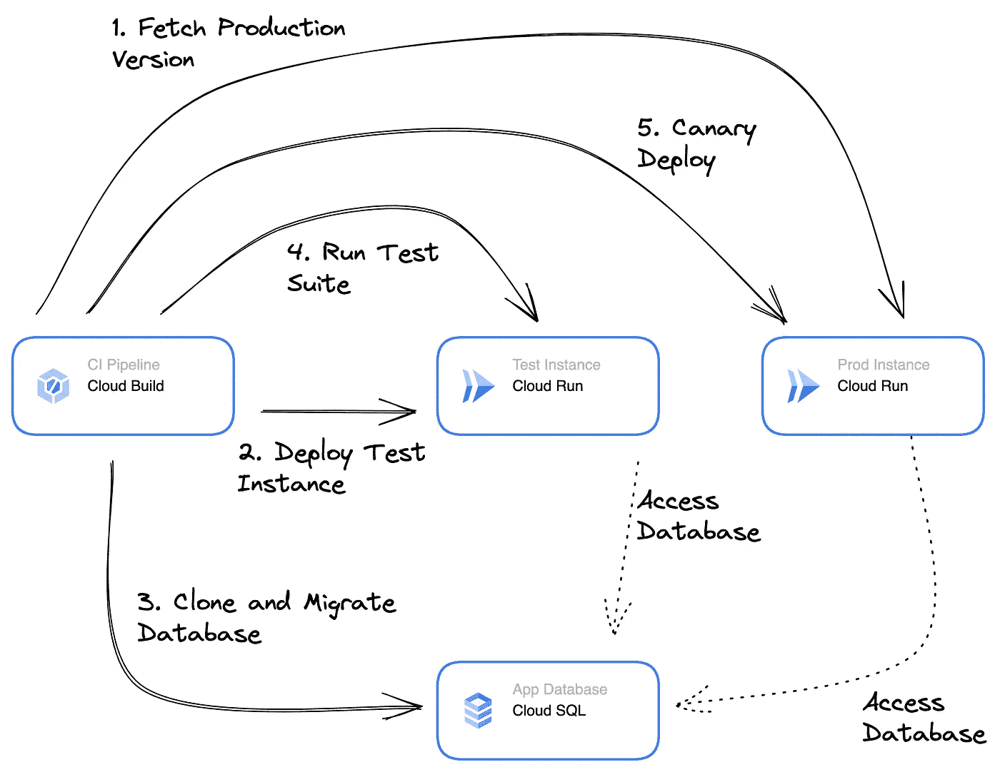

# 作为 CI 流程一部分的数据库兼容性测试

> 原文：<https://medium.com/google-cloud/automatic-database-compatibility-testing-7534e32476eb?source=collection_archive---------2----------------------->

在 [Unsplash](https://unsplash.com/s/photos/adapter?utm_source=unsplash&utm_medium=referral&utm_content=creditCopyText) 上[叫我弗雷德](https://unsplash.com/@callmefred?utm_source=unsplash&utm_medium=referral&utm_content=creditCopyText)

我非常喜欢现代的部署策略，比如蓝绿色部署或者更好的 canary 测试，但是我总是在数据库模式迁移上遇到困难。在过去，这经常阻止我的团队真正进行金丝雀测试，因为我们从来不确定新版本是否在数据库上引入了突破性的变化。当然，你可以试着把它作为一个字段添加到你的 JIRA 用户故事清单中，但是我不能 100%肯定它会一直被正确填写。

在这篇博文中，我将与您分享一种方法，您可以将其作为 CI/CD 管道的一部分来运行。我创建了一个示例存储库，展示了完整的运行设置。

 [## blog-examples/continuous-db-compatibility-testing at main cgrotz/blog-examples

### 此文件夹包含一些关于如何从 CI/CD 管道测试数据库模式向下兼容性的示例片段…

github.com](https://github.com/cgrotz/blog-examples/tree/main/continuous-db-compatibility-testing) 

数据库兼容性测试分 5 步进行

CI 管道将为应用程序、数据库迁移脚本和测试套件构建 3 个容器映像。随后，流水线执行以下步骤:
1 .使用云运行管理 API 获取生产环境中运行的容器映像版本。我们想测试新的数据库模式迁移是否与此应用版本兼容。
2。使用当前的生产版本，一个新的测试实例被部署到云运行
3。使用最新的数据库迁移容器映像
4 克隆和迁移当前的生产数据库。测试套件容器针对应用测试实例
5 运行。如果测试成功，就会触发 canary CD 管道将新版本部署到生产环境中。

使用像 [Flyway](https://flywaydb.org/) 和 [Liquibase](https://www.liquibase.org/) 这样的数据库迁移工具，我们现在有很好的工具来管理数据库模式。这比将数据库迁移脚本传递给数据库管理员要好得多。但是我有点犹豫是否将它们作为容器启动的一部分运行，更改 DB 模式的权限和增加的冷启动延迟并不总是可以接受的。因此，我更喜欢将它们打包在自己的容器中，作为连续交付管道的一部分，作为一个单独的步骤运行。这种设置使得数据库迁移成为一种更加通用的工具，例如允许我们测试数据库模式与不同应用程序版本的兼容性。对于这个例子，我使用的是 [golang-migrate](https://github.com/golang-migrate/migrate) ，这是一个很好的工具，可以用于 golang 应用程序的数据库迁移和独立迁移。

将集成测试打包到一个单独的容器中允许类似的通用重用。当您巧妙地标记或分组您的测试时，您甚至可以考虑使用您的集成测试的子集作为冒烟测试，您定期运行它来检查您的应用程序。打包的集成测试也可以和 [ZAProxy](https://github.com/zaproxy/zaproxy) 一起重用，用于安全测试(但那是另一个故事了)。

这篇博客中的方法使用 PostgreSQL，但是可以修改，以便也可以用于 NoSQL 数据库。你只需要改变一些功能。我选择克隆生产数据库。在 Postgres 中，当对数据库有写访问权限时，这是不可能的，所以在实际设置中，您可能希望使用集成数据库作为源，或者克隆整个 SQL 实例。

测试之后，您可以在您的 CD 工具或软件存储库中相应地标记发行包的兼容性，例如使用来自您的 CI/CD 管道的批准或二进制授权。

设置没有什么特别的，只是要执行的步骤。您可以按照`Readme.md`中的步骤设置该设置的测试版本。