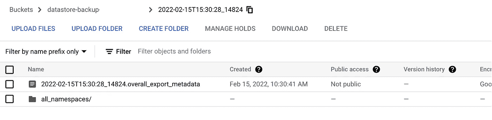

# 自动将数据存储复制到辅助数据存储实例

> 原文：<https://medium.com/google-cloud/automatic-datastore-replication-to-secondary-datastore-instance-3afb5f694d05?source=collection_archive---------0----------------------->

我的一个客户希望能够将特定类型的数据存储从生产实例导出到不同项目中的非生产数据存储实例。在传统 RDBMS 上进行开发的大多数团队都习惯于读取副本或辅助实例的概念，而客户在数据存储中寻找读取副本的等效物。

创建数据存储时，您可以选择“多区域”，这将在不同的区域创建另一个数据存储实例来备份您的数据，但用户无法查询。Google 使用它来查询第二个区域的数据，以防主区域的数据存储不可用。

**让我们看看需求:**

*   非生产项目应该将数据从生产数据存储实例自动导入到非生产数据存储中
*   目标数据存储区应每 24 小时与生产数据存储区同步一次
*   目前，该团队正在手动将生产中的数据存储实例导出和恢复到其他项目中，并且希望避免这种情况
*   通过使用生产数据的最新副本进行测试，QA 团队可以对解决方案的推出充满信心，并避免对陈旧数据进行测试

**挑战:**

*   数据存储仅允许离线导出到 GCS 存储桶。就在生产项目之外存储数据存储备份的要求而言，这很好，但不满足在辅助实例中自动恢复数据的要求。如何设置计划出口的 GCP 官方文件可以在这里找到链接—【https://cloud.google.com/datastore/docs/schedule-export 
*   我们必须考虑几种可能的自动化策略，以便在完成预定的导出后将数据导入到不同的项目数据存储实例中

**解决方案**


计划的数据存储导出和恢复

为了设置数据存储实例的连续导出，我们将使用云功能、云调度程序和发布/订阅的组合来激活计划导出并在目标项目中恢复。

**在源项目中**

*   创建发布订阅主题
*   向发布/订阅主题发布触发消息的云调度程序
*   创建一个由发布/订阅主题触发的云函数。云功能将调用数据存储导出 API，并提供 GCS 存储桶信息来备份数据存储数据

**在目的项目**

*   在目标项目中创建一个 GCS 存储桶
*   必须在目标项目中创建存储备份的 GCS 存储桶。这是必需的，因为只有当 GCS 存储桶在同一个项目中时，才能触发数据存储导入云功能的后续自动调用
*   任何新对象的创建都将触发数据存储导入云功能，但是仅当由“export_metadata”文件启动触发时，云功能才会触发数据存储导入 API 代码
*   数据存储导入云功能将启动长时间运行的操作，以恢复目标数据存储中的数据存储种类。
*   注意:数据存储导出和导入 API 通过批处理记录来减少数据存储 API 读取次数，从而有效地优化了备份过程，从而降低了成本

**服务账户权限:**

这个云函数使用项目的默认服务帐户来验证和授权其导出操作。创建项目时，会为您创建一个名为的默认服务帐户

*   project_id@appspot.gserviceaccount.com

此服务帐户需要权限才能开始导出操作并写入您的云存储桶。要授予这些权限，请将以下 IAM 角色分配给默认服务帐户:

*   云数据存储导入导出管理
*   存储桶上的存储管理员角色

类似地，对于导入功能，目标项目上的云功能服务帐户需要以下 IAM 角色

*   云数据存储导入导出管理
*   存储桶上的存储对象读取器和存储查看器角色

> **定时出口配置:**

```
SOURCE_PROJECT=<source-project-id>BUCKET=gs://<bucket>  # bucket name should be globally uniqueREGION=<region>DEST_PROJECT=<Destination-project-id>
```

**在目标项目中创建 GCS 存储桶**

```
gsutil mb -p $DEST_PROJECT -l northamerica-northeast1 -c NEARLINE $BUCKET
```

**在源项目中创建发布/订阅主题**

```
gcloud pubsub topics create datastorebackup --project=$SOURCE_PROJECT
```

**创建云调度程序，每天触发一次导出**

```
gcloud scheduler jobs create pubsub scheduledDatastoreExport \
--schedule="0 0 * * *" \
--topic=projects/$SOURCE_PROJECT/topics/datastorebackup \
--message-body='{ "bucket": "'"$BUCKET"'" }' --project=$SOURCE_PROJECT
```

**部署云功能触发数据存储导出**

```
git clone https://github.com/GoogleCloudPlatform/python-docs-samples.gitgcloud functions deploy datastore_export \
--source python-docs-samples/datastore/schedule-export/ \
--runtime python37 \
--entry-point datastore_export \
--trigger-topic datastorebackup \
--project $SOURCE_PROJECT \
--region $REGION
```

**云功能服务账户写入目的 GCS 桶的 IAM 权限**

```
gsutil iam ch 'serviceAccount:'"$SOURCE_PROJECT"'@appspot.gserviceaccount.com:admin' $BUCKET
```

**为云功能服务账户提供写入目的 GCS 桶的权限**

```
gcloud projects add-iam-policy-binding $SOURCE_PROJECT --member='serviceAccount:'"$SOURCE_PROJECT"'@appspot.gserviceaccount.com' --role='roles/datastore.importExportAdmin'
```

**激活云调度程序作业**

```
gcloud scheduler jobs run scheduledDatastoreExport --project $SOURCE_PROJECT
```

**使用手动触发器进行验证**

```
gcloud pubsub topics publish datastorebackup --project $SOURCE_PROJECT --message='{ "bucket": "'"$BUCKET"'"}'
```

这将触发数据存储导出作业，您可以验证导出操作和 GCS 存储桶中的输出

```
gcloud datastore operations list --project $SOURCE_PROJECT-----done: true
metadata:
'@type': type.googleapis.com/google.datastore.admin.v1.ExportEntitiesMetadatacommon:
endTime: '2022-02-14T23:05:53.830652Z'
operationType: EXPORT_ENTITIES
startTime: '2022-02-14T23:05:36.692059Z'
state: SUCCESSFUL
```

验证 GCS 桶的输出

```
gsutil ls $BUCKET
```

您的 GCS 存储桶将包含每种类型的文件夹和子文件夹，您还会看到一个“总体导出元数据”对象，这是我们将用于恢复的主要对象



具有数据存储导出的 GCS 存储桶的示例文件输出

> **Datastore 导入 GCS 功能并触发**

您可以使用您的云 shell 或通过 google cloud 帐户认证的本地 Shell 来部署下一组步骤

*   为云功能帐户提供数据存储导入的服务帐户权限以及对 GCS 存储桶的导出访问权限

```
gcloud config set project $DEST_PROJECTgsutil iam ch 'serviceAccount:'"$DEST_PROJECT"'@appspot.gserviceaccount.com:admin' $BUCKETgcloud projects add-iam-policy-binding $DEST_PROJECT --member='serviceAccount:'"$DEST_PROJECT"'@appspot.gserviceaccount.com' --role='roles/datastore.importExportAdmin'
```

**Python 云函数恢复数据**

创建一个目录来创建 datastore_import 函数

```
mkdir datastore-import
cd datastore-import
vi main.py
```

main.py

```
import base64
import json
import osfrom googleapiclient.discovery import build
from googleapiclient.discovery_cache.base import Cacheclass MemoryCache(Cache):
  _CACHE = {}def get(self, url):
  return MemoryCache._CACHE.get(url)def set(self, url, content):
  MemoryCache._CACHE[url] = contentdatastore = build("datastore", "v1", cache=MemoryCache())
project_id = os.environ.get("GCP_PROJECT")def datastore_import(event, context):
"""Triggered by a change to a Cloud Storage bucket.
Args:
event (dict): Event payload.context (google.cloud.functions.Context): Metadata for the event.""" file = event
  search_string = "overall_export_metadata"
  if search_string in file['name']: 
    print(f"Processing file: {file['name']}."
    path_name = "gs://" + file['bucket'] + "/" +file['name']       
    request_body = {"inputUrl": path_name}
    print (request_body)

    import_request = datastore.projects().import_(projectId=project_id, body=request_body) response = import_request.execute()
    print(response) else:
     print(f"Not an export Metadata file: {file['name']}.")
     return
```

Cloud 函数在每个上传到 GCS bucket 的对象上被触发，但是只有当文件名包含“整体导出元数据”时，导入请求才会被触发

**部署云功能**

```
gcloud functions deploy datastore_import \
--runtime python37 \
--trigger-resource $BUCKET \
--trigger-event google.storage.object.finalize \
--entry-point datastore_import \
--region $REGION
```

**运行全面的出口和进口验证:**

现在，您可以通过向 PubSub 主题发布消息来触发导出，从而手动触发完整的导出和导入测试

```
gcloud pubsub topics publish datastorebackup --project $SOURCE_PROJECT --message='{ "bucket": "'"$BUCKET"'"}'
```

瞧啊。根据数据存储的大小，您应该在几分钟内完成数据复制。