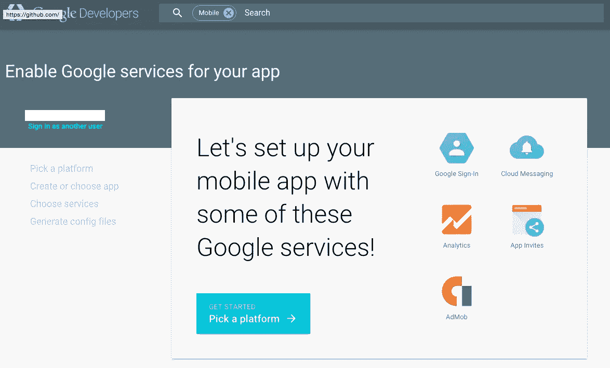

# 使用 Gradle 自动配置每个变量的 google_services.json

> 原文：<https://medium.com/google-cloud/automatic-per-variant-google-services-json-configurations-with-gradle-d3d3e40abc0e?source=collection_archive---------1----------------------->

您可以使用[https://developers.google.com/mobile/add](https://developers.google.com/mobile/add)轻松生成一个 *google_services.json* 文件，您的应用程序可以使用该文件为 AppEngine、Analytics、GCM 等指定 API 变量。按照 Google Developers 站点上的文档进行设置。



安装完成后，它运行良好——但是如果您想在您的*调试*与*发布*构建类型中使用不同的 API 键，该怎么办呢？不幸的是， *google_services.json* 必须驻留在您的 *:app* 模块的根目录中，而不是在 buildType/productVariant 文件夹中，所以 Gradle 不能通过文件夹放置自动为您处理这个问题。不要担心——通过一些自定义的梯度任务，我们可以解决这个问题！

首先，将每个构建类型各自的 *google_services.json* 放在以下位置:

```
app/src/debug/google_services.json
app/src/main/google_services.json
```

现在，让我们在你的:app 的 *build.gradle* 中创建一些 gradle 任务，以自动将适当的 *google_services.json* 移动到*app/Google _ services . JSON*

```
task switchToDebug(type: Copy) {
    description = 'Switches to DEBUG google-services.json'
    from "src/debug"
    include "google-services.json"
    into "."
}

task switchToRelease(type: Copy) {
    description = 'Switches to RELEASE google-services.json'
    from "src/release"
    include "google-services.json"
    into "."
}
```

很好，但是在构建应用程序之前必须手动运行这些任务非常麻烦。我们希望上述适当的复制任务在运行*:汇编调试*或*:汇编发布*之前的某个时间运行。让我们看看当*:assembler release*运行时会发生什么:

```
Zaks-MBP:my_awesome_application zak$ ./gradlew assembleRelease
Parallel execution is an incubating feature.
.... (other tasks)
:app:processReleaseGoogleServices
....
:app:assembleRelease
```

请注意*:app:processReleaseGoogleServices*任务。这个任务负责处理根 *google_services.json* 文件。我们希望正确的 *google_services.json* 被处理，所以我们必须事先立即运行我们的复制任务。

将此添加到您的 *build.gradle* 中。注意*后附*评估。

```
afterEvaluate {
    processDebugGoogleServices.dependsOn switchToDebug
    processReleaseGoogleServices.dependsOn switchToRelease
}
```

现在，无论何时调用*:app:processreleasegoleservices*，我们新定义的 *:app:switchToRelease* 都会被提前调用。*调试*构建类型的逻辑相同。你可以运行*:app:assembler release*，发布版本 *google_services.json* 会自动复制到你的 app 模块的根文件夹。

瞧啊。请记住，您可以通过 Gradle 的依赖管理系统挂钩到任何 Gradle 任务进行预处理。

你可以在这个[要点](https://gist.github.com/ZakTaccardi/708d5e2ad7d7d5bbd084)中看到代码本身。请随时提供对该流程的任何改进！