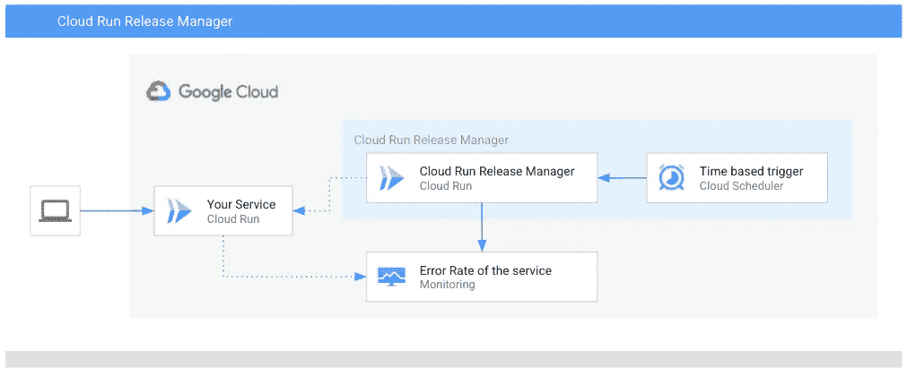
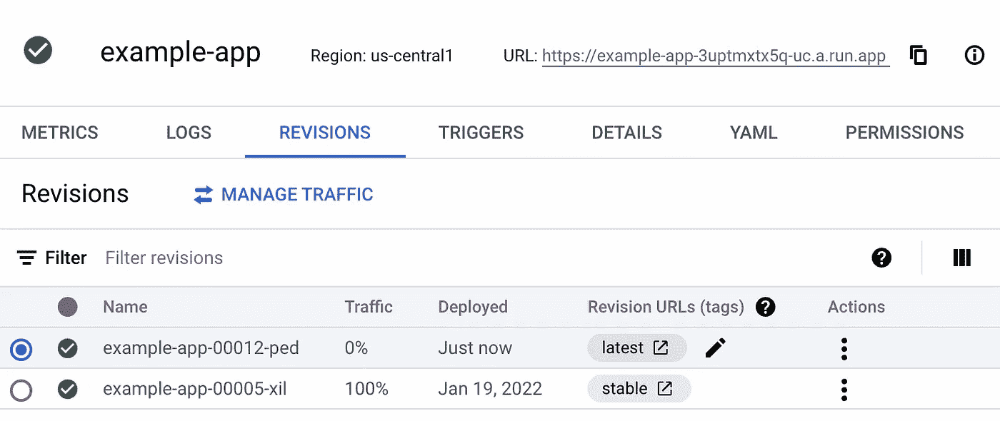
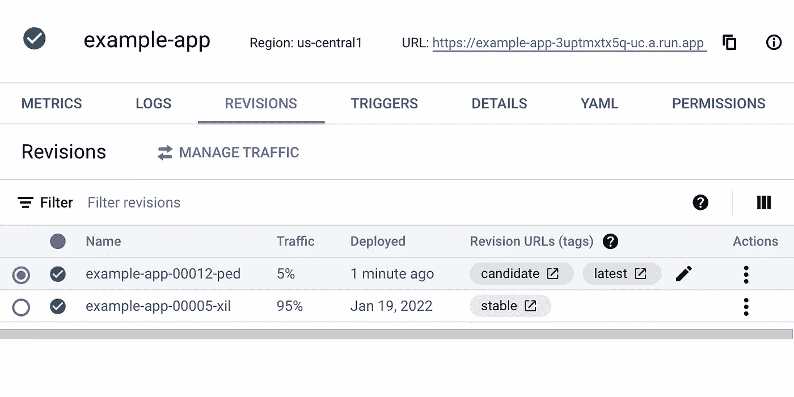

# 云运行时金丝雀发布的自动发布传播

> 原文：<https://medium.com/google-cloud/automatic-release-propagation-for-canary-releases-with-cloud-run-1ccc2ec74c7f?source=collection_archive---------0----------------------->

Joshua J. Cotten 在 [Unsplash](https://unsplash.com/s/photos/canary?utm_source=unsplash&utm_medium=referral&utm_content=creditCopyText) 上的照片

如今，当将软件部署到产品中时，团队通常要么使用蓝绿色部署策略，要么使用金丝雀部署。蓝绿色部署通常意味着您将应用程序的新版本与当前的稳定版本一起部署，并将流量切换到新版本。金丝雀部署是其下一步的发展，它不是立即切换流量，而是逐渐转移到新的实例，同时监控系统增加的故障率。但是实现金丝雀部署策略可能相当具有挑战性。

当然也有像 Spinnaker 或者 [Flagger](https://flagger.app) 这样的好工具，但是我发现它们使用起来很复杂或者很难安装。特别是对于 Spinnaker，由于我在过去几年中主要在 DevOps 团队中运行，我不希望为了部署我的软件而不得不操作另一个大型基础设施。我们通常退回到使用 shell 脚本编写蓝绿色部署脚本，如果部署没问题的话，这样做还可以，但是回滚总是一个痛苦的经历。通常我们仍然有一些手工任务。我们远没有真正的持续交付渠道。我一直喜欢 canary 部署，并试图在可能的情况下使用它们，但 canary 对我来说的顶峰是自动地、逐步地切换到新的发布版本，同时跟踪错误并在必要时回滚。

所以几周前，我对自己说，这可能是一个不错的兼职项目。使用 Cloud Run 的流量管理机制，并结合云监控来判断发布健康状况。我已经想开始编码了，当我发现已经由 [Ahmet](https://github.com/ahmetb) 和 [Valentin](https://github.com/gvso) 实现的时候，他们现在是在谷歌工作的 Google 员工。[云运行发布管理器](https://github.com/GoogleCloudPlatform/cloud-run-release-manager)提供了我所需要的一切。

repo 包含一个很棒的[设置指南](https://github.com/GoogleCloudPlatform/cloud-run-release-manager#setup-on-gcp)，你可以按照它进行设置，Cloud Run Release Manager 可以在几分钟内设置好。由于[云运行发布管理器](https://github.com/GoogleCloudPlatform/cloud-run-release-manager)本身运行在云运行中，它需要云调度器来触发发布传播的执行。[云运行发布管理器](https://github.com/GoogleCloudPlatform/cloud-run-release-manager)随后将跟踪您的云运行服务及其修订，并在必要时执行流量转移。由于采用了标准化平台，Cloud Run 提供了评估解决方案运行状况的指标，只需从云监控中检索即可，无需额外配置。部署状态使用注释保存在云运行服务本身上。为了注册自动发布传播的服务，您只需设置标签`rollout-strategy=gradual`

云运行发布管理器的构建块

当您更新服务时，您需要创建流量为 0 的新版本。您可以通过调用`gcloud run deploy <service_name> --image=<new_release_imagage> --no-traffic`轻松做到这一点。 [Cloud Run Release Manager](https://github.com/GoogleCloudPlatform/cloud-run-release-manager) 随后会逐渐将流量转移到新版本，同时检查 Google Cloud Monitoring 中的错误率。

创建新版本后进行流量分割

随着时间的推移，越来越多的流量将被路由到新版本。如果新版本出现错误，[云运行发布管理器](https://github.com/GoogleCloudPlatform/cloud-run-release-manager)将回滚到之前的稳定版本。

CRRM 第一次运行后的流量分流

我认为 [Cloud Run Release Manager](https://github.com/GoogleCloudPlatform/cloud-run-release-manager) 是一个使用云的力量来自动化你的设置的很好的例子。当然，还有其他很棒的工具来进行逐步推广，例如 Kubernetes 上用于服务网格的 [Flagger](http://flagger.app/) ，但我喜欢[云运行发布管理器](https://github.com/GoogleCloudPlatform/cloud-run-release-manager)的圆滑优雅。它不试图支持各种各样的服务网格或监控系统，所以它可以专注于做好一项工作。当然还有改进的空间，例如在未来扩展它以支持[云错误报告](https://cloud.google.com/error-reporting)会很棒，但是如果你在 Cloud Run 上运行你的服务，它是一个很棒的工具。