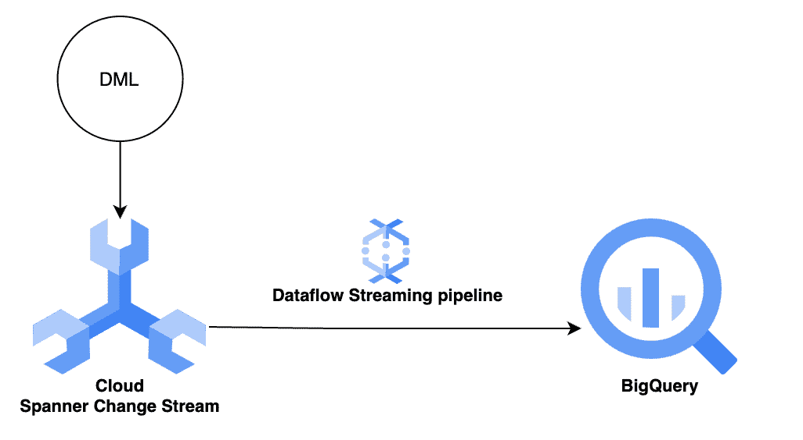
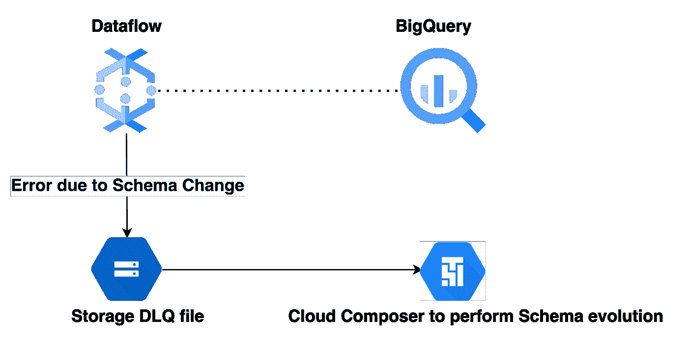
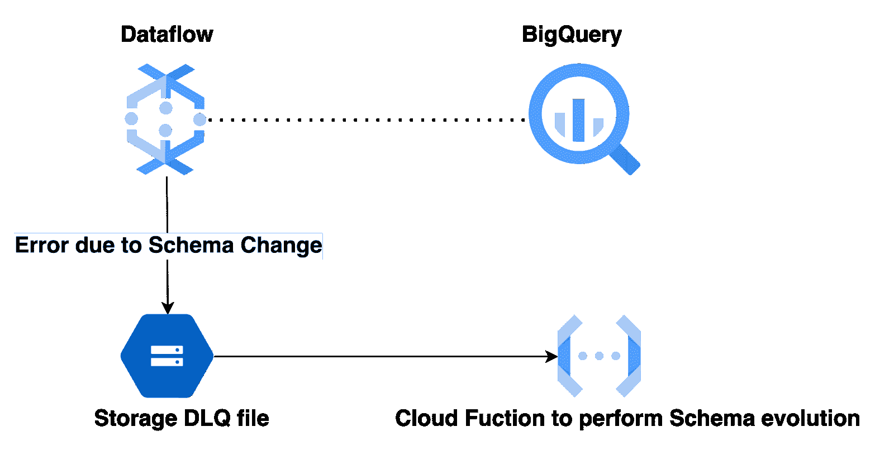

# 数据网格自助服务 BigQuery 中的自动模式演变，针对使用扳手更改流的扳手中的任何更改

> 原文：<https://medium.com/google-cloud/automatic-schema-evolution-in-bigquery-for-any-change-in-spanner-using-spanner-change-stream-d44710880855?source=collection_archive---------4----------------------->

在本系列的前一篇博客“[数据网格自助服务—从 Spanner 到 BigQuery 的摄取模式(网格的数据存储)](/google-cloud/mesh-self-service-data-ingestion-template-for-moving-data-from-spanner-to-bigquery-data-store-94186c0f13e5)”中，讨论了从 Spanner 到 BigQuery 获取数据的各种方法。使用扳手更改流和数据流描述了将扳手更改流式传输到 BigQuery 的首选方法之一。在这篇博客中，我们将讨论 Spanner 面临的模式演变挑战，以及如何使用各种方法解决这个挑战。

# 关于扳手更换流程:

一个**变更流**近乎实时地观察并流出云扳手数据库的*数据变更* —插入、更新和删除。它可以用于将 Spanner 数据更改复制到数据仓库，如 BigQuery，以便进行分析。数据流作业可用于从更改流中提取数据。Google 还提供了一些模板，让您可以为常见的变更流用例快速构建数据流管道，包括将流的所有数据变更发送到 BigQuery 数据集。

使用扳手将流和数据流作业转换为 BigQuery

# 目标:

目前，如果 Spanner 数据库中有模式更改(添加列)，使用更改流的数据流作业将失败，并且无法自动传播 BigQuery 中的更改。这个博客的目标是在 BigQuery 上实现模式的自动演化，无论何时在扳手表上有一个列的添加和数据的插入/更新，都会受到变更流的监视。

## 数据流模板云扳手将流更改为 BigQuery:

Cloud Spanner change streams to BigQuery 模板是一个流管道，它将 Cloud Spanner 数据更改记录进行流式处理，并使用数据流运行器 V2 将它们写入 big query 表中。

如果必要的 BigQuery 表不存在，管道将创建它们。否则，将使用现有的 BigQuery 表。现有 BigQuery 表的模式必须包含云扳手表的相应跟踪列以及未被“ignoreFields”选项显式忽略的附加元数据列。每一个新的 BigQuery 行都包含了来自 Cloud Spanner 表中相应行的变更流在变更记录的时间戳上观察到的所有列。

所有变更流监视的列都包含在每个 BigQuery 表行中，不管它们是否被云扳手事务修改。BigQuery 行中不包括未被监视的列。任何小于数据流水印的云扳手更改要么成功应用于 BigQuery 表，要么存储在死信队列中以供重试。与原始的云扳手提交时间戳排序相比，BigQuery 行是无序插入的。

## 数据流模板的局限性:

现在，如果 Spanner 数据库中存在模式更改(添加列)和对新列的任何数据更改(插入或更新)，数据流作业将失败，因为它无法在 BigQuery 中添加列和移动数据。它会生成一个错误，并将其写入谷歌云存储中的 DLQ(死信队列)文件。

## 数据流模板中的死信队列:

现在让我们讨论一下 Google 提供的数据流模板中的“DLQ(死信队列)”功能，以将从 [Cloud Spanner change streams 的更改流式传输到 BigQuery](https://cloud.google.com/dataflow/docs/guides/templates/provided-streaming#cloud-spanner-change-streams-to-bigquery) 。

每当使用数据流作业将数据从 Spanner Change 流传输到 BigQuery 时出现任何问题/错误，都会将日志写入 DLQ 存储桶内的错误文件中(默认为数据流作业的临时位置下的目录)。数据流尝试进行 5 次 DML 操作，然后将错误文件移动到桶内的一个严重文件夹中。

一个这样的错误场景可能是在 Spanner 端的一个表中添加列，该表被变更流监视。每当在列中插入或更新数据时，数据流作业都会对其进行跟踪。因为该列在 BigQuery 中不存在，所以它将在指定的存储桶位置生成一个 DLQ 错误文件，如上所述。

# 模式进化的可能解决方案:

现在，要在 BigQuery 中自动添加列和插入数据，可以使用以下不同的方法:

## **在 Cloud Composer 中使用传感器:**

如果模式演变频繁，并且 Composer 已经在项目的其他部分使用，我们可以利用 Composer 中的传感器，该传感器可以感知 Bucket 中的 DLQ 文件，并执行必要的任务来演变 BigQuery 模式和加载数据。

使用 Cloud Composer 中的传感器在 BigQuery 中进行模式进化

## **使用云功能:**

云功能是无服务器的轻量级 GCP 服务，可以在各种事件中调用。在我们的例子中，我们可以在桶中的 DLQ 文件创建事件上调用它。然后，我们可以编写自定义代码来检查文件内容，并在 BigQuery 中进行模式进化。如果在第一次尝试时添加了该列，在 DLQ 逻辑的后续重试中，数据会自动添加到 BigQuery 中，而不会丢失任何数据。

基于云函数的 BigQuery 模式进化

除了这些服务之外，还可以使用其他一些服务，比如 Pub/Sub 和云日志/监控警报，它们可以通知用户表中的模式已经更改。

# **总结:**

在本系列的前一部分 [Data Mesh Self Service —从 Spanner 到 BigQuery(Mesh 的数据存储)的摄取模式](/google-cloud/mesh-self-service-data-ingestion-template-for-moving-data-from-spanner-to-bigquery-data-store-94186c0f13e5)中，我们讨论了 Spanner 到 big query 模式、不同的数据加载方法，包括使用 Spanner 更改流和数据流的流数据插入。

在这一部分中，我们讨论了如何使用各种方法自动处理模式演化。一种方法是使用云函数，它将在 DLQ 文件到达时更新 BigQuery 模式。另一个讨论的是在 Cloud Composer 中使用传感器，它将定期检测存储中 DLQ 文件的到达。一旦在 GCS 找到该文件，它将更新 BigQuery 模式。

在本系列的下一部分中，我们将介绍其他摄取模式，如 File to BigQuery、Pub/Sub to BigQuery 等。

## 参考资料:

*   [*扳手改变流—将流数据改变到其他应用*](https://cloud.google.com/spanner/docs/change-streams)
*   [*数据流模板:云扳手将流更改为 BigQuery*](https://cloud.google.com/dataflow/docs/guides/templates/provided-streaming#cloud-spanner-change-streams-to-bigquery)