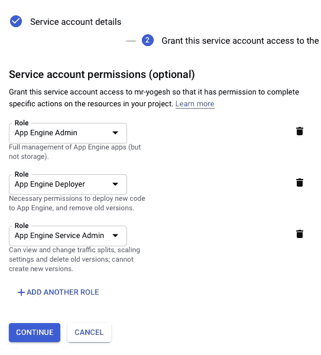
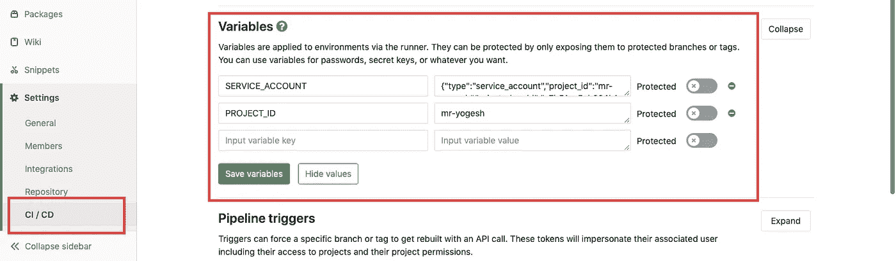

# 使用 Gitlab CI 自动部署到 Google App Engine

> 原文：<https://medium.com/google-cloud/automatically-deploy-to-google-app-engine-with-gitlab-ci-d1c7237cbe11?source=collection_archive---------0----------------------->

使枯燥的任务自动化😁部署

gitlab ci + appengine

我们要做的就是:

1.  创建一个服务帐户(我假设你知道)
2.  设置 Gitlab CI
3.  奇迹发生了！

# 创建服务帐户

访问 [iam-admin](https://console.cloud.google.com/iam-admin/serviceaccounts/create) 页面，创建具有所需权限的服务帐户并创建密钥。

创建要自动部署的服务帐户

1.  应用引擎管理(只有在使用 [dispatch.yaml](https://cloud.google.com/appengine/docs/standard/nodejs/reference/dispatch-yaml) 时才需要)
2.  应用引擎部署者和应用引擎服务帐户(如果您已授予第一个权限，请忽略这两个帐户)
3.  创建 JSON 密钥(在 Gitlab 配置中需要这个)

创建 JSON 键

现在参观[储物件](https://console.cloud.google.com/storage/browser)并进入储物桶:

1.  分期付款。**项目标识** .appspot.com
2.  us . artifacts .**PROJECT-ID**. app spot . com(如果没有这个名称，就用这个名称创建 bucket)

现在将您的**服务帐户添加为该存储桶的成员**，并授予权限**存储对象创建者**和**存储对象查看者。**

将服务帐户添加为成员

谷歌云开发者控制台的最后一步。

启用[云构建](https://console.cloud.google.com/cloud-build/builds) api，您需要链接计费帐户以启用此 api。

# 设置 Gitlab CI

我们将部署**主分支到生产**和**暂存分支到暂存。**

访问 gitlab 项目的 **CI/CD 设置**。

将变量添加到 gitlab

让我们添加两个变量 **PROJECT_ID** 和 **SERVICE_ACCOUNT**

**SERVICE_ACCOUNT** :在创建服务账号时，放入我们下载的 **JSON key** 的数据。

现在创建 [**。git lab-ci . yml**](https://docs.gitlab.com/ee/ci/yaml/)**文件放在你的根文件夹里。**

**密码**

**主分支和临时分支的更改将分别部署到生产和临时分支。
我已经使用了[**dispatch . YAML**](https://cloud.google.com/appengine/docs/standard/python/reference/dispatch-yaml)**文件，如果你没有的话也可以把它从脚本中删除。****

****按下。gitlab-ci.yml 在你的 repo 和你的都搞定了。****

****源代码:[https://github.com/mryogesh/yogesh](https://github.com/mryogesh/yogesh)
以防万一如果你想看 **staging-app.yaml** 和 **dispatch.yaml** 文件。****

# ****魔法🎩****

****现在， **git push** 会自动将您的代码部署到产品中。****

********

****你已经掌握了你的咒语****