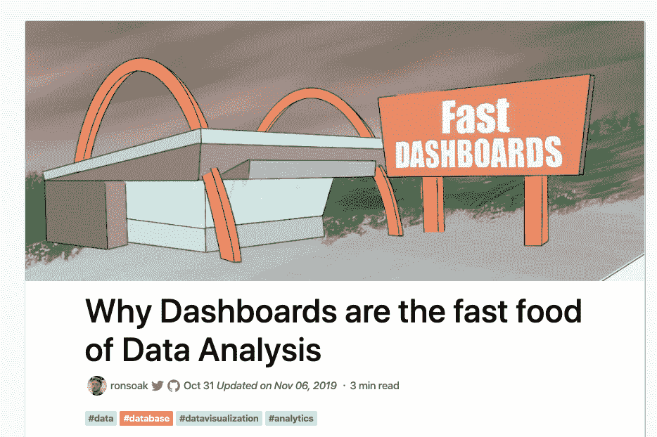
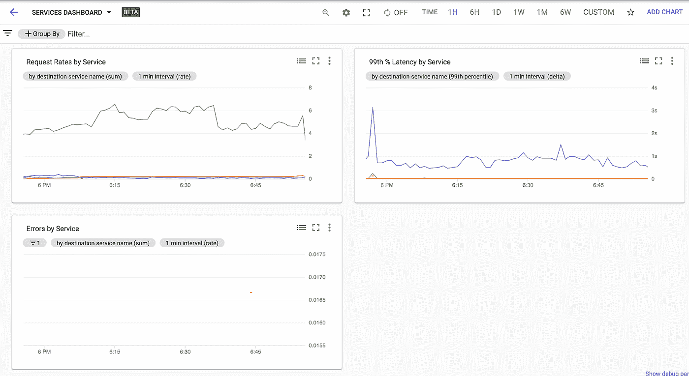
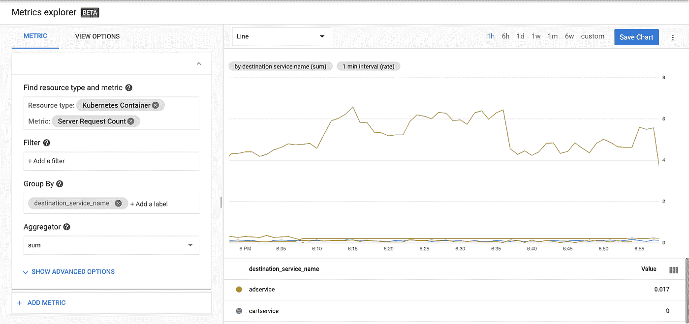
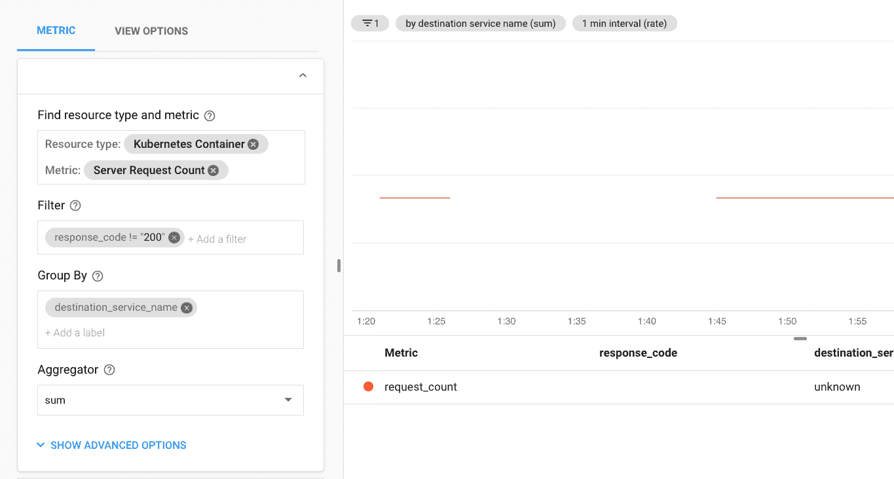
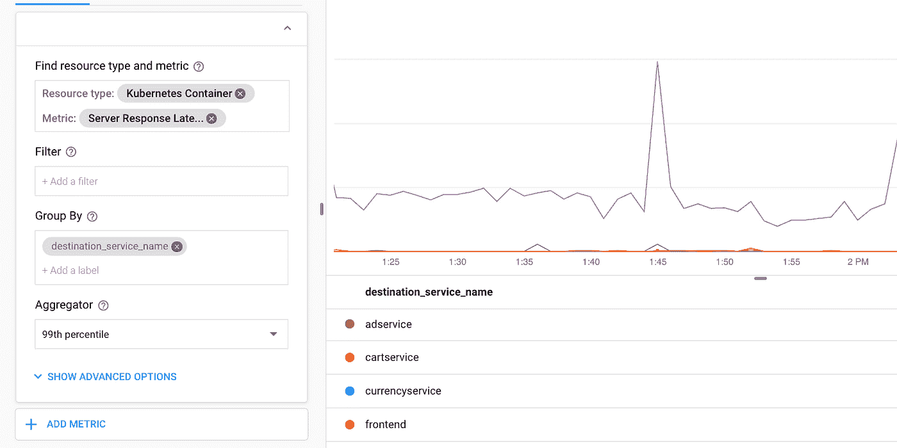
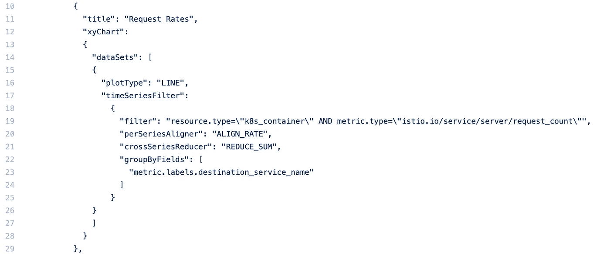
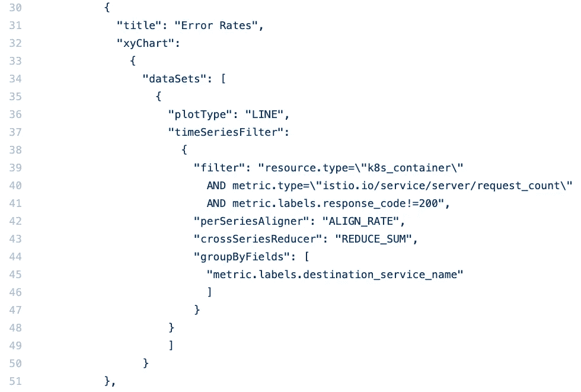
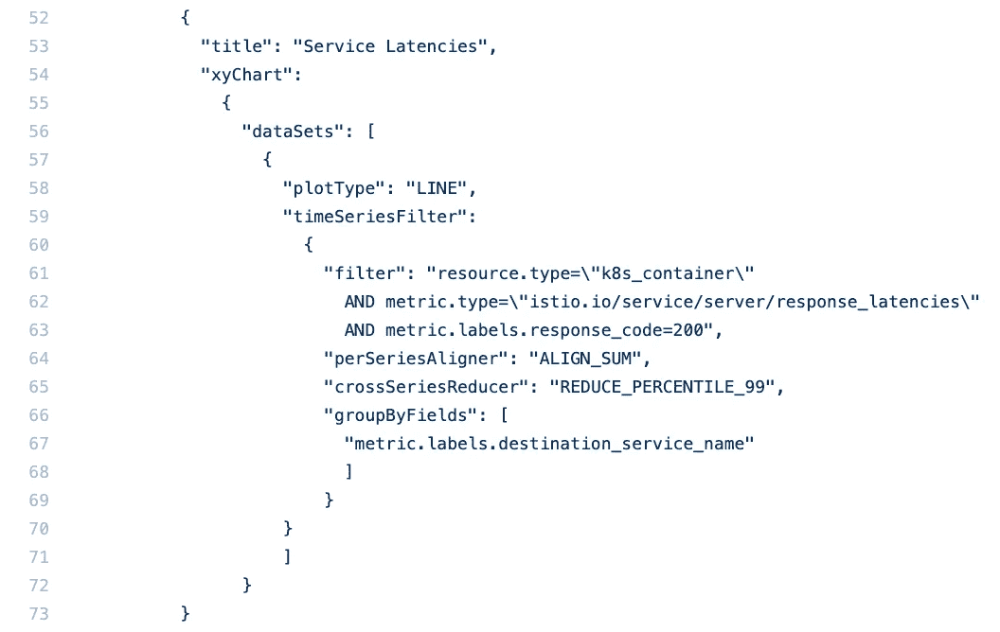
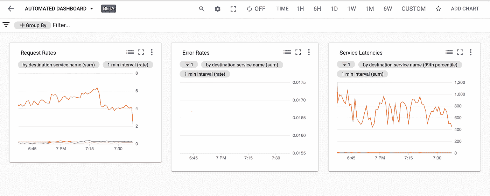

# 为 GKE/Istio 上的服务自动创建应用仪表板

> 原文：<https://medium.com/google-cloud/automating-application-dashboard-creation-for-services-on-gke-istio-a55a5a79aa15?source=collection_archive---------1----------------------->

# 介绍

我越来越多地从客户和我尊敬的业内人士那里听到一个更有趣的概念，那就是“作为代码监控”。当然，这是“一切如代码”运动的一个子集，但它确实引起了我的共鸣。具体来说，我最近与许多人交谈过，他们对在推出新服务或新项目时自动设置监控配置感兴趣。这通常包括两个主要部分——警报和仪表板。通过使用相关的 [API](https://cloud.google.com/monitoring/alerts/using-alerting-api) 或 [Terraform](https://www.terraform.io/docs/providers/google/r/monitoring_alert_policy.html) ，在 Stackdriver 中自动创建警报策略已经有一段时间了。现在，相同的自动化可用于 Stackdriver 仪表板！

# 仪表板

https://twitter.com/ronsoak[的功劳](https://twitter.com/ronsoak)

我一直认为仪表板在监控中被过分强调了，因为它们对问题检测或问题解决没有真正的帮助。前者可以通过定义良好的 SLO 和警报来更好地解决，后者可以通过良好的可观察性和专门的查询功能来解决。然而，仪表板被几乎所有涉及服务可靠性的人广泛使用，并且是任何监控设置中的必备功能。Stackdriver 仪表板非常受欢迎，我的大多数客户对话都包括帮助人们以这样或那样的方式可视化数据。我回答的最常见的一个问题是“我们的仪表板上应该放些什么？”

令人欣慰的是，这个问题的答案在 SRE [一书](https://landing.google.com/sre/sre-book/toc/)中的[章节](https://landing.google.com/sre/sre-book/chapters/monitoring-distributed-systems/)中有很好的记录。如果你没有其他东西，就从“黄金信号”开始——流量、错误、延迟和饱和度。

我们可以以在 GKE 运行并由 Istio 服务网格管理的一组基本服务为例。我以前写过 Istio 对于可观察性和监控的价值，以及它与 Stackdriver [的集成。另外，我创建了一个使用 Grafana](/google-cloud/istio-and-stackdriver-59d157282258) [在这里](https://cloud.google.com/community/tutorials/visualizing-metrics-with-grafana)构建一个显示来自这样一个系统的“黄金信号”数据的仪表板的教程。总的来说，我们在寻找类似这样的东西(**注意**我在这里使用的是[测试版](https://cloud.google.com/stackdriver/docs/release-notes#December_04_2019)的云控制台监控):

Stackdriver 中的服务仪表板

让我们看看如何创建一个关注服务健康“黄金信号”的仪表板。

# 应用仪表板

# 请求费率

第一个“黄金信号”是“流量”——本质上是衡量服务对多少用户活动做出响应的指标。幸运的是，Istio 为网格中的每个服务都提供了这一点。该指标称为“服务器请求计数”，我的仪表板中的第一个图表“按服务列出的请求率”使用该指标，并按“目的地服务名称”标签对结果进行分组。下面是它的详细配置:

请求费率图表

# 错误

下一个图表“按服务划分的错误”使用了相同的指标和分组选项；唯一的区别是数据被过滤，只统计响应代码不是 200 的请求。这是一种粗略的方法，因为它确实包括 3xx 重定向和 4xx 错误，这通常是客户端配置错误或行为不当的结果，但这足以说明这一点。下面是该图表的配置:

错误图表

# 潜伏

最后一个图表再次使用 Istio 指标—这一次，它是“服务器响应延迟”，按“目标服务名称”分组，并使用第 99 个百分位数的聚合。虽然这可能是一个好主意，但我不会为此过滤掉错误。它的配置如下:

潜伏期图表

# 自动化

假设数据是可用的，在 Stackdriver 中手动创建这样的仪表板并不困难，但是如果可能的话，应该自动化。随着 Dashboards API 的测试版发布，现在就是了！例如，用户还可以使用 API 在工作区之间复制仪表板，或者通过自动化创建额外的标准化。让我们来看看细节。

# 应用程序接口

API 在这里被记录为，但是总体思想非常简单——我们简单地调用 projects.dashboards.create 方法，传递一个 dashboards 对象，该对象包含名称、描述和一组指定图表本身的小部件对象。

# 结构

因为小部件是我们创建仪表板的基本构件，所以让我们从这里开始。我们已经有了自己的图表定义，只需要将它们转换成 API 期望的 JSON 表示。我们首先定义仪表板本身，它需要:

1.  **名称**，格式为“/projects/ <项目 ID 或编号>/dashboards/<ID>”—为了创建，我们可以不填
2.  **显示名称** —实际创建仪表板时显示的名称
3.  一个“ **root** ”对象——要显示的实际内容，它包含一个小部件
4.  默认**选项**将在加载时应用于仪表板

根是我们定义仪表板实际内容的地方。对于我们的示例，我们需要创建一个包含两列和三个图表的仪表板。所以仪表板的根是一个有两列的 [GridLayout](https://cloud.google.com/monitoring/api/ref_v3/rest/v1/projects.dashboards#gridlayout) 。然后它需要包含三个额外的[小部件](https://cloud.google.com/monitoring/api/ref_v3/rest/v1/projects.dashboards#widget)，每个小部件将指定一个 [xyChart](https://cloud.google.com/monitoring/api/ref_v3/rest/v1/projects.dashboards#xychart) 。每个图表需要指定一个[数据集](https://cloud.google.com/monitoring/api/ref_v3/rest/v1/projects.dashboards#dataset)对象，该对象又使用一个[时间序列过滤器](https://cloud.google.com/monitoring/api/ref_v3/rest/v1/projects.dashboards#timeseriesfilter)来实际查询数据。

# 履行

让我们看看如何使用这些信息来实现我们的仪表板。

# 请求费率

下面是请求率图表的 JSON 定义。这是我手动创建的，但是您可以使用 [API Explorer](https://cloud.google.com/monitoring/api/ref_v3/rest/v1/projects.dashboards/create) 来创建您自己的基线，并简单地用参数填充它。

请求费率图表定义

定义中需要注意的一些事项:

*   **过滤器**指定资源和度量。这也是我们指定的地方，例如，集群名、服务名或其他属性(如果需要的话)。
*   我们使用[默认对齐器和 sum reducer](https://cloud.google.com/blog/products/management-tools/stackdriver-tips-and-tricks-understanding-metrics-and-building-charts) 来简单地合计请求，并根据 destination_service_name 指标标签对它们进行分组。

# 错误率

接下来，我们需要定义我们的错误率图表。定义如下:

错误率图表定义

注意，这次我们使用了一个额外的过滤器，只对响应代码不是 200 的请求进行计数。否则，此定义与请求计数图表相同。

# 潜伏

最后，我们定义了延迟图表:

延迟图表定义

我们使用第 99 个百分位数的缩减器，只过滤成功的请求。

# 仪表盘

是时候把它们放在一起了——这是完整的仪表板[定义](https://gist.github.com/yuriatgoogle/c3b50c13f88b5fd776034f6879024533):

请注意，我们指定了一个 4 列 gridLayout，这实际上会产生一个 3 列仪表板。我们还将每个图表指定为布局中的一个小部件。我们将此作为 POST 请求主体提交给[**https://monitoring . Google APIs . com/v3/projects/$ { PROJECT _ ID }/dashboard**](https://monitoring.googleapis.com/v1/{parent}/dashboards)**s**(根据[文档](https://cloud.google.com/monitoring/api/ref_v3/rest/v1/projects.dashboards/create))，并获得此仪表板作为结果:

通过 API 调用创建的服务仪表板

瞧啊。我们现在有了一种在工作区中自动创建仪表板的方法！

# 总之…

我希望您发现这很有用，并开始使用基于这个简单示例的 API 来创建和自动化您自己的仪表板。在我的下一篇文章中，我将重复这个练习，并创建一个仪表板来可视化运行服务的 Kubernetes 集群的健康状况。直到那时——感谢阅读！