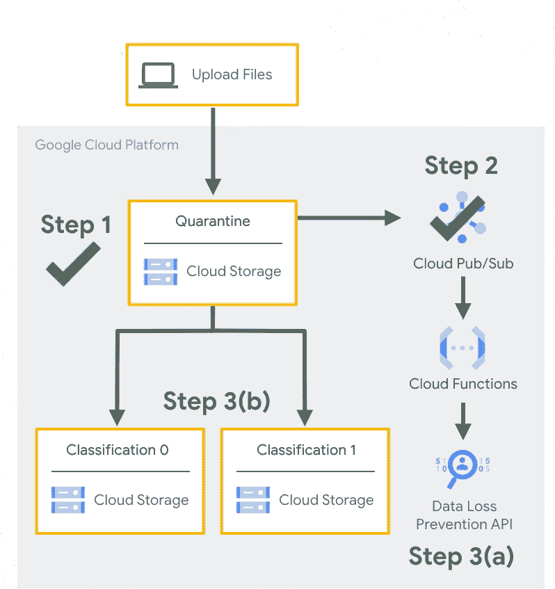
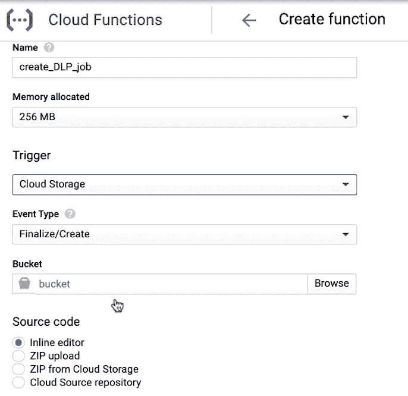

# 自动化云存储数据分类—第 3 部分

> 原文：<https://medium.com/google-cloud/automating-cloud-storage-data-classification-dlp-api-and-cloud-function-7546b3763203?source=collection_archive---------0----------------------->

## 在云中烹饪

作者:[普里扬卡·韦尔加迪亚](https://twitter.com/pvergadia)，[珍妮·布朗](https://twitter.com/jbrojbrojbro)

#GetCookingInCloud

# 介绍

“[在云中烹饪](/@pvergadia/get-cooking-in-cloud-an-introduction-5b3b90de534e)”是一个博客和[视频](https://www.youtube.com/playlist?list=PLIivdWyY5sqIOyeovvRapCjXCZykZMLAe)系列，帮助企业和开发者在谷歌云上构建商业解决方案。在这个系列中，我们计划确定开发人员希望在 Google cloud 上构建的特定主题。一旦确定，我们就以此为主题制作一个迷你系列。

在这个迷你系列中，出于安全和组织的目的，我们将介绍 Google 云存储中数据分类的自动化。

1.  [用例及整体流程概述](/google-cloud/automating-cloud-storage-data-classification-overview-35a63f39bb02)
2.  [深入探讨如何创建桶和云发布/订阅主题和订阅](/google-cloud/automating-cloud-storage-data-classification-setup-cloud-storage-and-pub-sub-8cacfcf8ba14)
3.  使用 DLP API 创建云函数并进行测试(**本文**)

在本文中，我们将创建云函数，设置 DLP API，并测试我们的应用程序的自动化数据分类。

# 你将学习和使用的东西

如何用谷歌云存储实现数据的自动上传和分类？

*   **前端 AppEngine**
*   **谷歌云存储**存储菜谱提交文件
*   **发布/订阅**消息
*   云功能以无服务器的方式实现快速自动化
*   **DLP API** 检测私人信息
*   [**此解决方案**](https://cloud.google.com/solutions/automating-classification-of-data-uploaded-to-cloud-storage) 用于自动将数据分类上传到云存储

# 看看这个视频

视频:自动化云存储数据分类:DLP API 和云

# **回顾**

在最近的两篇博客[ [1](/google-cloud/automating-cloud-storage-data-classification-overview-35a63f39bb02) ] [ [2](/@pvergadia/automating-cloud-storage-data-classification-setup-cloud-storage-and-pub-sub-8cacfcf8ba14) ]中，我们已经谈到了晚餐赢家——一个从世界各地的用户那里收集菜谱，并对其进行评判，然后发布获胜菜谱的应用程序。

我们知道，最初可能会有一些个人信息与这些提交内容相关联，需要在其他事情发生之前删除，我们希望这是一个无缝的自动化过程。

我们看到了他们如何通过使用云存储、云功能、DLP 和发布/订阅来自动化和分类上传数据的架构。

这是使用云发布/订阅、云功能和 DLP API 进行自动数据分类的架构

# **晚餐赢家的两个云函数**

对于 Dinner，我们需要两个云函数:一个在对象上传到云存储时调用，另一个在云发布/订阅队列中收到消息时调用。

让我们从创建从 GCS 桶触发的云函数开始。

创建云功能—“创建 _ DLP _ 作业”

1.  我们将开放云功能并创建一个新功能。将其命名为“create_DLP_job”
2.  在触发器字段中，我们将选择云存储。
3.  并从存储桶浏览器中选择隔离存储桶。
4.  运行时选择 Python 3.7。
5.  在内联编辑器中，复制并粘贴 main.py 和 requirements.txt 中下面描述的链接中的代码。
6.  您会发现有一个创建 DLP 作业功能，当配方上传到桶中时，该功能会创建 DLP 作业。
7.  在要执行的函数中，我们将用 *create_DLP_job* 替换 *hello_gcs* ，并创建函数

现在，我们需要创建 cloud 函数，当在 Cloud Pub/Sub 队列中收到消息时，该函数将被调用。

1.  这几乎是一样的，但这次我们将在触发器字段中选择云发布/订阅，进入我们的发布/订阅主题。
2.  我们将使用与上次相同的函数代码，但是在要执行的函数中，这次我们使用 *resolve_DLP* 。至此，我们已经准备好了两种云功能。

# **测试自动化**

现在是关键时刻了。我们的安全应用程序自动化的秘诀对晚餐赢家有用吗？我们需要测试，以确保正确的自动化和检测内容中的私人信息类型。

出于本练习的目的，我们将敏感数据信息类型定义为:姓名、电子邮件地址、位置和电话号码。但是您可以在代码中根据您自己的需求对其进行修改。

晚餐赢家

1.  开放云壳
2.  克隆 git repo[https://github . com/Google cloud platform/DLP-cloud-functions-tutorials . git](https://github.com/GoogleCloudPlatform/dlp-cloud-functions-tutorials.git)
3.  导航到示例数据。
4.  将文件复制到 GCS 隔离桶中。
5.  DLP API 对上传到隔离区的每个文件进行检查和分类，并根据其分类将其移动到适当的目标区
6.  打开我们的存储桶，查看上传的文件
7.  检查隔离桶中的文件，查看是否有任何敏感数据
8.  检查非敏感存储桶中的文件，以确保它不包含任何敏感数据

原来如此！晚餐赢家可以自动上传和分类，并满怀信心地返回他们的“游戏化”食谱提交。

# 结论

如果您希望以自动化的方式对数据进行分类，那么您已经体会到了所涉及的挑战和所需的要素。敬请关注[云烹饪系列](/@pvergadia/get-cooking-in-cloud-an-introduction-5b3b90de534e)中的更多文章，并查看下面的参考资料了解更多细节。

# 后续步骤和参考:

*   在[谷歌云平台媒体](https://medium.com/google-cloud)上关注这个博客系列。
*   参考:[自动化云存储数据分类](https://cloud.google.com/solutions/automating-classification-of-data-uploaded-to-cloud-storage?utm_source=youtube&utm_medium=Unpaidsocial&utm_campaign=pri-20200213-Automating-Classification)
*   由[罗杰·马丁内斯](https://medium.com/u/e7724d73a96?source=post_page-----35a63f39bb02----------------------)与[珍妮·布朗](https://medium.com/u/155d53c7be8b?source=post_page-----35a63f39bb02----------------------) : [使用 DLP API 和云函数对上传到云存储的数据进行自动分类](https://codelabs.developers.google.com/codelabs/cloud-storage-dlp-functions/#0)
*   关注[获取云端烹饪](https://www.youtube.com/watch?v=pxp7uYUjH_M)视频系列，订阅谷歌云平台 YouTube 频道
*   想要更多的故事？在[媒体](/@pvergadia/)和[推特](https://twitter.com/pvergadia)上关注我。
*   请和我们一起欣赏这部迷你剧，并了解更多类似的谷歌云解决方案:)