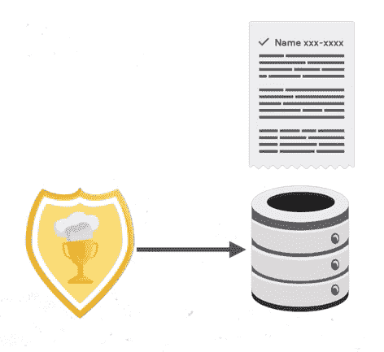

# 自动化云存储数据分类—第 1 部分

> 原文：<https://medium.com/google-cloud/automating-cloud-storage-data-classification-overview-35a63f39bb02?source=collection_archive---------1----------------------->

## 在云中烹饪

作者:[普里扬卡·韦尔加迪亚](https://twitter.com/pvergadia)，[珍妮·布朗](https://twitter.com/jbrojbrojbro)

# **简介**

" [Get Cooking in Cloud](/@pvergadia/get-cooking-in-cloud-an-introduction-5b3b90de534e) "是一个博客和[视频](https://www.youtube.com/playlist?list=PLIivdWyY5sqIOyeovvRapCjXCZykZMLAe)系列，帮助企业和开发者在 Google Cloud 上构建商业解决方案。在这个系列中，我们计划确定开发人员希望在 Google cloud 上构建的特定主题。一旦确定，我们就以此为主题制作一个迷你系列。

在这个迷你系列中，出于安全和组织的目的，我们将介绍 Google 云存储中数据分类的自动化。

1.  用例及整个过程的概述(本文)
2.  [深入探讨如何创建桶和云发布/订阅主题和订阅](/google-cloud/automating-cloud-storage-data-classification-setup-cloud-storage-and-pub-sub-8cacfcf8ba14)
3.  [使用 DLP API 创建云函数并进行测试](/google-cloud/automating-cloud-storage-data-classification-dlp-api-and-cloud-function-7546b3763203)

在这篇文章中，我们将涵盖整个用例并定义问题。

# 看看这个视频

# 用例以及改变我们考虑安全性的方式

有时，安全性不仅仅是保护外部威胁，出于保密原因，您可能需要将部分数据与数据集的其余部分分开。组织结构可能需要类似的分类。

这些用例都可能是一个手动密集型过程，因此我们将看看如何通过自动分类您上传到 Google 云存储的数据来简化这些情况。

在接下来的几篇博客中，我们将使用[云功能](https://cloud.google.com/functions)、[云存储](https://cloud.google.com/storage)和[云数据丢失预防(DLP) API](https://cloud.google.com/dlp) 来帮助对上传到 Google 云存储的数据进行自动分类。

晚餐赢家

为了说明这个场景，我们将在**晚餐赢家**帮助我们的朋友(因为我们喜欢食物:)。晚餐赢家(Dinner Winner)是一个应用程序，它收集了世界各地用户提交的食谱，并发布定期的获奖食谱供大家欣赏。

提交的食谱在被送去评审之前，需要被评估是否清晰，是否有任何可识别的信息。匿名评审结束后，获奖者会被联系，他们的食谱会被发布到应用程序中！

为了更好地理解我们可能会遇到的问题，让我们看看他们的系统现在是如何工作的:

显示从文件中手动提取机密信息的示例图像。

在比赛期间，用户以文本格式上传他们的食谱，这些食谱存储在 blob 存储中。从那里，他们被手动检查私人信息，如参与者的电子邮件和电话号码。在发送给评委投票之前，这些私人信息会被删除。正如我们所知，获胜的食谱会出现在平台上，让每个人都能看到。

# **这个场景的问题？**

1.  没有增长空间—这是一个手动过程，而且由于容量巨大，该系统的可扩展性很差。
2.  安全性——很难知道哪些内容被查看和更新了，哪些内容仍然包含私人信息。这里的任何问题都可能导致竞赛的腐败，并损害晚餐获胜者的品牌。

所以，这里的问题是多层次的。由于参赛者的潜在私人信息和竞赛的腐败，提交的食谱不能与审查的食谱混合，并且当前的过程是手动的，这意味着全面的问题，特别是在数量方面。对这些数据进行隔离和分类既复杂又耗时，尤其是考虑到每天有数百或数千个文件。

在理想情况下，我们将能够上传到隔离位置，并根据分类结果自动对文件进行分类并移动到适当的位置。

因此，我们已经建立了晚餐赢家需要一个自动化的过程来排序提交和分类审查提交。让我们分解一下配料，回顾一下我们将要遵循的食谱。

# **我们如何自动化这个过程？**

使用 DLP API、云功能、Google 云存储和云发布/订阅的自动化数据分类的架构和流程图

*   用户将在 web 界面上传一个文本文件(包括配方、名称、日期、电子邮件和电话号码)。
*   上传的文件被发送到 GCS，GCS 触发云功能在发布/订阅中创建数据丢失防护作业。
*   一旦事件被 pub/sub 接收，它就触发另一个云函数，该云函数调用 DLP API 并在配方文件中寻找机密信息。
*   一旦找到并删除，它会将文件移动到单独的存储桶中。如果文件不包含任何已识别的机密信息类型，则该函数将其移动到另一个存储桶。

这个请求流将机密数据与非机密数据分开，并且是相当自动化的，这样一旦文件到达 Google 云存储桶，所有其他进程就会自动启动以保护数据。

如果您想了解更多关于构建这个设置的信息，请查看本系列的下一篇博客，我们将一步一步地介绍。

# 结论

如果您希望以自动化的方式对数据进行分类，那么您已经体会到了所涉及的挑战和所需的要素。敬请关注[云烹饪系列](/@pvergadia/get-cooking-in-cloud-an-introduction-5b3b90de534e)中的更多文章，并查看下面的参考资料了解更多细节。

# 后续步骤和参考:

*   在[谷歌云平台媒体](https://medium.com/google-cloud)上关注这个博客系列。
*   参考:[自动化云存储数据分类](https://cloud.google.com/solutions/automating-classification-of-data-uploaded-to-cloud-storage?utm_source=youtube&utm_medium=Unpaidsocial&utm_campaign=pri-20200213-Automating-Classification)
*   由[罗杰·马丁内斯](https://medium.com/u/e7724d73a96?source=post_page-----35a63f39bb02--------------------------------)与[珍妮·布朗](https://medium.com/u/155d53c7be8b?source=post_page-----35a63f39bb02--------------------------------) : [使用 DLP API 和云函数对上传到云存储的数据进行自动分类](https://codelabs.developers.google.com/codelabs/cloud-storage-dlp-functions/#0)
*   关注[获取云端烹饪](https://www.youtube.com/watch?v=pxp7uYUjH_M)视频系列，订阅谷歌云平台 YouTube 频道
*   想要更多的故事？在[媒体](/@pvergadia/)和[推特](https://twitter.com/pvergadia)上关注我。
*   请和我们一起欣赏这部迷你剧，并了解更多类似的谷歌云解决方案:)