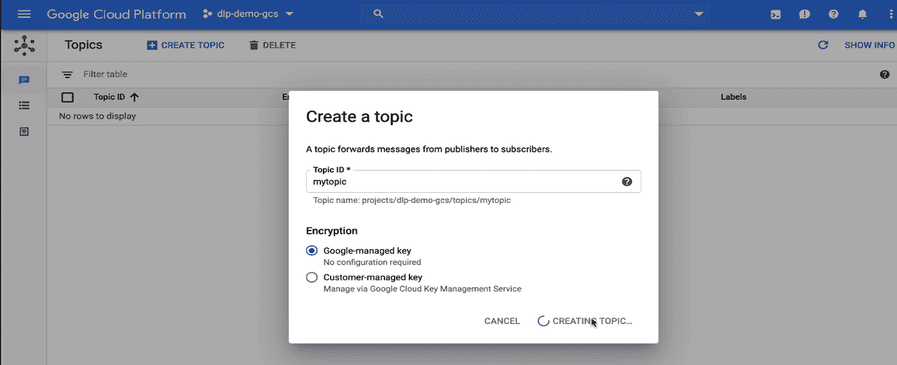

# 自动化云存储数据分类—第 2 部分

> 原文：<https://medium.com/google-cloud/automating-cloud-storage-data-classification-setup-cloud-storage-and-pub-sub-8cacfcf8ba14?source=collection_archive---------2----------------------->

## 在云中烹饪

作者:[普里扬卡·韦尔加迪亚](https://twitter.com/pvergadia)，[珍妮·布朗](https://twitter.com/jbrojbrojbro)

#GetCookingInCloud

# **简介**

" [Get Cooking in Cloud](/@pvergadia/get-cooking-in-cloud-an-introduction-5b3b90de534e) "是一个博客和[视频](https://www.youtube.com/playlist?list=PLIivdWyY5sqIOyeovvRapCjXCZykZMLAe)系列，帮助企业和开发者在 Google Cloud 上构建商业解决方案。在这个系列中，我们计划确定开发人员希望在 Google cloud 上构建的特定主题。一旦确定，我们就以此为主题制作一个迷你系列。

在这个迷你系列中，出于安全和组织的目的，我们将介绍 Google 云存储中数据分类的自动化。

1.  [用例及整体流程概述](/google-cloud/automating-cloud-storage-data-classification-overview-35a63f39bb02)
2.  深入探讨创建桶和云发布/订阅主题和订阅(**本文**)
3.  [使用 DLP API 创建云函数并进行测试](/google-cloud/automating-cloud-storage-data-classification-dlp-api-and-cloud-function-7546b3763203)

在本文中，我们将更深入地创建我们需要的不同云存储桶，并设置发布/订阅。

# 你将学习和使用的东西

如何用谷歌云存储实现数据的自动上传和分类？

*   **前端应用引擎**
*   **谷歌云存储**存储菜谱提交文件
*   **发布/订阅**消息
*   **云功能**以无服务器方式实现快速自动化
*   **DLP API** 检测私人信息
*   [**此解决方案**](https://cloud.google.com/solutions/automating-classification-of-data-uploaded-to-cloud-storage) 用于自动将数据分类上传到云存储

# 看看这个视频

视频:自动化云存储分类:设置

# 回顾

晚餐赢家(Dinner Winner)是一个应用程序，它收集了世界各地用户提交的食谱，并发布定期的获奖食谱供大家欣赏。

提交的食谱在被送去评审之前，需要被评估是否清晰，是否有任何可识别的信息。匿名评审结束后，获奖者会被联系，他们的食谱会被发布到应用程序中！

根据他们的架构，我们确定了与安全性和交叉污染相关的主要问题，以及巨大的效率差距。当前的手动流程将不可避免地导致系统不堪重负和质量下降，因此我们决定寻求自动化作为我们的主要解决方案。

# **四步流程**

使用云存储、云发布/订阅、云功能和 DLP API 的自动化数据分类架构

1.  创建云存储桶，作为隔离和分类管道的一部分。
2.  创建一个云发布/订阅主题和订阅，以便在两个云功能之间进行通知。
3.  创建两个简单的云函数，一个在文件上传时调用 DLP API，另一个使用 DLP API 检查和分类文件，并将它们移动到适当的存储桶。
4.  将一些样本文件上传到隔离区以调用云功能。

在这篇博客中，我们将回顾第 1 步和第 2 步。

# **设置环境**

在开始创建存储桶之前，我们需要设置我们的环境:

*   创建或选择 GCP 项目，并确保启用开单。
*   然后转到“API 和服务”选项卡，为云功能、云存储和云数据丢失预防 API 启用 API。

步骤 2:启用 API 和服务(1)

步骤 2:启用 API 和服务(2)

步骤 2:启用 API 和服务(3)

*   启用正确的权限，以便我们的应用引擎服务帐户可以连接 DLP API。
*   为此，我们将在项目中打开 IAM & Admin 页面，找到 app engine 服务帐户并编辑角色。
*   添加项目“所有者”、“ *DLP 管理员*”和“ *DLP API 服务代理*”并保存。注意:由于这是一个演示，为了简单起见，我们在这里使用“所有者”角色，如果您正在开发一个生产应用程序，请指定比**项目>所有者**更细粒度的权限。有关更多信息，请参见[向服务帐户授予角色](https://cloud.google.com/iam/docs/granting-roles-to-service-accounts)。

编辑角色

*   接下来，我们授予 DLP 服务帐户所需的权限。找到“DLP API 服务代理”，并向其添加项目“查看者”角色。

编辑权限

# **创建存储桶**

1.  我们导航到云存储并创建它们。
2.  我们将需要三个桶，一个用于敏感数据，一个用于非敏感数据，最后一个用于所有文件。用一个全局唯一的名称随意命名存储桶。一旦我们创建了所有三个存储区，您应该能够在存储浏览器中看到它们。

云存储桶

# **云 Pub/Sub 话题和订阅**。

*   导航到云发布/订阅并创建一个主题，为其提供一个名称并点击创建。

创建发布/订阅主题

*   然后，要创建与主题对应的订阅，请单击 new subscription，为其提供一个名称并创建。

创建发布/订阅订阅

# 结论

如果您希望以自动化的方式对数据进行分类，现在您知道如何去做了。敬请关注[云烹饪系列](/@pvergadia/get-cooking-in-cloud-an-introduction-5b3b90de534e)中的更多文章，并查看下面的参考资料了解更多细节。

# 后续步骤和参考:

*   在[谷歌云平台媒体](https://medium.com/google-cloud)上关注这个博客系列。
*   参考:[自动化云存储数据分类](https://cloud.google.com/solutions/automating-classification-of-data-uploaded-to-cloud-storage?utm_source=youtube&utm_medium=Unpaidsocial&utm_campaign=pri-20200213-Automating-Classification)
*   由[罗杰·马丁内斯](https://medium.com/u/e7724d73a96?source=post_page-----35a63f39bb02----------------------)与[珍妮·布朗](https://medium.com/u/155d53c7be8b?source=post_page-----35a63f39bb02----------------------) : [使用 DLP API 和云函数对上传到云存储的数据进行自动分类](https://codelabs.developers.google.com/codelabs/cloud-storage-dlp-functions/#0)
*   关注[获取云端烹饪](https://www.youtube.com/watch?v=pxp7uYUjH_M)视频系列，订阅谷歌云平台 YouTube 频道
*   想要更多的故事？在[媒体](/@pvergadia/)和[推特](https://twitter.com/pvergadia)上关注我。
*   请和我们一起欣赏这部迷你剧，并了解更多类似的谷歌云解决方案:)