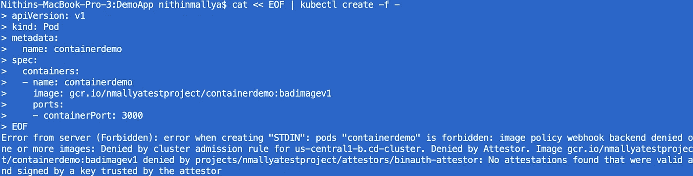

# 利用二进制授权和 Circle CI 实现 GKE 集装箱安全自动化

> 原文：<https://medium.com/google-cloud/automating-container-security-on-gke-with-binary-authorization-and-circleci-7efa7a6be2a7?source=collection_archive---------0----------------------->

我们如何确保部署到 Google Kubernetes 引擎(GKE)的容器来自可信的来源，我们如何使用 CI/CD 工具*自动化这一关键的安全检查？*

> ***注**:本文假设读者熟悉 Google 云平台、Kubernetes 和相关工具(gcloud、kubectl 等)。).熟悉 PGP 密钥生成过程也很有帮助。*

## *为集装箱安全辩护*

*让我们以部署在 GKE 的医疗保健应用程序为例。该应用程序用于管理非常敏感的患者医疗保健数据。*

*在下图中，您可以看到标准 CI/CD 流程正在进行:*

*   *代码被签入 GitHub*
*   *一个 CI/CD 工具(CircleCI)从 GitHub 获取它，运行所有需要的测试，创建一个 Docker 映像，并将其推送到 Google 容器注册中心(GCR)。*
*   *然后，它将此映像部署到 GKE。*

**

*在 GKE 部署医疗保健应用*

*现在，假设组织内的一个特权用户决定创建应用程序的另一个版本，并将其直接部署到 GKE 集群*，而不通过 CI/CD 管道*。这可能是无害的，比如在不影响生产应用程序的情况下测试一个新特性*，也可能是更危险的*，代码试图出于恶意目的访问敏感数据。*

*在任何情况下，由于该用户已经可以访问 Kubernetes 集群，所以使用新代码在本地构建应用程序并将其部署到 GKE 并绕过整个 CI/CD 过程是非常容易的。*

**

***问题**:我们如何确保集群中的容器来自可信的来源，并且已经通过了所有必要的检查，包括安全漏洞检查等等。？*

***解决方案**:Google 二进制授权。这是一种仅允许将“经证实的”映像部署到群集的服务。经证明的图像是已经由“证明者”验证或保证的图像。任何与二进制授权策略不匹配的未授权映像都会被拒绝，如下图所示。*

**

*二元授权在起作用*

## *术语*

*   ***二进制授权**是 Google 提供的一个部署时安全服务，它确保在我们的 GKE 集群中只部署受信任的容器。它使用策略驱动模型，允许我们配置安全策略。在后台，该服务与容器分析服务进行对话。*
*   ***容器分析**是一个 API，用于存储关于我们软件工件的可信元数据，并在二进制授权过程中使用*
*   ***证明人**是证明图像真实性的人或过程*
*   ***注意**是容器分析存储中与证明者相关联的一段元数据*
*   ***证明**是来自证明者的声明，表明映像已准备好进行部署。在我们的例子中，我们将使用一个证明来引用我们图像的签名*

## *将二进制授权整合到我们的管道中*

*为了实现这一点，我们需要遵循**的 2 组步骤**。第一个是一次性的**手动**设置过程，第二个可以是**自动**(通过您最喜欢的 CI/CD 工具)。在本文的后面，我将使用 CircleCI 展示这一点。*

> *这看起来工作量很大(确实如此)，但好消息是大部分工作都可以编写脚本并自动化。*

**

*二进制授权所需的设置*

> ***一次性手动设置**:我们将创建一个 GCP 项目，启用所需的 API，创建一个启用了二进制授权的 Kubernetes 集群，设置一个注释，生成 PGP 密钥并创建一个证明者。出于演示的目的，我将使用一个准系统 node.js Hello World 应用程序部署到 GKE。*

*让我们从手动设置开始:*

*   *创建一个 Kubernetes 集群并启用二进制授权*

**

*   *为您的项目启用容器注册表、容器分析和二进制授权 API*
*   *默认的二进制授权策略**允许所有图像**。您可以通过 GCP 控制台中的安全- >二进制授权来访问它*

> ***注意**:以下其余步骤在脚本[**ontime _ setup . sh**](https://github.com/nmallya/containerdemo/blob/master/kube/onetime_setup.sh)中可用*

*   *创建笔记有效负载。当我们创建证明者时，将需要此注释。注释 id 不应包含空格。*
*   *将有效负载发送到二进制授权服务*
*   *使用 gpg 生成 PGP 密钥对(公钥和私钥)。公钥将与证明者相关联，私钥将用于对图像进行签名。注意 : gpg 需要熵(随机性)来生成密钥。当我在我的 Mac 上这样做的时候，我不需要像 rngd 那样运行一个单独的程序来生成熵。此外，gpg 在密钥生成期间需要一个密码短语。我选择了一个空白密码，并接受了警告。*
*   *公钥被导出到一个文件中并保存以备后用*
*   *创建一个指定当前项目和上述注释的证明者。将公钥与证明者相关联。在我的例子中，证明者被称为“binauth-证明者”。证明者名称中不应有空格*
*   *创建二进制授权策略(参见 [sec-policy.yml](https://github.com/nmallya/containerdemo/blob/master/kube/sec-policy.yml) )。在此策略中，我们将默认限制所有项目级别的映像，并且只为我们名为 **cd-cluster 的集群启用由我们的证明者**(projects/nmallyatestproject/证明者/binauth-证明者)**证明的映像。**好看又限制！*

> *运行 onetime_setup.sh 后，如果一切顺利，您应该能够看到已经创建了 binauth-证明者，并且有一个相关联的公钥，如下所示。*

**

*二进制授权策略也已更改，以反映我们的新限制，如下所示:*

**

*让我们继续自动化工作的第二部分:在部署到 GKE 之前签署图像。*

> *自动化的 C I /CD 流程:在这个流程中，我们将执行构建我们的应用程序、测试它、将它归档并部署到 GCR 的标准任务。然后，我们将从映像创建一个映像摘要，用来自上述 PGP 密钥对的私钥对它进行签名，创建一个证明，并将其部署到二进制授权。*
> 
> ***重要提示**:为了让 CircleC I 能够签署我们的图像摘要，它需要能够访问之前生成的密钥。实现这一点的一种方法是对私钥进行 base64 编码，并将其保存在我们项目的 CircleCI 环境变量中。出于本演示的目的，我们将采用这种方法。名为 BINAUTH_PRIVATE_KEY 的 CircleCI 环境变量将包含该值。请注意，可能有其他更好的解决方案。*
> 
> *您可以在[https://github.com/nmallya/containerdemo/blob/master/kube/**extract _ private _ key . sh**](https://github.com/nmallya/containerdemo/blob/master/kube/extract_private_key.sh)中找到密钥提取逻辑*

*以下其余步骤在脚本[**generate _ signature . sh**](https://github.com/nmallya/containerdemo/blob/master/kube/generate_signature.sh)中可用，并将由 CircleCI 为每个新构建自动执行*

*   *构建/测试/归档映像/推送到 GCR*
*   *从 GCR 获取图像路径和摘要，并创建签名有效负载*
*   *从 Circle C I 环境变量中提取私钥并存储在本地*
*   *从公钥中提取 PGP 指纹*
*   *使用 gpg 使用上述输入为我们的证明人生成的签名签署有效负载*
*   *使用上述所有信息创建一个证明，并提交给二进制授权*
*   *稍等片刻(30 秒到 1 分钟),让更改在二进制授权中生效*
*   *使用 kubectl create -f 命令将应用程序部署到 GKE，并为我们的 **containerdemo** pod 传入 yml*

```
**cat <<* **EOF** | *kubectl* create -f -
*apiVersion: v1
kind: Pod
metadata:
  name: containerdemo
spec:
  containers:
  - name: containerdemo
    image: "***$**{IMAGE_PATH}*@***$**{IMAGE_DIGEST}*"
    ports:
    - containerPort: 3000* **EOF***
```

*   *检查 pod 展开状态。如果一切顺利，您应该会看到下面的输出。恭喜你！*

**

> ***制造麻烦:**让我们创建一个没有签名部分的**应用程序的新图像，看看当我们尝试部署它时会发生什么。***

*建立、标记和推动 GCR 的新形象*

```
*$ docker build -t containerdemo -f ./Dockerfile .
$ docker tag containerdemo gcr.io/nmallyatestproject/containerdemo:badimagev1$ gcloud docker -- push gcr.io/nmallyatestproject/containerdemo:badimagev1*
```

*部署到 GKE —您将看到下面的错误，指示此部署“被证明者拒绝”。找不到由证明者信任的密钥签名的有效证明。*

**

## *使用其他技术定制部署规则:*

*到目前为止，我们所看到的是在部署容器时确保信任的一种非常先进的方法(通过在项目级别禁止所有映像，只允许特定集群中经过验证的映像)。我们还可以尝试其他非常容易实现的技术，例如:*

1.  *将 GCR 的图像路径列入白名单。此路径中存在的任何映像都不会通过部署规则进行授权检查*
2.  *允许/禁止给定集群的所有图像等*

## *资源*

1.  *[本文的 GitHub 库](https://github.com/nmallya/containerdemo)。我很快会打扫干净的。*
2.  *[来自谷歌的二进制授权官方文档](https://cloud.google.com/binary-authorization/)*
3.  *感谢 [Brad Geesaman](https://twitter.com/bradgeesaman) 关于二进制授权的[教程](https://github.com/GoogleCloudPlatform/gke-binary-auth-demo)，它非常有帮助，提供了我在文章中用到的很多细节*