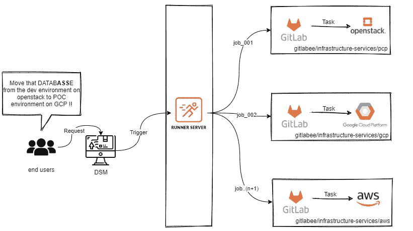
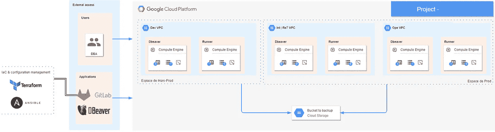
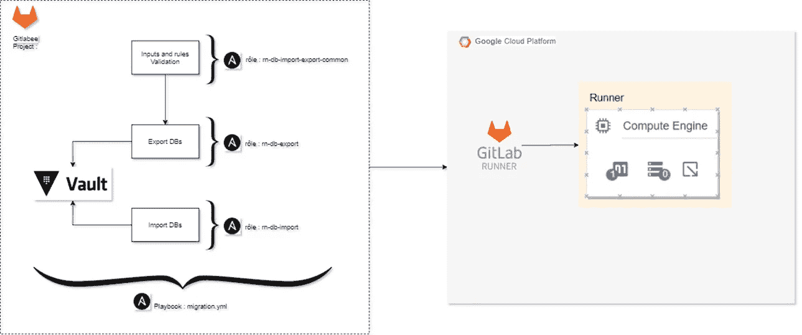

# 用 Ansible 和 Terraform 实现 GCP 数据库的自动迁移

> 原文：<https://medium.com/google-cloud/automating-database-migration-on-gcp-with-ansible-and-terraform-2d7c094293cb?source=collection_archive---------0----------------------->

数据是新的石油。这就是为什么大公司会生成和处理数十亿的数据记录，以便详细了解客户的需求。这也不可避免地揭示了一些挑战(例如性能或高可用性)并推动了一些需求(例如迁移到云)。

# 迁移的需要，

是否从内部迁移到云；从云到云；或者对于云计算，拥有一个迁移策略对于高效响应您的业务增长至关重要。

## 自动化迁移，

自动化迁移是 DATA&BI 团队最终目标的一部分。这支持在 **D** 数字 **S** 服务 **M** 市场管理和迁移数据即服务，这是一种端到端解决方案，用于:

*   将数据库从一个环境(例如生产环境)备份和恢复到另一个环境(例如开发环境)。
*   将数据从一个平台(例如 Openstack)迁移到另一个平台(例如 GCP)。

## 在幕后，

正如我们所看到的，这样做的必要性是显而易见的，过程也很容易描述。这就是为什么首先想到的是，这个工具能够完成工作的每一部分。然而，技术上这是不可能的。由于安全政策的原因，一个可以在云提供商和移动数据库之间跳跃的项目是不被允许的。即使是这样，从架构的角度来看也是不太好的——考虑到产品的复杂性和可维护性。

## 架构概述，

分而治之，每个云提供商一个项目。让我们保持简单。

全球架构概述

# 路线图，

在我们考虑在平台之间迁移数据库之前，我们必须先从环境入手(Poc、dev、re7 和 prod ),然后再将这些点连接起来:

1.  为每个云提供商提供服务:将数据库从一个环境备份和恢复到另一个环境。
2.  一项服务，将作为平台之间的项目调度程序。

我们必须了解每个云提供商的工作方式，并考虑客户的反馈。这就是我们选择以这种方式运作的原因。在达到最终目标之前，我们还有很多东西要学。

# 谷歌云平台，优先

出于财政和技术两方面的原因，我们必须首先把 GCP 的情况综合起来。

## 令人敬畏的项目

**I**n 基础结构 **a** s **C** ode 部分以及 **C** 配置 **M** 管理部分由以下目录表示:

*   太棒了-项目/地形。
*   真棒-项目/ansible。

基础设施的创建和数据库从一个环境到另一个环境的迁移之间的流程是由 gitlab-CI 管道编排的。

## 用 Terraform 编码基础设施，

terraform 工具负责创建必要的基础设施来执行数据库迁移。更准确地说，这包括:

*   awesome-project/terraform/01-instances:创建一个 VM (Runner)实例，通过它我们可以扮演我们的角色(脚本)。
*   awesome-project/terraform/02-storage:在环境之间创建一个共享的 GCP 存储桶。

GCP —建筑概述

## Ansible 的配置管理，

Ansible 部分旨在通过一组共享相同上下文的脚本(Ansible 角色)来定义要完成的操作:

*   awesome-project/ansi ble/roles/rn-d b-export:将数据库从源环境导出到 GCP 桶，即转储。
*   awesome-project/ansi ble/roles/rn-d b-import:将数据库从 GCP 存储桶导入到目标环境，恢复它。
*   awesome-project/ansi ble/roles/rn-d b-import-export-common:共同的基本操作、先决条件(例如输入和规则验证、保险库请求)。

GCP —配置管理流程

## 最终结果，

客户端必须通过我们的 **D** 数字 **S** 服务 **M** 市场提交一个带有不同输入的请求(例如 source_env、database、target_env、service_id 等。).

一旦通过验证，gitlab-ci 管道将负责所有的迁移过程。

## 下一步，

*   接近零的停机时间迁移。
*   持续反馈。
*   探索云提供商的 DMS(数据库迁移服务)。