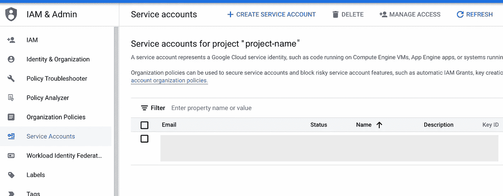
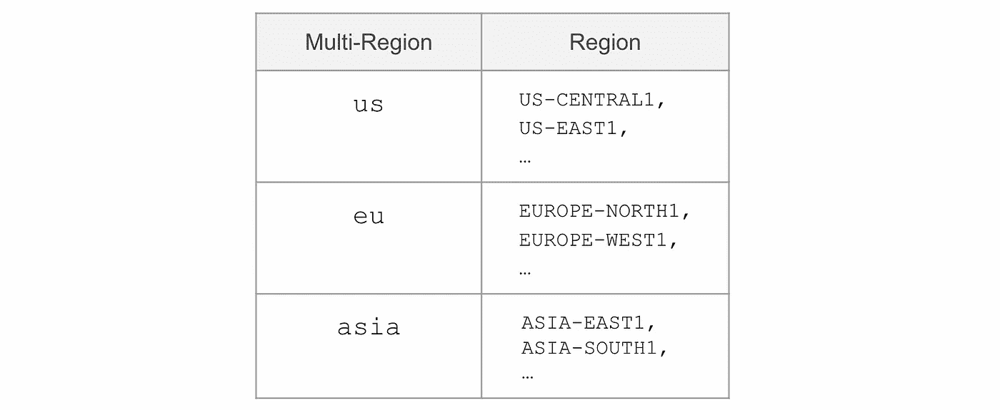

# 用 Python 自动化 Google 云存储管理

> 原文：<https://medium.com/google-cloud/automating-google-cloud-storage-management-with-python-92ba64ec8ea8?source=collection_archive---------0----------------------->

## 如何利用 Python 来自动管理您的云存储对象。


图片来自 [Unsplash](https://unsplash.com/photos/8EzNkvLQosk) 。

[谷歌云](https://cloud.google.com/)是市场上[最大的云提供商](https://www.statista.com/statistics/967365/worldwide-cloud-infrastructure-services-market-share-vendor/#:~:text=In%20the%20first%20quarter%20of,with%20eight%20percent%20market%20share.)之一。**谷歌云平台(GCP)** 提供各种云解决方案，包括计算服务、存储选项、网络和安全解决方案，以及大数据和人工智能框架。

不久前，我发表了一篇文章，介绍了如何使用 Python 自动化 AWS S3 文件管理的基础知识。今天，我们将把重点转移到 Google Cloud，我将向您展示如何使用 Google 的云存储解决方案来实现文件管理的自动化。

GCP 为用户提供了**自由层**，用于[云存储](https://cloud.google.com/free/docs/free-cloud-features#storage)其中包括 **5GB 存储**，5000 个 A 类和 50000 个 B 类操作。此外，新用户可以获得 [**300 美元的免费积分**](https://cloud.google.com/free) 用于购买各种云服务。

在下面的小节中，我将介绍设置您的 GCP 环境的步骤，并向您展示如何使用带有 Python 3 到的 **GCP 云存储 API 来自动管理您的存储桶和文件。**

# 1 |准备您的 GCP 环境

在我们开始使用任何 API 与 GCP 交互之前，我们需要执行一些准备步骤。

## 创建服务帐户

首先，我们需要**创建一个服务帐户(SA)** ，它将用于通过 API 与云存储交互。我们可以使用 API 执行的操作由我们授予 SA 的权限范围定义**。**

> 服务帐户(SA)为您提供了一种保护和划分对 GCP 环境的访问权限的简单方法。

例如，我们可以创建一个 SA，它只能**查看我们存储桶中的**文件，但是**不能创建**新存储桶。这有助于我们保护我们的 GCP 环境，特别是当具有不同角色和目标的多个团队在同一个项目中工作时。对于我们的用例，我们将创建一个对云存储具有**管理权限**的 SA，这意味着它将能够执行任何操作。

登录到您的 [Google 云管理控制台](https://console.cloud.google.com/)，进入 IAM & Admin 并选择 [*服务帐户*](https://console.cloud.google.com/iam-admin/serviceaccounts) 选项卡。在那里，点击*创建服务账户*。



图片来自 Google 云管理控制台— IAM & Admin >服务帐户

选择一个服务帐户名，例如“ *cloud-storage-sa* ”，并可选地添加简短描述。最后，我们需要授予 SA 访问权限。在我们的例子中，我们将选择*“云存储:存储管理员*”的角色。

## 正在收集 API 密钥

既然我们已经创建了 SA，我们需要生成它各自的密钥，这将允许我们在使用 API 时进行身份验证。

单击您新创建的 SA 的电子邮件地址，该地址显示在您的[服务帐户列表](https://console.cloud.google.com/iam-admin/serviceaccounts)中。该电子邮件地址将类似于“*cloud-storage-sa@project-name.gserviceaccount.com*”。然后转到*密钥*选项卡，点击*添加密钥>创建新密钥*并选择 *JSON* 作为密钥类型。这会将一个 JSON 文件下载到您的 PC 上，其中包含向您的 GCP 控制台进行身份验证所需的密钥。

> 确保安全地存储您的 JSON 密钥文件，因为这是访问您的 GCP 资源的密钥。

既然我们已经收集了云存储 SA 的 API 键，我们可以开始对云存储进行 API 调用了。

# 2 |通过 API 与 GCP 交互

google-cloud-storage 包是用于与云存储交互的官方 Google Python 包。您可以通过 pip 安装程序轻松安装它，如下所示:

```
pip install google-cloud-storage
```

在进行任何 API 调用之前，我们需要在 Python 脚本中创建一个环境变量，该变量保存包含 API 键的 JSON 文件的路径:

```
os.environ["GOOGLE_APPLICATION_CREDENTIALS"] = r"/path/to/credentials/project-name-123456.json"
```

太好了——我们都准备好了，让我们动手吧。

## A.创建云存储桶

首先，我们可以从创建一个 bucket 开始。

云存储 Python 包允许我们通过将[存储类](https://cloud.google.com/storage/docs/storage-classes)和[存储位置](https://cloud.google.com/storage/docs/locations)设置为函数 *create_bucket* 的参数来定义它们。在下面的示例中，我们选择“标准*”*作为存储类别，选择“*美国中心 1* ”作为位置:

存储类参数的其他选项包括' *COLDLINE* '、 *NEARLINE'* 或' *ARCHIVE'* 。

根据您定义位置参数的粒度，存储桶数据将按区域或多区域存储**。如下表所示，通过将'*位置*'设置为'*美国*'，您的铲斗的位置类型将**自动设置为多区域**——其他位置也是如此。**



多区域或区域云存储桶，位置类型选项。图片作者。

要将您的存储桶位置类型设置为**双位置**，请将“data_locations”参数添加到“create_bucket”函数中，并定义您的存储桶应将其数据存储在哪两个位置。

## B.将文件上传到云存储桶

既然我们已经看到了如何创建云存储桶，我们还可以定义一个函数，让我们将文件上传到我们的桶:

## C.从云存储桶下载文件到

同样，我们也可以将文件从云存储空间下载到本地机器:

## D.列出云存储桶中的文件

除了向/从我们的云存储桶上传和下载文件，我们可以定义一个函数' *list_cs_files* '，该函数返回桶中所有文件名的列表:

## E.获取云存储桶中文件的公共 URL

最后，我们还可以利用 API 来生成一个可公开访问的链接，该链接指向我们的 bucket 中的一个文件。出于安全原因，我们需要设置一个 URL 过期的时间。默认情况下，在如下所示的函数中，这被设置为 24 小时:

这将返回 Python 字符串形式的 URL，然后您可以与组织外部的任何人共享该字符串。

我希望这篇文章对您有所帮助，并且可以帮助您在开始使用云存储 API 和 google-cloud-storage Python 包时节省几分钟的时间！🎉下面你会发现一些官方云存储 API 文档的参考链接。

欢迎在评论中与我分享你的任何反馈！💬

# 参考资料:

[1]谷歌云，[云存储客户端库文档](https://cloud.google.com/storage/docs/reference/libraries#client-libraries-install-python) (2022)

[2]谷歌云，[，GitHub“python-storage”代码示例](https://github.com/googleapis/python-storage/tree/05e07f248fc010d7a1b24109025e9230cb2a7259/samples) (2022)

[3]谷歌云，[云存储](https://cloud.google.com/storage) (2022)