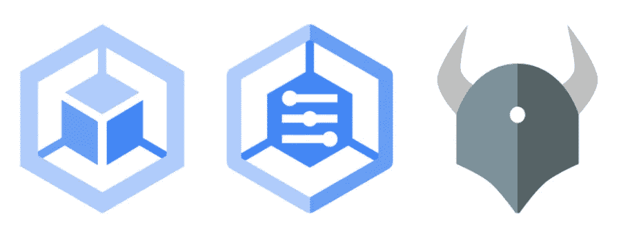

# 使用策略控制器突变自动化租户 pod 调度

> 原文：<https://medium.com/google-cloud/automating-tenant-pod-scheduling-using-policy-controller-mutations-b325f4616943?source=collection_archive---------1----------------------->



*这篇文章描述了使用 Anthos 配置管理* [*策略控制器*](https://cloud.google.com/anthos-config-management/docs/concepts/policy-controller) [*突变*](https://cloud.google.com/anthos-config-management/docs/how-to/mutation) *在多租户 GKE 集群中的租户名称空间中自动配置 pod。*

对于多租户用例，通常为每个租户划分 Kubernetes 集群的部分。在最简单的情况下，这可能意味着为每个租户创建一个名称空间。然而，对于其他用例，您可能还希望在专用节点上运行您的租户工作负载。例如，如果您的租户需要更好的相互隔离，或者需要特定的机器配置文件或硬件，如 GPU。

在这种情况下，您需要确保部署到一个租户名称空间的任何 pod 只被调度到专用于该租户的节点上。您通常通过对节点应用特定于租户的污点和标签，然后对租户的 pod 应用相应的容差和节点亲和性来解决这个问题。

*   [*节点相似性*](https://kubernetes.io/docs/concepts/scheduling-eviction/assign-pod-node/#affinity-and-anti-affinity) 是 pod 的一个属性，*将它们吸引*到一组节点
*   [*污点*](https://kubernetes.io/docs/concepts/scheduling-eviction/taint-and-toleration/) 则相反——它们允许一个节点*排斥*一组豆荚

您可以同时使用 nodeAffinity 和 taints 来确保给定租户的 pod 只被调度到适当的节点上。请注意，如果您单独使用污点，pod 可能会被调度到某个其他未被污染的节点上。您还必须使用 nodeAffinity 来确保 pod 本身需要一个适当的节点。

## 创建租户节点

使用 GKE，您可以为每个租户创建一个专用的节点池。您可以[将污点](https://cloud.google.com/kubernetes-engine/docs/how-to/node-taints)和标签应用到节点池，以便污点和标签应用到池中的所有节点(以及任何未来的节点，例如由自动缩放器创建的节点)。

下面的代码片段为*租户 1* 创建了一个新的节点池，并应用了一个引用租户名称的污点和标签。

```
gcloud container node-pools create tenant1-pool \
 ---zone europe-west1-b --cluster cluster-1 \
 --num-nodes=2 \
 --node-labels="tenant=tenant1" \
 --node-taints="tenant=tenant1:NoSchedule"
```

## 配置窗格

接下来，我们需要配置我们的 pod，以便它们只能被调度到正确的节点池上。具体来说，我们需要确保任何以租户名称空间为目标的 pod 都具有正确的 nodeAffinity 和容忍度。以下 YAML 显示了一个带有 nodeAffinity 和 toleration 集的部署片段。您可以在上面链接的文档中了解配置 nodeAffinity 和 tolerations 的不同方法——这不是我们在这里的原因！

## 自动化 pod 配置

上面的 YAML 在部署中正确地配置了 pod，以便 pod 仅被调度到我们的 *tenant1-pool* 节点池。然而，在每个部署或类似的部署中要包含相当多的样板文件，特别是如果每个租户有多个部署，并且我们在集群中有多个租户。

有几种方法可以减少维护这种样板文件的工作量。我们可以使用模板引擎为每个租户应用正确的值。我们可以使用 [Kustomize](https://kustomize.io/) 来“修补和合并”部署，以便将节点亲和性和耐受性应用于每个部署。

然而，如果我们能够*自动化*应用 nodeAffinity 和 toleration 到 pod 上，那将会非常有用。一种方法是用*变异* [*接纳控制器*](https://kubernetes.io/docs/reference/access-authn-authz/admission-controllers/) 。准入控制器拦截对 Kubernetes API 服务器的请求，以便在集群中创建对象之前对其进行验证或变更。使用这种准入控制器方法意味着单个租户部署不需要关心如何正确编写 YAML。准入控制器自动添加配置。

## Anthos 配置管理策略控制器

从历史上看，编写准入控制器是一种高级用例。然而， [Anthos 配置管理](https://cloud.google.com/anthos-config-management/docs/overview) [策略控制器](https://cloud.google.com/anthos-config-management/docs/concepts/policy-controller)现在提供了一种设置简单变异的简单方法。

PolicyController 基于开源[开放策略代理看门人](https://open-policy-agent.github.io/gatekeeper/website/docs/)项目。PolicyController 的核心用例是作为一个*验证*准入控制器。它在创建群集资源之前对其进行验证，例如，确保群集资源符合安全规则。然而，PolicyController 现在也提供了一种简单的方法来进行简单的资源[突变](https://cloud.google.com/anthos-config-management/docs/how-to/mutation)。我们可以通过写一些 YAML 来改变资源！(请注意，在撰写本文时，策略控制器突变特性是 GA 前的特性)。

当然，首先您需要在您的 GKE 集群中安装策略控制器。您需要设置“启用突变”标志来激活突变功能。安装后，您可以通过应用 YAMLs 来配置突变，如下所示。

## 通过突变增加耐受性和 nodeAffinity

下面的代码片段配置了一个变异，以便将一个*tenant = tenant 1:no schedule*容错添加到 *tenant1-ns* 名称空间中的所有 pod。我们实际上是将 *value* 元素的内容附加到 pod 的*spec . tolerances*元素中。

类似地，下面的代码片段配置了一个变异，该变异将一个 *tenant1* nodeAffinity 添加到 *tenant1-ns* 名称空间中的所有 pod。

## 结论

在这篇文章中，我们看到了如何使用 [PolicyController 突变](https://kubernetes.io/docs/reference/access-authn-authz/admission-controllers/)来自动配置租户 pod，以便它们只被调度到特定于租户的节点上。这种方法提供了一些好处:

*   租户应用程序开发人员无需担心如何正确配置他们的所有部署。适当的容差和节点关联性被添加到部署到租户命名空间的任何 pod。
*   类似地，突变可以由平台团队或者管理集群的人来管理和维护。
*   你不需要写任何代码。它内置于 PolicyController 中。

但是，您也应该密切关注最佳实践和注意事项:

*   变异的准入控制器可能会让开发人员感到困惑，因为他们的资源被悄悄地修改了
*   注意不要让突变覆盖了其他的 pod 配置。