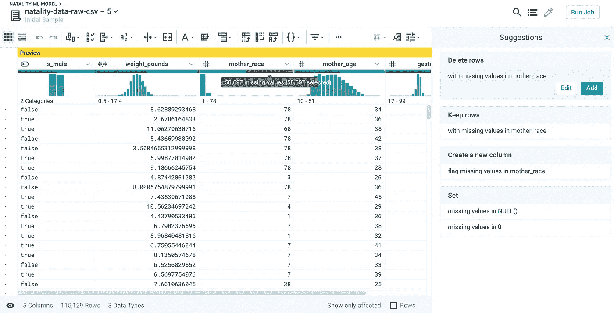

# 谷歌云上数据争论和机器学习的自动化

> 原文：<https://medium.com/google-cloud/automation-of-data-wrangling-and-machine-learning-on-google-cloud-7de6a80fde91?source=collection_archive---------2----------------------->

## 使用云数据准备、云编辑器和 BigQuery ML

我最近阅读了这篇关于使用 [**云数据准备** API](https://cloud.google.com/dataprep/docs/html/API-JobGroups-Create-v4_145281446) 来触发 Cloud Composer(基于 Apache Airflow)的自动化争论作业的[博文](https://cloud.google.com/blog/products/data-analytics/how-to-orchestrate-cloud-dataprep-jobs-using-cloud-composer)。

我采用了在美国出生统计数据上使用 **BigQuery** [公共数据集](https://cloud.google.com/bigquery/public-data?csw=1)的概念(首先玩玩数据，参见 [Jason](https://medium.com/u/4a0637341451?source=post_page-----7de6a80fde91----------------------) 的[帖子](/@ImJasonH/exploring-natality-data-with-bigquery-ed9b7fc6478a)关于使用带有 **BigQuery** 的数据)。除了这一次，除了清理数据之外，我还添加了一个使用 **BigQuery ML** 训练线性回归模型的步骤(更多信息请参见[文档](https://cloud.google.com/bigquery-ml/docs/bigqueryml-natality))。


如上所示，我将使用:

1.  **Cloud Dataprep (Trifacta 服务)**到
    导入并争论一个关于出生统计的 14GB 公共数据集，该数据集包含 1.37 亿条记录
2.  **BigQuery ML** 到
    对清理后的数据训练一个线性回归模型
3.  **Cloud Composer** 到
    自动完成以上两个步骤

# 1.让我们得到一些数据

在大多数项目中，数据专业人员通常不会处理简单明了的 **BigQuery** 数据集，相反，他们会发现自己在处理各种不同的数据，就像在野外发现的一样。为了让这个例子更接近现实，我们将把这个 **BigQuery** 数据集作为 CSV 导出到 Google 云存储桶中。查看 **BigQuery** 中的数据，您可以看到有 31 列，其中一些数据缺少值。为了稍后训练我们的模型来预测婴儿体重，我们只需要一些特征(列)。此外，我们希望忽略缺少或错误值的记录(例如，一个母亲每周喝 99 杯酒甚至超过了我最好的大学时光；此外，在第 99 周分娩在人类中不太可能。


数据显示的列比我们需要的多，并且有许多丢失或错误的值

# 2.清理数据

我正在使用 **Cloud Dataprep** ，这是由 **Trifacta** 提供的托管服务，用于处理、清理和准备结构化和非结构化数据。在 2 分钟内，我可以取出一个 137M 的记录文件，删除除 5 列之外的所有列，并过滤掉所有缺少值或值错误的行。所有这些都有一个漂亮整洁的界面，只需简单的点击。你可以将所有这些步骤保存到一个*食谱*中，这样你就可以在以后重复并始终如一地应用它们。运行*配方*需要另外 20 多分钟来执行使用**云** [**数据流**](https://cloud.google.com/dataflow) 的所有转换，这是谷歌云上用于流和批量数据处理的托管服务。


只需选择您想要保留的栏，然后选择“删除其他”

接下来在 **Cloud Dataprep** 中，我可以通过点击列名下面的黑色区域来识别丢失的值，将*删除行*步骤添加到我的争论*配方*中。



很容易删除有缺失值或错误值的记录，或者用平均值替换这些值

当然，您可以进行更复杂的转换，例如将半结构化数据拆分成多个列，添加具有派生值的新列，或者连接来自不同来源的数据集。要执行管道，我单击右上角的*运行作业*，然后选择输出目的地。在这种情况下，我选择写入一个新的 **BigQuery** 表，因为我们希望在下一步使用 **BigQuery ML** 训练一个模型。


流水线执行的输出显示了例如云数据流的自动缩放特征

# 3.让我们训练一个机器学习模型

现在我们已经在 **BigQuery、**中有了一组干净的数据，我们可以使用 **BigQuery ML** 来训练一个模型。我在此不再赘述，因为这在 [**BigQuery ML** 文档](https://cloud.google.com/bigquery-ml/docs/bigqueryml-natality)中使用相同的数据集进行了详细解释。


呼叫军情六处。根据一些测试数据预测婴儿体重

**剧透警告:根据清理数据训练的模型比原始数据集的模型表现更好**

# 4.最后，让我们自动化一切

假设您的输入数据每天都在变化(如新冠肺炎案例)，您将需要手动运行上述步骤或编写一些脚本/代码来触发以下步骤:

1.  用配方 ID 和认证令牌调用**数据准备 API**
2.  等待**数据流**作业完成
3.  用 **BigQuery ML** 训练模型的新版本

自动化这个过程还需要在某个地方部署代码、配置调度/触发器、考虑错误处理、指数补偿重试、自动重试等等。

或者……(插入 drumroll)……我们可以使用 Cloud Composer 来代替。Cloud Composer 是 Apache Airflow 的托管版本，用于编排数据管道。Airflow 使用 Python DAGs(有向非循环图)定义编排步骤。它主要是样板代码，定义参数、执行顺序和步骤之间的依赖关系。我的同事 Tahir Fayyaz 写了一篇关于气流和 BigQuery 的文章[。](https://cloud.google.com/blog/products/gcp/how-to-aggregate-data-for-bigquery-using-apache-airflow)


简单的 DAG 基本上有 2 个步骤:首先使用云数据流运行 Dataprep 作业(然后等待完成)，完成后，使用 BigQuery ML 创建一个新的线性回归模型

这是我在 [GitHub](https://github.com/aosterloh/natality-bqml-composer-dataprep/blob/master/dataprep-bqml-pipeline_v7.py) 上的示例(缩写)代码，你可以在下面看到。

```
import Airflow
...default_args = {
    'owner': 'Alex Osterloh',
    'depends_on_past': False,
     ...
    'schedule_interval': '[@daily](http://twitter.com/daily)'
}...#common DAG parameters like scheduling
with airflow.DAG(
        'natality_bq_model_v8',
        default_args=default_args,
        # Not scheduled, trigger only
        schedule_interval=None,
        user_defined_macros={
          'json': json
        }
) as dag:# Trigger Dataprep via HTTP POST call
run_dataprep_task = SimpleHttpOperator(
    task_id='run_dataprep_job',
    endpoint='/v4/jobGroups',
    data=json.dumps({"wrangledDataset": {"id": int(recipe_id)}}),
    ....
  )# Wait for Dataprep job to finish
wait_for_dataprep_job_to_complete = HttpSensor(
    task_id='wait_for_dataprep_job_to_complete',
    endpoint='/v4/jobGroups/{{  json.loads(ti.xcom_pull(task_ids="run_dataprep_job"))["id"] }}?
    .....
  )# Train new model using BigQuery ML 
bigquery_run_sql = bigquery_operator.BigQueryOperator(
    task_id='bq_run_sql',
    ....
    sql='''
        CREATE OR REPLACE MODEL `<project-name>.natality_bqml.natality_model_v7`
        OPTIONS
          (model_type='linear_reg', input_label_cols=['weight_pounds']) AS
        SELECT
          weight_pounds,
          is_male,
          gestation_weeks,
          mother_age,
          CAST(mother_race AS string) AS mother_race
        FROM
   `thatistoomuchdata.natality_data_us.natality_data_clean_model_v6`
        WHERE
          weight_pounds IS NOT NULL
          AND RAND() < 0.001
    '''
  )# Define the task dependencies
run_dataprep_task >> wait_for_dataprep_job_to_complete >> bigquery_run_sql
```

# 后续步骤

如果你对数据自动化、机器学习和爵士乐感兴趣，我在这个 6 分钟的视频中总结了一切，请欣赏。

*感谢*[*feli PE*](https://www.linkedin.com/in/felipemartina/)*帮我弄对了措辞。这不是谷歌的官方工作。如果我错过了什么，请告诉我。*