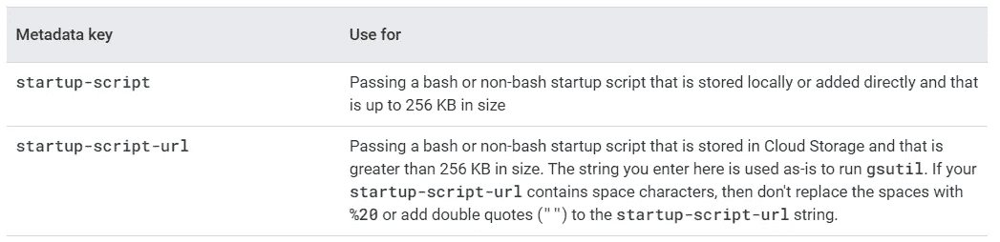

# 在 GCP 使用启动脚本自动化虚拟机实例任务和配置

> 原文：<https://medium.com/google-cloud/automation-vm-instance-tasks-and-configurations-using-startup-scripts-in-gcp-ca66f7c9afc?source=collection_archive---------3----------------------->


**简介**

在本文中，我们将了解如何使用启动脚本在 GCP 虚拟机或 GCE 实例中自动执行磁盘装载、分配驱动器号和标签、下载文件和软件包、安装软件、插件、证书以及编辑配置等任务。

**什么是启动脚本？**

启动脚本是包含虚拟机(VM)实例启动时运行的命令的文件。计算引擎支持在 **Linux 虚拟机和【Windows 虚拟机上运行启动脚本。**

# 【Linux 虚拟机的启动脚本

可以在虚拟机创建过程中使用自动化部分或使用元数据键将启动脚本添加到 Linux 虚拟机中。您可以使用多个启动脚本。存储在本地或直接添加的启动脚本在存储在云存储中的启动脚本之前执行。



我们可以在 GCS 桶中添加一个脚本，并使用 GCS url 和元数据，或者我们可以直接传递命令，如下图所示。如果将脚本存储在 GCS 存储桶中，请确保 VM 服务帐户至少具有从存储桶读取文件的读取权限和范围。


您可以在云控制台串行输出日志中查看启动脚本执行日志


您可以在下面看到日志和执行顺序

将执行第一个**启动脚本**元数据项


之后**启动脚本 url** 元数据文件将执行


# Windows 虚拟机的启动脚本

Windows 启动脚本必须是命令 shell ( `.cmd`)、PowerShell ( `.ps1`)或批处理文件脚本(`.bat`)，并且必须具有适当的文件扩展名。

下表显示了可用于 Windows 启动脚本的元数据项，并根据启动脚本的存储位置、大小和文件类型提供了有关使用哪个项的信息。


**在启动脚本中访问虚拟机元数据**

在执行启动脚本时，可以使用虚拟机元数据，如下例所示，获取网络标记并将其保存为启动脚本中的变量，然后在脚本执行中使用。

```
$tags = (Invoke-RestMethod -Headers @{'Metadata-Flavor' = 'Google'} -Uri "http://metadata.google.internal/computeMetadata/v1/instance/tags") 
```

使用上述方法，我们可以使用启动脚本和自动化 windows 和 Linux 虚拟机任务。

有关演示，请参见下面的视频

更多关于谷歌云的视频，请在下面免费找到我的谷歌云播放列表。