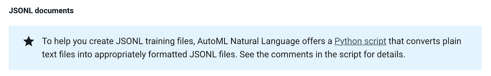
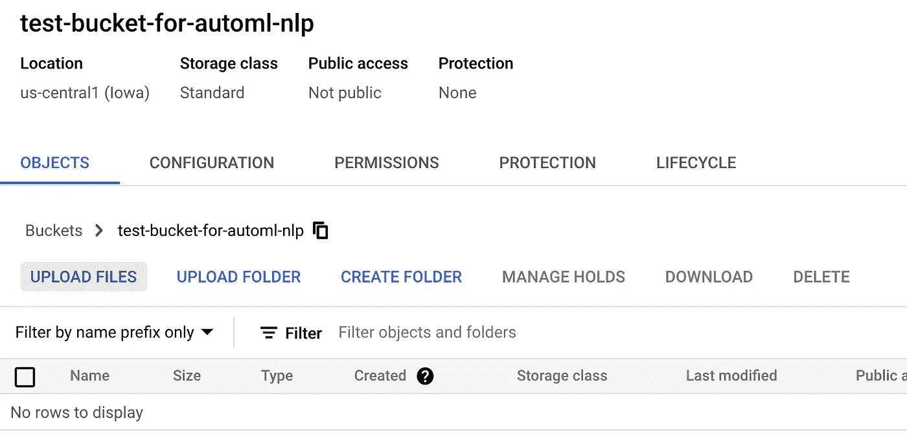
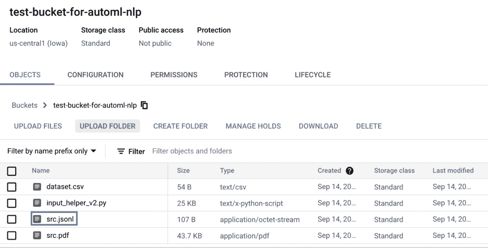
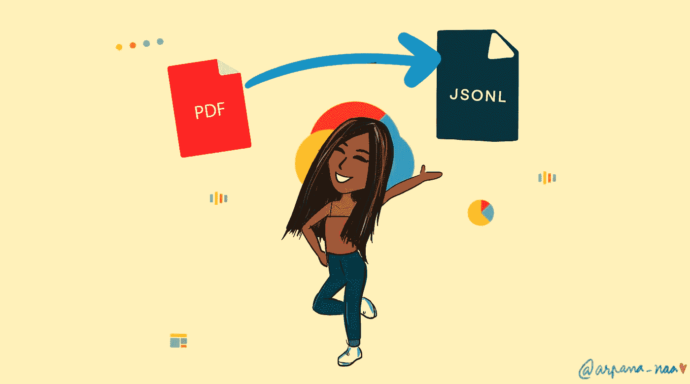

# AutoML NLP:将 pdf 转换为 JSONLs！

> 原文：<https://medium.com/google-cloud/automl-nlp-convert-pdfs-to-jsonls-c01f1da0899?source=collection_archive---------0----------------------->

## 学习使用 AutoML docs 提供的脚本将文本文件转换成 jsonl 格式。



截图来自 GCP [AutoML docs](https://cloud.google.com/natural-language/automl/docs/prepare#expandable-2) 【作者图片】

如果你从 GCP 的 AutoML NLP 开始，你已经知道第一步了。将您的文档转换为`.jsonl`格式，然后作为培训数据传递。AutoML 文档已经为你提供了一个 python 脚本，但是如果你发现这个脚本有点难以理解或使用，你并不孤单！

当我浏览文档时，我希望有一个使用 [**python 脚本**](https://cloud.google.com/natural-language/automl/docs/scripts/input_helper_v2.py) 的一步一步的指南，所以它在这里。

## 什么是 AutoML？

AutoML 是 Google 云平台上 AI 的积木之一。当您想要创建和训练定制的高质量模型，并且机器学习专业知识有限时，它尤其有用。它提供了一个接口来帮助您将数据传输到算法中以构建您的模型。它会自动选择最佳的神经网络架构，并根据您的目标为您调整超参数，基本上节省了重新训练和微调的人工努力。


文档中提供的脚本是用 Python2 编写的。[图片由 [Hitesh Choudhary](https://unsplash.com/@hiteshchoudhary?utm_source=unsplash&utm_medium=referral&utm_content=creditCopyText) 在 [Unsplash](https://unsplash.com/s/photos/python?utm_source=unsplash&utm_medium=referral&utm_content=creditCopyText) 上拍摄]

## 因此，第一步——获取您的数据！

我不会写在 AutoML 上创建和训练模型过程中的所有步骤，因为你可以在这里找到很好的文档。我们的重点是引起一点摩擦的任务。

确保您的 pdf 的大小< 2 Mb. If they contain pictures or any graphical data, you might want to read this [**文章**](https://towardsdatascience.com/how-to-extract-the-text-from-pdfs-using-python-and-the-google-cloud-vision-api-7a0a798adc13) 解释了如何使用 cloud vision API 和 python 从 pdf 中的图像提取文本数据。

# 将 pdf 转换为 JSONL —在 gCloud shell 中

该脚本可以在 gCloud 命令行 shell 中运行，或者如果您已经安装了 gCloud SDK，那么您可以直接从您的机器上运行该脚本，并将存储在 GCS buckets 中的 pdf 转换为 jsonl 文件。它是用 Python2 编写的，接受三个参数— *脚本文件名、pdf 文件的路径和目的地 bucket 的路径*。

```
python2 <script> gs://<path_to_src_pdf> gs://<dest_bucket>/
```



将脚本和您的源 pdf 文件上传到 GCS 桶中[图片由作者提供]

1.  将[脚本](https://cloud.google.com/natural-language/automl/docs/scripts/input_helper_v2.py) ( `input_helper_v2.py`)和您的源 PDF(以后称为`src.pdf`)文件上传到 GCS bucket 中。请注意这两个文档的路径。
2.  在云壳中安装 python2。`sudo apt install python2`
3.  在区域(`us-central1`)中创建一个 GCS 存储桶，并将存储类别设置为`standard`。AutoML 加工的区域必须是`us-central1`。(截至 2011 年 9 月的数据)
4.  将存储在 GCS bucket 中的脚本复制到 cloud shell 主目录中。`gsutil -m cp gs://<path_to_script>`
5.  第 4 步是将脚本加载到我们的云 shell VM 的主目录中。运行`ls`确认脚本是否复制成功。
6.  在云壳中，运行`python2 input_helper_v2.py gs://<path_to_src_pdf> gs://<path_to_gcs_bucket>/`

> 如果想一次转换多个文件，可以用`*.extension`代替一个文件名。示例— `*.pdf`



运行脚本后创建的 JSONL 文件[图片由作者提供—截图来自 GCP 控制台>云存储]

带有 jsonl 文件 URIs(可直接用于导入训练数据)和 jsonl 文件的 CSV 数据集已创建并存储在您指定的目标 GCS 存储桶中。前往[文档](https://cloud.google.com/natural-language/automl/docs/prepare#importing_training_documents)(在 autoMl 控制台中导入您的训练数据)并继续构建您的定制模型！



希望这个指南对你有帮助！如果遇到任何问题，请发表评论。[作者照片，灵感来自[普里扬卡·韦尔加迪亚](https://medium.com/u/9b9e67983b04?source=post_page-----c01f1da0899--------------------------------)🤗]