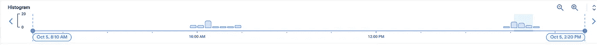

# Dataproc —为什么我的集群没有伸缩？

> 原文：<https://medium.com/google-cloud/autoscaling-in-dataproc-e02bf446a509?source=collection_archive---------0----------------------->


“Autoscaling”是一个 Dataproc API，可以自动监控纱线内存使用情况，并添加/删除容量以实现最佳使用。它消除了针对季节性高峰过度调配群集的需求，以及可能导致业务关键型延迟的群集调配不足的风险。

Dataproc 的自动缩放控制平面(真正的阿甘正传风格)是

> *易如反掌*

Dataproc 试图将配置的复杂性保持在最小，这意味着可用于调整自动缩放策略的旋钮和杠杆并不多。

由于配置如此之少，当客户遇到自动扩展问题时，他们通常会疑惑——“我们哪里出了问题？”

在本帖中，我们将用一个常见的答案来回答客户在使用自动缩放时提出的 3 个问题

1.  为什么我的集群没有纵向扩展，尽管我有新的工作负载激增？
2.  为什么我的集群没有向下扩展？尽管只有非常小的工作负载在运行，为什么我还要为空闲节点付费？
3.  为什么群集长时间处于“正在更新”状态，并且不允许我对群集执行其他更新？

# **很高兴知道**

一个 Dataproc 集群有 1 或 3 个(对于 HA)运行名称节点守护进程的主节点，以及一堆执行所有繁重工作(计算)的工作机。有两种类型的工人-

*   主要员工—参与 HDFS 存储并为计算做出贡献的员工
*   次要员工—不参与 HDFS，仅执行计算的员工

使用此设置，您可以根据需要添加或删除辅助员工，而不会影响任何 HDFS 数据。可以手动添加/删除辅助工作器，也可以使用自动缩放 API。

> 初级工人也可以按比例增减，但不建议这样做。您通常会希望根据 BAU 工作负载调整基本容量(主工作人员池)的大小，并使用辅助工作人员来适应高峰工作负载。

截至 2022 年，Dataproc 在决定是否缩放时仅考虑纱线内存。算法很简单—

*   如果群集中的“可用内存”多于“待定内存”，请尝试移除节点
*   如果群集中的“待定内存”多于“可用内存”，请尝试添加节点

计算背后有一点七年级的数学，但我们将在这篇文章中跳过这些实现细节。[点击这里](https://cloud.google.com/dataproc/docs/concepts/configuring-clusters/autoscaling#how_autoscaling_works)阅读更多。

# 解决办法

**故障排除**

Dataproc 不允许并发更新。这意味着，如果集群正在进行任何类型的更新—标签被重命名、集群被调整大小、属性被修改等等，则在此期间不能执行任何其他更新操作。

调整集群的大小，即向集群添加/删除额外的节点，是一种发生在 Dataproc 的控制平面中的更新操作。

作为自动缩放引擎所做建议的一部分，群集可能正在进行缩减操作，尽管新的工作负载需要额外的内存，但这会阻止进一步的更新。

缩减操作考虑了多种因素。简而言之，一旦 autoscaler 引擎确定集群中有可以删除的节点，它会将这些节点标记为删除，相应的容量会立即从 Yarn 中移除。然而，这些机器不会立即死亡。如果机器上已经运行了应用程序，或者包含等待提供给在其他节点上运行的应用程序的随机/临时数据，那么 Dataproc 将等待作业完成，或者等待随机数据被提供，或者等待正常退役超时窗口关闭，以较早者为准。

```
Time taken to complete downscaling = 
MIN 
(
time taken by existing applications to finish, 
time taken for shuffle data on the node to get served, 
graceful decommissioning timeout
)
```

这意味着，在许多情况下，缩小规模不是一个瞬间的活动，可能导致集群处于长期的"更新"期。这在不使用增强灵活性模式和长时间正常停用超时(GDT)的情况下尤其普遍。

要验证这一点，请转到云日志记录，并使用此 MQL 过滤到自动缩放日志—

```
resource.type="cloud_dataproc_cluster"
resource.labels.cluster_name="<cluster-name>"
log_name="projects/<project>/logs/dataproc.googleapis.com%2Fautoscaler"
```

该 MQL 将获取该群集的所有自动缩放日志。确定您的分类是否具有较长的缩减窗口模式的一种快速方法是查看日志记录中生成的直方图。为了获得更明确的描述，将时间窗口增加到您的正常退役超时的一个因子(至少 2 倍)。

在我们的例子中，我用了 6 个小时，因为 GDT 是 3 个小时



注意自动缩放器如何显示日志记录活动的突发，静默 3 小时，然后在再次静默之前再次唤醒？这 3 个小时是自动缩放策略的 GDT。这表明群集经常运行在这样一种情况下，即许多空闲节点在被删除之前都在等待提供随机数据。

有一些影响-
-您为空闲节点付费，因为集群已经缩减了规模，但机器仍在运行。
-在达到 GDT 之前，不会为新工作负载提供额外容量。

**那么我们能做些什么呢？**

*   这个想法是让 GDT 窗口尽可能接近于零。如果您的应用程序具有足够的弹性，并且由于重启而导致的延迟是可以接受的，那么将 GDT 设置为一个较低的值(甚至为零)，这样无论节点是否空闲，都会立即删除它们。快速失败，更快恢复。
*   [增强灵活性模式或 EFM](https://cloud.google.com/dataproc/docs/concepts/configuring-clusters/flex) 是 Dataproc 提供的一项功能，它允许将数据仅存储在主工作节点中，从而允许辅助工作节点立即缩减规模。当然，在它们上面运行的任何应用程序都需要在不同的节点上重新启动。
*   如果修改 GDT 不符合您的业务需求，您可以调整自动扩展策略中的以下旋钮—
    **—扩展/缩减因子(0–1)**
    这控制了如何积极地**扩展或缩减集群。
    下图说明了放大系数的工作原理。除了变量是可用内存之外，缩小因子的数学运算也是一样的。**

```
Let’s say that the amount of memory to scale up by = f(x,y,z)
where
x = Number of pending containers, e.g. — 100
y = Memory requested by each container, e.g.- 512 MB
z = Scale up factor, e.g. — 0.5Therefore, the total pending YARN memory = x*y = 50 GB
Amount of memory to scale up by = Total pending YARN memory*Scale up factor = 25GBSo if each node has 8 GB of memory and assuming 80% allocation to YARN,For z=0.5, number of nodes = 100*512*0.5 / (8*1000)*0.8 = 4
For z=1, number of nodes = 100*512*1 / (8*1000)*0.8 = 8
```

**-放大/缩小最小工人比例** 这控制**如何频繁地**放大或缩小集群。
和前面的观点一样，下图适用于两种分数。

```
Let the amount of memory to scale up by = f(x,y,z)
where
x = Number of pending containers, e.g. — 100
y = Memory requested by each container, e.g.- 512 MB
z = Scale up factor, e.g. — 0.5
N = Number of nodes in the cluster, e.g. — 20
S = scaleUpMinWorkerFraction, e.g. — 0.3
M = N*S = 6 nodesTotal pending YARN memory = x*y = 50 GB
Amount of memory to scale up by = Total pending YARN memory*Scale up factor = 25GBSo if each node has 8 GB of memory and assuming 80% allocation to YARNFor z=0.5 —
Nodes = 100*512*0.5 / (8*1000)*0.8 = 4.
Since this is less than M = 6, no scale up will occurFor z=1 —
Nodes = 100*512*1 / (8*1000)*0.8 = 8.
Since this is greater than M = 6, cluster will scale up by 8
```

*   如果**缩小最小工作人员比例**设置为更高的值，那么只有当有更大的节点块要删除时，集群才会缩小。这将降低缩减的频率，从而降低提交额外工作负载时集群处于更新状态的概率。这也有助于减少集群容量的频繁波动。

# 摘要

这篇文章详细介绍了更新操作停滞或不能正常工作的几个原因之一。大多数其他原因归结为基础设施问题或服务损坏。本文中详细介绍的故障排除解释了应用程序逻辑或集群配置产生的原因。Dataproc 的自动伸缩策略试图使最终用户的实现尽可能简单，但是如果没有适当的调整，它会导致不稳定的性能和增加的成本。