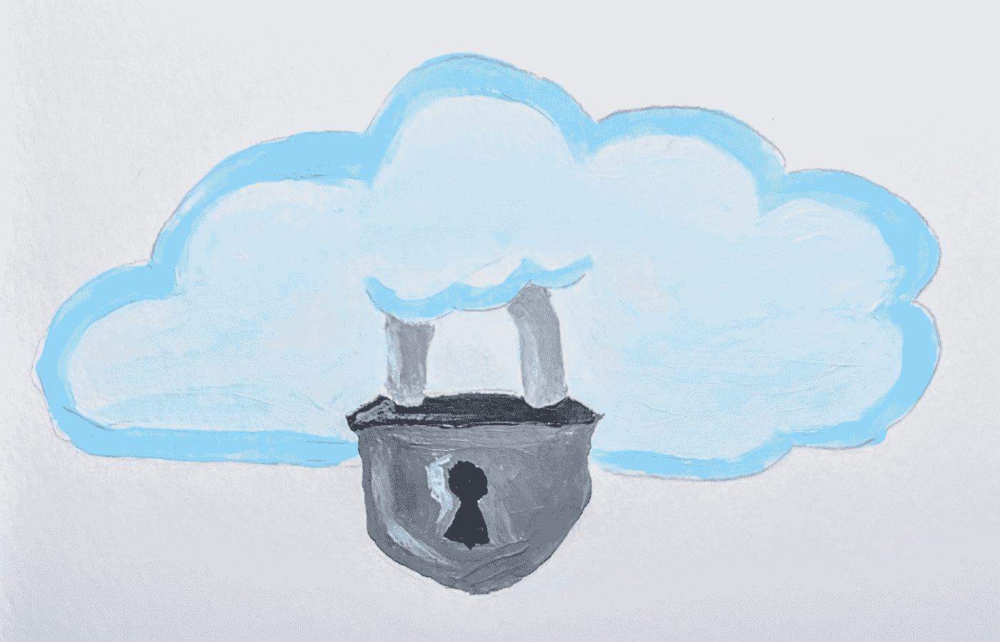
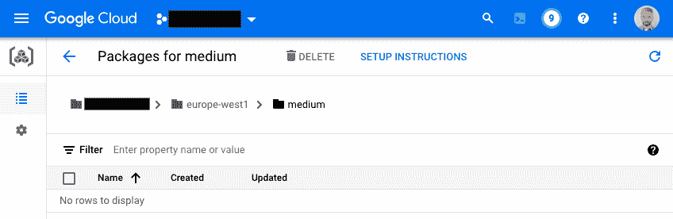

# 避免使用 Google Cloud Artifact Registry 的公共 PyPI

> 原文：<https://medium.com/google-cloud/avoid-public-pypi-using-google-cloud-artifact-registry-4464325a5e75?source=collection_archive---------0----------------------->

你为什么想要避开 [PyPI](https://pypi.org/) ？PyPI 很棒，它是一个巨大的集市，有近 400，000 个包，自 2003 年以来一直公开发售。但不幸的是，它对出版内容的控制也非常有限。不怀好意的人很容易发布与现有流行软件包名称非常相似的软件包，利用常见的打字错误，并包含恶意软件。也有可能找到所有者不再有时间照看的包，并试图侵入所有者的帐户并发布有效现有包的新中毒版本。有许多变种利用这些[软件供应链漏洞](https://cloud.google.com/resources/delivering-software-securely-whitepaper)，但是我们也可以通过避开我们无法控制的软件库来保护自己。

更大的组织通常会走得更远，直接禁止访问公共互联网。现在如果你需要安装一个 Python 包，你会怎么做？如果你在谷歌云上，你使用工件注册。



有很多关于使用 Artifact Registry 设置 Python 存储库的信息，通常是为了共享内部开发的 Python 包。但是对于那些在没有互联网接入的环境中的人来说，具体的挑战很少被涉及。这篇文章提供了如何克服这些障碍的细节。

如果你建立了一个私有的软件包回购，正如我们在这篇文章中建议的，你将不得不通过不断安装新版本的软件包来维护它，让你的用户保持最新。当 Artifact Registry 使其[虚拟存储库](https://cloud.google.com/artifact-registry/docs/repositories/virtual-repo)普遍可用时，这种负担将会减轻，但在此之前，我们将不得不手工维护。

# 在工件注册表上设置 Python 索引

您的相关管理员将锁定您的互联网访问，例如禁止您使用外部 IP 地址创建资源，如计算引擎中的虚拟机或 Vertex AI Workbench 中的 Jupyter 笔记本。如果资源的网络(VPC)没有启用云 NAT，它将无法访问互联网。

在这种情况下，当我们需要安装 Python 包时，我们将从 Artifact Registry 中的 Python 存储库中安装它们。我们首先选择我们信任的 Python 包和版本，并允许在我们的项目中使用。我们将把这些包上传到 Artifact Registry，项目的用户可以在需要的时候安装它们。

但是，如果我们没有互联网接入，我们如何让包上传到工件注册？要设置我们的 Python 包存储库，我们需要从某个地方访问互联网。我们可以在计算引擎中使用虚拟机，管理员可以使用外部 IP 地址创建该虚拟机，或者在具有云 NAT 的 VPC 中创建虚拟机，以支持互联网访问。当然，在这种情况下，我们将不得不阻止其他用户在这个 VPC 中创建资源！

对于本文的剩余部分，我们将假设我们在安全项目中的一个虚拟机上工作，该虚拟机可以访问公共互联网和我们项目中的工件注册表。我们将使用 [gcloud 命令行界面](https://cloud.google.com/sdk/docs/install)。

在这种情况下，我们可以简单地按照[文档](https://cloud.google.com/artifact-registry/docs/python)创建一个 Python 库并上传我们的包:

1.  首先在您选择的地区创建一个名为“medium”的 Python 存储库:

```
gcloud auth login
gcloud config set project my_project
gcloud artifacts repositories create medium \
   --repository-format=python --location=europe-west1
```

2.一个项目所需的 Python 包列表通常保存在一个 [requirements.txt 文件](https://learnpython.com/blog/python-requirements-file/)中。如果您没有，那么您可以使用 pip freeze 创建一个 requirements.txt:

```
pip freeze > requirements
```

3.准备下载我们所有的软件包！或者也许我们应该首先检查我们的列表不包含任何已知的漏洞…我推荐使用 [pip-audit](https://www.redhat.com/sysadmin/find-python-vulnerabilities) 。如果它返回“没有发现漏洞”，那么我们就可以走了！您可以按如下方式使用 pip-audit:

```
pip install virtualenv
virtualenv venv
source venv/bin/activate
pip install --upgrade pip-audit
pip-audit --requirement requirements.txt
```

4.终于准备好下载我们所有的软件包了。画中画工具在这里很有用:

```
mkdir dist
pip download --destination-directory dist -r ../requirements.txt
```

5.现在，我们使用 twine 上传下载的包，如 [Google Cloud 文档](https://cloud.google.com/artifact-registry/docs/python/manage-packages)中所述(不要忘记将“my_project”替换为您的项目名称！)

```
pip install twine
twine upload --repository-url [https://europe-west1-python.pkg.dev/my_project/medium/](https://europe-west1-python.pkg.dev/my_project/medium/) dist/* --skip-existing
```

如果 twine 挂在大量要上传的包上，请逐个上传:

```
for F in dist/*; do twine upload — repository-url [https://europe-west1-python.pkg.dev/my_project/medium/](https://europe-west1-python.pkg.dev/my_project/medium/) $F — skip-existing; done
```

恭喜你，你的 Python 库已经上线了！

# 使用您的私有 Python 包存储库

[文档](https://cloud.google.com/artifact-registry/docs/python/authentication)以及许多博客和 stackoverflow 问题将告诉您做两件事:设置认证和配置 pip 以从工件注册中心的 Python 存储库中检索包。我们来看这两个步骤。


# 设置身份验证

在使用 pip install 从 Artifact Registry 中的存储库安装软件包之前，您需要启用 pip 来验证 Artifact Registry。Pip 不是一个 Google Cloud 感知工具，所以它需要某种机制来检索 Google Cloud 凭证。这个机制就是 Google Cloud Artifact Registry 插件的“keyring”包。使用 pip install 安装密匙环和插件。

但是等等……如果我不能访问互联网，也不能通过我的私有存储库进行认证，我该如何用插件安装这个密匙环呢？蛇咬自己的尾巴。

## 最简单的方法

这个问题最简单的解决方案是让管理员构建一个自定义容器。如果这个容器构建过程可以访问互联网，那么您可以将这些包作为 Docker 构建的一部分进行 pip 安装:

```
RUN pip install keyring==23.7.0
RUN pip install keyrings.google-artifactregistry-auth==1.0.0
```

注意，这一步确实涉及到从公共 PyPI 安装这些包，这是我们试图避免的。但是我们需要在某个时候下载这些包，只要它在管理员的控制下，我们就可以，比如说，如果这些包已经被污染了，我们就可以取消发布容器。

## 如果最简单的方法不适用

最简单的方法是构建一个定制的映像，并在容器构建过程中使用互联网访问。如果您使用云构建来构建您的容器，那么云构建工作人员必须能够访问互联网。如果违反了这两个条件中的任何一个，我们就需要寻找另一个解决方案。

解决方案是让管理员下载包，就像我们之前从 requirements.txt 文件下载包一样。我们使用 pip 安装下载的文件，这将启用工件注册的认证。

我们只需要安装两个包:keyring 和 key rings . Google-artifact registry-auth。但是我们也需要他们的依赖。以及依赖关系的依赖关系。更不用说，*他们的*依赖关系了。你明白了。Pip 下载将负责下载所有内容。总共有 22 个包，你需要按照正确的顺序安装。对于当前版本 keyring 23.7.0 和 keyrings . Google _ artifact registry _ auth 1 . 0 . 0，以下是按有效顺序排列的列表:

```
jeepney-0.8.0-py3-none-any.whl
typing_extensions-4.3.0-py3-none-any.whl
zipp-3.8.1-py3-none-any.whl
importlib_metadata-4.12.0-py3-none-any.whl
pycparser-2.21-py2.py3-none-any.whl
cffi-1.15.1-cp37-cp37m-manylinux_2_17_x86_64.manylinux2014_x86_64.whl
cryptography-37.0.4-cp36-abi3-manylinux_2_24_x86_64.whl
SecretStorage-3.3.2-py3-none-any.whl
keyring-23.7.0-py3-none-any.whl
pyasn1–0.4.8-py2.py3-none-any.whl
pyasn1_modules-0.2.8-py2.py3-none-any.whl
rsa-4.9-py3-none-any.whl
cachetools-5.2.0-py3-none-any.whl
six-1.16.0-py2.py3-none-any.whl
google_auth-2.9.1-py2.py3-none-any.whl
certifi-2022.6.15-py3-none-any.whl
charset_normalizer-2.1.0-py3-none-any.whl
idna-3.3-py3-none-any.whl
urllib3–1.26.11-py2.py3-none-any.whl
requests-2.28.1-py3-none-any.whl
pluggy-1.0.0-py2.py3-none-any.whl
keyrings.google_artifactregistry_auth-1.0.0-py3-none-any.whl
```

管理员可以通过云存储共享这些包，只要需要，用户就可以检索并安装它们。但是这有点麻烦，如果我们正在运行任何类型的分布式处理(例如，使用数据流)，我们将需要在每次新工人启动时经历这个过程，这将影响处理速度。最好是生成一个 docker 映像，并使用这个映像来启动新的工人。我不会在这里详细描述，但是如果你在数据流中使用自定义容器，你可以将所有的包下载到一个目录(例如 pydist)中，并将其包含在 docker 文件中:

```
ADD pydist pydist
RUN pip install pydist/jeepney-0.8.0-py3-none-any.whl
RUN pip install pydist/typing_extensions-4.3.0-py3-none-any.whl
RUN pip install pydist/zipp-3.8.1-py3-none-any.whl
...
```

诸如此类。

一旦我们安装了这些包，我们就可以运行 keyring-list-backends，它应该会输出如下内容:

```
keyrings.gauth.GooglePythonAuth (priority: 9)
keyring.backends.chainer.ChainerBackend (priority: -1)
keyring.backends.fail.Keyring (priority: 0)
```

这意味着我们都准备好了。如果您尚未获得认证，请使用 gcloud auth login 获取您的凭据。现在，如果您运行 pip install，它将能够通过您的存储库工件注册中心进行认证。也就是说，如果 pip 具有知道您的存储库在哪里的配置。我们一会儿会看到这是如何做到的，但是让我们思考一下。

# 装有我们需要的一切的定制容器

如果我们必须下载 22 个包，并可能构建一个自定义容器，这样我们就可以从工件注册表安装包…为什么我们不创建一个包含我们需要的所有包的自定义容器，这样我们就不需要安装任何东西了？

从性能和可重复性的角度来看，构建包含所有必需代码的自定义容器是推荐的做法。性能，因为容器启动时不需要安装工作。和可再现性，因为容器上的软件版本是固定的，而 requirements.txt 文件通常不指定(某些)包版本。

但是要做到这一点，我们需要知道我们需要的软件包的完整列表。当我们发现我们需要升级一个包时，我们需要重新构建容器。当我们需要添加一个我们以前没有使用过的包时也是如此。如果您有一个正在生产中工作的数据流管道或类似的东西，那么我们仍然建议为这个过程创建一个自定义容器。但是如果你的团队正在开发新的代码，构建新容器的管理开销将会非常高。例如，每当您想要安装 Python 包时，必须在新构建的容器上重新创建一个笔记本实例。所以 Artifact Registry 使得 Python 包的管理更加容易。

当您需要使用您的项目中没有人使用过的包时，您的管理员只需从 PyPI 下载它，验证它没有漏洞(！idspnonenote)。)，并将其上传到工件注册表。

# 配置 pip！

您可以通过在每次调用时传递正确的命令行参数来配置 pip，但是这很容易出错。[工件注册表 UI](https://console.cloud.google.com/artifacts) 有一个“设置说明”按钮



如果您单击它，它会告诉您运行这个命令(同样，用您的项目名称替换“my_project ”)

```
gcloud artifacts print-settings python \
  --project=my_project --repository=medium --location=europe-west1
```

该命令的输出是一些您可以粘贴到 pip 配置文件中的配置。它会告诉 pip 添加一个“额外的索引 URL”。这将导致 pip 查看公共 PyPI 和您的本地存储库。这很有用，所以你可以在内部发布你自己的包，而不会失去对 PyPI 的访问。不幸的是，这对我们不起作用。

如果您无法访问互联网，pip 将继续尝试检查 PyPI。我们不需要添加额外的索引 URL，我们需要设置*和*索引 URL，并告诉 pip 不要查看其他地方。这将是“我的项目”的配置，它也禁用 pip 的更新检查:

```
[global]
index-url = [https://europe-west1-python.pkg.dev/my_project/medium/simple/](https://europe-west1-python.pkg.dev/my_project/medium/simple/)[global]
disable-pip-version-check = True
```

将这些信息存储在一个名为 pip.conf 的文件中，并告诉 pip 使用它:

```
export PIP_CONFIG_FILE=pip.conf
```

如果希望从任何目录都可以使用，请使用绝对路径。如果您正在构建一个定制的容器，那么您还需要在 docker 文件中包含这个配置:

```
COPY pip.conf pip.conf
ENV PIP_CONFIG_FILE=pip.conf
```

如果您没有构建设置了这种配置的定制容器，那么每次容器启动后都必须执行这些步骤。如果你使用的是 Vertex AI 用户管理的笔记本，那么你可以为你的笔记本实例使用一个“启动后脚本”来实现自动化。您需要将脚本存储在云存储中，并将云存储的 URL 传递给[–post-startup-script 参数](https://cloud.google.com/sdk/gcloud/reference/notebooks/instances/create#--post-startup-script)，例如:

```
gcloud notebooks instances create example-instance \
  --vm-image-project=deeplearning-platform-release \
  --vm-image-family=caffe1-latest-cpu-experimental \
  --machine-type=n1-standard-4 \
  --location=us-central1-b \
  --post-startup-script=gs://…
```

现在，您可以像往常一样使用 pip install 安装软件包:

```
pip install packagename
```

查找输出的第一行，以验证 pip 正在查看正确的存储库:

```
Looking in indexes: [https://europe-west1-python.pkg.dev/my_project/medium/simple/](https://europe-west1-python.pkg.dev/my_project/medium/simple/)
```

# 结论

如果你已经走了这么远，那你就完了。现在，您已经将 pip 配置为在工件注册中心查询您的私有 Python 存储库。您还将它配置为能够通过工件注册中心进行认证，而不需要通过公共互联网！

人们越来越意识到依赖公共软件库的安全隐患。我们希望这个指南能帮助你在 Google Cloud 上配置一个安全的环境。


# 参考

1.  [安全交付软件](https://cloud.google.com/resources/delivering-software-securely-whitepaper)，谷歌云白皮书
2.  [神器登记文档](https://cloud.google.com/artifact-registry/docs/how-to)
3.  [在工件注册表](https://cloud.google.com/artifact-registry/docs/repositories/virtual-repo)上创建虚拟存储库，工件注册表文档。截至 2022 年 8 月的私人预览功能。
4.  [管理 Python 包](https://cloud.google.com/artifact-registry/docs/python/manage-packages)，工件注册文档
5.  [如何在你的 Python 代码中发现第三方漏洞](https://www.redhat.com/sysadmin/find-python-vulnerabilities)，红帽。pip 审计说明。

—

图片来源:丹尼斯·巴尔姆