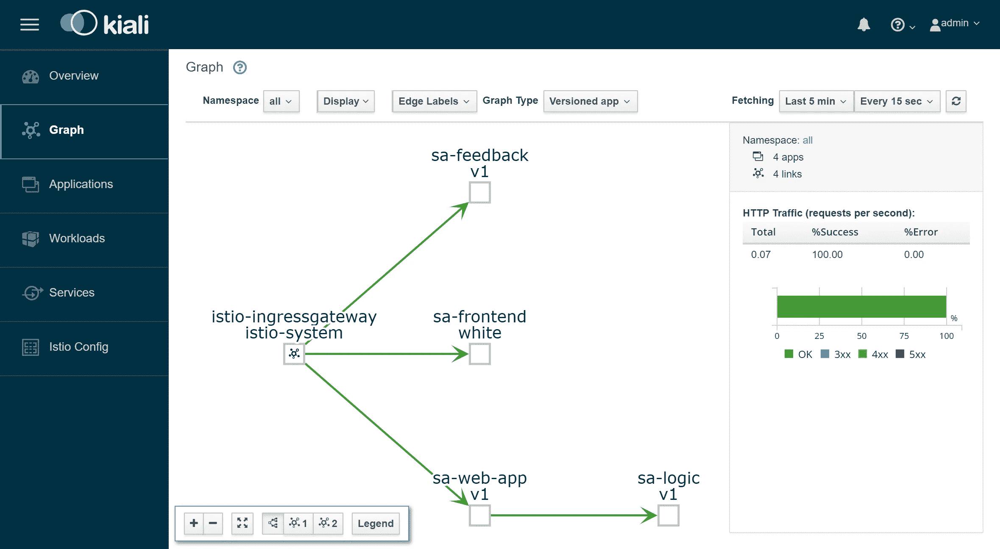

# 使用 Istio 回到微服务(第 1 部分)

> 原文：<https://medium.com/google-cloud/back-to-microservices-with-istio-p1-827c872daa53?source=collection_archive---------0----------------------->


> **注:**此文已过时。我的最新文章“[学习 Istio——如何管理、保护和监控您的服务](https://www.freecodecamp.org/news/learn-istio-manage-microservices/)”适用于最新版本的 Istio。

**Istio** 是一个开源项目，由谷歌、IBM 和 Lyft 的团队合作开发，它为基于微服务的应用的复杂性提供了一个解决方案，仅举几个例子:

*   **流量管理**:超时、重试、负载平衡、
*   **安全性:**最终用户认证和授权，
*   **可观察性:**跟踪、监控和记录。

所有这些都可以在应用层解决，但您的服务不会再如此“微观”，实现这些服务的所有额外工作会给公司的资源带来压力，而这些资源可用于交付业务价值。让我们举个例子:

> PM:添加反馈功能需要多长时间？
> 
> 戴夫:两次冲刺。
> 
> PM:什么…？那只是一堆垃圾！
> 
> Dev:创建 CRUD 是容易的部分，但是我们需要对用户和服务进行认证和授权。由于网络不可靠，我们需要在客户端实施重试和断路器，为了确保我们不会让整个系统瘫痪，我们需要超时和隔离，此外还需要检测我们需要监控和跟踪的问题[…]
> 
> PM:那我们就把它放在产品服务里吧。呀！

你应该知道，对于我们来说，增加一项服务所需要的所有仪式和努力是巨大的。在本文中，我们将展示 Istio 如何从我们的服务中消除所有上述跨领域问题。


图一。微服仪式

**注意:**本文假设您对 Kubernetes 有一定的了解。如果不是这样，我推荐你阅读[我对 Kubernetes 的介绍](https://medium.freecodecamp.org/learn-kubernetes-in-under-3-hours-a-detailed-guide-to-orchestrating-containers-114ff420e882)，然后继续这篇文章。

# Istio 的想法

在没有 Istio 的世界里，一个服务直接向另一个服务发出请求，在失败的情况下，服务需要通过重试、超时、打开断路器等方式来处理请求。


图二。Kubernetes 的网络流量

为了解决这个问题，Istio 提供了一个巧妙的解决方案，它与服务完全分离，只拦截所有网络通信。这样做可以实现:

*   **容错** —使用响应状态代码，它了解请求何时失败并重试。
*   **Canary Rollouts** —只将指定百分比的请求转发给新版本的服务。
*   **监控和度量** —服务响应所需的时间。
*   **跟踪和可观察性** —它在每个请求中添加特殊的报头，并在集群中跟踪它们。
*   **安全** —提取 JWT 令牌，对用户进行认证和授权。

举几个例子(真的只是几个)让你感兴趣！让我们进入技术细节！

# 伊斯迪奥的建筑

Istio 拦截所有网络流量，并通过在每个 pod 中注入一个智能代理来应用一组规则。启用所有功能的代理包括**数据平面**和那些可由**控制平面动态配置的功能。**

# 数据平面

注入的代理使 Istio 能够轻松实现我们的需求。举个例子，让我们看看重试和断路功能。


图 3。特使如何实施重试和断路

总结一下:

1.  Envoy 将请求发送到服务 B 的第一个实例，但它失败了。
2.  特使边车重试。(1)
3.  向调用代理返回失败的请求。
4.  这将打开断路器并根据后续请求调用下一个服务。(2)

这意味着您不必使用另一个重试库，也不必用编程语言 X、Y 或 z 开发自己的电路断开和服务发现实现。所有这些以及更多功能都由 Istio 和**提供，不需要**代码更改。

太好了！现在你想和 Istio 一起航行，但是你仍然有一些疑问，一些未解决的问题。这是一个适合所有人的解决方案吗？你对此表示怀疑，因为它最终总是没有一个适合所有人的解决方案！

你最后喃喃地问:“这是可配置的吗？”

欢迎乘坐游轮，我的朋友，让我们认识一下控制飞机。

# 控制平面

由三个组件组成:导频器**、混合器**、堡垒**和堡垒**，它们组合起来配置特使来路由流量、执行策略和收集遥测数据。直观地呈现在下图中。****


图 4。相对于数据平面的控制平面

使用 Istio 定义的 [Kubernetes 自定义资源定义](https://kubernetes.io/docs/concepts/extend-kubernetes/api-extension/custom-resources/)配置代理(即数据平面),并专门用于此目的。这意味着对您来说，它只是另一个具有熟悉语法的 Kubernetes 资源。在被创建之后，它将被**控制平面**拾取，并将其应用于特使。

# 服务与 Istio 的关系

我们描述了 Istio 与我们服务的关系，而不是反过来，我们的服务与 Istio 的关系是什么？

坦率地说，我们的服务对 Istio 的存在有很多了解，就像鱼对水一样，他们会问自己“水到底是什么？”。


维多利亚·迪米特拉科普洛斯绘制

这意味着您可以选择一个工作集群，在部署 Istio 的组件后，其中的服务将继续工作，同样，您可以删除组件，一切都会好起来。可以理解，您会失去 Istio 提供的功能。

我们已经受够了理论，让我们把这些知识付诸实践吧！

# 实践中的 Istio

Istio 要求 Kubernetes 集群至少有 4 个 vCPU 和 8 GB RAM。为了快速建立集群并跟进本文，我推荐使用 Google 云平台，它为新用户提供了 300 美元的免费试用。

创建集群并使用 Kubernetes 命令行工具配置访问后，我们就可以使用 Helm Package manager 安装 Istio 了。

# 安装舵

按照[官方文档](https://docs.helm.sh/using_helm/#installing-the-helm-client)中的说明，在您的计算机上安装 Helm 客户端。我们将在下一节中使用它来生成 Istio 安装模板。

# 安装 Istio

从[最新版本](https://github.com/istio/istio/releases/tag/1.0.5)下载 Istio 的资源，将内容提取到一个目录中，我们称之为`[istio-resources]`。

要轻松识别 Istio 资源，请在 Kubernetes 集群中创建一个名称空间`istio-system`:

```
**$ kubectl create namespace istio-system**
```

导航到`[istio-resources]`目录并执行以下命令，完成安装:

```
**$ helm template install/kubernetes/helm/istio \
  --set global.mtls.enabled=false \
  --set tracing.enabled=true \
  --set kiali.enabled=true \
  --set grafana.enabled=true \
  --namespace istio-system > istio.yaml**
```

上面的命令将 Istio 的核心组件打印到文件`istio.yaml`中。我们使用以下参数定制了模板:

*   **global.mtls.enabled** 设置为 false 以保持简介的焦点。
*   **tracing.enabled** 使用 jaeger 启用请求跟踪。
*   **kiali.enabled** 在我们的集群中安装 kiali，用于可视化服务和流量
*   **grafana.enabled** 安装 grafana 以可视化收集的指标。

通过执行以下命令来应用生成的资源:

```
**$ kubectl apply -f istio.yaml**
```

这标志着我们集群中 Istio 安装的完成！通过执行以下命令，等到`istio-system`名称空间中的所有窗格都处于运行或完成状态:

```
**$ kubectl get pods -n istio-system**
```

现在我们已经准备好继续下一部分，我们将启动并运行示例应用程序。

# 情感分析应用架构

我们将使用在 [Kubernetes 介绍文章](https://medium.freecodecamp.org/learn-kubernetes-in-under-3-hours-a-detailed-guide-to-orchestrating-containers-114ff420e882)中使用的相同微服务应用程序，它足够复杂，可以在实践中展示 Istio 的功能。

该应用由四个微服务组成:

*   **SA-前端服务**:服务于前端 Reactjs 应用。
*   **SA-WebApp 服务**:处理情感分析请求。
*   **SA 逻辑服务**:执行情感分析。
*   **SA-反馈服务**:接收用户对分析准确性的反馈。


图 6 情绪分析微服务

在图 6 中，除了服务之外，我们还看到了入口控制器，它在 Kubernetes 中将传入的请求路由到适当的服务，Istio 使用了一个类似的概念，称为入口网关，这将在本文的后续部分介绍。

# 使用 Istio 代理运行应用程序

为了跟进本文，克隆存储库 [istio-mastery](https://github.com/rinormaloku/istio-mastery) ，其中包含 Kubernetes 和 istio 的应用程序和清单。

## 边车喷射

注射由自动**或手动**或**完成。要启用自动边车注入，我们需要通过执行下面的命令，用`istio-injection=enabled`标记名称空间:**

```
**$ kubectl label namespace default istio-injection=enabled** namespace/default labeled
```

从现在开始，每个部署到默认名称空间的 pod 都将被注入 sidecar。为了验证这一点，让我们通过导航到`[istio-mastery]`存储库的根文件夹并执行以下命令来部署示例应用程序:

```
**$ kubectl apply -f resource-manifests/kube** persistentvolumeclaim/sqlite-pvc created
deployment.extensions/sa-feedback created
service/sa-feedback created
deployment.extensions/sa-frontend created
service/sa-frontend created
deployment.extensions/sa-logic created
service/sa-logic created
deployment.extensions/sa-web-app created
service/sa-web-app created
```

部署好服务后，通过执行命令`**kubectl get pods**` 来验证 pod 有两个容器(服务和边车)，并确保在 ready 列下，我们看到值“ **2/2** ”表示两个容器都在运行。如下图所示:

```
**$ kubectl get pods**
NAME                           READY     STATUS    RESTARTS   AGE
sa-feedback-55f5dc4d9c-c9wfv   2/2       Running   0          12m
sa-frontend-558f8986-hhkj9     2/2       Running   0          12m
sa-logic-568498cb4d-2sjwj      2/2       Running   0          12m
sa-logic-568498cb4d-p4f8c      2/2       Running   0          12m
sa-web-app-599cf47c7c-s7cvd    2/2       Running   0          12m
```

如图 7 所示。


图 7。特使代理在其中一个豆荚里

随着应用程序的启动和运行，我们现在需要允许传入的流量到达我们的应用程序。

# 入口网关

允许流量进入集群的最佳实践是通过 Istio 的**入口网关**，它将自己定位在集群的边缘，并在传入流量上启用 Istio 的功能，如路由、负载平衡、安全和监控。

在 Istio 的安装过程中，`Ingress Gateway`组件和对外公开它的服务被安装到集群中。要获取服务外部 IP，请执行以下命令:

```
**$ kubectl get svc -n istio-system -l istio=ingressgateway**
NAME                   TYPE           CLUSTER-IP     EXTERNAL-IP
istio-ingressgateway   LoadBalancer   10.0.132.127   13.93.30.120
```

在本文的后续部分，我们将访问这个 IP(称为 EXTERNAL-IP)上的应用程序，为了方便起见，通过执行下面的命令将它保存在一个变量中:

```
**$ EXTERNAL_IP=$(kubectl get svc -n istio-system \
  -l app=istio-ingressgateway \
  -o jsonpath='{.items[0].status.loadBalancer.ingress[0].ip}')**
```

如果你在你的浏览器中到达这个 IP，你会得到一个服务不可用的错误，因为默认情况下，Istio 会阻止任何进入的流量，直到我们定义一个网关。

# 网关资源

网关是 Kubernetes 在我们的集群中安装 Istio 时定义的自定义资源定义，它使我们能够指定我们希望允许传入流量的端口、协议和主机。

在我们的场景中，我们希望所有主机都允许端口 80 上的 HTTP 流量。通过以下定义实现:

除了选择器`istio: ingressgateway`之外，所有配置都一目了然。使用这个选择器，我们可以指定将配置应用到哪个入口网关，在我们的例子中，它是安装在 Istio 设置上的默认入口网关控制器。

通过执行以下命令来应用配置:

```
**$ kubectl apply -f resource-manifests/istio/http-gateway.yaml** gateway.networking.istio.io/http-gateway created
```

网关现在允许在端口 80 访问，但是它不知道将请求路由到哪里。这是使用**虚拟服务**实现的。

# 虚拟服务资源

VirtualService 指示入口网关如何路由允许进入集群的请求。

对于我们的应用程序，通过 **http-gateway** 发出的请求必须被路由到`**sa-frontend**` **、** `**sa-web-app**`和`**sa-feedback**` 服务(如图 8 所示)。


图 8。要用虚拟服务配置的路由

让我们来分解应该路由到 SA 前端的请求:

*   **确切的路径**T5 应该被路由到 SA 前端以获得 Index.html
*   **前缀路径** `**/static/***`应该路由到 SA-Frontend，以获取前端所需的任何静态文件，如级联样式表和 JavaScript 文件。
*   **匹配正则表达式** `**'^.*\.(ico|png|jpg)$'**`的路径应该被路由到 SA-Frontend，因为它是一个页面需要显示的图像。

这是通过以下配置实现的:

这里的要点是:

1.  这个虚拟服务适用于来自 **http 网关的请求。**
2.  目的地定义了请求被路由到的服务。

**注意:**上面的配置在文件`sa-virtualservice-external.yaml`中，它也包含路由到 SA-WebApp 和 SA-Feedback 的配置，但为了简洁起见被缩短了。

通过执行以下命令来应用虚拟服务:

```
**$ kubectl apply -f resource-manifests/istio/sa-virtualservice-external.yaml** virtualservice.networking.istio.io/sa-external-services created
```

**注意:**当我们应用 Istio 资源时，Kubernetes API 服务器创建一个由 Istio 的控制平面接收的事件，然后该控制平面将新配置应用到每个 pod 的特使代理。入口网关控制器是由控制平面配置的另一个代理，如图 9 所示。


图 9。配置**Istio-Ingres gateway**以路由请求

情绪分析应用程序现已在`http://{EXTERNAL-IP}/`上线。如果您得到一个未找到的状态，不要担心*有时配置生效和更新特使缓存需要一点时间*。

在进入下一部分之前，使用应用程序产生一些流量。

# Kiali —可观察性

要访问 Kiali 的管理用户界面，请执行以下命令:

```
$ kubectl port-forward \
    $(kubectl get pod -n istio-system -l app=kiali \
    -o jsonpath='{.items[0].metadata.name}') \
    -n istio-system 20001
```

使用用户名和密码“admin”(不带引号)打开`[http://localhost:20001/](http://localhost:20001/)`登录。有大量有用的功能，例如检查 Istio 组件的配置，根据通过拦截网络请求收集的信息可视化服务，以及回答“谁在呼叫谁？”，“哪个版本的服务有故障？”等等。在进入下一个好东西之前，花些时间检查一下 Kiali，用 Grafana 可视化指标！



图 10。Kiali —服务可观察性

# Grafana —指标可视化

Istio 收集的指标被收集到 Prometheus 中，并使用 Grafana 可视化。要访问 Grafana 的管理用户界面，执行下面的命令并打开 [http://localhost:3000。](http://localhost:3000.)

```
$ kubectl -n istio-system port-forward \
    $(kubectl -n istio-system get pod -l app=grafana \
    -o jsonpath={.items[0].metadata.name}) 3000
```

在左上角单击菜单**主页**和选择 **Istio 服务仪表板**，在左上角选择以 **sa-web-app、**开始的服务，您将看到收集的指标，如下图所示:


这是一个空洞的、完全没有意思的观点，管理层永远不会同意的。让我们通过执行下面的命令来增加一些负载:

```
$ while true; do \
    curl -i [http://$EXTERNAL_IP/sentiment](/$EXTERNAL_IP/sentiment) \
    -H “Content-type: application/json” \
    -d ‘{“sentence”: “I love yogobella”}’; \
    sleep .8; done
```

现在我们有了更漂亮的图表😊此外，我们还有 Prometheus 的监控工具和 Grafana 的可视化工具，使我们能够随时了解服务的性能、运行状况、改进或退化情况！

最后，我们将调查整个服务中的跟踪请求。

# 耶格——追踪

我们需要跟踪，因为我们拥有的服务越多，就越难查明失败的原因。让我们以下图中的简单案例为例:


图 12。通常随机失败的请求

请求进入，失败退出，*原因是什么？* *第一服？* *还是第二？*两者都有例外，让我们来看看每个例外的日志。你发现自己这样做了多少次？我们的工作感觉更像软件侦探，而不是开发人员。

这是微服务中普遍存在的问题，使用分布式跟踪系统可以解决这一问题，在分布式跟踪系统中，服务相互传递唯一的报头，然后将该信息转发给分布式跟踪系统，在分布式跟踪系统中将请求跟踪放在一起。图 13 显示了一个例子。


图 13。用于标识请求范围的 TraceId

Istio 使用 Jaeger Tracer 实现 OpenTracing API，这是一个厂商中立的框架。要访问 Jaegers UI，请执行以下命令:

```
$ kubectl port-forward -n istio-system \
    $(kubectl get pod -n istio-system -l app=jaeger \
    -o jsonpath='{.items[0].metadata.name}') 16686
```

然后在 [http://localhost:16686](http://localhost:16686/) 中打开 UI，选择 **sa-web-app** 服务，*如果下拉列表中没有显示该服务，则在页面上生成一些活动并点击刷新*。之后点击**查找轨迹**按钮，其中显示最近的轨迹，选择任意，将显示所有轨迹的明细**，**，如图 14 所示。


图 14。Jaeger —请求跟踪

跟踪显示:

1.  请求到达**istio-Ingres gateway**(这是与其中一个服务的第一次联系，因此为请求生成跟踪 ID)，然后网关将请求转发给`**sa-web-app**`服务。
2.  在`**sa-web-app**`服务中，请求被 Envoy sidecar 接收，一个 span 子节点被创建(这就是为什么我们在跟踪中看到它)并被转发到`**sa-web-app**`容器实例。
3.  这里，方法**sensitive analysis**处理请求。这些跟踪是由应用程序生成的，这意味着需要更改代码)。
4.  从开始 POST 请求的地方到`**sa-logic**` **。**跟踪 ID 需要由`**sa-web-app**`传播。

5\. …

**注意:**在第四点，我们的应用程序需要获取 Istio 生成的头，并在下一个请求中传递它们，如下图所示。


图 15。(A) Istio 传播报头， **(B)服务传播报头**

Istio 完成了主要的繁重工作，因为它在传入的请求上生成头，在每个边车上创建新的跨度，传播它们，但是如果没有我们的服务也传播头，我们将丢失请求的完整跟踪。

要传播的头是:

```
x-request-id
x-b3-traceid
x-b3-spanid
x-b3-parentspanid
x-b3-sampled
x-b3-flags
x-ot-span-context
```

尽管这是一项简单的任务，但已经有许多库[简化了这个过程，例如在`**sa-web-app**`服务中， **RestTemplate** 客户端通过简单地在](https://github.com/opentracing-contrib)[依赖项](https://github.com/rinormaloku/istio-mastery/blob/master/sa-webapp/pom.xml#L36-L47)中添加 Jaeger 和 OpenTracing 库来传播头文件。

*注意:情绪分析应用展示了 Flask、Spring 和 ASP.NET 核心的实现。*

现在，在研究了我们开箱即用(或部分开箱即用)后😜)这里进入主要话题，细粒度路由，管理网络流量，安全等等！

# 交通管理

使用 Envoy 的 Istio 可为您的集群提供大量新功能，从而实现:

*   **动态请求路由** : Canary 部署，A/B 测试，
*   **负载均衡:**简单和一致哈希均衡，
*   **故障恢复**:超时、重试、断路器、
*   **故障注入**:延迟、中止请求等。

在本文的序列中，我们将展示我们的应用程序中的这些功能，并一路介绍新概念。我们将深入研究的第一个概念是 DestinationRules，并使用它们来启用 A/B 测试。

# A/B 测试—实践中的目的地规则

当我们有一个应用程序的两个版本(通常版本在视觉上不同)并且我们不能 100%确定哪个会增加用户交互时，就使用 A/B 测试，所以我们同时测试两个版本并收集指标。

执行以下命令来部署演示 A/B 测试所需的第二个版本的前端:

```
**$ kubectl apply -f resource-manifests/kube/ab-testing/sa-frontend-green-deployment.yaml** deployment.extensions/sa-frontend-green created
```

绿色版本的部署清单有两点不同:

1.  该图像基于不同的标签:`**istio-green**`和
2.  豆荚上贴有`**version: green**`的标签。

由于两个部署都有标签`**app: sa-frontend**`，由虚拟服务`**sa-external-services**` 路由到服务`**sa-frontend**`的请求将被转发到其所有实例，并将使用循环算法进行负载平衡，这导致了图 16 所示的问题。


图 16。找不到请求的文件

找不到这些文件，因为它们在不同版本的应用程序中的名称不同。让我们验证一下:

```
**$ curl --silent** [**http://$EXTERNAL_IP/**](http://$EXTERNAL_IP/) **| tr '"' '\n' | grep main** /static/css/main.c7071b22.css
/static/js/main.059f8e9c.js
**$ curl --silent** [**http://$EXTERNAL_IP/**](http://$EXTERNAL_IP/) **| tr '"' '\n' | grep main** /static/css/main.f87cd8c9.css
/static/js/main.f7659dbb.js
```

这意味着请求静态文件的一个版本的`index.html`可能被负载平衡到交付另一个版本的 pod，可以理解的是其他文件不存在。

这意味着，为了让我们的应用程序工作，我们需要引入一个限制条件，即**“服务于 index.html 的应用程序版本必须服务于后续请求”**。

我们将使用一致的哈希负载平衡来实现这一点，这个过程**使用预定义的属性将请求从同一个客户端转发到同一个后端实例**，例如 HTTP 头**。**因**和**的目的规则而成为可能。

# 目的地规则

在一个请求被 **VirtualService** 路由到正确的服务之后，使用 **DestinationRules** 我们可以指定应用于该服务实例的流量的策略，如图 17 所示。


图 17。利用 Istio 资源进行交通管理

**注:**图 17 以一种易于理解的方式直观地展示了 Istio 资源如何影响网络流量。但是，准确地说，将请求转发到哪个实例的决定是在由 CRDs 配置的入口网关的特使中做出的。

使用目的地规则，我们可以配置负载平衡，以获得一致的哈希，并确保相同的用户由相同的服务实例响应。通过以下配置实现:

1.  根据“版本”头的内容生成一致的哈希。

通过执行下面的命令来应用配置，并尝试一下！

```
**$ kubectl apply -f resource-manifests/istio/ab-testing/destinationrule-sa-frontend.yaml** destinationrule.networking.istio.io/sa-frontend created
```

执行以下命令，并验证在指定版本头时是否获得了相同的文件:

```
**$ curl --silent -H "version: yogo"** [**http://$EXTERNAL_IP/**](http://$EXTERNAL_IP/) **| tr '"' '\n' | grep main**
```

**注意:**你可以用这个 [chrome 扩展](https://chrome.google.com/webstore/detail/modheader/idgpnmonknjnojddfkpgkljpfnnfcklj)给版本头添加不同的值，在你的浏览器中测试。

DestinationRules 有更多的负载平衡能力，详情请查看[官方文档](https://preliminary.istio.io/docs/reference/config/istio.networking.v1alpha3.html#LoadBalancerSettings)。

在更详细地了解 VirtualService 之前，通过执行以下命令删除绿色版本的应用程序和目标规则:

```
**$ kubectl delete -f resource-manifests/kube/ab-testing/sa-frontend-green-deployment.yaml** deployment.extensions “sa-frontend-green” deleted
**$ kubectl delete -f resource-manifests/istio/ab-testing/destinationrule-sa-frontend.yaml** destinationrule.networking.istio.io “sa-frontend” deleted
```

# 影子——实践中的虚拟服务

当我们想要测试生产中的变更但不影响最终用户时，就使用影子或镜像，因此我们将请求镜像到有变更的第二个实例中并评估它。更简单地说，就是你的一个同事挑出最关键的问题，提出一个没有人能真正审查的大难题。

为了测试这个特性，让我们通过执行下面的命令创建 SA-Logic 的第二个实例(*有问题*):

```
**$ kubectl apply -f resource-manifests/kube/shadowing/sa-logic-service-buggy.yaml** deployment.extensions/sa-logic-buggy created
```

执行以下命令，并验证所有实例都标有各自的版本和`**app=sa-logic**`:

```
**$ kubectl get pods -l app=sa-logic --show-labels**
NAME                              READY   LABELS
sa-logic-568498cb4d-2sjwj         2/2     app=sa-logic,**version=v1**
sa-logic-568498cb4d-p4f8c         2/2     app=sa-logic,**version=v1**
sa-logic-buggy-76dff55847-2fl66   2/2     app=sa-logic,**version=v2**
sa-logic-buggy-76dff55847-kx8zz   2/2     app=sa-logic,**version=v2**
```

由于服务`**sa-logic**`以标有`**app=sa-logic**`的 pod 为目标，任何传入的请求都将在所有实例之间进行负载平衡，如图 18 所示。


图 18。循环负载平衡

但是我们希望将请求路由到版本为 v1 的实例，并镜像到版本为 v2 的实例，如图 19 所示。


图 19。路由到 v1 并镜像到 v2

这是通过将 VirtualService 与 DestinationRule 结合使用来实现的，其中 destination rule 指定子集和到特定子集的 VirtualService 路由。

# 使用目标规则指定子集

我们使用以下配置定义子集:

1.  主机定义该规则仅在向`**sa-logic**`服务进行路由时适用
2.  路由到子集实例时使用的子集名称。
3.  Label 定义了需要匹配的键值对，以使实例成为子集的一部分。

执行以下命令，应用配置:

```
**$ kubectl apply -f resource-manifests/istio/shadowing/sa-logic-subsets-destinationrule.yaml** destinationrule.networking.istio.io/sa-logic created
```

定义了子集后，我们可以继续并配置虚拟服务，以应用于向`**sa-logic**`发出的请求，这些请求是:

1.  路由到名为 v1 的子集，
2.  镜像到名为 v2 的子集。

这是通过下面的清单实现的:

因为一切都是不言自明的，所以让我们看看它的实际应用:

```
**$ kubectl apply -f resource-manifests/istio/shadowing/sa-logic-subsets-shadowing-vs.yaml** virtualservice.networking.istio.io/sa-logic created
```

通过执行以下命令增加一些负载:

```
**$ while true; do curl -v** [**http://$EXTERNAL_IP/sentiment**](/$EXTERNAL_IP/sentiment) **\
    -H “Content-type: application/json” \
    -d ‘{“sentence”: “I love yogobella”}’; \
    sleep .8; done**
```

检查 Grafana 中的结果，我们可以看到有问题的版本使大约 60%的请求失败，但是没有一个失败影响最终用户，因为他们由当前活动的服务响应。


图 20。sa 逻辑服务版本的成功率

在本节中，我们第一次看到了应用于我们服务的代理的 VirtualService，当`**sa-web-app**` 向`**sa-logic**` 发出请求时，该请求会通过 sidecar envoy，它通过 VirtualService 被配置为路由到服务的子集 v1 并镜像到服务的子集 v2。

我可以看到你在想“该死的虚拟服务很简单！”，在下一节中，我们将把这个句子扩展为“简直太棒了！”。

# 金丝雀部署

Canary 部署是向一小组用户推出新版本应用程序的过程，作为验证不存在问题的一个步骤，然后以更高的质量保证向更广泛的受众发布。

我们将继续使用同样有问题的`**sa-logic**`子集来演示金丝雀部署。

让我们大胆地开始，通过应用下面的 VirtualService，将 20%的用户发送到错误版本(这代表 canary 部署),将 80%的用户发送到健康服务:

1.  Weight 指定转发到目标或目标子集的请求的百分比。

使用以下命令更新先前的`**sa-logic**`虚拟服务配置:

```
**$ kubectl apply -f resource-manifests/istio/canary/sa-logic-subsets-canary-vs.yaml** virtualservice.networking.istio.io/sa-logic configured
```

我们立即发现我们的一些请求失败了:

```
**$ while true; do \
   curl -i** [**http://$EXTERNAL_IP/sentiment**](/$EXTERNAL_IP/sentiment) **\
   -H “Content-type: application/json” \
   -d ‘{“sentence”: “I love yogobella”}’ \
   --silent -w “Time: %{time_total}s \t Status: %{http_code}\n” \
   -o /dev/null; sleep .1; done** Time: 0.153075s Status: 200
Time: 0.137581s Status: 200
Time: 0.139345s Status: 200
Time: 30.291806s Status: 500
```

虚拟服务支持 Canary 部署，通过这种方法，我们将潜在的损害减少到了 20%的用户群。漂亮！现在，每当我们对代码不安全时，换句话说，总是可以使用阴影和金丝雀部署。😜

# 超时和重试次数

代码并不总是有问题。在“[分布式计算的 8 个谬误](https://en.wikipedia.org/wiki/Fallacies_of_distributed_computing#The_fallacies)列表中，第一个谬误是“网络是可靠的”。网络不可靠，这就是为什么我们需要超时和重试。

出于演示目的，我们将继续使用`**sa-logic**`的错误版本，其中随机故障模拟网络的不可靠性。

有缺陷的服务有三分之一的机会花费太长时间来响应，三分之一的机会以内部服务器错误结束，其余的成功完成。

为了缓解这些问题并改善用户体验，我们可以:

1.  如果服务时间超过 8 秒，则超时
2.  对失败的请求重试。

这是通过以下资源定义实现的:

1.  该请求的超时时间为 8 秒，
2.  它尝试 3 次，
3.  如果尝试时间超过 3 秒，将被标记为失败。

这是一种优化，因为用户等待的时间不会超过 8 秒，如果失败，我们会重试三次，从而增加成功响应的机会。

使用以下命令应用更新的配置:

```
**$ kubectl apply -f resource-manifests/istio/retries/sa-logic-retries-timeouts-vs.yaml** virtualservice.networking.istio.io/sa-logic configured
```

并查看成功率提高的 Grafana 图(如图 21 所示)。


图 21。使用超时和重试后的改进

在进入下一部分之前，通过执行以下命令删除`**sa-logic-buggy**`和虚拟服务:

```
**$ kubectl delete deployment sa-logic-buggy** deployment.extensions “sa-logic-buggy” deleted
**$ kubectl delete virtualservice sa-logic** virtualservice.networking.istio.io “sa-logic” deleted
```

# 断路器和隔板模式

微服务架构中支持服务自我修复的两种重要模式。

**断路器**用于阻止发送到被认为不健康的服务实例的请求，并使其能够恢复，同时客户端的请求被转发到该服务的健康实例(提高成功率)。

**隔板模式**隔离故障，防止整个系统停机，例如，服务 B 处于损坏状态，另一个服务(服务 B 的客户端)向服务 B 发出请求。这将导致客户端耗尽自己的线程池，无法为其他请求提供服务(即使这些请求与服务 B 无关)。

我将跳过这些模式的实现，因为您可以在[官方文档](https://istio.io/docs/tasks/traffic-management/circuit-breaking/)中查看实现，我对展示认证和授权太兴奋了，这将是下一篇文章的主题。

# 第一部分——总结

在本文中，我们在 Kubernetes 集群中部署了 Istio，并使用其定制资源定义，如**网关**、**虚拟服务**、**目的地规则**及其组件，它实现了以下特性:

*   通过使用 **Kiali** 回答哪些服务正在运行、它们的性能如何以及它们之间的关系，来观察我们的服务。
*   使用 **Prometheus** 和 **Grafana** 进行度量收集和可视化。
*   用 **Jaeger** 请求追踪(德语为猎人)。
*   对网络流量进行全面精细的控制，支持**金丝雀部署**、 **A/B 测试和阴影**。
*   轻松实现**重试、超时和断路器**。

所有这一切都是可能的，无需代码更改或任何额外的依赖，保持您的服务小，易于操作和维护。

对于您的开发团队来说，移除这些横切关注点并将它们集中到 Istio 的控制平面中，意味着新服务易于引入，它们不会占用大量资源，因为开发人员可以专注于解决业务问题。而且到目前为止，没有一个开发者抱怨“必须解决有趣的业务问题！”。

我很乐意在下面的评论中听到你的想法，也可以随时通过推特或我的主页 rinormaloku.com T2 联系我。

事不宜迟，让我们进入第二部分[回到使用 Istio(第 2 部分)](/google-cloud/back-to-microservices-with-istio-part-2-authentication-authorization-b079f77358ac)的微服务，让我们处理认证和授权！