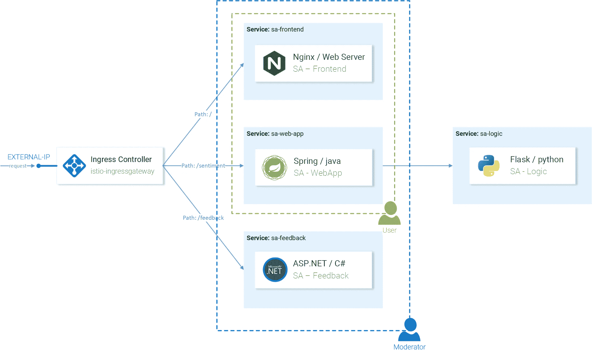

# 回到使用 Istio 的微服务(第 2 部分)—身份验证和授权

> 原文：<https://medium.com/google-cloud/back-to-microservices-with-istio-part-2-authentication-authorization-b079f77358ac?source=collection_archive---------0----------------------->


> **注意:**这篇文章已经过时了。我的最新文章“[学习 Istio——如何管理、保护和监控您的服务](https://www.freecodecamp.org/news/learn-istio-manage-microservices/)”适用于最新版本的 Istio。

*这是文章的第二部分“* [*回微服务用 Istio*](/@rinormaloku37/back-to-microservices-with-istio-part-1-827c872daa53) *”(跟随第二部分的先决条件是完成第一部分。)*

在第一篇文章中，我们建立了一个 Kubernetes 集群，在其中部署了 **Istio** 和示例微服务应用程序“情绪分析”，以展示 Istio 的特性。

使用 Istio，我们保持了较小的服务规模，并淘汰了以下层:重试、超时、断路器、跟踪、监控(如图 1 所示),此外，我们启用了高级测试和部署技术，如 A/B 测试、阴影和金丝雀部署。


图一。微服仪式

在本文中，我们将处理认证和授权的最后一层，使用 Istio，这是一次愉快的经历！

# Istio 中的身份验证和授权

我从来不相信认证和授权会让我兴奋！在技术领域，Istio 可以做些什么来让这些话题变得有趣，更重要的是，为什么你也应该感到兴奋？

**答案很简单:** Istio 将这些责任从我们的服务转移到 Envoy 代理，当请求到达我们的服务时，它们已经被认证和授权，我们只需编写提供业务价值的代码。

听起来不错？让我们开始吧！

# 使用 Auth0 进行身份验证

作为身份和访问管理服务器，我们将使用 Auth0，它有一个试用选项，使用起来很直观，我非常喜欢它！也就是说，同样的原则可以用于任何 [OpenID Connect 实现](https://openid.net/developers/certified/)，比如 KeyCloak、IdentityServer 等等。

首先，导航到 [Auth0 Portal](https://manage.auth0.com) 使用您的首选帐户登录，创建一个租户，导航到应用程序>默认应用程序下，选择域名，如下图所示:


图二。Auth0 管理门户中的默认应用

更新文件`resource-manifests/istio/security/auth-policy.yaml`以使用您的域:

有了这个资源，pilot 配置代理在将请求转发给服务之前对请求进行身份验证:`**sa-web-app**`和`**sa-feedback**`。同时，这不适用于服务`**sa-frontend**`的使者，使我们能够得到未经认证的前端。要应用该策略，请执行以下命令:

```
**$ kubectl apply -f resource-manifests/istio/security/auth-policy.yaml** policy.authentication.istio.io “auth-policy” created
```

回到页面做一个请求，你会看到以 401 Unauthorized 结尾，现在让我们从前端转发用户用 Auth0 认证。

# 使用 Auth0 验证请求

为了验证终端用户的请求，我们需要在 Auth0 中创建一个 API，它代表经过验证的服务，即:评论、细节和评级。要创建 API，请导航到 **Auth0 门户**>**API**>**创建 API** ，如下图所示。


图 3。在 Auth0 中创建新的 API

这里的重要信息是稍后在脚本中使用的标识符，如:

*   **观众:**{你的观众}

其余需要的细节在 Auth0 门户的**应用**下，然后选择自动创建的与 API 同名的**测试应用**。

在这里记下:

*   **域:**{您的域}
*   **客户 Id:**{您的客户 ID}

在测试应用程序中向下滚动到 **Allowed Callback URLs** 文本字段，在这里我们指定在认证完成后呼叫应该转发到的 URL，在我们的例子中是:

`[http://{EXTERNAL_IP}/callback](/google-cloud/{EXTERNAL_IP}/callback)`

添加对于**允许的注销 URL**添加以下 URL:

`[http://{EXTERNAL_IP}/logout](/google-cloud/{EXTERNAL_IP}/logout)`

我们去前台吧。

# 更新前端

签出到`[istio-mastery]`存储库的分支 **auth0** 。在此分支中，前端包含代码更改，将用户转发到 Auth0 进行身份验证，并在对其他服务的请求中使用 JWT 令牌，如下所示:

要更新前端以使用您的租户的详细信息，请导航至文件`sa-frontend/src/services/Auth.js`,并用我们之前记录的值替换以下值:

应用程序准备就绪，在下面的命令中指定您的 docker 用户 id，然后构建和部署更改:

```
**$ docker build -f sa-frontend/Dockerfile \
 -t $DOCKER_USER_ID/sentiment-analysis-frontend:istio-auth0 \
 sa-frontend****$ docker push $DOCKER_USER_ID/sentiment-analysis-frontend:istio-auth0****$ kubectl set image deployment/sa-frontend \
 sa-frontend=$DOCKER_USER_ID/sentiment-analysis-frontend:istio-auth0**
```

试试这个应用吧！您将被转发到 Auth0，在那里您必须登录(或注册),然后被转发回页面，并可以发出经过身份验证的请求。同时，如果您尝试早期的 curl 命令，您将得到一个 401 状态代码，表明该请求是未经授权的。

让我们更进一步，授权请求。

# 使用 Auth0 授权

身份验证使我们能够知道用户是谁，但我们需要授权才能知道他们可以访问什么。Istio 也为此提供了工具！

例如，我们将创建两组用户(如图 24 所示):

*   **用户**:只能访问 SA-WebApp 和 SA-Frontend 服务。
*   **版主**:谁可以访问所有三个服务。



图 4。授权概念

为了创建用户组，我们将使用 Auth0 授权扩展，然后使用 Istio 为他们提供不同级别的访问权限。

# 安装和配置 Auth0 授权

在 Auth0 门户中，导航到扩展并安装“Auth0 Authorization”扩展。安装完成后，导航到授权扩展，通过单击右上角的租户并选择菜单选项“配置”进行配置。启用群组，点击按钮**发布规则**。


图 5。激活令牌内容中的组

# 创建组

在授权扩展中，导航到**组**并创建版主组。同时，我们将把所有经过身份验证的用户视为普通用户，因此没有必要创建额外的组。

选择版主组并点击添加成员，添加您的主帐户。让一些用户没有任何组来验证对他们的访问是禁止的。(您可以在 Auth0 门户>用户>创建用户中手动注册新用户)

# 向访问令牌添加组声明

用户被添加到组中，但此信息不会反映在访问令牌中。为了保持 OpenID Connect 一致性，同时返回组，我们需要[向令牌添加自定义命名空间声明](https://auth0.com/docs/tokens/access-token#add-custom-claims)。这可以使用 Auth0 规则来完成。

要在 Auth0 门户中创建规则，请导航到 Rules，单击“创建规则”并从模板中选择一个空规则**。**


图 6。创建新规则

粘贴下面的代码并保存名为“添加组声明”的新规则。

**注意:**这段代码选择授权扩展中定义的第一组用户，并将其作为自定义命名空间声明添加到访问令牌中。

返回到**规则页面**并验证您是否按此顺序获得了两个角色:

*   auth 0-授权-扩展
*   添加组索赔

顺序很重要，因为 group 字段是由`**auth0-authorization-extension**`规则异步检索的，然后由第二个规则作为命名空间声明添加，产生了下面的访问令牌:

```
{
 "https://sa.io/group": "Moderators",
 "iss": "https://sentiment-analysis.eu.auth0.com/",
 "sub": "google-oauth2|196405271625531691872"
 // [shortened for brevity]
}
```

现在，我们必须配置特使代理，通过从返回的访问令牌中的声明`https://sa.io/group`中提取组来验证用户访问。那是下一节的主题，让我们移到那边去。

# 在 Istio 中配置授权

为了获得授权，我们需要为 Istio 启用 RBAC。为此，请对网格应用以下配置:

1.  仅对包含字段中指定的服务和/或命名空间启用 RBAC。
2.  包括指定的服务列表。

通过执行以下命令来应用配置:

```
**$ kubectl apply -f resource-manifests/istio/security/enable-rbac.yaml** rbacconfig.rbac.istio.io/default created
```

现在，所有服务都需要基于角色的访问控制，换句话说，对所有服务的访问都被拒绝，并将导致响应“RBAC:访问被拒绝”。允许授权用户访问将是下一节的主题。

# 配置常规用户访问

所有用户都应该能够访问**SA-前端**和 **SA-WebApp** 服务，这是通过以下 Istio 资源实现的:

*   **ServiceRole:** 指定用户拥有的权限
*   **ServiceRoleBinding:** 指定服务角色适用于谁。

对于普通用户，我们将允许访问指定的服务:

并且使用**常规用户绑定**我们将把 ServiceRole 应用到我们页面的所有访问者:

哦！所有用户这意味着未经身份验证的用户可以 SA WebApp？不，该策略仍将检查 JWT 令牌的有效性。😉

应用配置:

```
**$ kubectl apply -f resource-manifests/istio/security/user-role.yaml** servicerole.rbac.istio.io/regular-user created
servicerolebinding.rbac.istio.io/regular-user-binding created
```

# 配置仲裁者用户访问

对于我们的版主，我们希望能够访问所有服务:

但是我们希望只将它绑定到那些访问令牌拥有等同于值仲裁者的声明`https://sa.io/group`的用户。

要应用配置，请执行:

```
**$ kubectl apply -f resource-manifests/istio/security/mod-role.yaml** servicerole.rbac.istio.io/mod-user created
servicerolebinding.rbac.istio.io/mod-user-binding created
```

由于特使中的缓存，授权规则可能需要几分钟才能生效，但在此之后，您将能够验证用户和版主具有不同的访问级别。

# 第 2 部分—总结

说真的，你见过更简单的、零工作量的、可扩展的、安全的认证和授权概念吗？

仅使用三种 Istio 资源(RbacConfig、ServiceRole 和 ServiceRoleBinding ),我们就可以对认证和授权终端用户访问我们的服务进行细粒度控制。

此外，我们将这些顾虑从我们的服务中转移给特使，我们:

*   减少安全问题和错误可能潜入的样板代码，
*   减少由于忘记注释而暴露一个端点的愚蠢情况。
*   您消除了每次添加新角色或权限时更新所有服务的连锁反应。
*   简单、安全、快速地添加新服务。

# 结论

Istio 使您的团队能够再一次将他们的资源集中在提供商业价值上，而没有仪式性的服务开销，最终让他们回到**微观**。

本文为您提供了坚实的知识和实际操作，让您在现实世界的项目中开始使用 Istio。

我借此机会感谢你和我一起踏上这次旅程，这当然不容易，你能坚持下来真是太棒了。我很想在下面的评论中听到你的想法，也可以随时在 rinormaloku.com 的[推特](https://twitter.com/rinormaloku)或我的页面[上联系我。](https://rinormaloku.com)