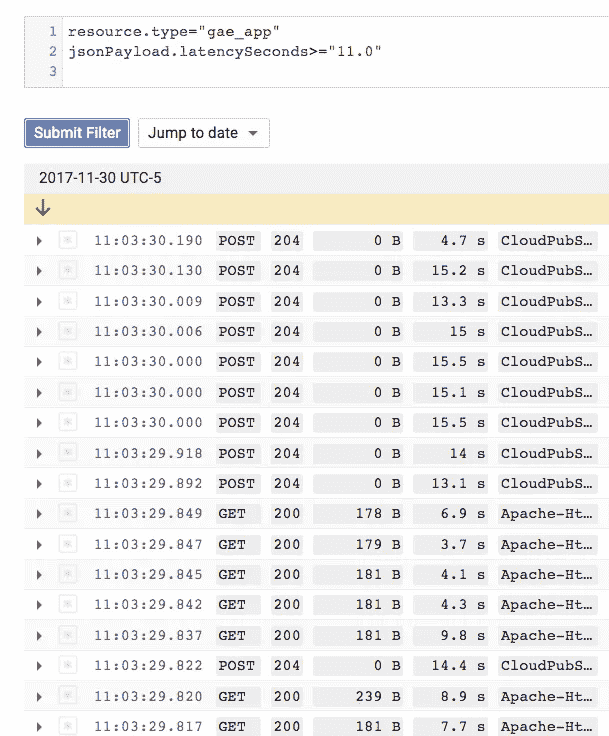

# Bash hacks gcloud，kubectl，jq 等。

> 原文：<https://medium.com/google-cloud/bash-hacks-gcloud-kubectl-jq-etc-c2ff351d9c3b?source=collection_archive---------0----------------------->

## 优化这些 CLI 的 bash 技巧商场

我发现并收到了一些最优秀的 bash 和其他 CLI 技巧，用于优化我使用 [gcloud](https://cloud.google.com/sdk/) 和 [kubectl](https://kubernetes.io/docs/reference/kubectl/overview/) 的体验。我将它们列在这里，希望其他人会觉得有用。

这个页面是为我(和像我一样的人)准备的，他们知道一定有一个 CLI“方法”,但是没有见过，或者因为不经常使用而忘记了正确的解决方案。

这将是一个正在进行的职位…我会更新每当我使用一个命令，并认为它可能会感兴趣。

## 尝试

我最近用这种方法随机选择一个端点，对它们发出`curl`命令:

```
[https://stackoverflow.com/a/2388555](https://stackoverflow.com/a/2388555)
```

因此，当路径不容易生成时，这是最有用的，但是，为了举例:

```
PATHS=("s1" "s2" "s3" "s4")
for TEST in {1..10}
do
  SELECTED_PATH=${PATHS[$RANDOM % ${#PATHS[@]}]}
  VALUE=$((RANDOM%10))
  curl --silent http://echo.jsontest.com/${SELECTED_PATH}/${VALUE}
done
```

## gcloud

列出“我的”(我是其中的成员…)项目，但仅列出项目 Id，仅列出项目 Id 包含“dazwilkin”的项目以及项目 ID 以“dazwilkin”开头的项目:

```
gcloud projects list \
--format='value(projectId)'gcloud projects list \
--format='value(projectId)' \
--filter='projectId ~ dazwilkin'gcloud projects list \
--format='value(projectId)' \
--filter='projectId ~ ^dazwilkin'
```

格式化和过滤的一个挑战是每个 CLI 都有自己的方式。另一种方法是将输出格式化为 JSON 或 YAML，然后使用通用工具对 grep 或 [jq](https://stedolan.github.io/jq/) 的结果进行后处理(参见 [jqplay](https://jqplay.org/) ):

```
gcloud projects list --format='value(projectId)' \
| grep '^dazwilkin'gcloud projects list --format='json' \
| jq '.[] | select (.projectId | test("^dazwilkin")) | .projectId'
```

想要迭代 gcloud 资源 id 或名称是很常见的。能够过滤项目并获取项目 ID:

```
for PROJECT in $(gcloud projects list --format='value(projectId)')
do
  gcloud iam service-accounts list \
  --filter='value(email)' \
  --project=${PROJECT}
done
```

我按天按主题创建项目，一旦完成就立即处理掉。偶尔，我会让虚拟机闲置几天，但要确保它们都已关闭

```
PROJECT=[[YOUR-PROJECT-ID]]
INSTANCES=$(gcloud compute instances list \
  --project=$PROJECT \
  --format="value(name)")
gcloud compute instances stop ${INSTANCES} --project=${PROJECT}
```

第一个命令获取整个项目(所有区域和分区)的实例列表，并将其指定给实例。第二个命令将它们全部关闭。如果您愿意，可以合并这两个命令。

我的同事寻求一种方法来从 IAM 策略中过滤出“[成员](https://cloud.google.com/iam/docs/overview#concepts_related_to_identity)”。另一位同事(感谢格伦！)提供了一种使用 gcloud 实现这一点的方法:

```
gcloud projects get-iam-policy ${PROJECT} \
--flatten=bindings \
--filter=bindings.role:roles/editor \
--format="value(bindings.members)"
```

> 注:有关“展平”、“过滤”和“格式”的解释，请参见 Cloud SDK 文档[此处](https://cloud.google.com/sdk/gcloud/reference/)和另一位同事的博客帖子[此处](https://cloudplatform.googleblog.com/2016/06/filtering-and-formatting-fun-with.html)。

对正在发生的事情的快速解释。“flatten”标志将策略拆分为多个记录，绑定数组中的每个元素对应一个记录。这对应于每个角色类型一个。“过滤器”然后隔离“角色/编辑”的记录。“format”然后返回 binding.members(针对该角色)。

这里有一种使用 jq 的方法。

这将枚举`$PROJECT`中`$ROLE`的成员:

```
ROLE="roles/owner" # for exampleFILTER=".bindings[] | select (.role==\"${ROLE}\") | .members[]"gcloud projects get-iam-policy ${PROJECT} --format=json \
| jq --raw-output "${FILTER}"
```

> 注意:这里使用的“raw-output”标志去掉了引号字符串。

更复杂但更有用的是，它通过过滤“user”成员并返回不带“user:”前缀的成员详细信息来扩展上面的过滤器:

```
FILTER=".bindings[] | select (.role==\"${ROLE}\") | .members[] | select (. | startswith(\"user:\")) | ltrimstr(\"user:\")"
```

> 注意:当然，您可以用其他类型的成员(“组”、“域”、“服务帐户”)替换“用户”。

具有讽刺意味的是，我刚知道 gcloud 的“展平”旗，就有机会再次使用它。一位客户工程师问他如何为所有项目枚举所有集群的节点映像。他想确认他们不再使用现在已经废弃的[容器-虚拟机](https://cloud.google.com/kubernetes-engine/docs/concepts/node-images#container-vm_deprecated)映像。

有一种方法可以做到这一点:

与我们的一位客户聊天，讨论如何克服云日志(控制台)过滤的一个已知限制，这让我想到了下一个问题。目前无法比较云控制台日志中的数值，因为许多数值被记录为字符串。



4.7 ≥ 11.0 !！谢谢加布里埃尔

一个解决方案是使用 gcloud 以 JSON 的形式获取日志输出，然后将其注入 jq 以获得一些魔力:

```
PROJECT="[YOUR-PROJECT-ID]"
ROOT="projects/${PROJECT}/logs"
LOG="${ROOT}/appengine.googleapis.com%2Fnginx.request"TODAY=$(date +%Y-%m-%d)
AFTER="${TODAY}T00:00:00.000Z"
BEFORE="${TODAY}T23:59:00.000Z"FILTER="resource.type=\"gae_app\" "\
"logName=\"${LOG}\" "\
"timestamp>=\"${AFTER}\" "\
"timestamp<=\"${BEFORE}\""gcloud logging read  "$FILTER" --project=$PROJECT --format=json \
| jq '.[] | {url: .httpRequest.requestUrl, latency: .jsonPayload.latencySeconds} | select (.latency != null) | select (.latency|tonumber > .5)'
```

这里有很多混乱和混乱，这让它比我们想要的更粗糙，但是…在设置了环境变量之后，为 App Engine (Flex)应用程序构建过滤器字符串，只获取 Nginx 请求日志中今天(UTC)的条目。

然后，jq 从结果中抓取两个键，httpRequest.requestUrl 的值(变成' Url ')和 jsonPayload.latencySeconds 的值(称为' latency '的字符串)。该结果投影({url，latency})被过滤以移除任何为空的延迟值，并且这些结果被过滤以将非空字符串转换成数字，然后仅取出那些大于 0.5 秒的值。

结果是:

```
{
  "url": "/favicon.ico",
  "latency": "0.613"
}
{
  "url": "/",
  "latency": "0.583"
}
```

因此，我了解到使用带有“持续时间”和“时间戳”值的云日志过滤器是可能的。即使以字符串的形式出现，也可以用数字来比较。上述过滤器的一个细微差别是，请求日志条目包括 HTTP 请求元数据以及我们上面使用的 JSON 有效负载数据。HTTP 请求元数据包括一个延迟字符串，它实际上是一个持续时间。困惑了吗？在这里阅读更多。因为它是一个持续时间值，我们可以这样过滤:

```
gcloud logging read  "$FILTER httpRequest.latency > \"0.5s\"" \
--project=$PROJECT \
--format=json
```

我们使用不同的日志值(httpRequest.latency，而不是 jsonPayload.latencySeconds)，但是，因为 httpRequest.latency 被视为“持续时间”，所以我们可以放弃 jq 后置过滤，并增加 gcloud 过滤器以包括改进:http request . latency >“0.5s”。

另一个，这个时间计数 App 引擎健康检查(两个[口味](https://cloud.google.com/appengine/docs/flexible/custom-runtimes/configuring-your-app-with-app-yaml#health_checks):遗留和更新)给定模块，版本为时间段之后到之前:

```
LOG="{$ROOT}/appengine.googleapis.com%2Fnginx.health_check"MODULE="[YOUR-MODULE]"
VERSION="[YOUR-VERSION]"FILTER="resource.type=\"gae_app\" "\
"logName=\"${LOG}\" "\
"resource.labels.module_id=\"${MODULE}\" "\
"resource.labels.version_id=\"${VERSION}\" "\
"timestamp>=\"${AFTER}\" "\
"timestamp<=\"${BEFORE}\""gcloud logging read "${FILTER}" \
--format="csv[no-heading](httpRequest.status,httpRequest.requestUrl)" \
--project=${PROJECT} \
| sort | uniq -c
```

结果是:

```
XXXX 200,/liveness_check
YYYY 200,/readiness_check
```

或者:

```
ZZZZ 200,/_ah/health
```

## 库贝特尔

如上所述，在 CLI(例如 gcloud 和 kubectl)之间切换意味着在过滤和格式方式之间切换。`kubectl`使用“输出”实现过滤和格式化。我发现 kubectl 输出比 gcloud 更容易过滤和格式化，但它仍然主要是试错的。我首先将命令输出为 JSON:

```
kubectl get pods --format=json
```

API 非常一致，多值结果总是在一个“items”数组中，并且许多(所有？)有一个“元数据”部分和一个“名称”。不幸的是，jq 使用的查询语言不是 JSONPath，因此需要进行转换。kubectl 也支持 Golang 的模板包，但是最近使用得不那么频繁了，而 JSONPath 更为常见。

```
kubectl get pods \
--format=json \
| jq .items[].metadata.namekubectl get pods \
--output=jsonpath='{.items[*].metadata.name}'kubectl get pods \
--output=go-template='{{range .items}} {{.metadata.name}} {{end}}'
```

您在 Kubernetes 中看到的一个常见(因为它非常有用)的模式是用内部命令过滤|格式化外部命令的输出来嵌套 kubectl 命令，即:

```
kubectl port-forward $(\
  kubectl get pod \
  --selector=app=prometheus \
  --namespace=istio-system \
  --output=jsonpath='{.items[0].metadata.name}'\
  ) \
--namespace=istio-system \
9090:9090 &
```

Kubectl 有一个有用的端口转发命令，它需要一个端口映射(这里是`9090:9090`)和 pod 的名称。在这种情况下，为了确定 pod 的名称，我们需要识别带有标签的 pod(app:Prometheus)。应该只有 1 个 pod 符合标准，因此 items[0]主要是将结果数组(包含一个项目)转换为单一结果。

kubectl 命令的另一个常见模式是想要获取一个已知服务的负载平衡器的 IP 地址:

```
SERVICE=[YOUR-SERVICE]NETWORKLB=$(kubectl get services/${SERVICE} \
--output=jsonpath='{.status.loadBalancer.ingress[0].ip }')curl --silent http://${NETWORKLB}/
```

我今天了解到也有一个整洁的“[自定义列](https://kubernetes.io/docs/reference/kubectl/overview/#custom-columns)”格式。所以，我在玩 Brendan Burns 的聪明的[超粒子](https://metaparticle.io)项目，并使用它，我部署了一个由 15 个 pod 组成的服务，运行在一个区域集群上。一个问题是，默认的 output=wide 格式太宽，产生了我正在寻找的“节点”名称，但包括了一些我不需要的列。我想要 pod 名称及其节点的名称，很简单:

```
kubectl get pods \
--output=custom-columns=Name:.**metadata.name**,Node:.**spec.nodeName**
```

与大多数这些命令一样，除非您非常熟悉输出结构，否则创建您需要的东西是一个试验过程。在这种情况下，我首先使用通用的 YAML 输出调用命令，确定我想要的列，然后在 custom-columns 规范中引用这些列:

```
kubectl get pods --output=yamlapiVersion: v1
items:
- apiVersion: v1
  kind: Pod
  **metadata**:
    labels:
      app: metaparticle-example
      pod-template-hash: "1676060832"
    **name**: metaparticle-example-5bcb4b4d76-42d7m
    namespace: default
  **spec**:
    containers:
      name: metaparticle-example-0
      resources:
        requests:
          cpu: 100m
      terminationMessagePath: /dev/termination-log
      terminationMessagePolicy: File
      volumeMounts:
      - mountPath: /var/run/secrets/kubernetes.io/serviceaccount
        name: default-token-5v5k6
        readOnly: true
    dnsPolicy: ClusterFirst
    **nodeName**: gke-cluster-01-default-pool-5af672df-t4hg
```

您创建一个服务，并将其作为节点端口公开(在集群之外)。可能是因为您将通过 L7 负载平衡器引用节点端口。您可能还需要配置防火墙规则来公开群集的节点，这些节点现在都公开此端口。如何快速测试它是否按预期工作？首先，确定节点端口:

```
SERVICE=[YOUR-SERVICE-NAME]NODEPORT=$(kubectl get service/${SERVICE} \
--output=jsonpath='{ .spec.ports[0].nodePort }')
```

然后确定集群的一个节点。集群的所有节点都公开了节点端口，因此它们中的任何一个都是可接受的。我们随便抓一个吧。kubectl 命令列出了集群节点的名称(以“node/”为前缀)。从结果中剪下前缀“node/”，对结果随机排序并获取第一个:

```
INSTANCE=$(kubectl get nodes --output=name \
| cut --delimiter="/" --fields=2 \
| sort --random-sort \
| head --lines=1)
```

现在，我们将所有内容结合起来，使用 gcloud 通过 ssh 连接到随机选择的集群节点，并将节点端口转发到本地主机。

```
PROJECT=[YOUR-PROJECT-ID]gcloud compute ssh ${INSTANCE} \
--project=${PROJECT} \
--ssh-flag="-L ${NODEPORT}:localhost:${NODEPORT}"
```

然后，根据支持节点端口的内容，您可以从本地主机访问它。如果它是一个简单的 HTTP 服务，那么您现在可以:

```
curl localhost:${NODEPORT}
```

反馈总是受欢迎的。

更多即将推出…