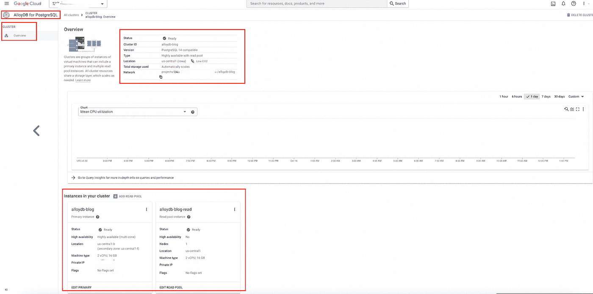
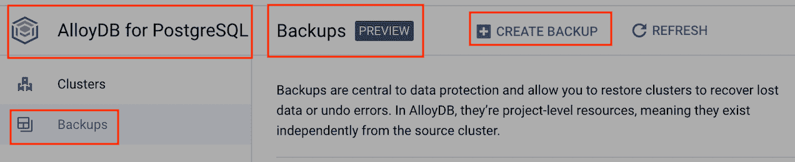
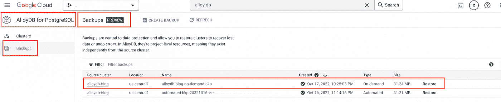

# AlloyDB 实例的基本实现

> 原文：<https://medium.com/google-cloud/basic-implementation-of-alloydb-instance-eab8ea06bac6?source=collection_archive---------1----------------------->

# 概述:

这篇技术博客的目的是了解什么是 AlloyDB，它在内部是如何工作的，以及如何创建和使用一个基本的 AlloyDB 集群。这是一个相当新的服务，今天是在预览。

# 目标:

本博客将通过以下步骤来阐述 AlloyDB 服务:

*   用读池实例创建 AlloyDB 集群和实例
*   在实例中创建表
*   将数据加载到表中
*   创建按需备份
*   删除为 AlloyDB 创建的资源

# 技术堆栈:

*   [**AlloyDB**](https://cloud.google.com/alloydb) **:** 一个完全托管的兼容 PostgreSQL 的数据库服务
*   [**计算引擎**](https://cloud.google.com/compute) **:** 安全且可定制的计算服务，可让您在谷歌的基础设施上创建和运行虚拟机

# AlloyDB 简介:

如今，客户在谷歌云上已经有了很多选择。也就是说，仍然有支持客户迁移到云的空间，特别是对于来自遗留的专有数据库的客户。这些客户越来越标准化开源，特别是一个开源数据库， [Postgres](https://www.postgresql.org/) 。从传统的专有数据库迁移的企业客户希望在管理和扩展其应用程序方面获得额外的支持。AlloyDB 结合了 Google 的优势和 Postgres 的完全兼容性，以行业领先的性能和可用性应对 Postgres 带来的挑战。它可以处理任何工作负载，同时最大限度地减少管理开销。全面的 Postgres 兼容性意味着重新获得在客户希望的时间和地点运行您的应用程序的自由，并从整个 Postgres 生态系统中受益。

# AlloyDB 是什么？：

AlloyDB 是一种新的数据库服务，可用于顶层关系数据库工作负载。对于事务性工作负载，它比标准 Postgres 快四倍。对于事务性工作负载，它也比亚马逊的同类 Postgres 兼容服务快两倍以上。最棒的是，查询性能随着计算资源的增加而线性扩展。AlloyDB 提供比标准 Postgres 快 100 倍的分析查询。这是零模式变化，也不需要移动数据。无需担心复杂的数据库管理任务，如内存管理、数据清空和数据分层。它会自动为您解决这些问题。AlloyDB 的一个关键概念是计算和存储的“分解”。大多数客户在不是专门为 PostgreSQL 设计的通用存储上运行数据库。随着您的事务量和存储需求的增加，扩展和性能也随之提高。您不需要分配存储。您只需为您使用的存储空间付费。您不需要执行复杂的存储调整或分区来获得性能。此外，它还与谷歌独特的人工智能和人工智能服务组合无缝集成。例如， [Vertex AI](https://cloud.google.com/vertex-ai) 将在发布时推出，便于与 AlloyDB 数据库进行推理，即 AlloyDB 将与谷歌云的人工智能平台 Vertex AI 预集成。

# 合金的加工 b:

AlloyDB 完全兼容 PostgreSQL 14。如果您的应用程序运行在 PostgreSQL 上，那么它运行在 AlloyDB 上。第三方工具如 pgAdmin、HammerDB 和许多其他工具无需修改就可以在 AlloyDB 上运行。没有必要重写或修改您现有的代码。您插入它，它就工作了:您现有的 PostgreSQL 应用程序变得更快、更可靠、更易于维护。

AlloyDB 的核心是完全分解计算和存储的方法。对于 AlloyDB，有一个新的智能数据库优化存储层，它可以独立于数据库实例进行扩展，并从主数据库卸载工作。它通过消除 I/O 瓶颈和卸载主数据库实例的工作来提供快速、可预测的性能。默认情况下，它是区域性的，支持快速、有限的恢复时间和低延迟的读取副本。AlloyDB 具有 DRAM、超高速缓存和持久存储之间的自动数据分层功能。这意味着获得我们横向扩展存储服务的可用性和规模优势，以及分层缓存的性价比优势。它还智能地组织这些缓存之间的数据。在 DRAM 中，基于行和列的格式都用于最大化查询性能。当一个查询到来时，查询规划器将在基于行、列和混合执行之间做出明智的选择，以优化每个查询的性能。在列存储中，AlloyDB 建立在现代处理器的“单指令、多数据”SIMD 能力上，以加快查询执行。缓存未命中在命中持久存储之前会进入第二个超快速层缓存，以最大限度地提高性价比。这种[架构](https://cloud.google.com/blog/products/databases/alloydb-for-postgresql-intelligent-scalable-storage)能够为事务性和分析性工作负载提供最佳性能。矢量化列执行引擎加快了分析查询的速度。智能存储服务使延迟非常低的读取副本能够始终查询数据的最新版本。[读取池](https://cloud.google.com/alloydb/docs/instance-read-pool-create)允许您通过添加更多节点来水平扩展读取连接。

# 6.IAM 先决条件:

在构建管道之前，必须检查用户是否具有以下角色，以避免身份验证问题:

*   **服务使用消费者**:能够检查服务状态和操作，并为消费者项目消费配额和计费。
*   **Cloud AlloyDB Admin** :对所有 AlloyDB 资源的完全控制。
*   联网许可将根据具体情况而定。

# AlloyDB 的基本实现步骤:

我们将为 AlloyDB 的基本实现执行下面提到的步骤。这些都可以通过控制台和 CLI 来完成。

# 使用读取池实例创建 AlloyDB 集群和实例:

*   转到 AlloyDB 页面，创建一个集群，同时选择创建读池。这种配置**不是**永久的。我们也可以在以后的阶段改变它。


*   给出集群 id、区域名称和网络名称。


*   选择主实例的配置。对于我们的用例，我们选择了可用的最低机器配置。如果在实现中需要，可以选择为 Postgres 设置[标志](https://cloud.google.com/alloydb/docs/reference/database-flags)。


*   根据需要选择读取池的数量、所需的节点及其配置。


*   创建集群和底层实例需要一些时间。您创建的集群和实例将如下所示:



*   等效的 CLI 命令如下所示:
*   要创建主实例，请执行以下操作:

```
gcloud beta alloydb clusters create <YOUR_CLUSTER_ID> \
 - password=<YOUR_PWD> \
 - network=<YOUR_NETWORK> \
 - region=GCP_REGION_VALUE \
 - project=<YOUR_PROJECT_ID>
```

*   要在创建的集群中添加主实例，请执行以下操作:

```
gcloud beta alloydb instances create <YOUR_PRIMARY_INSTANCE_ID> \
 - instance-type=PRIMARY \
 - cpu-count=2 \
 - region=GCP_REGION_VALUE \
 - cluster=<YOUR_CLUSTER_ID> \
 - project=<YOUR_PROJECT_ID>
```

*   要在创建的群集中添加读取池实例，请执行以下操作:

```
gcloud beta alloydb instances create <YOUR_READ_POOL_INSTANCE_ID> \
 - instance-type=READ_POOL \
 - cpu-count=2 \
 - read-pool-node-count=2 \
 - region=GCP_REGION_VALUE \
 - cluster=<YOUR_CLUSTER_ID> \
 - project=<YOUR_PROJECT_ID>
```

# 在实例中创建表:

*   首先，我们需要创建一个 VM 实例，它将连接到上一步中创建的 AlloyDB 实例，我们将 SSH 到该实例中。


*   复制我们的主实例的主 IP，并在环境变量' ALLOYDB '中设置它。

```
export ALLOYDB = <YOUR_ALLOYDB_PRIMARY_INSTANCE_IP>
```


*   通过将环境变量“ALLOYDB”保存在一个文本文件中并检查文件的内容，检查该变量是否设置了正确的 IP。

```
echo $ALLOYDB > alloydbip.txt
```


*   我们将使用以下命令安装 PostgresQL 依赖项:

```
sudo apt-get install Postgresql-client-common
sudo apt-get install Postgresql-client-12
```


*   我们将使用下面的命令连接到 AlloyDB 实例，并通过设置 AlloyDB 实例时使用的密码进行连接:

```
psql -h $ALLOYDB -U Postgres
```


*   我们可以编写 DDL 语句来创建所需的表。
*   在本例中，我们创建了一个雇员表，如下所示:

```
CREATE TABLE employee (
employee_id int NOT NULL,
employee_name varchar(25),
department_id int,
department_name varchar(25)
);
```


*   我们将 employee_id 作为主键。

```
ALTER TABLE employee ADD PRIMARY KEY (employee_id);
```


# 将数据加载到表中:

*   我们可以编写 DML 语句将数据加载到创建的表中。
*   在本例中，我们插入了所需的行，如下所示:

```
INSERT INTO employee
VALUES
(1, 'Manish Joshi', 100, 'ProServ Delivery'),
(2, 'Suraj Nair', 101, 'ProServ Delivery'),
(3, 'Shubham Shingade', 102, 'ProServ Delivery'),
(4, 'Saurabh Kumar', 104, 'ProServ Delivery'),
(5, 'Garima Garg', 105, 'ProServ Delivery'),
(6, 'Utkarsh Jain', 106, 'ProServ Delivery'),
(7, 'Pradeep Gurbani', 107, 'ProServ Delivery'),
(8, 'Avenash R', 108, 'ProServ Delivery'),
(9, 'Subham Chaudhary', 109, 'TAM'),
(10, 'Amritha Parameshwaran', 110, 'ProServ Delivery'),
(11, 'Shambhavi Upadhyay', 111, 'Business Operations');
```


*   检查数据加载是否正确:

```
SELECT * FROM employee;
```


# 创建按需备份:

*   当我们创建 AlloyDB 实例时，会自动创建一个[备份](https://cloud.google.com/alloydb/docs/backup/overview)。
*   除此之外，我们还可以创建自己的按需备份。以下是相同的步骤:
*   点击“创建备份”。



*   给出源群集和备份 id。


*   将使用给定的详细信息创建您的备份。



*   等效的 CLI 如下所示:

```
gcloud beta alloydb backups create <YOUR_BACKUP_ID> \
 - cluster=<YOUR_CLUSTER_ID> \
 - region=GCP_REGION_VALUE \
 - project=<YOUR_PROJECT_ID>
```

# 删除创建的资源:

*   使用后，我们可以从 GUI 以及通过 CLI 轻松删除创建的备份、读取池实例、主实例、AlloyDB 集群和计算引擎实例。
*   以下是 AlloyDB 的 CLI 命令:
*   删除创建的按需备份实例:

```
gcloud beta alloydb backups delete <YOUR_BACKUP_ID> \
 - region=GCP_REGION_VALUE
```


*   删除读取池实例和主实例:

```
gcloud beta alloydb instances delete <YOUR_READ_POOL_INSTANCE_ID>
 - cluster=<YOUR_CLUSTER_ID> \
 - region=GCP_REGION_VALUE
```


```
gcloud beta alloydb instances delete <YOUR_PRIMARY_INSTANCE_ID>
 - cluster=<YOUR_CLUSTER_ID> \
 - region=GCP_REGION_VALUE
```


*   删除群集:

```
gcloud beta alloydb clusters delete <YOUR_CLUSTER_ID> \
 - region=GCP_REGION_VALUE
```

