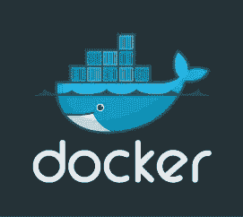
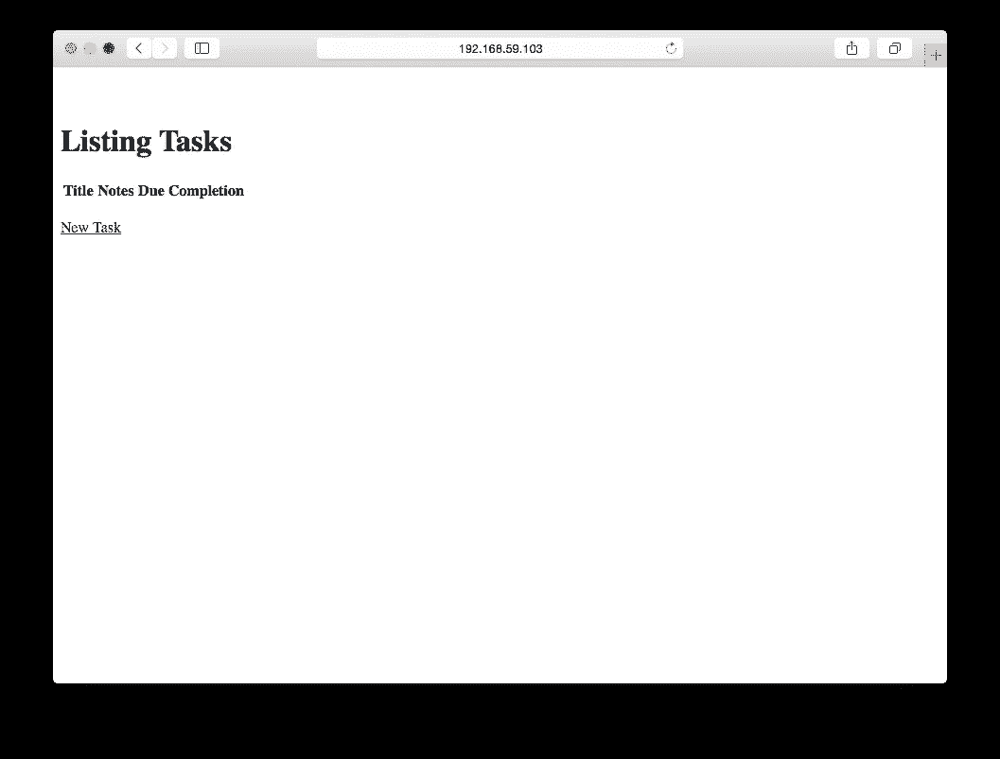

# 带有 Docker 的基本 Rails 应用程序

> 原文：<https://medium.com/google-cloud/basic-rails-app-with-docker-a08eba3c2197?source=collection_archive---------4----------------------->



# 为什么是码头工人

在过去的一年里，我在 Rails 社区听到了越来越多关于 Docker 的讨论。乍一看，Docker 有很多让人喜欢的地方。容器可以使多云部署更加容易。容器允许您遵循相同的流程来配置服务器和部署应用程序更新，这将使推送操作系统级安全修复变得更加简单。Docker 在云托管领域的广泛采用也意味着厂商锁定的可能性降低。由于所有这些积极因素，给 Docker 一个尝试似乎是个好主意。

为了试验 Docker，我使用 rails scaffold 编写了一个简单的任务列表应用程序。一旦我让它在开发模式下运行，我就使用 docker 容器在本地部署它。要在 mac 上完成这篇文章的其余部分，你需要安装 [boot2docker](http://boot2docker.io/) 和一些最新版本的 rails。我用的是 rails 4.2.0。

# 创建 Rails 应用程序

我首先创建了一个名为“todo”的新 rails 项目。然后，我使用脚手架添加了一个任务模型。任务有标题、注释、截止日期和完成百分比(用整数表示)。

```
$ rails new todo 
$ rails g scaffold task title:string notes:string due:datetime completion:integer
```

根据我过去使用 Rails 的经验，我知道我想在生产中使用 postgres，但在开发和测试中继续使用 sqlite。为此，我需要修改 gem 文件。

```
gem 'rails', '4.2.0'
gem 'sass-rails', '~> 5.0'
gem 'uglifier', '>= 1.3.0'
gem 'coffee-rails', '~> 4.1.0'

gem 'jquery-rails'
gem 'turbolinks'
gem 'jbuilder', '~> 2.0'
gem 'sdoc', '~> 0.4.0', group: :doc

group :production do
  gem 'pg'
end

gem 'capistrano-rails', group: :development

group :development, :test do
  gem 'byebug'
  gem 'web-console', '~> 2.0'
  gem 'spring'
  gem 'sqlite3'
end
```

我还需要更新 database.yml 以便在生产中使用 postgres。我覆盖了现有的生产配置，以使用 postgresql 适配器。弄清楚需要如何配置用户名、密码和主机需要做更多的工作。我不太了解如何设置 postgres 服务器，所以我决定使用来自 [Dockerhub](https://hub.docker.com/) 的官方 [postgres 镜像](https://registry.hub.docker.com/_/postgres/)作为数据库。

postgres 映像的文档指出，它有 POSTGRES_USER 和 POSTGRES_PASSWORD 的环境变量。它还公开端口 5432，用于连接到其他应用程序。Docker 有一个容器[链接](https://docs.docker.com/userguide/dockerlinks/)的概念，它将通过环境变量向 web 前端公开用户名、密码和连接信息。我使用这些环境变量在 database.yml 文件中设置用户名、密码和主机。

```
production:
  <<: *default
  adapter: postgresql
  encoding: unicode
  database: todo_production
  username: <%= ENV['PG_ENV_POSTGRES_USER'] %>
  password: <%= ENV['PG_ENV_POSTGRES_PASSWORD'] %>
  host:     <%= ENV['PG_PORT_5432_TCP_ADDR'] %>
```

# 将应用程序归档

就像 Rails 应用程序有一个 gem 文件来指定需要什么 gem 一样，Docker 应用程序有一个 Docker 文件来指定应用程序的设置和配置。

我的 Dockerfile 文件基于现有的[库/rails](https://registry.hub.docker.com/u/library/rails/) 容器映像。我所做的唯一更改是使用 docker [ENV](https://docs.docker.com/reference/builder/#env) 命令设置 RAILS_ENV，并让容器在启动后调用一个 init 脚本。这是我最后得到的 docker 文件:

```
FROM rails:onbuild 
ENV RAILS_ENV=production 
CMD ["sh", "/usr/src/app/init.sh"]
```

Docker 的一个怪癖是一个 Docker 文件只能包含一个 CMD 行。CMD 行是安装完成且容器启动并运行后执行的代码行。对于 rails 应用程序，我需要在启动时做两件事:设置数据库，然后启动 rails。我可以把它们串在一个 CMD 指令中，但是把它们放在 shell 脚本中更容易。我调用了 shell 脚本 init.sh。

init.sh 文件位于 Dockerfile 文件旁边的 RAILS_ROOT 中。我使用的 rails 映像将 RAILS_ROOT 中的所有文件复制到容器中，因此 init.sh 与应用程序代码一起被复制。下面是 init.sh 中的代码:

```
export SECRET_KEY_BASE=$(bundle exec rake secret) 
bundle exec rake db:create db:migrate 
bundle exec rails server -b 0.0.0.0
```

这段代码完成了基本的 rails 启动。它使用 rake secret 设置 SECRET_KEY_BASE。如果我想要一个静态密钥，这也可以在 done 文件中完成。之后，它创建并迁移数据库(如果需要)，然后使用 rails server 启动服务器。如果容器图像支持它，您可以在这里使用 unicorn、puma 或 passenger。我计划在另一篇博文中展示如何设置 unicorn + nginx。

至此，我已经拥有了使用 docker 容器在本地启动我的应用程序所需的所有代码。Docker 简洁得令人愉快；为 Docker 准备好一个基本的 rails 应用程序需要大约 20 行修改。

# 使用 Docker 在本地部署

一旦所有的代码都写好了，我需要构建 docker 文件来创建 docker 映像。

```
$ docker build -t your_user_name/todo .
```

t 标志允许我给 docker 图像一个名称/标签。惯例是使用用户名或项目名、斜杠，然后是图像名。我把我的命名为托多。的。在命令的末尾告诉 docker 在当前目录中构建 Dockerfile。

一旦 rails 应用程序的映像构建完成，我就可以开始部署了。首先需要部署数据库，以便它在 rails 容器启动时运行。

```
$ docker run --name db -e POSTGRES_PASSWORD=password -e POSTGRES_USER=rails -d postgres
```

这里有很多关于命令行标志的东西，但是单独来看，它们非常简单。docker 运行启动一个容器。—名称数据库命名新的容器数据库。如果您不提供名称，docker 将为您生成一个名称。-e 用于将环境变量传递给容器。postgres 容器的[文档](https://registry.hub.docker.com/u/library/postgres)指出，您可以使用 POSTGRES_PASSWORD 和 POSTGRES_USER 环境变量将默认的数据库密码和用户名传递到容器中。-d 告诉 docker 以[分离模式](https://docs.docker.com/reference/run/#detached-vs-foreground)运行集装箱。最后，postgres 是您应该用来启动容器的图像的名称。

一旦 docker run 命令完成，数据库容器就开始运行。试试 docker ps 就知道是这样的。

```
$ docker ps
```

该命令显示正在运行的容器、它们的状态以及它们已经运行了多长时间。在我的机器上，数据库容器在 1 秒钟内启动。容器启动很快，一旦图像被下载，一两秒钟是正常的。

一旦启动了数据库容器，我就可以启动 web 容器了。

```
$ docker run --name web -d -p 3000:3000 --link db:pg your_user_name/todo
```

-d 和— name 是用于启动数据库容器的标志，所以看起来应该很熟悉。your_user_name/todo 是用于容器的图像的名称。-p 3000:3000 将容器上的端口 3000 映射到承载容器的机器上的端口 3000。这允许我从外部访问运行容器的 web 服务器。—链接数据库:pg 将该容器链接到已经运行的数据库容器。这使得 db 容器中的所有环境变量在 web 容器中都可用。它还在 web 容器中为 db 容器公开的每个端口创建了一些环境变量。link 参数的 pg 部分告诉 docker 用 pg 作为所有这些环境变量的前缀。由 link 创建的环境变量在 database.yml 中用于获取用户名、密码和主机。如果您再次查看 database.yml，您可以在变量名的开头看到 pg 前缀。

```
username: <%= ENV['PG_ENV_POSTGRES_USER'] %>
password: <%= ENV['PG_ENV_POSTGRES_PASSWORD'] %>
host:     <%= ENV['PG_PORT_5432_TCP_ADDR'] %>
```

一旦容器启动，我就可以访问网站。因为我使用 boot2docker，所以我使用 boot2docker ip 命令来获取 docker 主机的 ip 地址。该应用程序运行在端口 3000 上，应该可以在浏览器中访问。在我看来是这样的:



在本系列的后续部分中，我将展示如何使用 [kubernetes](http://kubernetes.io/) 来管理更复杂的容器部署。我还将展示如何设置一个持久磁盘并部署到 [Google 容器引擎](https://cloud.google.com/container-engine/)。

[回去](http://www.thagomizer.com/)

*原载于 2015 年 5 月 12 日 www.thagomizer.com**的* [*。*](http://www.thagomizer.com/blog/2015/05/12/basic-docker-rails-app.html)