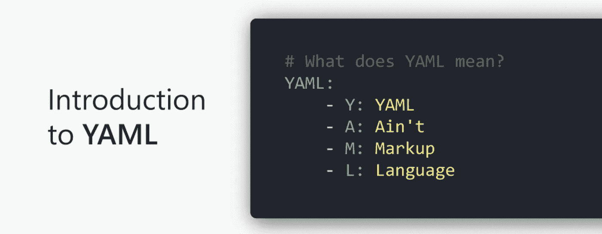
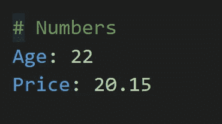
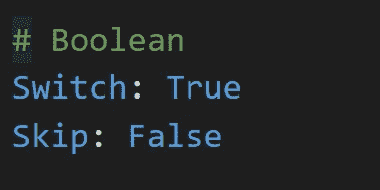
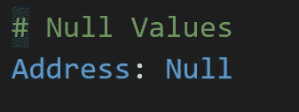
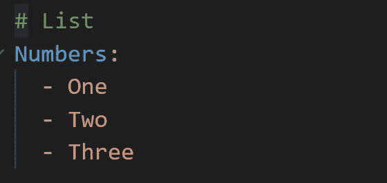
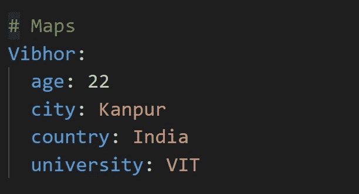
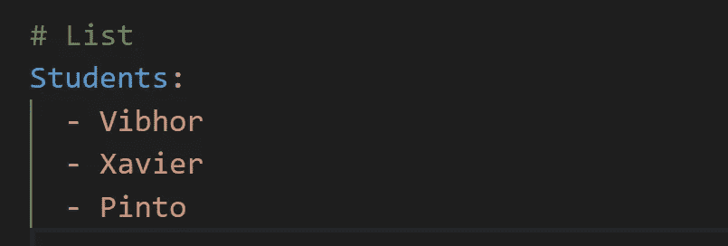
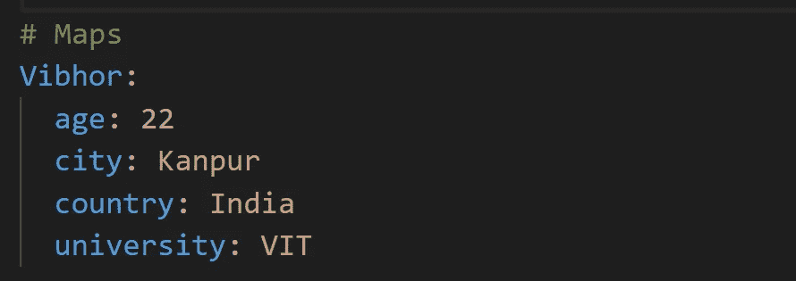

# YAML 基础知识📝📝

> 原文：<https://medium.com/google-cloud/basics-of-yaml-e5897b8f11a0?source=collection_archive---------0----------------------->

什么是 YAML？？

## 介绍🚩🚩

各位读者好👋我已经写了一段时间关于 Kubernetes 及其对象的基础知识。在 Kubernetes 的世界里，前方的道路将会更加先进。主题包括从日程安排到网络的概念。

我认为，在讨论这些话题之前，我们可能需要先了解一下 YAML 的基本情况。YAML 语是我们现在将广泛使用的语言。即使 YAML 的基础知识变得清晰，我们将能够与 Kubernetes 集群一起工作，并轻松地学习它的概念。

***所以在这篇文章中，我们将试着去理解下面的事情*** :

*   什么是 YAML？
*   YAML 的基本语法
*   在 YAML 什么时候使用列表和地图？

> 这将是一篇非常短小精悍的文章。
> 所以不要再拖延了，让我们开始吧:)

## 什么是 YAML？？🤔🤔

*   YAML 代表“ **YAML 不是标记语言**”。
*   YAML 是一种轻量级、人类可读的数据序列化语言。它旨在使格式易于读写。所以，**任何人都能理解**就像一个非技术人员在 YAML 能读会写一样。
*   它类似于 XML 和 JSON，但是语法简单明了。
*   YAML 文件是用“，”创建的。**YAML“**或**”。yml** "扩展。我们可以使用任何 IDE(集成开发环境)或文本编辑器来打开/创建 YAML 文件。
*   这很容易，我们可以用一种简单的方式来表示复杂的映射。由于这个原因，现在在配置设置中使用 YAML。

> **简单来说，YAML 是一种用来以非常易读的格式表示数据的语言。**
> 
> 早期的 JSON 和 XML 用于相同的目的，但是 YAML 本质上是如此简单和可读，以至于它现在被广泛用于在不同的 DevOps 工具和云应用程序中编写配置文件，像 YAML 被用于 Docker 和 Kubernetes。

## YAML 的基本语法🤓🤓

伊利亚·巴甫洛夫在 [Unsplash](https://unsplash.com?utm_source=medium&utm_medium=referral) 拍摄的照片

让我们挖掘一下，看看我们如何能代表 YAML 的各种事物。

*   **评论**

*   **琴弦**

*   **数字**

*   **布尔人**

*   **空值**

*   **列出了**

*   **地图**

*   **带地图的列表**

如上图所示，每当你在 YAML 写一个键值对的时候。

你必须遵循下面的语法:

*   写入密钥名称
*   在键名后面添加一个冒号(:)
*   在冒号(:)后加一个空格
*   在空格后写入值
*   例如→关键字名称:值名称

> **注**🔻 🔻
> **缩进 YAML** 是有意义的。确保使用空格而不是制表符来缩进各节。在配置文件和上面显示的所有例子中，我在每个缩进层次使用了 2 个空格。

## 在 YAML 什么时候使用列表和地图？？🤔🤔

埃文·丹尼斯在 [Unsplash](https://unsplash.com?utm_source=medium&utm_medium=referral) 上的照片

经常出现的问题是，在 YAML 什么时候使用列表，什么时候使用地图。

**谨记以下规则:**

*   每当用户必须表示一组只有一个属性的实体时(例如:学生姓名)。那么用户应该使用 YAML 的**列表。**

*   每当用户不得不表示任何实体，这些实体有一些属性，那么用户应该使用 YAML 的**地图。以某人为例，他的不止一处房产我们必须在 YAML 代理。比如年龄，城市，国家等等。**

*   每当用户必须表示一组具有多个属性的实体时。然后，用户应该使用 YAML 地图列表。

> **注**🔻 🔻
> **列表本质上是有序的**，即列表中对象位置的任何变化都会改变列表的性质。
> **地图本质上是无序的**也就是说，地图上物体位置的任何变化都不会改变列表的性质。

## 接下来呢？👀 👀

> 非常感谢你来到这里！是本文的结尾。在这篇文章中，我们只是触及了 YAML 语言的皮毛。但是不管我们讲了什么，都足以让每个人了解什么是 YAML，从现在开始，没有人会在理解 YAML 写的库伯内特配置时遇到任何问题。
> 
> 请鼓掌并跟我来🙈如果你喜欢我的作品，并希望在未来更多地阅读我的作品:)

如果你对这篇文章有任何疑问，或者想聊聊天，请随时联系我的社交媒体账号

*推特—*[*https://twitter.com/ChindaVibhor*](https://twitter.com/ChindaVibhor)

*LinkedIn—*[【https://www.linkedin.com/in/vibhor-chinda-465927169/】T42](https://www.linkedin.com/in/vibhor-chinda-465927169/)

## 我以前写的文章:

 [## kubernetes 服务公司第一部分

### Kubernetes 有哪些服务？

medium.com](/google-cloud/kubernetes-services-️️-part-1-42244ada9990)  [## kubernetes 服务公司:第二部分

### Kubernetes 有哪些服务？

medium.com](/google-cloud/kubernetes-services-part-2-90b2cfa98d21) 

## 参考资料:

 [## YAML 语法-可翻译文档

### 本页提供了正确的 YAML 语法的基本概述，这是可行的行动手册(我们的配置…

docs.ansible.com](https://docs.ansible.com/ansible/latest/reference_appendices/YAMLSyntax.html) 

我仍然会继续发表新的文章，涵盖我正在探索的一系列主题。

那都是乡亲们！！涂鸦:))