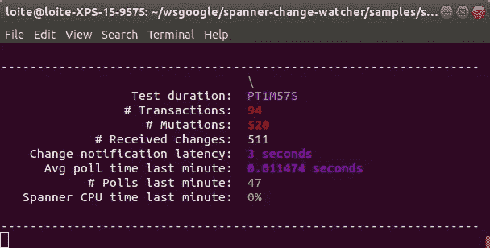
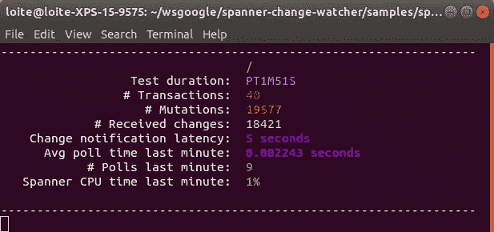
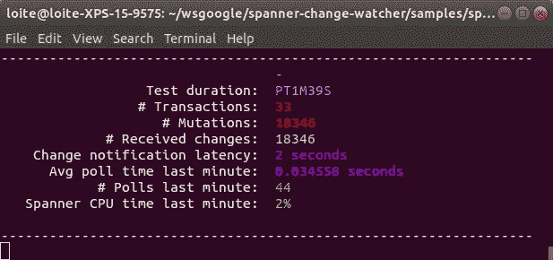

# 基准扳手变化观察器

> 原文：<https://medium.com/google-cloud/benchmark-spanner-change-watcher-e5b6cc2ac618?source=collection_archive---------2----------------------->

Google Cloud Spanner Change Watcher 是 Google Cloud Spanner 的一个[开源库](https://github.com/cloudspannerecosystem/spanner-change-watcher)，用于观察和发布来自云 Spanner 数据库的变化。本文中的示例需要 1.1.0 或更高版本的扳手变化观察器。


该库附带了一个样例基准测试应用程序，可以用来为一个更改观察器尝试不同的配置，以测试相应的性能和负载。基准应用程序使用一个带有辅助索引的示例表，为了简单起见，这两个表都是由基准应用程序自动创建的。[表格和二级索引与本文](/@knutolavloite/scaling-up-spanner-change-watcher-82315fbc8962)中推荐的设置相对应，建议在继续阅读本文之前阅读文章中的[，以了解如何设置示例表格。](/@knutolavloite/scaling-up-spanner-change-watcher-82315fbc8962)

本文展示了许多关于如何使用这个基准应用程序测试不同配置的例子。

# 运行基准应用程序

基准应用程序位于存储库中的[spanner-change-watcher-samples](https://github.com/cloudspannerecosystem/spanner-change-watcher/tree/master/samples/spanner-change-watcher-samples)项目中，是一个随时可以运行的 Java 控制台应用程序。它有两个必需的命令行参数:

*   `--instance: The Cloud Spanner instance to use`
*   `--database: The Cloud Spanner database to use`

所有其他参数都是可选的，可用于尝试不同的配置和写入负载。

如果数据库、表和二级索引尚不存在，它们都将被自动创建。基准应用程序将在内部启动两个进程:

1.  更新程序:更新程序将向数据表写入随机更改，以模拟表上的写负载。可以通过设置`transactionsPerSecond`和`mutationsPerTransaction`参数来配置更新器的写入负载。默认设置将使用每秒 1 个事务和每个事务 5 个突变的低写入吞吐量，平均每秒总共 5 个突变。
2.  观察器:观察器将轮询数据表中由更新器写入的更改。观察器将计算它所看到的变化的数量，否则它不会对这些变化做任何事情。观察器的默认设置将等同于本文中[为大型表推荐的观察器设置。](/@knutolavloite/scaling-up-spanner-change-watcher-82315fbc8962)

## 使用 Maven 运行基准应用程序

在本地开发机器上运行基准应用程序的最简单方法是使用 Maven exec 插件。在您的 IDE 中执行基准应用程序也是可能的，但不建议这样做，因为大多数 IDE 中的控制台支持有限。

导航到`spanner-change-watcher/samples/spanner-change-watcher-samples`目录并执行以下命令:

`mvn exec:java -Dexec.args="-i my-instance -d watcher-benchmark-db"`

这将使用云扳手实例“my-instance”和数据库“watcher-benchmark-db”启动基准测试应用程序，否则将使用默认选项。**“我的实例”必须是现有实例。**

# 基准应用程序输出

使用默认设置运行基准应用程序应该会得到类似如下的输出:



使用默认设置对应用程序输出进行基准测试

上面说出来的意思是:

1.  测试持续时间:基准测试运行的时间。
2.  # Transactions:应用程序到目前为止已经执行的写事务的数量。
3.  # Mutations:应用程序到目前为止已经执行的突变总数。
4.  # Received changes:到目前为止，观察器收到的更改总数。当您用一个新的数据库开始基准测试时，这个数字将等于或略小于已经执行的突变数。以后的运行可以显示接收到的变更数量比执行的突变数量多。如果在有尚未报告的突变时停止基准应用程序，就会发生这种情况。这些变化将在下一次基准运行时报告。
5.  更改通知延迟:更改的提交时间戳和报告更改的时刻之间的秒数。
6.  Avg poll time last minute:数据库上的更改轮询查询持续的平均秒数。该值从[SPANNER _ SYSQUERY _ STATS _ TOP _ MINUTE](https://cloud.google.com/spanner/docs/introspection/query-statistics)表中读取。
7.  Spanner CPU time last minute:一个由**计算出的**值，该值表示单个 CPU 的总可用时间占所有所需轮询查询总数的比例。该值计算为`(avg_query_time * execution_count) / 60 seconds`。该值**不一定等于云扳手**上的实际 CPU 负载。

# 测试不同的配置

基准应用程序支持大量命令行参数，这些参数可用于尝试不同的观察器配置和写吞吐量。以下示例是在单节点区域云扳手实例上执行的。根据节点数和区域与多区域设置，您自己的设置结果可能会有所不同。

最重要的配置选项包括:

1.  transactionsPerSecond (w):应用程序平均每秒应该执行的随机写入事务的数量。将使用一个线程池来执行事务，该线程池将在平均与该配置中的数量相匹配的随机时间调度事务。
2.  mutationsPerTransaction (m):每个事务平均将执行的变异数。每个事务的实际突变数量将在[1，2m]的范围内，平均值为 m
3.  numWatchers (n):要使用的不同观察器的数量。示例表包含一个分片列，该列包含 37 个不同的值。因此，最多可以使用 37 个不同的观察器，每个观察器观察一组单独的碎片值。默认配置将使用一个观察器来观察所有碎片，这对于大多数用例来说已经足够了。如果写吞吐量超过了单个观察器可以处理的最大更改数量，那么下一步最好使用多个观察器。单个观察器可以处理的数量变化将取决于您的 Cloud Spanner 实例中的节点数量。本例中的单个节点实例每秒可以处理大约 3000 到 5000 个突变。
4.  pollInterval (p):每次轮询查询之间的时间间隔。默认值为 1 秒。将该值设置为较高的时间间隔可以减少由观察器引起的 Cloud Spanner 实例的负载，因为将执行较少的轮询查询。
5.  limit (l):轮询查询在一次轮询中获取的最大更改数。默认值为 10，000。如果轮询返回<limit>数量的更改，将在此轮询之后立即安排一个新的轮询查询，以获取下面的<limit>更改。将 limit 设置为较低的值，将 poll interval 设置为较高的值，这可能是一个很好的策略，可以为接收突发写的表获得更动态的轮询行为。例如，如果轮询间隔设置为 10 秒，限制为 500，则该表将仅每 10 秒轮询一次，除非该表在 10 秒间隔内接收到超过 500 个突变。</limit></limit>

## 默认(推荐)配置

基准应用程序使用的 [SpannerTableTailer](https://github.com/cloudspannerecosystem/spanner-change-watcher/blob/master/google-cloud-spanner-change-watcher/src/main/java/com/google/cloud/spanner/watcher/SpannerTableTailer.java) 的默认配置如下:

默认表观察器配置

该配置与本文中描述的[推荐设置相对应。](/@knutolavloite/scaling-up-spanner-change-watcher-82315fbc8962)

下表显示了基准应用程序使用不同写入负载和观察器默认配置的结果。测试是针对已经包含 1700 万条记录的表执行的。轮询更改时是否需要使用辅助索引很大程度上取决于表中记录的总数。

```
|  Load   | -w | -m  | -n |  -p  |   -l  |  Avg   | CPU | Latency |
|---------|----|-----|----|------|-------|--------|-----|---------|
| V light |  1 |   5 |  1 | PT1S | 10000 | 0.0085 | 0%  | 1 sec   |
| Light   |  5 |  20 |  1 | PT1S | 10000 | 0.0191 | 1%  | 1 sec   |
| Medium  | 10 |  50 |  1 | PT1S | 10000 | 0.0575 | 3%  | 1 sec   |
| High    | 25 | 100 |  1 | PT1S | 10000 | 0.2912 | 12% | 2 sec   |
| V high  | 50 | 200 |  1 | PT1S | 10000 | 2.1908 | 69% | *       |
| V high  | 50 | 200 |  2 | PT1S | 10000 | 0.8298 | 42% | 5 sec   |
| V high  | 50 | 200 |  4 | PT1S | 10000 | 0.2791 | 42% | 2 sec   |
| V high  | 50 | 200 |  8 | PT1S | 10000 | 0.1355 | 48% | 1 sec   |
```

前四个写加载场景可以由一个观察器处理(n = 1)。在单节点 Cloud Spanner 设置中，一个观察器无法处理每秒 50 个事务、每个事务写入 200 个突变、每秒总共 10，000 个突变的“极高”写入负载场景。单个观察器将开始越来越滞后于更新，并且等待时间将持续增加。添加第二个观察器就足以让场景工作，尽管平均延迟大约为 5 秒。添加更多的观察器将进一步减少延迟。

## 禁用表提示/辅助索引

前面的示例使用了基准应用程序的默认配置。这意味着表观察器将使用一个表提示，指示 Cloud Spanner 在查询时使用二级索引。如果我们删除这个表提示，Cloud Spanner 将(在撰写本文时)默认不使用二级索引。这将对轮询查询的性能产生负面影响。确切的影响将取决于表中的行数。如果您用一个新创建的表进行测试，您将获得比让基准应用程序在高写负载下运行一段时间(例如`-w 25 -m 100`)更好的结果。

禁用表格提示的命令行参数是`--disableTableHint`。

```
| Load  | -w | -m | -n |  -p  |  -l   |   Avg   | CPU  |  Latency  |
|-------|----|----|----|------|-------|---------|------|-----------|
| Light |  5 | 20 |  1 | PT1S | 10000 | 85.0711 | 283% | 30-60 sec |
| Light |  5 | 20 |  2 | PT1S | 10000 | 80.8160 | 404% | 30-60 sec |
| Light |  5 | 20 |  8 | PT1S | 10000 | 80.7088 | 929% | > 60 sec  |
| Light |  5 | 20 | 37 | PT1S | 10000 | 81.6249 | 910% | > 60 sec  |
```

禁用表提示将对表更改监视器的性能产生巨大影响。确切的值在很大程度上取决于被监视的表中现有的行数，因为轮询查询将使用全表扫描，而不是使用辅助索引。

## 禁用碎片提供程序

我们还可以禁用 shard provider，它告诉观察器只观察 shard 列中值在-37 和 37 之间的变化。这个 shard 提供者向轮询查询添加了一个`WHERE ShardId IN (-37, -36, ..., 36, 37)`子句，这乍一看似乎是不必要的。然而，它确实使 Cloud Spanner 更有效地扫描二级索引成为可能，因为我们事先有效地告诉 Cloud Spanner，它只需要查找这些特定的值。如果我们忽略这一点，Cloud Spanner 在访问索引的每个不同部分之前，首先需要扫描索引中所有不同的碎片值。或者，Cloud Spanner 将对整个索引进行全面扫描。

禁用表格提示的命令行参数是`--disableShardProvider`。请注意，只有当观察者的数量为 1 时，基准应用程序才允许您禁用 shard provider。否则，您将有多个观察者观察表的同一个部分(being 整个表)。仍然使用指示 Cloud Spanner 使用二级索引的表提示，由于它是一个空过滤索引，基准测试应用程序将向观察器添加一个 [NotNullShardProvider](https://github.com/cloudspannerecosystem/spanner-change-watcher/blob/master/google-cloud-spanner-change-watcher/src/main/java/com/google/cloud/spanner/watcher/NotNullShardProvider.java) 。这个提供者只需在轮询查询中添加一个`WHERE ShardId IS NOT NULL`子句。

```
|  Load  | -w | -m  | -n |  -p  |  -l   |   Avg   | CPU  | Latency |
|--------|----|-----|----|------|-------|---------|------|---------|
| Light  |  5 |  20 |  1 | PT1S | 10000 | 14.0975 | 140% | 11 sec  |
| Medium | 10 |  50 |  1 | PT1S | 10000 | 13.7384 | 160% | 10 sec  |
| High   | 25 | 100 |  1 | PT1S | 10000 | 14.8597 | 173% | *       |
```

观察器将能够跟上低和中等写入负载，但是高写入负载将淹没它。与使用指定每个可能碎片值的碎片提供者相比，在低和中等写入负载下的性能也要差得多。

使用 [NotNullShardProvider](https://github.com/cloudspannerecosystem/spanner-change-watcher/blob/master/google-cloud-spanner-change-watcher/src/main/java/com/google/cloud/spanner/watcher/NotNullShardProvider.java) 而不是 ShardProvider 来指定 shard 列中所有可能的值，在某些特定场景中仍然很有用:

*   如果 shard 列可以包含任意随机值，而不仅仅是一组特定的值。在这些情况下，使用 NotNullShardProvider 仍然比完全不使用 ShardProvider 要好。
*   如果您通过将 commit timestamp 设置为 null 来定期从辅助 null 筛选索引中删除较旧的项，NotNullShardProvider 将会执行得非常好，因为所有不相关的条目都已经从索引中删除了。关于如何从一个空过滤的二级索引中删除旧条目的更多信息，请参见本文中的[相关章节。](/@knutolavloite/scaling-up-spanner-change-watcher-82315fbc8962)

## 增加轮询间隔

如果您的表没有接收到连续的写入流，而是接收到突发的写入流，那么设置更高的轮询间隔是有意义的。这将减少常规轮询查询的执行频率，从而降低数据库的总负载。每次轮询将总是获取所有可用的更改，而不管已配置的限制。该限制将仅决定在一个轮询查询中获取多少更改。如果一个查询返回`limit`变更，将直接执行一个新的轮询查询来获取下一组变更。以下命令行参数显示了这一效果:

```
> mvn exec:java -Dexec.args=" \
> -i my-instance \
> -d my-database \
> -w 0.5 -m 500 -l 1000 -p PT10S"
```

更改监视器将每 10 秒执行一次轮询查询，最多允许 1000 次更改。如果查询返回 1，000 个更改，将立即执行新的轮询查询来获取剩余的更改。这将重复进行，直到轮询查询收到的更改少于 1，000 个。观察器将再等待 10 秒钟，然后再次轮询。



每 10 秒轮询一次—更高的延迟，更低的负载

这将以变更通知延迟为代价，换取后端负载的减少。确切的差异将取决于表中写入的突发性。与下面的屏幕截图进行比较，该截图来自具有以下设置的运行:

```
> mvn exec:java -Dexec.args=" \
> -i my-instance \
> -d my-database \
> -w 0.5 -m 500 -l 10000 -p PT1S"
```



每 1 秒轮询一次—延迟更低，(稍微)负载更高

# 结论

扳手变化观察器的样本目录中的基准应用程序可用于结合不同的写入负载测试扳手表观察器的不同配置。基准应用程序中使用的默认配置是接收大量写操作的大型表的推荐设置。该设置包括:

1.  包含相对较小的一组固定值的(计算)分片列。示例表使用表中一些数据的散列的模 19，这给出了范围[-18，18]内的一组固定碎片值。
2.  shard 列和 commit timestamp 列上的(空筛选的)辅助索引。
3.  一个 FixedShardProvider，其数组<int64>包含范围[-18，18]内的所有值。</int64>
4.  强制使用上述第 2 点中的二级索引的表提示。