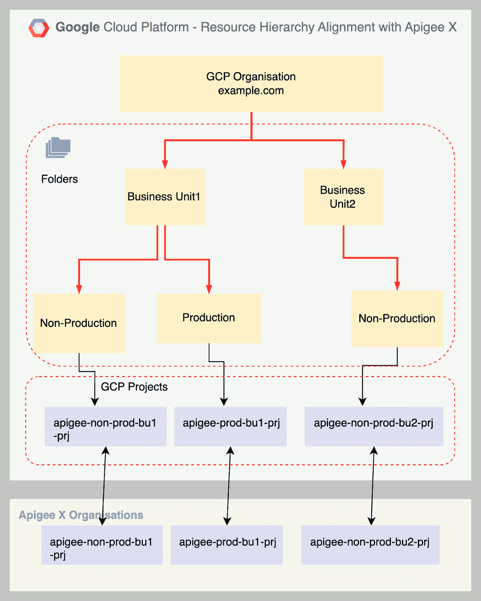
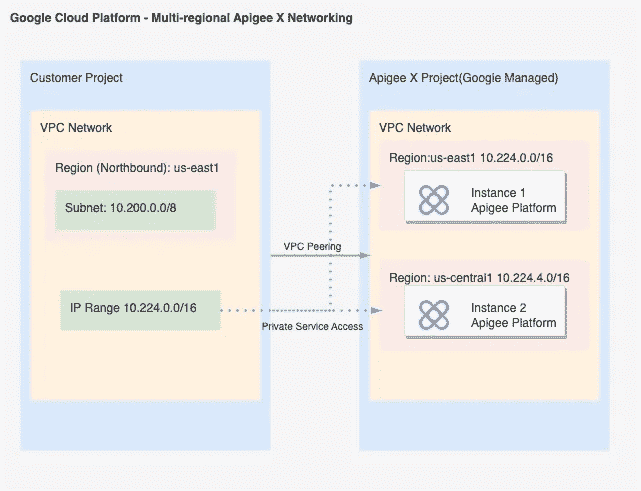
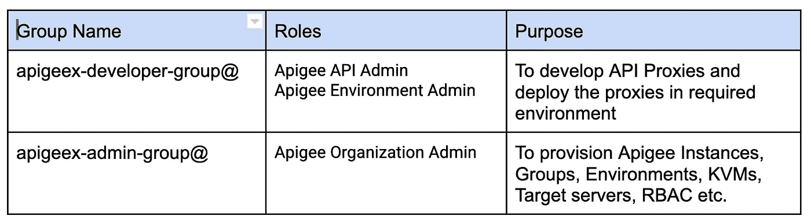
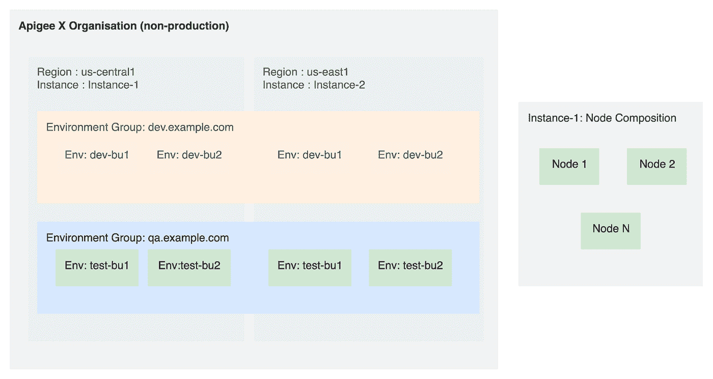

# 在 GCP 构建经济高效且可扩展的 Apigee X PayG 组织的最佳实践

> 原文：<https://medium.com/google-cloud/best-practices-for-architecting-cost-effective-and-scalable-apigee-x-payg-organisation-in-gcp-f575cc504e74?source=collection_archive---------1----------------------->

Apigee X 是一个基于 SaaS 的 API 网关，运行在谷歌云平台上。除了作为一个反向代理，Apigee X 还提供 API 发布、分析和货币化功能。Apigee X 作为应用程序的 API 管理平台，由于快速部署、可伸缩性和广泛的 API 代理操作，被证明是非常有用的。

开始并构建一个有弹性且灵活的 Apigee X 组织可能是一项艰巨的任务，因为作为一个客户，您可能有独特的需求，并且没有一种通用的方法来构建解决方案。Apigee X 组织需要与相应的 GCP 组织保持一致，以提供强大的 API 管理能力。可扩展性和成本效益密切相关，因为 Apigee X 是 GCP 最昂贵的资源之一。Apigee X 组织设计应该与 API 消耗率保持足够的一致性和灵活性，以实现最大价值。

一个计划良好的 Apigee X 设置允许轻松的可伸缩性、面向未来且经济高效的 API 操作。下面是在提供 Apigee X 组织之前需要计划的关键决策领域的清单。

> 选择 Apigee X 计费类型
> 
> 与 GCP 资源层次结构保持一致
> 
> 网络设计要求
> 
> 为 Apigee X 设置角色和权限
> 
> Apigee X 组织层次结构

让我们深入研究每一步。

1.  ***选择顶点 X 计费计划***

Apigee X 为 Apigee X 提供了三种计费方案:评估(Eval)、现收现付(PayG)和订阅(基于许可证)。

评估类型的 Apigee X 组织仅供应 60 天。除了持续时间短之外，评估计划还有一个基础架构限制，即只有一个实例(单个区域)，无法为业务连续性规划(BCP) /灾难恢复(DR)提供多区域设置。因此，它不是商业组织推荐的类型。

PayG 和 Subscription 类型是组织的推荐选择。

PayG 是 Google Cloud 中最近推出的 Apigee X 的计费类型(PayG 计费模式不适用于 Apigee Hybrid)。客户现在可以只为支持当前 API 消费所需的 Apigee X 基础设施付费。该基础设施处理预定的最小 API 调用，并且可以手动和自动扩展以支持不断增加的 API 流量。

[PayG](https://cloud.google.com/apigee/docs/api-platform/reference/pay-as-you-go) 在以下场景下是不错的选择，这里可以适用多个。

*   客户正处于应用现代化/向云迁移的早期阶段。正在开发新的服务，并不断添加新的服务来支持应用程序的核心功能
*   后端应用程序或微服务在其 DevOps 周期中处于持续集成/持续开发阶段
*   建立(测量)生产 API 请求速率/数量(TPS)仍然是一个遥远的目标，应用程序处于非生产或类似的环境中
*   业务连续性规划(BCP) /灾难恢复(DR)处于次要位置，因为主要需求是开发后端服务。
*   不需要高级 API 特性，如 API 货币化、应用程序集成和高级 API 操作
*   PayG 也适合尝试基于云的 API 管理平台并希望控制相关成本的数字原生用户。

与订阅计费类型形成对比，在订阅计费类型中，在以 Apigee 作为 API 网关开始之前购买计费计划。基于订阅的计费计划基于年度 API 请求或呼叫量的数量、分析数据保留和其他网络相关定价。订阅类型有 [3 种标准服务](https://cloud.google.com/apigee/docs/api-platform/reference/subscription-entitlements)，即标准、企业和企业升级版。由于既定的年度 API 费率和 GCP 网络成本(出口/入口/高级/标准层)与基于订阅的整体计划中的其他相关 Apigee 服务结合在一起，因此订阅证明具有成本效益。

在以下情况下优先选择订阅计划，此处可适用多个计划。

*   客户已经估计了他们的年度 API 调用量或 API 速率(TPS)
*   业务连续性规划(BCP) /灾难恢复(DR)是一项要求，因为后端应用程序和相关的云基础架构对于基于生产的环境来说是稳定和成熟的。
*   持续集成/持续部署是最能描述应用程序生命周期的 CI/CD 阶段
*   客户需要 API 货币化、应用程序集成和高级 API 操作等附加功能

本文的其余部分将重点介绍 PayG 作为一种计费方案，因为它被广泛使用，并在开始应用程序现代化/迁移时提供可伸缩性和低成本供应的好处。

2. ***与 GCP 资源层级*的兼容性**

根据经验，一个 GCP 项目只能映射到一个 Apigee X 组织。GCP 资源层次结构可以主要根据不同的软件开发生命周期(SDLC)来安排。建议为 SDLC 的生产和非生产环境分别保留至少两个不同的 Apigee 组织，而不是在整个 SDLC 中共享一个 Apigee 组织。这种方法有很多优点

*   独立的 Apigee 组织只为所需的 SDLC 环境提供高可用性(HA) /灾难恢复(DR)规划的灵活性，从而节省总体成本。
*   避免了开发人员和测试团队对生产资源的意外部署/变更。Apigee 组织的分离确保只有相关团队可以访问。
*   某些地区法规和公司规范要求将生产和非生产环境数据分开保存。每个环境有不同的 Apigee 组织可确保使用 GCP IAM 政策分别授予相关人员访问权限。
*   特定于生产的 Apigee 组织可以有一个预先的计费计划，如订阅计划，附带 API 货币化、集成和高级 API 操作的额外费用
*   开发者门户、API 密钥等。可以在生产和非生产环境中分开存放。这与两种环境中 API 密钥分开的某些法规安全要求是一致的。
*   使用高级开发人员门户的灵活性，如用于生产的 Drupal 和用于非生产 Apigee 组织的 Apigee 集成开发人员门户。
*   Apigee 组织的产品限制为 10 个实例(每个独特区域一个)、85 个环境、85 个环境组等。详细的产品限制可在[这里](https://cloud.google.com/apigee/docs/api-platform/reference/limits)找到。将生产和非生产作为独立的组织确保不违反产品限制。
*   生产 Apigee X 组织可以在应用程序最终准备好进入生产环境时进行调配。

Apigee X -GCP 资源层次结构参考

3. ***网络设计要求***

[服务网络](https://cloud.google.com/kubernetes-engine/docs/concepts/service-networking)用于在谷歌云上为基于 SaaS 的产品提供网络。使用服务网络供应的著名 SaaS 产品包括 Apigee X、Cloud IDS、Cloud SQL 等。服务网络在 GCP 使用网络对等来连接主机 VPC 与 a pigee X(GCP 的租户项目)的入口/出口。[私有服务访问](https://cloud.google.com/vpc/docs/private-services-access)用于在主机 VPC 内保留 IP 地址，以便在对等 Saas 项目(如 Apigee X)间共享

VPC 规划

作为最佳实践，每个 SDLC 的每个生产和非生产阶段至少应该有两个 VPC。每个 VPC 将用于在相应的 SDLC 阶段为 Apigee X 组织提供网络。不同的 VPC 有助于将生产和非生产流量分开，并满足法规要求。

VPC 是一种全球资源。网络管理员可以为子网规划、静态 IP、私有服务访问等特定用例提供和保留 IP 范围。始终为 VPC 配置自定义子网，并删除具有自动模式子网的 VPC(如果有)。

Apigee X 运行时实例要求每个实例至少有/22 个子网范围(用于 Apigee 运行时)和/28 个子网(用于故障排除)。故障排除范围可以手动选择，也可以从对等的顶点范围自动选择。但是，在自动分配的情况下，一些 IP 范围应保持未初始化，以便服务网络提供故障排除范围。

例如，GCP 网络管理员提供 10.224.0.0/16 来供应 Apigee X 运行时。

10 . 224 . 0 . 0/16 = > 00001010.11100000.000000 00.0000000(二进制表示)

该子网范围可分为

例子

顶点 X 实例 1:10 . 224 . 0 . 0/22 = > 00001010.11100000.0000000.0000000

顶点 X 实例 2:10 . 224 . 4 . 0/22 = > 00001010.11100000.0000100.0000000

…

顶点 X 实例 10:10 . 224 . 36 . 0/22 = > 00001010.11100000.00100.0000000

可以根据需要添加实例数量。在此示例中，每个 Apigee 组织总共可以配置 10 个实例，从而提供可扩展性。如果需要更多实例，需要添加一个单独的 Apigee 组织。截至 2022 年 12 月撰写本文时，每个机构 10 个实例是[极限](https://cloud.google.com/apigee/docs/api-platform/reference/limits)。

Apigee 故障排除范围/其他资源(未初始化):

10.224.128.0/17 => 00001010.11100000.10000000.00000000

Apigee X 网络参考

为 Apigee X 分配 IP 地址的最佳实践

*   使用的地址范围可以是私有 IPv4 范围( [RFC 1918](https://www.rfc-editor.org/rfc/rfc1918) )
*   如果计划的私有 IPv4 地址空间不足或可能提前耗尽，建议使用共享地址空间 [RFC 6598](https://www.rfc-editor.org/rfc/rfc6598) 。
*   请选择足够的地址空间来容纳前端资源子网、Apigee X 运行时实例(PayG)、后端资源子网和组织所需的其他 GCP 资源。
*   为 GCP 资源选择 IP 地址不应与本地/其他云网络子网、通过云互连和云 VPN 调配的连接冲突

4. ***为顶点 X*** 提供角色和权限

对于 Apigee 组织，可以通过在 GCP 组织内部为 IAM 组分配所需的角色来授予权限。

IAM 组是设置角色的推荐方式

*   通过将角色分配给组，而不是分配给单个用户，可以大规模管理 Apigee X 用户的权限。
*   在撤销用户对特定 Apigee 权限的访问时，可以从相应的 IAM 组中删除该用户。
*   Apigee X 的自定义角色在 GCP IAM 中也可用。自定义角色提供细粒度的访问，IAM 组可以根据自定义角色进行设置。

建议从具有以下权限的 IAM 组开始。可以根据定制的业务需求添加新的组，并拥有细粒度的 Apigee X 权限。

Apigee X 推荐的角色和 IAM 组

5. ***顶点 X 组织层级***

就资源层级而言，Apigee X 组织不同于 GCP 组织。Apigee X 组织由以下部分组成

*   实例—调配不同环境的区域资源
*   环境—将部署 API 代理的执行上下文
*   网关节点-处理 API 流量的环境单元。随着流量的增加，环境需要更多的节点
*   环境组—具有主机名的 Apigee 环境的逻辑分组和映射。每个组可以分配一个或多个主机名，将传入的 API 请求路由到适当的环境

设置 Apigee X 层次结构时的建议

*   Apigee X 实例是一种区域性资源。为了实现灾难恢复设置的 99.99%的 SLA，应该配置多个实例或多区域实例。
*   生产或类似 SDLC 阶段的环境应跨多区域实例设置，以实现容错和灾难恢复
*   Apigee 环境是使用充当 Apigee 运行时的节点实现的。每个实例为每个 Apigee 环境提供最少 2 个节点，为所有 Apigee 环境提供最多 1000 个节点。
*   网关节点数量是 [PayG Billing](https://cloud.google.com/apigee/docs/api-platform/reference/pay-as-you-go) 的组成部分之一。默认情况下，最少有 2 个节点实例。最大节点数可以根据需要手动设置，也可以自动缩放。
*   在[理想测试](https://cloud.google.com/apigee/docs/api-platform/reference/pay-as-you-go-nodes#apigee-gateway-node-performance)条件下，每个 Apigee 节点可以处理 300 TPS(每秒事务)。节点的实时性能可能因 API 代理性能和网络配置而异。为了节省成本，建议使用每个节点 300 个 TPS API 卷来估计环境所需的最大节点数量(假设[理想的实验室条件](https://cloud.google.com/apigee/docs/api-platform/reference/pay-as-you-go-nodes#apigee-gateway-node-performance))。请相应地修改 TPS 以进行评估)。手动设置节点的最大限制是控制成本的好方法。

Apigee X 组织结构参考

在 GCP 对上述输入(计费计划、GCP 资源层级、网络规划、角色和权限、Apigee X 资源层级)进行架构和规划后，可以通过 Apigee [控制台](http://apigee.google.com/)或使用 [Terraform](https://github.com/apigee/terraform-modules/tree/main/modules) Apigee 模块来提供 Apigee。