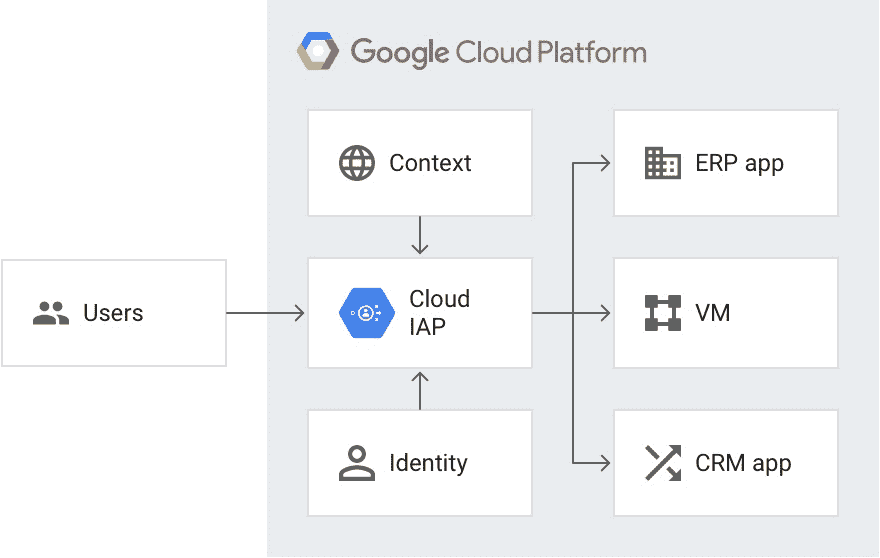
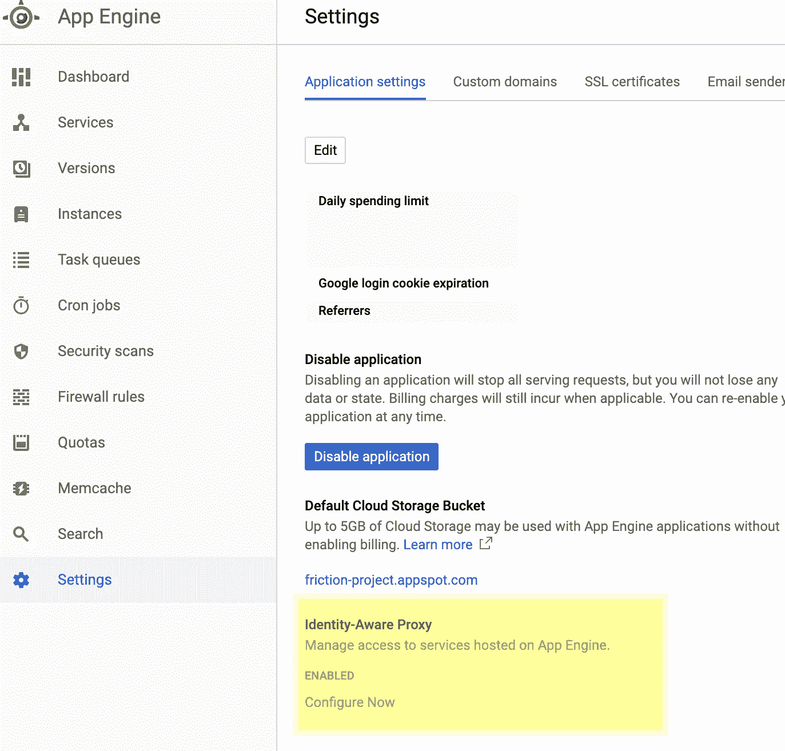
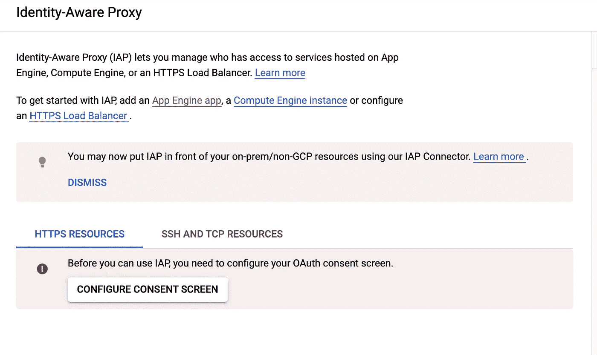
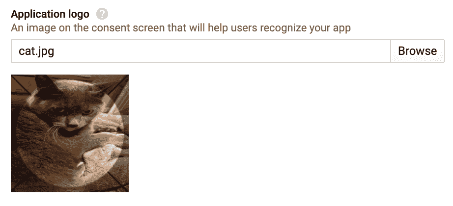
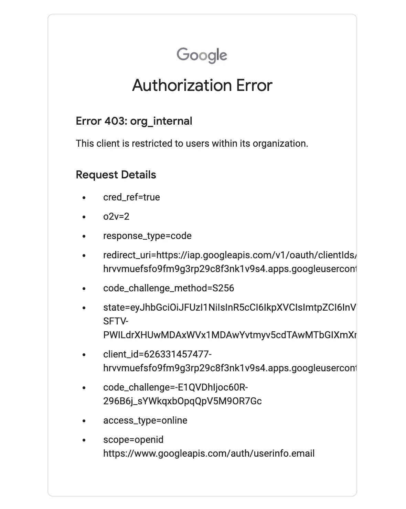
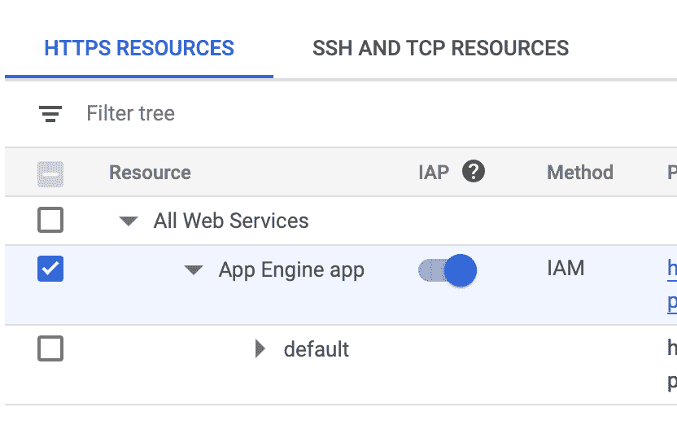
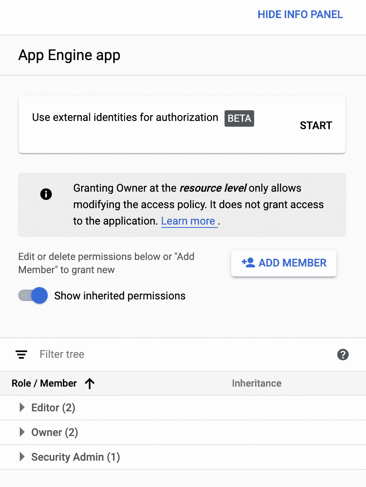
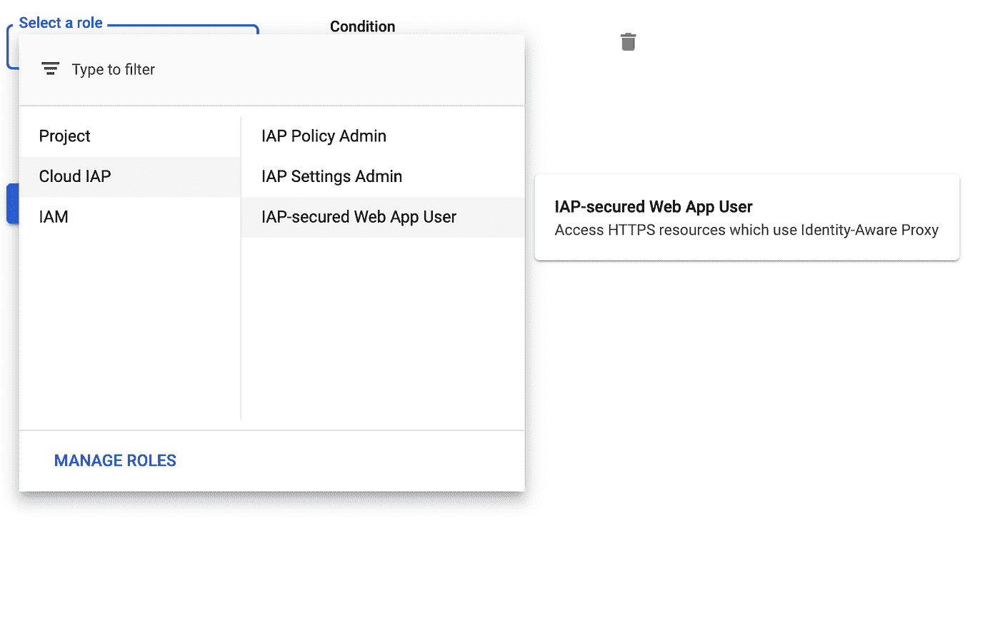
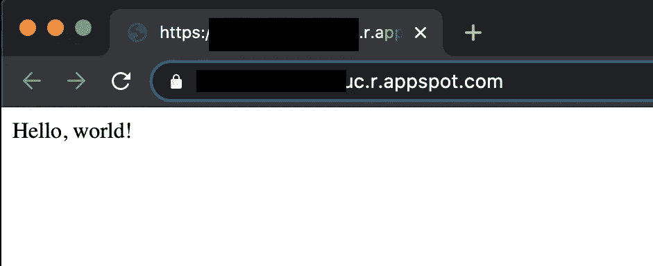

# 在家工作时对企业零信任

> 原文：<https://medium.com/google-cloud/beyond-corp-in-a-bottle-uncorked-5e8c7acce52?source=collection_archive---------1----------------------->

*本博客由詹·珀恩和* [*马克斯·索尔顿斯托尔*](/@max.saltonstall) 共同撰写

随着越来越多的人在家工作，公司需要安全访问资源的解决方案。让办公室外的每个人安全可靠地连接在一起并不容易，风险状况也发生了变化。如果你还没有听说过 BeyondCorp 远程访问 web 应用程序的模型，那么[阅读关于它的全部内容](/google-cloud/what-is-beyondcorp-what-is-identity-aware-proxy-de525d9b3f90)。


照片由 [Gustavo Fring](https://www.pexels.com/@gustavo-fring?utm_content=attributionCopyText&utm_medium=referral&utm_source=pexels) 从 [Pexels](https://www.pexels.com/photo/photo-of-person-in-personal-protective-equipment-using-macbook-4149043/?utm_content=attributionCopyText&utm_medium=referral&utm_source=pexels) 拍摄

> 当 WFH 来袭时，我们如何保证员工的安全？

今天，我们将使用这种基于上下文的信任模型建立一个示例应用程序。我们将为一个简单的 App Engine 应用程序运行基于身份的访问控制，使用云身份来控制授权。请继续阅读关于设置新应用程序和使用身份识别代理保护应用程序的分步说明。

# 身份感知代理

在我们开始有趣的例子之前，最好先了解一下我们正在使用的产品！云[身份感知代理](https://cloud.google.com/iap) (IAP)可以帮助您控制对公共云应用、本地应用和运行在 Google Cloud 上的虚拟机的访问。IAP 的工作原理是验证用户的身份，并考虑用户请求的上下文来决定是否允许他们访问。这是零信任访问模型中的一个构造块，这是一个企业安全模型，使每个员工都能够在不使用 VPN 的情况下从不受信任的网络工作。

> 身份感知代理决定谁进入谁离开


[https://burst.shopify.com/photos/shining-disco-ball?q =夜总会](https://burst.shopify.com/photos/shining-disco-ball?q=nightclub)

在我们的例子中，我们使用 IAP 在服务 App Engine 应用程序之前验证客户端的身份和上下文。把 IAP 想象成保镖，把 App Engine 想象成俱乐部:IAP 看到你并获得你是谁的信息，然后检查你是否在名单上。如果你在上面，你就进去了！如果没有，那你就倒霉了，你可以在 403: Forbidden 里过夜。



# 部署到应用引擎

要开始，你需要一个新的或现有的谷歌云项目与应用引擎应用程序。我们使用 GitHub 上的 App Engine samples repo 中的 [Node.js 示例](https://github.com/GoogleCloudPlatform/nodejs-docs-samples)。下面你可以看到如何使用 gcloud 命令行工具来管理项目。

> 轻松快速地保护应用引擎或任何应用

如果您已经准备好了 gcloud 和一个项目，请跳到下面的“**获取代码**”。如果你还没有 gcloud，谷歌云命令行界面，[下载](https://cloud.google.com/sdk/docs)并更新。产品一直在改进，因此即使您已经安装了产品，运行更新也是一个好主意:

```
gcloud components update
```

登录到您将用于管理项目的帐户。

```
gcloud auth login
```

该命令打开一个 Chrome 标签页，用于登录 GCP。
登录后，您可以使用以下命令创建一个项目:

```
gcloud app create --project=[YOUR_PROJECT_ID]
```

我们称我们的项目为`helloworld-portal`。为什么？因为这是我们刚才想到的第一件事。

```
gcloud app create --project=helloworld-portal
```

# 获取代码

如果你脑子里没有一个具体的项目，这里是你可以抓取一些样本代码的时候。

克隆示例存储库:

```
git clone [https://github.com/GoogleCloudPlatform/nodejs-docs-samples](https://github.com/GoogleCloudPlatform/nodejs-docs-samples)
```

输入适当的样本目录:

```
cd nodejs-docs-samples/appengine/hello-world/standard
```

安装所需的软件包:

```
npm install
```

# 部署！

安装完软件包后，使用以下命令将 Node.js 应用程序部署到应用程序引擎:

```
gcloud app deploy --project=helloworld-portal
```

您可以在没有`--project`标志的情况下调用这个命令，但是请注意，这样做将会调用默认项目上的命令。如果您有许多项目正在进行，最好包括这个标志，并确保您正在部署预期的应用程序！

要查看您的项目，请使用此命令或复制终端响应中提供的链接:

```
gcloud app browse --project=helloworld-portal
```


[来源](https://pixabay.com/photos/the-ostrich-ostrich-head-beak-fluff-1658267/)

# 完成了吗？

好了，我们成功部署了一个 helloworld 应用程序！但是，嗯……我们仍然需要解决整个安全问题。

默认情况下，我们已经向互联网上的任何人公开了这个应用程序，这不是我们想要的。为了确保只有正确的人才能进入，我们将使用身份感知代理来控制谁可以访问，基于他们的个人电子邮件或他们的组成员。这样我们就限制了我们非常机密的“你好，世界！”

> 只有特别允许的人才能通过执法

一旦我们添加了这些控件，负载平衡器将限制谁访问应用程序，并禁止不在列表中的任何人访问。


凯尔·格伦在 [Unsplash](https://unsplash.com/s/photos/forbidden?utm_source=unsplash&utm_medium=referral&utm_content=creditCopyText) 上的照片

# 配置识别身份的代理

在云控制台中，导航到[应用引擎标签](https://console.cloud.google.com/appengine)。在那里，你会在左侧找到[应用引擎设置链接](https://console.cloud.google.com/appengine/settings)。在这些应用程序设置的底部，选择“**立即配置**”。



启用后，您需要配置同意屏幕，以通知用户在访问您的应用程序时他们同意什么。



对于用户类型，选择内部。外部将允许任何拥有谷歌账户的人登录。我们的目标是将此应用限于您的特定用户。
为您的应用程序选择一个图标。我选择水星是因为它总是当季。



接下来，您将看到授权域链接的字段。您可以暂时将这些字段留空。
最后选择**保存**。
IAP 现已启用！


尼古拉斯·天梭在 [Unsplash](https://unsplash.com/s/photos/fireworks?utm_source=unsplash&utm_medium=referral&utm_content=creditCopyText) 上拍摄的照片

> 啊哦:现在所有人都被禁止了！

当您返回访问您的应用程序时，您将看到一个谷歌登录屏幕。使用 Google 帐户登录。你会注意到，你再也看不到你的“hello world”应用程序，这正是应该发生的，因为 IAP 启动时处于默认拒绝状态，我们没有将任何人添加到允许的人列表中！



**你不得通过！！**

# 添加授权用户

你的应用受到限制，不是任何人都可以使用，这很好！但是当然，必须有人能够访问它！在这种情况下，也就是你！
在云控制台，选择 [**安全>身份感知代理**](https://console.cloud.google.com/security/iap) 。
选择你的 App Engine app。



在右侧面板中，您将看到当前已被授予的 IAM 角色。



选择**“添加成员”**，并选择您想要用来访问应用程序的电子邮件。对于角色，选择**云 IAP > IAP 安全的 Web App 用户**。



> 现在，只有合适的人才能访问你的应用

# 试试吧！

现在，您的电子邮件可以使用 App Engine 应用程序了！继续并再次访问应用程序。使用您刚刚列出的电子邮件登录。



成功！您现在可以访问您的 App Engine 应用程序。如果您使用没有权限的电子邮件地址登录，您会注意到您无法访问该应用程序。

# 下一步是什么？

[通过文档深入了解 IAP 的特性，并亲自尝试一下。](https://cloud.google.com/iap/docs)

在使用 Google 作为身份提供者的情况下，IAP 工作得很好。

但是，如果您的公司已经有了他们使用的提供商，该怎么办呢？例如，如果你的公司使用 OIDC、SAML 或脸书会怎样？

在下一篇文章中，我将向您展示如何对不同的身份提供者使用身份感知代理。