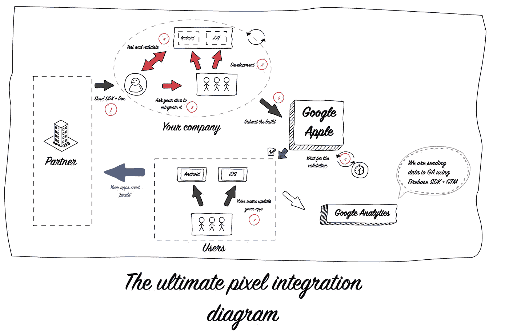
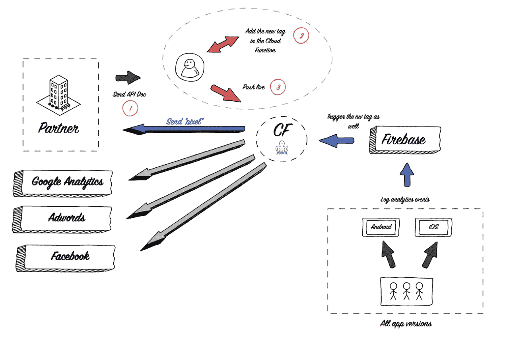

# Firebase 云功能超越移动跟踪！

> 原文：<https://medium.com/google-cloud/beyond-mobile-tracking-with-firebase-cloud-functions-fb8ed2fe00b3?source=collection_archive---------1----------------------->

在我的公司，整个公司的许多团队都使用分析数据来:

*   优化付费营销活动
*   提供独特的用户体验

在网络上，我们根据整个团队的期望，采用跟踪和像素'*小片段* *来收集* *并发送* *关于访问者及其浏览的信息。我们正在使用**G**oogle**T**ag**M**anager，它给了我们很大的灵活性来修改/丰富数据并将其发送给我们的数十个营销合作伙伴。*

## 我们如何用手机追踪拔掉我们的头发…

当我们在今年年初推出我们的移动应用程序时，我们使用 Firebase SDK + Google Tag Manager 进行内部分析，我们很快意识到需要使用大量不同的 SDK '*软件开发套件'*'从应用程序端完成像素集成。

## 接着，谷歌发布了 Firebase 云功能

Firebase 允许您在他们的服务器上部署 NodeJS 功能，这些功能可以基于不同的事件触发，例如 **Firebase 分析功能。**

> *惊艳！我们已经在使用 Firebase 向 Google Analytics 发送数据。*

然后，我们决定建立一个具有云功能的内部解决方案来集中一切: **Octopus** 。

## 关于章鱼

简单解释一下章鱼的作用。

基于分析事件:添加到购物车，登录… Octopus 可以丰富/修改数据并将其发送到我们想要的任何地方，而无需依赖应用发布或 SDK 集成。

## 借助云功能简化构建

我们的 index.js 包含 Firebase 将基于分析事件触发的所有函数。您可以使用您想要的所有来源来丰富您的数据，对我们来说，这是我们的 CRM API。

为了分解正在发生的事情，函数有:
1。从应用程序中实时获取活动负载
2。丰富数据
3。将数据传递给相关标签(子功能)

每个“标签”将输入数据映射为所需的输出格式。

让我们来看看 Google Analytics 标签中的 sign_in。下面，我们正在填写团队将在 Google Analytics 中找到的签到活动的活动信息。

最后，我们有一个通用函数使用测量协议将数据发送到 Google Analytics。

# 结论

将跟踪从应用程序端转移到 Firebase 端大大减少了像素跟踪集成所花费的时间，并帮助我们**利用移动跟踪**。

## 积分时间加快 3！

整合过程中从 **7 到 3 步**。

**实时部署**:任何更改都可以实时发布，无需移动开发人员参与，也无需等待应用发布

## 消防基地游乐场

**数据整合**:之前，我们有**两个**谷歌标签管理器**容器**需要维护(一个用于 Android，一个用于 iOS)。现在，我们有相同的代码**运行在两个移动应用的云函数上。**

**数据丰富:**我们可以在调度数据之前对其进行**整形**。

## 无服务器、无服务器和无服务器…

云功能环境由谷歌完全管理。

 [## 一起打造更好的软件

### GitHub 是人们构建软件的地方。超过 2300 万人使用 GitHub 来发现、分享和贡献超过…

吉斯吉斯](https://gist.github.com/anaisghelfi/0401afec327f4c16bee3f080210d133a/edit)