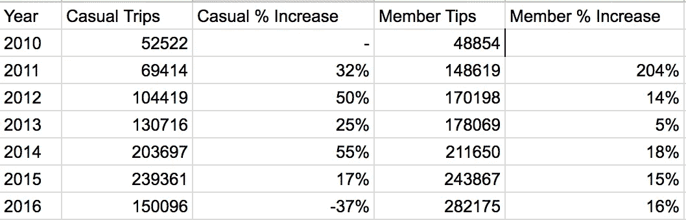

# 大数据、大查询和自行车的故事

> 原文：<https://medium.com/google-cloud/big-data-bigquery-and-a-story-of-bikes-6745e410d1bc?source=collection_archive---------2----------------------->

“大数据”作为一个流行语是不可避免的。每天收集的数据量如此惊人，几乎让人无法理解。截至 2015 年，每天[都会产生 250 万 TB 的新数据](https://www-01.ibm.com/software/data/bigdata/what-is-big-data.html)。应用范围从简单的消费者分析到科学研究和公共政策的预测模型。大数据对日常生活的影响是不可否认的，尽管通常是隐藏的。

对于一个不经意的观察者来说，大数据经常感觉像一个无法接近的庞然大物，所以当我第一次读到谷歌的 BigQuery 工具集时，我立刻就感兴趣了。我参加了谷歌开发者代言人[莎拉·罗宾逊](https://twitter.com/srobtweets?lang=en)在 DevFestMN 2017 上的演讲，演讲内容是通过她对纽约市[花旗自行车项目](https://cloud.google.com/blog/big-data/2016/12/analyzing-nyc-biking-data-with-google-bigquery)的分析来展示 BigQuery 的实际应用。她在演讲结束时粗略地看了一下 Nice Ride MN bike 项目，这启发了我尝试使用 BigQuery 并深入大数据世界。

自 2010 年该项目启动以来，Nice Ride MN 一直在收集数据，并在他们的网站上公开这些数据。我绝不是 SQL 专家，所以我很高兴将数据导入 BigQuery 只需要一点试错，这让我在大约一个小时的时间内运行了基本的查询。

所以，让我们来问一个最基本的问题:骑行的感觉有多好？

```
SELECT
  COUNT(*) as total_trips
FROM
  [mn_nice_ride.trips_2010],
  [mn_nice_ride.trips_2011],
  [mn_nice_ride.trips_2012],
  [mn_nice_ride.trips_2013],
  [mn_nice_ride.trips_2014],
  [mn_nice_ride.trips_2015],
  [mn_nice_ride.trips_2016]
WHERE
  duration != 0;
```

这产生了令人印象深刻的结果 2，223，719:


2010 年至 2016 年 MN 尼斯之旅的总行程

所以下一个显而易见的问题是，乘客数量每年是如何增长的？

```
SELECT
  2016 AS year,
  COUNT(*) AS number_of_trips
FROM
  `mn_nice_ride.trips_2016`
WHERE
  duration != 0 UNION ALL….[REST OF YEARS]
```


2010-2016 年 MN 尼斯之旅每年的总旅行次数

上述细分显示，除了 2015 年至 2016 年乘客量下降这一奇怪情况外，年复一年的增长相当稳定。那么，我们如何进一步分析这些数据，以更好地了解导致经济下滑的原因呢？原来，每个旅行记录中的另一个数据点是旅行是由订户(会员)还是非订户(临时)进行的。

```
SELECT
  account_type AS account,
  COUNT(*) AS num_trips,
FROM
  [mn_nice_ride.trips_2010]
WHERE
  duration != 0
GROUP BY
  account;
```



2010 年至 2016 年按会员类型划分的 MN Nice Ride 每年的旅行次数

这个查询产生了非常有趣的结果。事实上，从 2015 年到 2016 年，用户出行的年同比增长(16%)仍在继续，但原因性出行的数量出现了相当严重的下降(-37%)。


我做了一个图表

因此，我们更好地了解了乘坐舒适的顾客的哪一个子集导致了乘客量的下降——在正式确定衰退的假设之前，还有什么可以获得更多信息的吗？

让我们来看看 2015 年和 2016 年非用户选择的热门路线:


2015 年非订户的 10 大旅行


2016 年非订户的 10 大旅行

从数据中可以立即看出，非订户倾向于以游客身份使用这项服务，非常受欢迎的路线是明尼阿波利斯的环湖链。我们看到，从 2015 年到 2016 年，这些目的地的旅行数量明显下降。减少的最明显的原因，或者更简单地说，最符合逻辑的原因是，2016 年在高峰时段出现了更多不理想的骑行天气，休闲用户可能会租一辆自行车环游湖泊——但我们如何确定呢？这是一个重要的问题，因为它对 Nice Ride 金库的底线有着巨大的影响，因为这些受欢迎的非会员旅行的每一次都占总收入的约 8 美元。

使用来自 NOAA 的数据子集(从 MSP 机场测量)，我开始运行查询来查看可能不利于悠闲骑自行车的各种天气条件。

```
SELECT
  COUNT(*) AS hot_and_humid,
  year
FROM
  [mn_nice_ride.weather_2016],
  [mn_nice_ride.weather_2015],
  [mn_nice_ride.weather_2014]
WHERE
  mo > 3
  AND mo < 11
  AND dewp > 65
  AND max > 90
GROUP BY
  year;
```


2014 年至 2016 年炎热潮湿的日子

```
SELECT
  COUNT(*) AS hot_and_humid,
  year
FROM
  [mn_nice_ride.weather_2016],
  [mn_nice_ride.weather_2015],
  [mn_nice_ride.weather_2014]
WHERE
  mo > 3
  AND mo < 11
  AND rain_drizzle = 1
GROUP BY
  year;
```


2014 年至 2016 年的降雨天数

因此，从 2015 年到 2016 年，不舒服的高温日和降水日都有所增加。这些额外的信息给了我们另一个途径来探索天气条件是如何影响临时乘车的。我随机抽取了 2016 年一个炎热的周六和 2016 年一个凉爽的周六，并查询了两个周六的乘车次数:

```
SELECT
  COUNT(*) AS casual_trips_hot_day
FROM
  [mn_nice_ride.trips_2016]
WHERE
  start_date LIKE "7/23/2016%"
  AND account_type = "Casual";
```


2016 年 7 月 23 日临时用户的出行次数


2016 年 7 月 2 日临时用户的出行次数

毫不奇怪，在凉爽舒适的日子里，休闲骑手的数量轻而易举地超过了在炎热的日子里的数量。我有点惊讶，大热天的客流量如此之高，但我使用的数据相当不完整，没有给出天气与客流量的全貌——只是一个基本趋势。

虽然我可以对目前作为 BigQuery 公共数据集加载的 NOAA 天气数据运行额外的查询，但我认为更有用的指标是查询每小时的温度读数，以更准确地了解天气状况如何真正影响乘客数量。

已经回答了一些基本问题，但是记录和分析这些数据有什么商业用途呢？创建乘客量与天气模型可以允许 Nice Ride 提供激励以增加热天的旅行次数，或者提供专注于周末使用的不同会员计划以增加订阅会员，或者甚至利用实时数据来创建奖金系统以减少车站重新平衡可能是潜在的可能应用。

我完成了让自己熟悉 BigQuery 的目标，同时学习了更多关于 Nice Ride MN 程序所面临的复杂性和挑战。谷歌提供的平台对于更先进的数据集来说似乎足够强大，我认为他们在大数据民主化方面做了令人难以置信的工作。希望更多的记者和爱好者能够利用这一强大的工具，更好地分析当今世界面临的复杂问题，努力将“大数据”转化为“有意义的数据”。