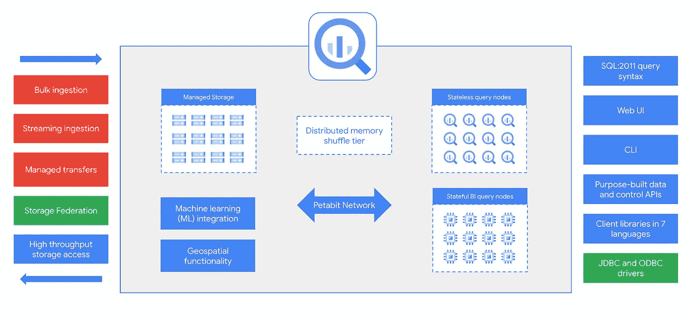

# BigQuery:基础和内部:第 1 部分

> 原文：<https://medium.com/google-cloud/bigquery-basics-internals-part-1-9eda52b65960?source=collection_archive---------1----------------------->

谷歌大查询

# 动机

读者你好！

下面是一系列关于 BigQuery(以及 GCP 的相关产品，包括 BigLake、Omni 等)的博客文章，深入介绍了它的设计、架构、工作方式和最佳实践。

下面是这篇博客文章的一个小索引(随着系列文章新部分的撰写，它将不断更新):

*   [第 1 部分—简介、BigQuery 基础知识和 BigQuery 架构](/google-cloud/bigquery-basics-internals-part-1-9eda52b65960)
*   [第 2 部分—大查询存储，设计原则&(一些)最佳实践](/@suddhasatwa/bigquery-basics-internals-part-2-7769f59d01e4)

# 介绍

**BigQuery** 是谷歌云平台(GCP)的旗舰数据仓库和数据分析产品。在其众多的使用案例和应用中，该技术背后的基本思想是为 GCP 客户提供一个易于使用的基于 SQL 的界面，从 GUI(图形用户界面，又名 GCP 控制台)或 CLI(命令行界面，或 GCP SDK)执行大规模的数据仓库任务！

在这篇文章中，我们将重温数据仓库概念的基础知识，然后是 BigQuery 的基础知识和内部工作细节。在关于 BigQuery 的这个*系列博客文章*的后续部分中，我们将涵盖该软件的其他方面，包括 BigLake、BigQuery Omni、机器学习能力等等。

# 数据仓库基础

在详细了解 BigQuery 之前，我们都来修改一下常用术语是至关重要的。我们中的大多数人对此已经很熟悉了，但一次修改并没有什么错！

在任何组织或机构中，可用的数据都可以收集起来，然后用不同的技术或不同的方法存储在不同的地方！通常，我们重用术语**数据库**来指代事务系统，我们可以在其中存储由应用程序或系统生成的数据。通过设计，它可以高效地检索和更新信息。这些数据库可以是 SQL 或非 SQL 数据库，这取决于它们的设计和规范化属性。Google 云平台套件数据库的一部分，这类数据库的列表包括 BigTable、Spanner、Cloud SQL 等等。这些事务数据库分别以不同的方式结合了酸或碱原理。

[https://www . research gate . net/figure/ACID-and-BASE-comparative-representation-Vanroose-et-thi llo-2014 _ TBL 1 _ 339883071](https://www.researchgate.net/figure/ACID-and-BASE-comparative-representation-Vanroose-et-Thillo-2014_tbl1_339883071)

一旦我们发明了传统的数据库系统，就有了通过它们各自的应用程序来分析存储在这些系统中的大量数据集的内在需求。但是，有一个问题！

默认情况下，这些事务性系统没有针对执行大规模分析进行优化，因为它们在许多情况下固有地包含规范化表的概念，导致连接，从而导致大规模低效！

这将我们带到了**数据仓库**的出现，以及后者为大规模数据分析和数据科学应用提供可能性的伟大时代。

简单来说:

> 数据仓库存储来自各种数据源的信息，用于分析目的，其固有的设计支持这样的操作，甚至是大规模的操作！

直到最近几年，我们还提出了**数据集市**和**数据湖**的概念，这些概念可能对不同的人有不同的定义，这取决于相关的理解和它们解决的用例。

对于本文的上下文，让我们用简单的话来说:

*   一个**数据湖**是一个数据转储场——这是我们存储所有原始文件(通常包含非结构化数据)的地方，在经过转换和清理的数据提取被放入数据仓库之前，它充当一个暂存环境！
*   一个**数据集市**是一个数据仓库的一部分——它是专门为某件事或某个人设计的，比如我们组织中的一个部门！

记住上面的修改，现在让我们深入研究 BigQuery。

# BigQuery —查询大数据！

作为 Google 云平台最突出的数据分析产品， [BigQuery](https://cloud.google.com/bigquery) 是一个完美的数据仓库解决方案，它还支持数据湖和数据集市的实现！通过这种方式，它带来了分析平台的所有 OLAP(在线分析处理)要求的最佳性能，解除了我们在 OLTP(在线事务处理)数据库系统上进行数据分析的限制。

然而，对于许多人来说，BigQuery 的定义可以根据我们的角色和我们对它的理解而适当地有所不同！

一个企业中 BigQuery 的不同定义！

BigQuery 的构思实际上是从现实中的 **Map Reduce 编程模型**的基础概念开始的！要快速修订:

> **MapReduce** 是一个[编程模型](https://en.wikipedia.org/wiki/Programming_model)，是在[集群](https://en.wikipedia.org/wiki/Cluster_(computing))上用[并行](https://en.wikipedia.org/wiki/Parallel_computing)、[分布式](https://en.wikipedia.org/wiki/Distributed_computing)算法处理和生成[大数据集](https://en.wikipedia.org/wiki/Big_data)的关联实现。[【1】](https://en.wikipedia.org/wiki/MapReduce#cite_note-1)[【2】](https://en.wikipedia.org/wiki/MapReduce#cite_note-2)[【3】](https://en.wikipedia.org/wiki/MapReduce#cite_note-3)
> 
> MapReduce 程序由一个 [*映射*](https://en.wikipedia.org/wiki/Map_(parallel_pattern)) [过程](https://en.wikipedia.org/wiki/Procedure_(computing))和一个)*方法组成，前者执行过滤和排序(如按名字将学生排序到队列中，每个名字对应一个队列)，后者执行汇总操作(如统计每个队列中的学生数量，得出名字频率)。“MapReduce 系统”(也称为“基础设施”或“框架”)通过[编组](https://en.wikipedia.org/wiki/Marshalling_(computer_science))分布式服务器，并行运行各种任务，管理系统各部分之间的所有通信和数据传输，并提供[冗余](https://en.wikipedia.org/wiki/Redundancy_(engineering))和[容错](https://en.wikipedia.org/wiki/Fault-tolerant_computer_system)来协调处理。*

*参考:[https://en.wikipedia.org/wiki/MapReduce](https://en.wikipedia.org/wiki/MapReduce)*

*有趣的是，这正是 BigQuery 在幕后所做的事情(或者至少是试图去做的事情)!在查看其详细的组织或架构细节之前，让我们以一种简单的方式快速了解一个典型的查询是如何在 BigQuery 中执行的:*

**

*BigQuery 查询生命周期概述*

*本质上，对于在 BigQuery 上运行的每个查询，我们都有一个映射阶段(左下角的第一个方形框，下一个是 workers)，其中数据被映射到特定的 Workers，并可能根据查询语法和语义进行过滤或排序。此外，产生的数据子集被写出到某个中间阶段(上面提到的，作为混洗系统)，然后最后在最后阶段被减少(由上面图中的工作人员)，以便输出可以被写出给用户(以输出结果对象的形式)。虽然我们将在本系列文章的后面部分深入研究查询执行，但有趣的是要注意上面的几点:*

*   *静止的输入或数据被视为分块或分成几部分。*
*   *每个工作者在初始阶段处理数据的一个特定部分。*
*   *所有人一起被带到洗牌阶段。*
*   *最后，结果由一个(或多个)工作者输出到磁盘。*

*为了有效地工作，我们需要在 Hadoop 等已知框架中对我们过去执行 Map Reduce 程序的方式进行实质性的改进。其中一些，以及 BigQuery 在后台使用的解决方案是:*

*   *一个高度可扩展和高吞吐量的网络:这就是谷歌的超高速和全球规模的 Pb 级网络 [**木星**](https://cloud.google.com/blog/topics/systems/the-evolution-of-googles-jupiter-data-center-network) 发挥作用的地方！*
*   *一个高度冗余和高性能的磁盘组织:这就是 [**巨像**](https://cloud.google.com/blog/products/storage-data-transfer/a-peek-behind-colossus-googles-file-system) 来拯救的地方！*
*   *一个复杂的处理引擎，可以使用矢量化等技术改善程序执行:这就是 [**Dremel**](https://research.google/pubs/pub36632/) 发挥作用的地方！*

*上面的例子(在图表中)有一个普通的查询；在大规模连接和大规模执行的情况下，BigQuery 中遵循的总体策略可以总结为下图:*

**

*BigQuery 中的大规模连接*

*总之，对于大规模连接，首先将数据映射到 worker，其中它们基本上只是从分布式存储中读取，然后对数据进行排序，以便连接键的每个散列的行都在同一个 worker 中结束！*

*现在，让我们慢慢理解 BigQuery 的架构。*

# *BigQuery 架构——一个温和的介绍*

**

*BigQuery:整体架构:摘要*

*让我们逐点探索 BigQuery 整体架构的上述图示:*

*   *首先，我们需要注意的是，存储和计算是分开的，可以独立地按需扩展。这就是 BigQuery 对于大规模数据分析用例表现优异的本质！*
*   *在架构的中间部分，我们遇到了 [**巨像**](https://cloud.google.com/blog/products/storage-data-transfer/a-peek-behind-colossus-googles-file-system) —谷歌的分布式文件系统，这是 BigQuery 在谷歌云平台中原生存储客户数据的地方。在架构的右边，我们找到了 [**Dremel**](https://research.google/pubs/pub36632/) ，我们的查询引擎！*
*   *与传统的事务数据库相比，前者中的存储和计算单元在本地存储时彼此非常接近，以保证 ACID 原则和性能。到目前为止，我们已经拥有了速度惊人的大型网络，因此紧密耦合不再是一个硬性限制！同样，我们计划实践真正大规模的分析，因此，查询通常会运行一段时间来处理我们所有的数据！这意味着，延迟也不那么重要。*

*对于 BigQuery，将存储和计算分离有很大的好处，如下所示:*

*   ***可扩展性**:无需任何数据移动，就可以将新节点添加到节点集群中！因此，与计算和存储紧密耦合的数据库需要数小时或数天相比，计算和存储分离的集群横向扩展速度非常快(即，只需几秒钟)。*
*   ***可用性:**出现节点故障时，数据永不丢失！群集中的幸存节点可以访问所有数据(通过网络)，因此任何或所有系统从节点故障中的恢复都可以由一个(或多个)幸存的工作节点非常快速地执行！*

*在上面的架构图中间，我们也有分布式内存洗牌，我们肯定会在接下来的帖子中深入探讨。所有这些操作都在 [**Jupiter**](https://cloud.google.com/blog/topics/systems/the-evolution-of-googles-jupiter-data-center-network) 上运行，这是谷歌巨大的 Pb 级网络，它允许任何谷歌云平台客户有效地利用谷歌作为一个组织的规模。*

**

*整体 BigQuery 组织和架构*

*除了基本设计原则，我们还发现:*

*   *有很多方法可以将数据导入 BigQuery 进行分析。最常见的方法包括使用命令行的**批处理/批量摄取**或其他 GCP 产品，如 [**数据流**](https://cloud.google.com/dataflow) ，使用 [**BigQuery 流式传输**](https://cloud.google.com/bigquery/docs/samples/bigquery-table-insert-rows) 选项或数据流的流式摄取，使用 [**BigQuery 数据传输服务**](https://cloud.google.com/bigquery/docs/dts-introduction) 选项的托管传输等等。*
*   *[**存储联盟**](https://cloud.google.com/bigquery/docs/cloud-sql-federated-queries) 选项内置在 BigQuery 中作为服务，这样我们甚至可以在 Google 云存储中概念化我们的数据湖，并在 BigQuery 中以假设的外部表的形式直接读取(通常是结构化或 JSON/XML)数据。*
*   *要像数据分析师一样以编程方式与 BigQuery 交互，我们不仅有标准的 **SQL 方言**，而且还有 [**机器学习集成**](https://cloud.google.com/bigquery-ml/docs/introduction) ，以及类似**地理空间功能**的特性。*
*   *在 BigQuery 中，我们设计了 ***无状态工人节点*** 。简单地说，这些是我们执行查询的标准计算人员。此外，到目前为止，我们还为 BI 引擎提供了 BI 查询节点，查询在内存中执行，从而使事情变得非常快。更多的双引擎稍后！*
*   *我们还可以通过 Web UI、命令行界面、客户端库等与 BigQuery 进行交互。这使得 BigQuery 对开发人员来说非常灵活，只受 IAM 角色所赋予的不同用户角色的限制。*

# *结论:第一部分*

*希望这第一套对 BigQuery 及其内部原理的介绍对我们的读者(数据工程师、数据科学家等)有用！).在这一系列博客文章的下一部分，我们将揭示 BigQuery 更多的内部工作方式，从存储(Colossus)的内部工作方式开始，Dremel 查询执行引擎如何有效地运行我们的查询，等等。*

*对于那些寻找视频格式快速介绍的读者来说，Youtube 上已经有一个由我们的谷歌同事创建的优秀播放列表了！此处 可用 [**。**](https://www.youtube.com/watch?v=d3MDxC_iuaw&list=PLIivdWyY5sqLAbIdmcMwsxWg-w8Px34MS)*

*快乐学习！！！*