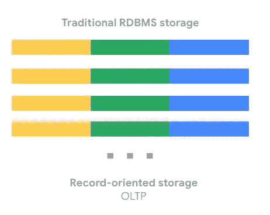
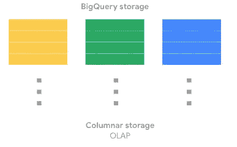
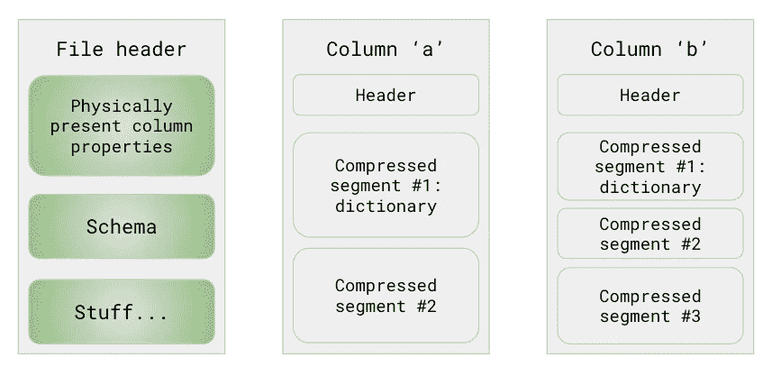
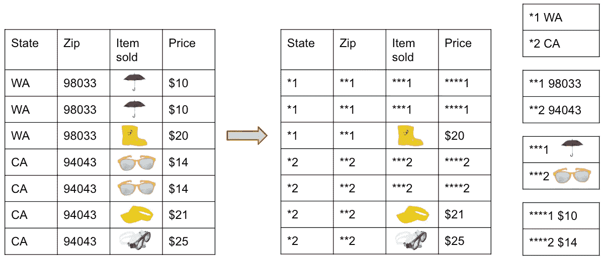
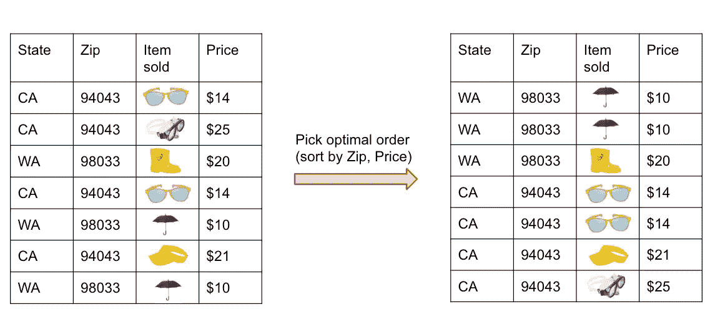
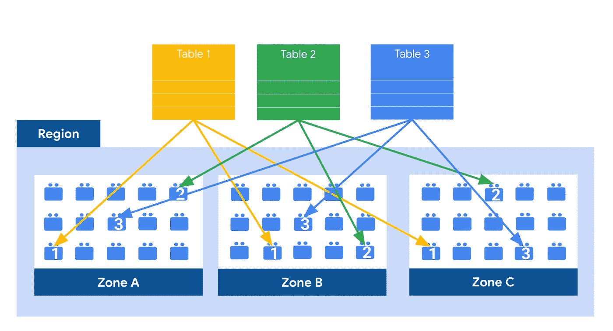
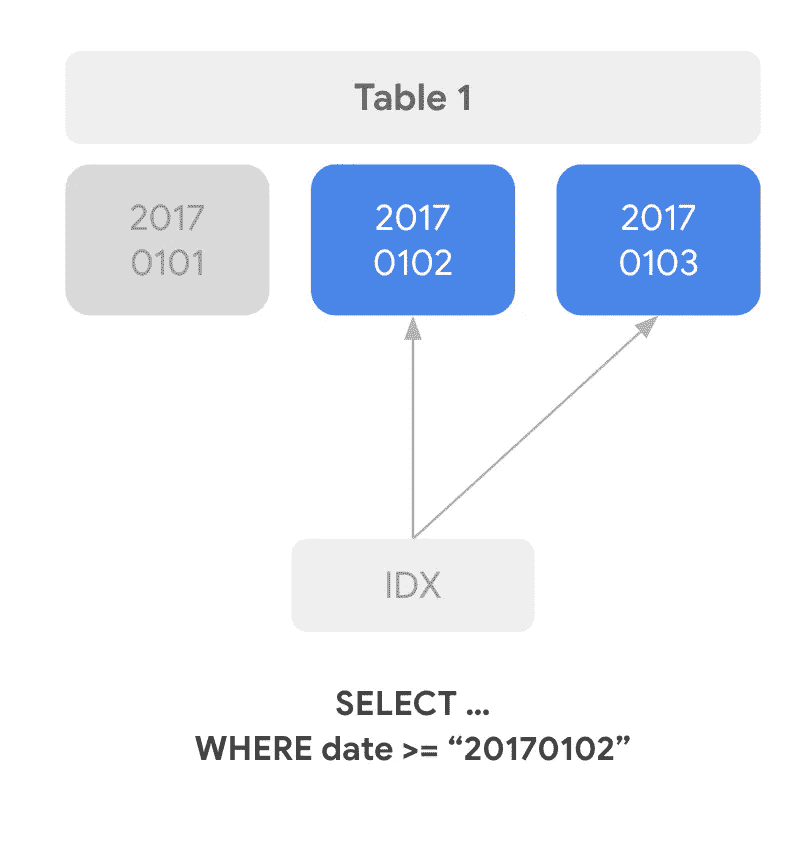
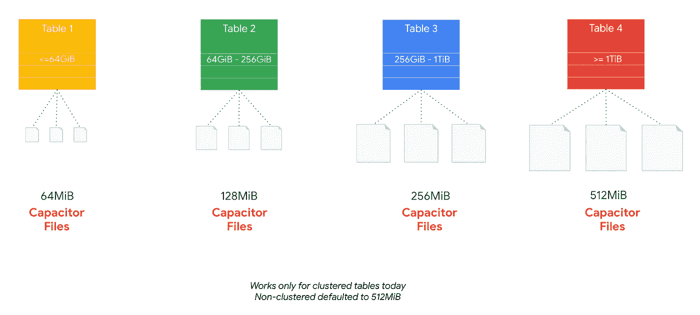

# BigQuery:基础和内部:第 2 部分

> 原文：<https://medium.com/google-cloud/bigquery-basics-internals-part-2-7769f59d01e4?source=collection_archive---------1----------------------->

大查询(谷歌云平台)

# 介绍

在这一系列文章的第一篇文章中，我们已经看到了 BigQuery 的基础知识，以及它如何“适合”我们所有客户的谷歌云平台的数据分析和数据科学生态系统，它是一个在谷歌数据规模上具有分析和机器学习功能的数据仓库，可供我们所有的谷歌云平台客户使用！

在这篇博客文章中，我们将讨论并了解 BigQuery 的后端是如何设计存储的，特别是 [**巨像**](https://cloud.google.com/blog/products/storage-data-transfer/a-peek-behind-colossus-googles-file-system) 文件系统，它在内部是如何工作的，以及我们如何通过使用**分区**和**集群**的方法来充分利用存储，以及其他技巧！

# 引擎盖下的储物！

在幕后，BigQuery 使用 Colossus 来存储数据。然而在巨像的内部，它使用了电容器！让我们先了解一下传统数据库系统是如何处理数据存储的，从而理解电容器到底是什么。

传统的关系数据库，如 Postgres 或 MySQL，按照设计是逐行存储数据的(也称为面向记录的存储)。这使得它们对于在线事务性更新或 OLTP 用例来说非常高效！在谷歌云平台(GCP)上，我们利用云 SQL(我们的托管数据库解决方案)进行大量的事务更新。总的来说，数据的组织如下所示:

OLTP 系统存储概念

另一方面，BigQuery 使用**列**存储，其中每一列都存储在驻留磁盘上的一个单独区域中。存储在磁盘上的数据块被亲切地称为**电容器**。简单来说，capacitor 是 Colossus 系统上存储 BigQuery 数据的文件格式。稍后将详细介绍如何加载数据！

同时，如果我们考虑开发人员和分析师针对 OLTP(事务性)数据库(如 Oracle 和 MySQL)编写和执行的查询，逐行存储数据更明智，不仅因为数据库需要遵守 ACID 原则，还因为它通常更多地用于行级别的批量写入和选择性读取，尽管我们看到客户使用 OLTP 数据库的方式有所不同。例如，世界上确实有一些大公司通过对数据进行适当的索引以及为报告和分析用例创建聚合层，将 Oracle 数据库有效地用于他们所有的 OLTP 和 OLAP 用例。

然而，如果我们有分析用例，(比如)其中，我们想要计算我们在脸书上的追随者的平均年龄，处理这个用例的数据工程师或分析师，将需要读取每个人的所有信息！！如果我们的数据是以行存储格式存储的，那么整个操作将会非常低效，因为我们最终将会读取几乎所有的行！

BigQuery 的列存储(适合 OLAP)

相反，使用面向列的存储，就像我们在 BigQuery 中使用的电容器一样，我们可以只读取特定的“年龄”列！

**重要提示:**记住，这是一个 **SELECT *** 是 BigQuery 中最危险的操作的基本原因。在大型查询数据集上操作时，不仅性能不友好，而且会导致巨大的开销。稍后会有更多关于数据集的内容！

现在，让我们更深入地了解**电容器**及其设计/工作原理！

# 电容器先生！

总的来说，下面的图表提供了如何使用电容器文件格式在 Colossus 的列级存储中存储数据块的概述。

电容格式— BigQuery 数据存储

正如所定义的，**电容器**是一种面向列的格式——这意味着，每个字段的值都是单独存储的，因此总体 I/O 开销(在任何或所有读写操作期间)与您实际读取的字段数成比例！然而，这并不一定表示每一列都在自己的文件中；它只是指定每一列都存储在一个文件块中，该文件块被独立地进一步压缩。

电容器也是自描述的，因此文件本身的信息总是足以完全解码和读取它。这是通过名为**文件头**的组件实现的，如上图所示。

所谓的**文件头**包含所有与文件中出现的列相关的**元数据**细节。这包括但显然不限于每一列的列名、数据类型和其他元数据细节。每一列都有 min/max，BigQuery 查询执行引擎有时会使用它来拒绝整个文件。关于 BigQuery 中查询执行的更多内容将在后面的文章中介绍！

此外，每一列还有**压缩信息**——本质上，BigQuery 使用不同的编码来优化存储。当相关的业务过滤条件在读操作期间被应用到列的顶部时，这是一个巨大的性能捐助者！

现在，让我们快速地看一些例子，看看 BigQuery 是如何完成数据编码的，全部由它自己完成！接下来的内容绝不是所有可能的编码方法的确定列表，而只是出于示例目的的一小部分。

# 列数据的编码

BigQuery 使用的对列数据进行编码的一种常见方式是基于**字典的编码**，其示例如下所示:

编码:字典

实际上发生的是原始数据的存储方式，如上图左侧所示，就像字典一样有组织地存储在内部，如图右侧所示！

也被称为**游程编码**方法，这允许 BigQuery 有效地存储重复的值，因此 BigQuery 将只记录它重复了三次，而不是说*1 三次。

另一个可以考虑的非常常见的方法是**记录重新排序**，这也是 BigQuery 如何在内部组织数据以加快分析操作的另一种方式。

记录重新排序

本质上，这里发生的是，电容器是内部重新排序记录，能够尝试和分组重复的字段，从而使运行长度编码(RLE)方法更成功！

在我们转到 BigQuery 中基于最佳实践的设计模式之前，让我们以简单的术语最终理解实际的物理存储布局来总结 BigQuery 的存储方面。

# 巨像:物理存储模式

总的来说，Colossus 文件系统如下图所示:

巨像文件系统—整体设计

总的来说，如上所述，BigQuery 存储是一个区域性和/或多区域性的服务，这是在创建“数据集”时选择的(即，与 OLTP 数据库中的模式同义，稍后将详细介绍！).GCP 的一个地区被细分为多个区域，因此每个“表”(BigQuery 中的一个数据逻辑实体，就像任何其他数据库一样！)跨多个区域复制，以用于故障转移场景，此时表所属的数据集是使用区域选项创建的。

根据设计，在巨像中，

*   所有数据都被自动压缩、加密、复制和分发。
*   正如我们所知，在谷歌云平台中有许多级别的防御措施来防止未经授权的访问，其中之一就是 100%的数据在静态时都是加密的。
*   Colossus 使用**擦除编码**在多个物理磁盘上存储冗余数据块，从而确保耐用性。

将数据写入 Colossus 后，BigQuery 立即启动地理复制过程，将所有数据镜像到指定区域周围的不同数据中心，以防表所属的数据集是区域性的。

需要考虑的一些关键点如下:

*   在单个区域中，数据仅存储在该区域中。**注意:**在这种情况下，没有 Google Cloud 提供的备份或复制到另一个地区。
*   如果出现机器级别的故障，BigQuery 将继续运行，延迟不超过几毫秒。根据设计，所有查询都应该成功。如果发生分区故障，预计不会丢失数据。
*   软区域故障，例如由停电、变压器损坏或网络分区导致的故障，已经是久经考验的路径，是 BigQuery 所有灾难恢复场景的一部分，由我们的工程和/或 SRE 团队定期进行全面检查。
*   不幸的是，如果由于任何原因发生硬区域故障，例如，如果任何自然或非自然的灾难破坏了该区域，那么如果数据集是作为区域数据集创建的，则该区域中的数据可能会丢失。
*   另一方面，软区域故障将导致可用性损失，直到该区域重新联机，但不会导致数据丢失。

多区域位置(就 Google 云平台而言)是一个很大的地理区域，例如美国(US)或欧洲(EU)，它包含两个或更多地理位置。

*   在 BigQuery 的多区域类型的数据集中，数据存储在单个区域中，但在地理上分离的区域中进行备份，以提供对区域性灾难的恢复能力。
*   BigQuery 完全高效地自动管理恢复和故障转移过程。

**注意:**许多客户将其数据存储在多区域数据集中，以确保自动备份和更好的灾难恢复，但有时，即使从法律或数据隐私的角度来看，为 BigQuery 中的数据集选择单个区域也是更好的选择，其目的是接近本地或 GCP 应用程序工作负载；这样做是为了最小化应用程序和 BigQuery 实例/工作者之间的延迟！

现在，让我们继续讨论 BigQuery 中的一些重要设计模式，它也用于提高分析工作负载的性能。

# 设计模式——分区和集群！

BigQuery 的第一个也是最重要的设计模式是**分区**。当我们(数据工程师)设计数据仓库解决方案时，在我们的 OLAP 数据库系统之上，根据预期查询的访问模式来划分我们的数据通常是一个最佳实践。这提高了系统的性能和可伸缩性，也有助于减少长期的维护开销！

BigQuery —分区示例！

在 BigQuery 中，也鼓励数据工程师和分析师依赖于对存储在表中的数据进行分区，以获得适当的性能水平；这确保了根据过滤条件，只查询数据的选定分区，而不是全部，因此减少了查询执行时间和成本。

但是，分区(或修剪)实际上是如何工作的呢？

对于读取操作:

*   dremel(big query 查询执行引擎)向元数据服务器发送请求，元数据服务器根据 PartitionKey 列(如 WHERE 子句中所述)过滤查询存储集表(只是 Colossus 上存储对象的另一个名称)，最后以 PartitionKey 在请求范围内的存储集列表作为响应。这不是实际的数据读取阶段，而只是我们所说的数据识别阶段。
*   接下来，Dremel 打开存储集内的电容器文件，检查文件中每一列的最小和最大值(可在电容器文件头中找到，记住！).
*   如果[min，max]超出相关范围，它将跳过文件的其余部分，否则将从该文件中读取数据！

对于写操作:

*   来自这些存储文件的元数据将用于确定哪些片段将是相关的。
*   其余的更新操作几乎完全类似于读取操作！

任何 BigQuery 表上可能有两种分区类型:

*   **摄取日期/时间划分:**基于数据加载的日期/时间。为此，我们使用伪列过滤表中的数据: **_PARTITIONDATE** ， **_PARTITIONTIME。**一个示例查询可以是:SELECT col FROM d . t WHERE**_ partition date**>“2018–05–01”
*   **列分区:**基于以下任何列类型对表进行分区:时间戳、日期、日期时间(小时、天、月或年粒度)、INT64(您可以定义范围:开始、结束和间隔)。这里，我们再次使用列名进行过滤，减少扫描的数据。示例:SELECT COUNT(*)FROM d . t WHERE datecol>" 2018–05–01 "

与分区类似，BigQuery 中另一个非常重要的设计模式是**集群**，其中基于多达 4 列的内容，任何给定 BigQuery 表中的数据都可以自动排序，或者由数据工程师选择排序！

但是，以下是关于集群的几点注意事项:

*   集群表不需要分区！如果表分区大小小于 1 GB，我们应该避免分区。
*   是—群集确实可以提高查询速度，因为只扫描相关的数据块(以群集的形式)而不是整个表，可以扫描非常少的数据。
*   某些查询利用集群实现更快的连接。
*   对于 BigQuery 来说，聚集是一种开销非常小的操作，因为适当的数据过滤(基于聚集的列)可以在提高性能的同时降低成本。
*   最后，集群还可以防止由于用户意外查询非常大的整个表而导致的成本激增

**注意:**我们的许多读者会惊讶地知道，BigQuery 还会不时地在后台执行表的自动重新聚类，以固有地对表中的数据进行排序。

# 自适应文件大小

BigQuery 的一个鲜为人知但非常有益的设计特性是，它提供了自适应的文件大小调整功能！

自适应文件大小

**注意:**在撰写本文时，只有集群表被支持或选择用于自动调整文件大小，而我们的 BigQuery 安装中的其余非集群表/数据将默认为 512MB 的块大小。

但是，对于聚集表，BigQuery 会根据表的大小自动调整数据的块大小，以便对较小的数据集进行高效的查询！

**记住:**根据设计，BigQuery 是针对吞吐量而不是延迟进行调优的！

# 结尾注释

在这篇文章中，我们学到了很多相关深度的东西。

作为结束语，值得一提的是，通常情况下，如果我们的查询的访问模式应该首先受益于底层数据的分组和排序，那么分区和集群(一起使用)的适当和良好设计的组合可以极大地提高查询的性能。

因此，最好地利用分区和/或集群的决定不应该是强制性的，而是应该由打算在我们的 BigQuery 设置上运行的查询来决定，以用于分析用例。

在接下来的文章中，我们将进一步详细介绍如何为任何客户项目组织 BigQuery 安装(通常情况下),或者，我们稍后将介绍 BigQuery 迁移主题的一些用例。

快乐学习！！！