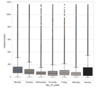

# BigQuery 最佳实践物联网

> 原文：<https://medium.com/google-cloud/bigquery-best-practice-for-iot-7cafc243df7f?source=collection_archive---------1----------------------->

## 谷歌云物联网数据科学最佳实践。

下面是将“数据科学就绪数据”导入 Google BigQuery 的一些要点。

*这主要适用于预测性维护等工业应用，但在这里也有一些有趣的家用例子。*

# 工程要求:

1.  每个传感器都有自己的微秒时间戳(UNIX)。
2.  该设备(拥有多个传感器)也有自己的时间戳。
3.  当设备数据包到达时，服务器会对其进行标记。
4.  上述所有 3 项的原子钟参考(设备在启动时获取)

## 让数据科学家抓狂的 BigQuery 错误:

BigQuery 条目错误

设备时间增加正常

服务器时间跟在 OK 后面

灯光值变化很快(蓝色圆圈)正常

但是传感器 ts(红色圆圈)保持不变

# 问题

实时处理跨越 11 个传感器的并发微秒时间戳(同步到原子钟)在 Linux 中是 [***无望的***](https://www.theregister.co.uk/2019/04/17/kernel_bypassing_by_quobye_tensorflow_plugin_for_faster_machine_learning_file_access/) 但在 RTOS (C /汇编语言)中可以做到。我们使用了商用直升机的一个版本，在该版本中，同步输入至关重要，该版本在 ARM M4 上运行，带有 FPU 和 Crypto:

实时部分独立于 IP Linux 部分

## ***这个为什么重要？***

如果我们不在物联网资源层面*做出努力*与云紧密合作，那么进入谷歌 PubSub = >谷歌数据流的数据将是垃圾。

每个传感器事件的时间戳需要精确，并且彼此同步，否则数据科学家会非常沮丧。

*想象一下，你正在驾驶一辆汽车，却在关注 10 秒钟前的交通动态。你会开车吗？以毫秒计的实时数据和接近实时的分析对于任何被称为“重要”或“紧急”的事情都是至关重要的。*

股票价格、航空、军事情报、能源供应网、医院——但是将来会在网上出现的任何资产呢？

考虑这个价值链中的第一个客户是**数据科学家。**只有他们能告诉产品负责人这些数据可能会带来什么。

# 使用谷歌数据实验室的例子

蓝色显示的噪声分贝水平*(数字整流音频——只有振幅，没有频率；所以没有讲话)*与穿红色衣服的人的热成像很好地相关联。我们可以推断这个人还活着，并且在那个地方做着类似烹饪的事情，而不需要拍摄他们或者偷听他们的声音。

房间中现在有两个传感器，传感器流不能很好地关联

两个数据集中都有大约 200 万个 JSON 读数，并有精确的时间戳。 [*谷歌云物联网系统的成本约为每板每年 4 欧元。*](/google-cloud/how-much-does-iot-on-google-cloud-cost-at-scale-58d7227b1bba)

# 在浴室呆了多久？

一个人在浴室呆了多长时间可以通过精确叠加带有时间戳的热传感器数据点来确定——人的体温留下的印象越强烈，时间越长——类似于长时间曝光的望远镜观察遥远的星星

# 厕所里发生了什么？

在一个小房间里，CO2 随着呼吸开始增加，然后大量排放有机气体，然后抽风机将所有气体去除到一个低得多的水平——所有这些都在 7 分钟内完成。

这个序列然后创建了一个机器学习标签“某人今天成功地去了厕所”——这个*(原谅背景中的瘪四和屁股头窃笑)*实际上是医生和老年患者之间的四大问题之一。机器学习功能可以保护个人隐私。

机器学习马桶的动作(超过 7 分钟的气体组合结合人坐着的热成像(插值算法)。

在同一个厕所位置的振动“峰值”与进入房间(灯打开和关闭)相关联，这使 ML 标签变硬。如果没有时间戳，它将只是一堆信息。 相反我们对一个复杂的人类动作的实时性有 95%的把握。这对于人工智能来说是足够清楚的“理解”。

对于睡觉、吃饭、客厅活动也可以这样做，随着时间的推移，这些活动会产生股价，就像一个人的生活图表一样(有大量有用的[金融分析软件](https://towardsdatascience.com/predicting-stock-prices-with-echo-state-networks-f910809d23d4)可以重新用于准确的医疗保健趋势)。

两天后我会有什么感觉？

想象一下，问一个问题“我妈妈怎么样？”看到她很好，实时地，对未来有预测性的医学洞察力。

她什么都没穿，没有摄像机和麦克风。这种洞察力对关心的亲属有多大价值？或者可能是一个服务试图同时管理一个城市的几十万个病人**？**

**以低成本获得实时数据是一回事。**

**另一个问题是对(数据)进行足够快的分析处理**，同时还要实时处理**，在不到 100 毫秒的延迟内产生大规模结果。**

**这是在生产中[的样子](/@nickord/eon-blockchain-patent-ep3512228-6b403ad0b1dd)。**

# **工厂环境:**

**一周中每天的温度、压力、湿度和有机气体。有机气体中的强异常值表示排放/清洁事件。**

***为了证明安全性和环境合规性，BigQuery 消息可以在源位置使用* [*板载加密*](/google-cloud/how-much-does-iot-on-google-cloud-cost-at-scale-58d7227b1bba) *轻松进行身份验证和哈希处理。***

******

由于天气变化，温度与压力之间的关系更易变** ******

湿度与有机气体(有来自机器清洗液的异常峰值)** 

# **大型办公室:**

****

**在办公室工作超过 12 小时。在 1750 ppm 时，大脑功能显著下降。一些办公室每隔 100 米就有 4 组传感器，我们发现即使在窗户打开后，一氧化碳云也往往沉重地悬挂在角落里。要让氧气回到 400ppm 的一氧化碳基准水平，就要在角落里循环空气。**

****

**同一个办公室，光线从一扇关着的窗户射进来。日出在中午达到顶峰，直到它绕过墙壁。关闭的窗户解释了二氧化碳的增加。椅子等物体移动(加速度计 Z 轴)。人们在 13:00 后参加封闭的办公室会议，表明分贝的降低与振动的减少相关。**

**有关所用 GCP 物联网架构的信息，请查看谷歌云上的[物联网规模](/google-cloud/how-much-does-iot-on-google-cloud-cost-at-scale-58d7227b1bba)**

****这项工作导致了一批** [***专利申请***](/@nickord/eon-blockchain-patent-ep3512228-6b403ad0b1dd)**

# **关键:**

> ***93E3 BEBC C164 D766***
> 
> ***公开可审计身份* [*此处*](https://gist.github.com/NickOrd/ceded6c6c1ada6802f43f5e184341252)**