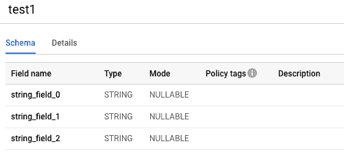
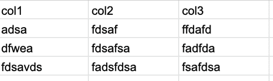
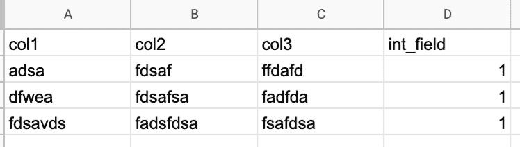
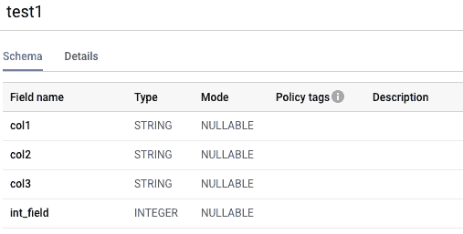
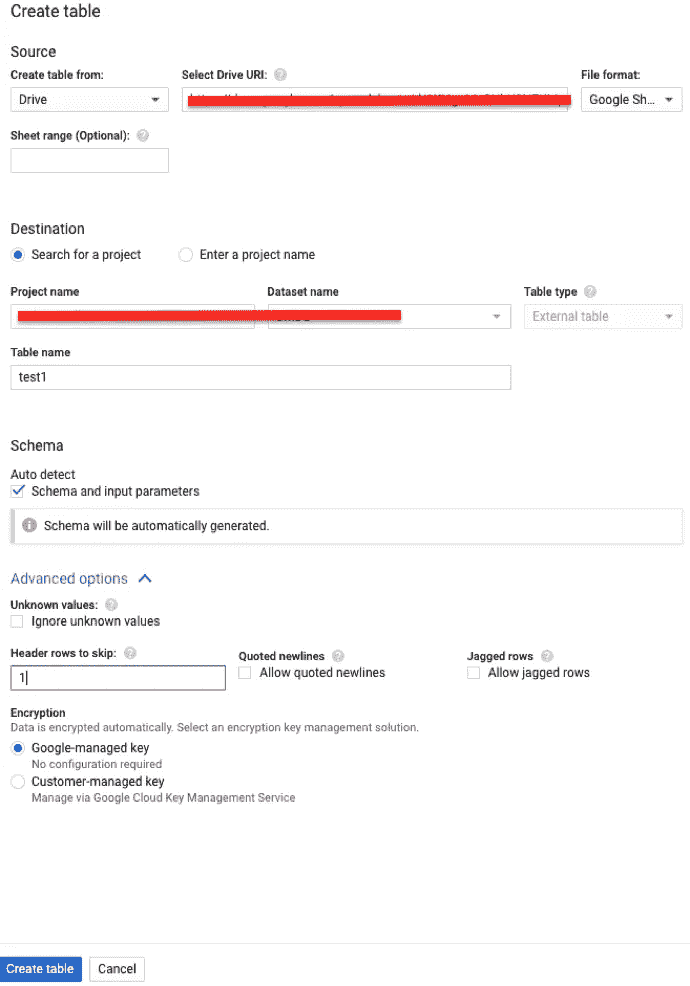

# BigQuery 从 Google Sheets 创建表导致不正确的列名(string_field_0，..)

> 原文：<https://medium.com/google-cloud/bigquery-create-table-from-google-sheets-causing-incorrect-column-names-string-field-0-134f6ecd3fc8?source=collection_archive---------0----------------------->

当您从 Google Sheets 创建一个 BigQuery 表，并得到不正确的列名，如 string_field_x，如下图所示:

大概 Google Sheet 里所有的数据都是字符串类型。比如:

解决这个问题的一个方法是在工作表中添加一个虚拟整数列，如下所示:

然后，您将看到列名被正确识别:

我用来加载这个谷歌表单的选项如下:

然后，您可以通过使用 CTAS 和 except 创建一个新表来删除该列，例如:

将表“project_id.dataset.table”创建为“project_id.dataset.table_ext”中的
SELECT * except(int _ field)