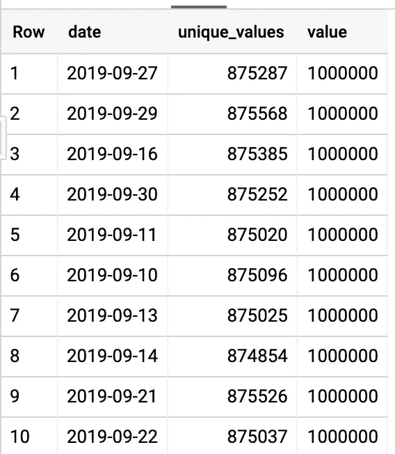
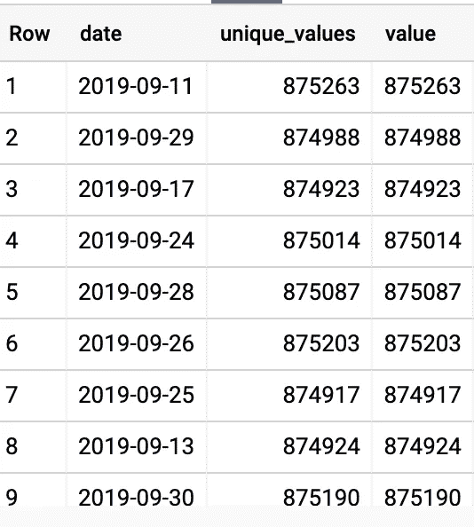
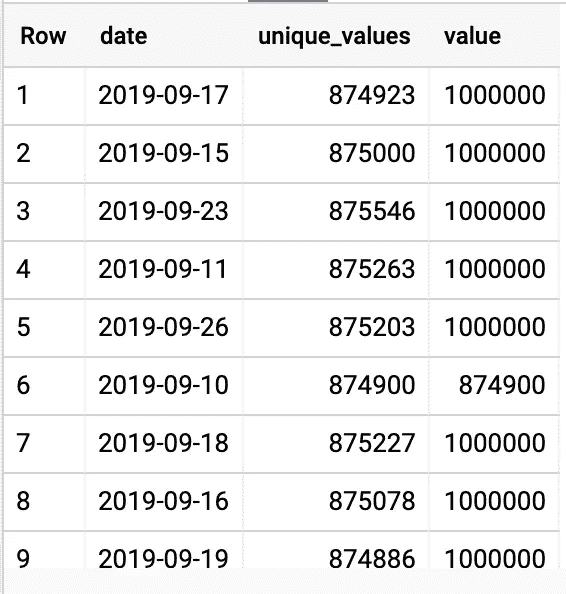

# 大查询重复数据删除

> 原文：<https://medium.com/google-cloud/bigquery-deduplication-14a1206efdbb?source=collection_archive---------0----------------------->

你曾经在 BigQuery 中得到重复的行吗？

我将探索 BigQuery 中针对整个表和按分区进行重复数据删除的一些技术。它假设您有数据集事务。

# 创建您的测试数据

这将创建一个包含两列(date，v)的表。将有 21 天的数据(按日期划分)，每天将有一百万行。值 v 通常是唯一的，但是会有许多重复的值。

## 创建数据

```
CREATE OR REPLACE TABLE `transactions.testdata`
PARTITION BY date
AS SELECT
  date,
  CAST((i*2)+(2-FLOOR(RAND()*4.0)) AS INT64) AS v
FROM
  UNNEST(GENERATE_DATE_ARRAY(
    CURRENT_DATE(),
    DATE_ADD(CURRENT_DATE(), INTERVAL 20 DAY)
  )) AS date
  CROSS JOIN UNNEST(GENERATE_ARRAY(1, 1000000, 1)) AS i;
```

## 检查您的数据

```
SELECT
  date,
  COUNT(DISTINCT v) AS unique_values,
  COUNT(*) AS value
FROM
  `transactions.testdata`
GROUP BY
  1;
```

这些是输出的前十行。



您可以看到(取决于 RAND())有相当多的 unique_values，但总是少于整整一百万。我们想删除重复的。

# 对所有内容进行重复数据消除—简单的方法

最简单的方法是使用 DISTINCT 就地重新创建整个表。您需要对表使用相同的参数(PARTITION BY)。

## 重新创建表格

```
CREATE OR REPLACE TABLE `transactions.testdata`
PARTITION BY date
AS SELECT DISTINCT * FROM `transactions.testdata`;
```

这处理了大约 320MB，消耗了 2 分 15 秒的槽时间。

## 检查您的数据

运行查询以检查数据，结果显示该数据现在已消除重复数据:



但是，如果您有分区，并且您正在追加到您的表，您不希望每次都对整个表进行重复数据删除。相反，您希望只对您的分区进行重复数据删除。但是怎么做呢？

# 对部分表进行重复数据删除—合并

请重新运行该查询，再次创建该表，使其充满重复项。这样，您可以看到部分重复数据消除。

## 使用合并进行重复数据删除

```
MERGE `transactions.testdata` t
USING (
  SELECT DISTINCT *
  FROM `transactions.testdata`
  WHERE date=CURRENT_DATE()
)
ON FALSE
WHEN NOT MATCHED BY SOURCE AND date=CURRENT_DATE() THEN DELETE
WHEN NOT MATCHED BY TARGET THEN INSERT ROW
```

这处理了 15.3MB，消耗了 18 秒的槽时间。由于有 21 天的数据，这是有意义的。

## 检查您的数据

其中一天(即撰写本文时的当前日期)未进行重复数据消除，但其他几天都没有。果然不出所料！



# 结论

在 BigQuery 中，跨整个表或表的一个子集(包括一个分区子集)对行进行重复数据删除非常容易。