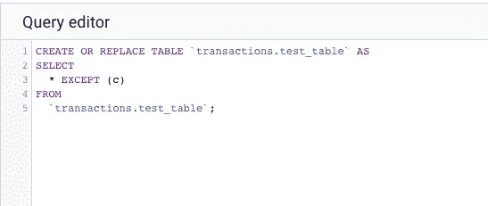

# BigQuery 删除或更改列

> 原文：<https://medium.com/google-cloud/bigquery-drop-or-change-column-43409ae12bc4?source=collection_archive---------0----------------------->

# 更新

BigQuery 的 DDL now **是否支持更改表。请看[这里](https://cloud.google.com/bigquery/docs/managing-table-schemas)。本文的其余部分将向您展示一些替换表格的技巧。然而，替换表格将破坏任何[时间旅行](https://cloud.google.com/bigquery/docs/time-travel)，因此建议使用原生功能，而不是创建或替换表格。**

# 旧内容—改用原生功能

BigQuery DDL 不支持更改表，但支持重写表。你可以用这个来达到同样的效果。



## 创建表格

例如，如果您按如下方式创建一个表:

```
CREATE OR REPLACE TABLE `transactions.test_table` AS
SELECT
  '' AS a,
  1 AS b,
  TRUE AS c
LIMIT
  0;
```

您将有三列(a、b、c ),分别具有不同的类型(字符串、整数、布尔)。

## 将 b 列改为浮点型

```
CREATE OR REPLACE TABLE `transactions.test_table` AS
SELECT
  * EXCEPT (b),
  CAST(b AS FLOAT64) AS b
FROM
  `transactions.test_table`;
```

## 删除列 c

```
CREATE OR REPLACE TABLE `transactions.test_table` AS
SELECT
  * EXCEPT (c)
FROM
  `transactions.test_table`;
```

## 小心点！

截至本文撰写之时，这将**移除任何表历史**，因此要非常小心您正在做的事情。请确保在生产环境中运行之前备份您的关键数据并测试您的 SQL。