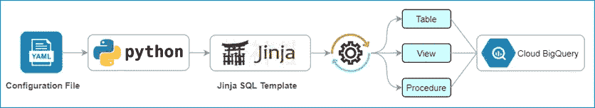

# 使用 Jinja 模板的 BigQuery 动态 SQL

> 原文：<https://medium.com/google-cloud/bigquery-dynamic-sql-using-jinja-template-5c1332317960?source=collection_archive---------0----------------------->

## 使用面向 Python 的 Jinja 模板语言的动态 SQL

创建手工制作的 SQL 既麻烦又耗时。因此，通过有效的自动化流程，我们可以克服这些挑战。Jinja 模板提供了动态生成 SQL 查询的属性和参数，大大节省了时间和精力。这是组织用来提高 SQL 查询的准确性和减少 IT 操作依赖性的最佳技术之一。



您可以执行以下步骤来实现这种自动化。

1.  **步骤 1:** 创建一个配置文件
2.  **步骤 2:** 创建一个 Jinja 模板和宏
3.  **第三步:** Python 源代码

## **配置文件**

配置文件 **(config.yaml)** 包含生成动态 SQL 所需的输入参数，这是唯一需要定制的文件。以下示例描述了单个 BigQuery 视图的创建，但是您可以通过在配置文件中扩展输入参数来一次性创建多个视图。

```
- viewName: mydataset.vw_job_profile
  baseTables:
    - mydataset.emp_profile
    - mydataset.emp_department
    - mydataset.emp_payroll
  joinKey: emp_id
  filterConditions:
    - emp_profile.management_level > 87
    - emp_department.dept_name = 'IT'
    - emp_payroll.year = 2020
  excludeColumns:
    - insert_timestamp
    - update_timestamp
```

## **Jinja 模板和宏**

Jinja 模板 **(sql_template.sql)** 用于动态创建 BigQuery 视图。模板包含变量/表达式，当呈现模板时，这些变量/表达式将被替换为值。

```

CREATE OR REPLACE VIEW {{ params.viewName }}
AS
SELECT
    {{ params.viewColumnList|join(',') }}
FROM
    {{ params.baseTables|join(',') }}
WHERE
    {{ **macro_filter_condition**(params.filterConditions) }}
    
        {{ **macro_join_condition**(params.tableL, params.tableR, params.joinKey)}}
    
```

本解决方案中使用的 Jinja 宏用于设计可重用的 SQL 语句。标签允许跨模板定义可重用的内容片段。

```

  
    AND {{ l_tbl }}.{{ column }} = {{ r_tbl }}.{{ column }}
  

  
    
      {{ tbl_filter }}
    
      AND {{ tbl_filter }}
    
  

```

## 源代码

用于该解决方案的源代码执行多项任务，例如读取配置文件、从 BigQuery 获取元数据以及使用参数呈现 Jinja SQL 模板。

源代码( **main.py** )

```
import yaml
from jinja2 import Environment, FileSystemLoader
from google.cloud import bigqueryconfigList = yaml.safe_load(open("config.yaml"))
env = Environment(loader=FileSystemLoader("./"))
sqlTemplate = env.get_template('sql_template.sql')for tableConf in configList:
    viewName = tableConf['viewName']
    baseTables = tableConf['baseTables']
    joinKey = tableConf['joinKey']
    filterConditions = tableConf['filterConditions']
    excludeColumns = tableConf['excludeColumns'] tableColumnList = **getTableColumns**(baseTables)
    viewColumnList = **getViewColumns**(tableColumnList, excludeColumns) params = {
        'viewName': viewName,
        'baseTables': baseTables,
        'viewColumnList': viewColumnList,
        'filterConditions': filterConditions,
        'tableCount': len(baseTables)
    } if len(baseTables) > 1:
        tableL, tableR = **getTableJoin**(baseTables)
        params['tableL'] = tableL
        params['tableR'] = tableR
        params['joinKey'] = joinKey sqlQuery = sqlTemplate.render(params=params)
    **runSql**(sqlQuery)
```

源代码(**用户自定义模块**)

```
def **getTableColumns**(baseTables):
    client = bigquery.Client()
    columnList = []
    for tables in baseTables:
        datasetName = tables.split(".")[0]
        tableName = tables.split(".")[1]
        tableRef = client.dataset(datasetName).table(tableName)
        table = client.get_table(tableRef)
        for column in table.schema:
            if column.name not in str(columnList):
                columnList.append(tableName + "." + column.name)
    return columnListdef **getViewColumns**(columnList, excludeColumns):
    viewColumns = set(columnList).difference(set(excludeColumns))
    viewColumnList = sorted(list(viewColumns))
    return viewColumnListdef **getTableJoin**(baseTables):
    columnList = []
    for tables in baseTables[1:]:
        tableName = tables.split(".")[1]
        columnList.append(tableName) return baseTables[0].split(".")[1], columnListdef **runSql**(sqlQuery):
    client = bigquery.Client()
    sqlJob = client.query(sqlQuery)
    sqlJob.result()
```

## 源代码库

[https://github.com/soumendra-mishra/jinja-sql-template.git](https://github.com/soumendra-mishra/jinja-sql-template.git)

## 怎么用？

1.  创建动态视图所需的 BigQuery 数据集和基表
2.  从 GitHub 资源库下载源代码
3.  编辑配置文件 **(config.yaml)** 并更改 BigQuery 数据集、表、连接键、过滤条件和排除列
4.  运行 **main.py** 文件