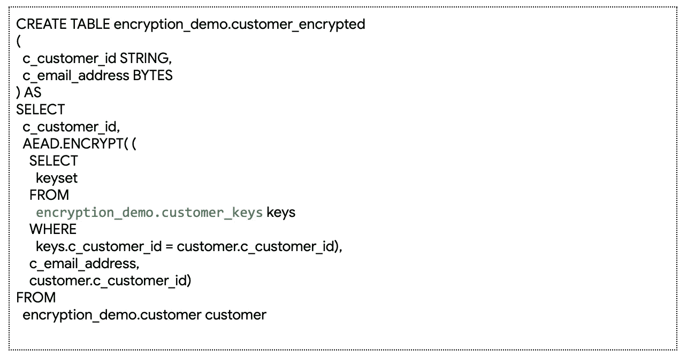

# 大查询加密函数—第一部分:使用加密粉碎的数据删除/保留

> 原文：<https://medium.com/google-cloud/bigquery-encryption-functions-part-i-data-deletion-retention-with-crypto-shredding-7085ecf6e53f?source=collection_archive---------0----------------------->

BigQuery 与其他数据仓库有许多不同的特性——[大规模流式摄取](https://cloud.google.com/bigquery/streaming-data-into-bigquery)、[自动数据存档而不影响性能](https://cloud.google.com/bigquery/pricing#long-term-storage)和[集成机器学习功能](https://cloud.google.com/bigquery/docs/bigqueryml-intro)只是其中的几个。最近，我们发布了 [BigQuery 加密函数](https://cloud.google.com/bigquery/docs/reference/standard-sql/aead_encryption_functions)，它支持一系列广泛而重要的功能，包括我们今天将讨论的内容:使用[加密粉碎](https://en.wikipedia.org/wiki/Crypto-shredding)删除和保留数据。

为什么要从 BigQuery 中删除数据？许多企业在围绕数据保留的法规下运营，例如，GDPR 的[“被遗忘的权利”](https://en.wikipedia.org/wiki/Right_to_be_forgotten)条款规定，用户的数据应在被请求时删除。更具体地说，我们想要实现的是这个场景:

1.  用户数据存储在多个 BigQuery 表中
2.  法规遵从性要求规定，应根据请求从所有表中删除特定用户的数据

因此，让我们快速回顾一下允许您从 BigQuery 中删除数据的两种常见模式:

****删除****

**传统上，这个简单且众所周知的模式使您能够删除数据行。下面的删除查询示例来自我的同事在[上写的一个非常有用的博客，在 BigQuery](https://cloud.google.com/blog/products/gcp/performing-large-scale-mutations-in-bigquery) 中执行大规模突变:**

****

**这里的想法非常简单:使用 delete DML 语句删除符合特定条件的一系列行。**

****创建或替换表格****

**这个模式也非常简单:我们只是从同一个表的结果中重新创建表。在本例中，我们通过过滤需要删除的行来替换表。由于操作是原子性的，我们永远不会遇到替换操作导致不一致结果的情况。**

****

**对于大多数用例，上述两种方法应该足够了。然而，在用户数据跨多个表的初始场景中，我们需要将上述删除模式应用于多个表。这可能不方便，容易出错，或者导致安全问题，特别是如果我们的删除操作无法从一些表中删除，但不能从所有表中删除。如果在大型数据集上运行删除操作，也可能会降低成本效益。**

**一种允许我们一次从所有表中删除数据的方法是[加密粉碎](https://en.wikipedia.org/wiki/Crypto-shredding)。这种技术有助于我们通过以下步骤从所有表中删除特定数据:**

1.  **您的加密和解密密钥是使用 BigQuery 加密函数创建的。**
2.  **您的数据使用该加密密钥进行加密。**
3.  **您的解密密钥被安全地存储并用于解密。**
4.  **一旦有问题的数据被删除，其解密密钥也被删除。**
5.  **以下示例演示了使用 BigQuery 加密函数的上述步骤。**

**首先，我们创建一个表，每个用户有一个惟一的键。**

****

**接下来，我们将使用上一步中创建的密钥来加密和存储用户的电子邮件地址。**

****

**关键的一步是确保所有用户数据，无论在哪个表中，都使用用户的个人密钥进行加密。为了查询加密的表，我们将使用 AEAD。DECRYPT_STRING()函数。**

****

**现在，如果我们想从系统中删除一个用户，我们只需删除该特定用户的加密密钥。**

****

**让我们总结一下这里发生的事情:**

****

***注意:虽然它们超出了本文的讨论范围，但是在应用这种模式时，您需要考虑一些问题:例如，删除密钥后无用加密数据的垃圾收集、密钥轮换以及对读取查询的影响。***

**在 BigQuery 中加密数据允许我们通过删除加密密钥来快速删除用户的所有数据(因为没有它我们永远无法解密用户的数据)。但是让我们更进一步:如果您希望确保数据不仅在 BigQuery 中被删除，而且在数据处理管道中存储数据的任何地方也被删除，该怎么办？**

**在下一篇博文中，我们将带您看一个例子，在这个例子中，您可以通过在 BigQuery 之外加密数据，在所有数据处理组件中应用加密分解，并且在数据进入 BigQuery 之后还能够解密数据。目前我很想在 Twitter 上听到你的消息。我们的开发者倡导者 **Felipe Hoffa:** [我的账户可以访问 BigQuery](https://stackoverflow.com/questions/56122855/how-can-users-prove-a-specific-account-has-access-to-bigquery-aead-encryption) 吗**