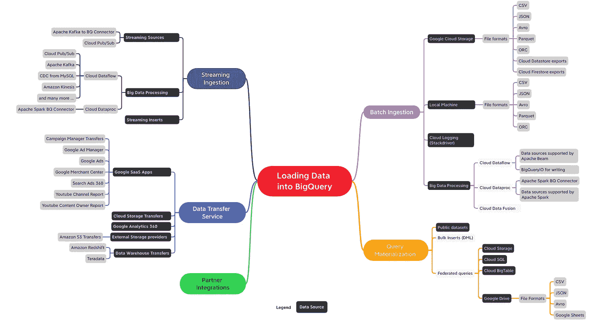

# BigQuery 解释:数据摄取

> 原文：<https://medium.com/google-cloud/bigquery-explained-data-ingestion-cdc26a588d0?source=collection_archive---------0----------------------->

> 在谷歌云博客上关注 BigQuery 解释系列[。有问题或者想聊天？在](https://cloud.google.com/blog/topics/developers-practitioners/bigquery-explained-blog-series)[推特](https://twitter.com/rajesh_thallam)或 [LinkedIn](https://www.linkedin.com/in/rajeshthallam/) 上联系。

在之前的 BigQuery 解释系列中，我们已经回顾了[解耦存储和计算架构](/google-cloud/bigquery-explained-overview-357055ecfda3)如何帮助 BigQuery 无缝扩展。我们研究了 [BigQuery 的存储管理、分区和集群](/google-cloud/bigquery-explained-storage-overview-70cac32251fa)表，以提高查询性能和优化成本。到目前为止，我们只查询或使用了 BigQuery 中已经存在的数据集。在这篇文章中，我们将看到如何将数据加载或接收到 BigQuery 中并对其进行分析。让我们开始吧！

在开始之前，让我们看看将数据加载到 BigQuery 和不加载到 BigQuery 而直接从外部数据源查询之间的区别。

*   **直接导入(托管表):** BigQuery 可以将各种不同格式的数据集直接摄取到其[本机存储中](/google-cloud/bigquery-explained-storage-overview-70cac32251fa)。BigQuery 原生存储完全由 Google 管理，包括复制、备份、扩展大小等等。
*   **不加载查询(外部表)**:使用[联邦查询](https://cloud.google.com/bigquery/external-data-sources)是直接查询外部数据源而不加载到 BigQuery 存储的选项之一。你可以在 Google Sheets、Google Drive、Google Cloud Storage、Cloud SQL 或 Cloud BigTable 等 Google 服务之间进行查询，而不必将数据导入 BigQuery。

一个关键区别是查询外部数据源的性能可能不等同于查询本地 BigQuery 表中的数据。如果优先考虑查询速度，那么将数据装载到 BigQuery 中。联邦查询的性能取决于实际保存数据的外部存储引擎的性能。

# 将数据加载到 BigQuery

有多种方法可以将数据加载到 BigQuery 中，具体取决于数据源、数据格式、加载方法和用例，如批处理、流或数据传输。概括地说，以下是将数据导入 BigQuery 的方法:

*   批量摄入
*   流式摄取
*   数据传输服务
*   查询具体化
*   合作伙伴集成

这里是一个快速地图，带有将数据导入 BigQuery 的选项(*不是一个详尽的列表*)。



将数据加载到 BigQuery 中(单击图像以获得更好的分辨率)

***在本帖中，我们将深入探讨批量摄取，并在较高层次上介绍其他方法。我们将来会有关于其他摄入机制的专门博客文章。***

# 批量摄入

批量接收包括加载大型的、有限的、不需要实时处理的数据集。它们通常以特定的规则频率被摄取，所有数据要么立即到达，要么根本不到达。然后查询摄取的数据以创建报告，或者与包括实时数据在内的其他来源相结合。

> *BigQuery 批量加载作业是免费的。您只需为存储和查询数据付费，而无需为加载数据付费。*

对于批量用例，云存储是存放传入数据的推荐位置。这是一种持久、高度可用且经济高效的对象存储服务。从云存储加载到 BigQuery 支持[多种文件格式](https://cloud.google.com/bigquery/docs/loading-data-cloud-storage#next_steps) — CSV、JSON、Avro、Parquet、ORC。

## 加载压缩或未压缩的文件？

BigQuery 可以从云存储中接收压缩(GZIP)和未压缩的文件。高度并行的加载操作使得未压缩文件的加载速度明显快于压缩文件。由于未压缩文件更大，可能会有带宽限制，存储它们的成本也更高。另一方面，压缩文件传输更快，存储更便宜，但加载到 BigQuery 时速度较慢。根据您的使用情况权衡压缩选项—当客户受到网络速度的限制时，他们通常会选择压缩文件。

## 选择加载数据的文件格式

由于支持多种多样的数据摄取文件格式，有些文件格式自然比其他文件格式更快。以下是将数据加载到 BigQuery 时的文件格式建议:

*   当优化加载速度时，Avro 文件格式是首选。Avro 是一种基于行的二进制格式，可以由包括压缩文件在内的多个插槽并行拆分和读取。
*   拼花地板和 ORC 是二进制和柱形格式。当将数据接收到 BigQuery 中时，需要读取整个记录，因为它们是列格式，所以加载速度比 Avro 慢。
*   压缩的 CSV 和 JSON 的执行速度相对较慢，因为 Gzip 压缩是不可分割的，因此每个压缩文件必须先解压缩，然后才能进行并行处理。

下图根据负载性能对不同格式进行了排名


## 加载方法

将数据加载到 BigQuery 时，可以创建一个新表，或者追加或覆盖现有表。您需要指定表或分区模式，或者，对于支持的数据格式，您可以使用模式[自动检测](https://cloud.google.com/bigquery/docs/schema-detect)。


BigQuery 支持从各种来源以各种格式加载数据。除了云存储等谷歌服务，BigQuery 还支持从亚马逊 S3 等外部存储加载。让我们看看从不同数据源加载这些批处理文件的选项。

## 使用 BigQuery UI 加载

正如您之前看到的，您也可以使用用于检查表和构建查询以加载数据的相同 web UI。一旦有了可以加载到本地机器或云存储上的数据，就可以使用 web UI 将数据加载到目标表中。在 UI 中，您可以启用[模式自动检测](https://cloud.google.com/bigquery/docs/schema-detect)或者明确指定它。更多详情，请参考[快速入门指南](https://cloud.google.com/bigquery/docs/quickstarts/quickstart-web-ui#load_data_into_a_table)。


使用 BigQuery UI 将数据加载到 BigQuery 中

## 使用 CLI — bq 加载

要使用 CLI 将数据加载到 [BigQuery 中，可以使用`bq load`命令。例如，要将 CSV 文件从云存储导入到 BigQuery，请为指向 CSV 文件的多个 URIs 指定云存储 URI 或逗号分隔列表。CLI 支持您在 web UI 中看到的相同选项——模式检测或手动](https://cloud.google.com/bigquery/docs/loading-data-cloud-storage-csv#bq)[指定模式](https://cloud.google.com/bigquery/docs/schemas)，追加或覆盖，以及从本地机器接收文件都是可用的。

```
bq load \
 — source_format=CSV \
 myproject.mydataset.mytable \
 gs://mybucket/mydata.csv \
 ./myschema.json
```

## 使用 REST API 加载

可以从 Java 或 Python 等运行时环境中使用 REST API 与 BigQuery 进行通信。该服务接收 HTTP 请求并返回 JSON 响应。web UI 和 CLI 都使用这个 API 与 BigQuery 通信。例如，看看如何使用 [Python API 将数据](https://cloud.google.com/bigquery/docs/loading-data-cloud-storage-csv#loading_csv_data_into_a_table)从云存储加载到 BigQuery 表中:

除了使用上述工具，您还可以使用以下数据管道选项将数据加载到 BigQuery 中:

> [***云数据流***](https://cloud.google.com/dataflow)

*   Dataflow 是 GCP 上的一项完全托管的服务，使用开源的 Apache Beam API 构建，支持各种数据源 —文件、数据库、基于消息等。使用 Dataflow，您可以使用相同的代码在批处理和流模式下转换和丰富数据。谷歌为批处理作业提供[预建数据流模板](https://cloud.google.com/dataflow/docs/guides/templates/provided-templates)。

> [***云数据报***](https://cloud.google.com/dataproc)

*   Dataproc 是在 GCP 上为 Apache Spark 和 Apache Hadoop 服务提供的完全托管的服务。Dataproc 提供了 [BigQuery 连接器](https://cloud.google.com/dataproc/docs/concepts/connectors/bigquery)，使 Spark 和 Hadoop 应用程序能够处理来自 BigQuery 的数据，并使用其本地术语将数据写入 BigQuery。

> [***云日志***](https://cloud.google.com/logging)

*   这不是一个数据管道选项，但是云日志(以前称为 Stackdriver)提供了一个将日志文件导出到 BigQuery 的选项。请参见[使用日志查看器导出](https://cloud.google.com/logging/docs/export/configure_export)了解更多信息，并参考[指南](https://cloud.google.com/solutions/exporting-stackdriver-logging-for-security-and-access-analytics)关于将日志导出到 BigQuery 进行安全性和访问分析。

## 在幕后

在后台，当 BigQuery 收到将文件加载到其托管存储中的请求时，它会执行以下操作:

*   **编码、压缩和统计:** BigQuery 在分析数据类型、取值频率后，对数据进行最优编码，并以读取大量结构化数据的最优方式对数据进行压缩。
*   **分片:** BigQuery 将数据分配到最佳分片中，并根据表的定义方式将数据加载到特定的分区、集群和重新集群。


*   **加密:**默认情况下，BigQuery 总是在数据写入磁盘之前对其进行加密，不需要您执行任何额外的操作。当被授权用户读取时，数据被自动解密。对于传输中的数据，当它在机器之间传输时，您的数据在 Google 数据中心内是加密的。
*   **地理复制:** BigQuery 自动跨多个数据中心复制数据，这取决于您如何定义您的[数据集位置](https://cloud.google.com/bigquery/docs/locations#data-locations) —区域或多区域。

BigQuery 用户受益于性能、耐用性、效率和可伸缩性的持续改进，而无需停机和升级，因为 BigQuery 不断优化其后端。

# BigQuery 加载作业的要点

> ***批量摄取免费***

*   使用提到的批处理摄取选项将数据加载到 BigQuery 是免费的。然而，[配额和限制](https://cloud.google.com/bigquery/quotas#load_jobs)适用。

> ***负载性能最佳***

*   由于用于加载数据的计算是从共享池中免费提供给用户的，因此 BigQuery 不保证该共享池的性能和可用容量。这由[公平调度器](https://cloud.google.com/bigquery/docs/slots#fair_scheduling_in_bigquery)管理，在可能与其他用户或项目的负载竞争的负载作业之间分配资源。装载作业的配额已经到位，以将影响降至最低。

**提示:**为了保证任何关键负载的摄取速度，您可能想要购买专用的插槽(预留)，并[将管道作业](https://cloud.google.com/bigquery/docs/reservations-intro#assignments)分配给它们。更多关于预订的信息将在以后的博客中发布。

> ***加载作业不消耗查询能力***

*   用于查询数据的插槽不同于用于接收的插槽。因此，数据接收不会影响查询性能。

> [***酸***](https://en.wikipedia.org/wiki/ACID) ***语义***

*   对于通过`bq load`命令加载的数据，查询要么反映所有数据的存在，要么不反映任何数据。查询从不扫描部分数据。

# 流式摄取

流接收支持需要使用接近实时的控制面板和查询来分析大量连续到达的数据的使用情形。跟踪移动应用事件就是这种模式的一个例子。应用程序本身或支持其后端的服务器可以记录用户与事件摄取系统(如 [Cloud Pub/Sub](https://cloud.google.com/pubsub) )的交互，并使用数据管道工具(如 Cloud Dataflow)将它们传输到 BigQuery，或者您可以使用云功能来处理少量事件。然后，您可以分析这些数据以确定总体趋势，例如高交互或问题区域，并实时监控错误情况。

BigQuery 流接收允许您通过使用`[tabledata.insertAll](https://cloud.google.com/bigquery/docs/reference/rest/v2/tabledata/insertAll)`方法将数据一次一条记录地传输到 BigQuery 中。API 允许来自多个生产者的不协调的插入。在第一个流插入的几秒钟内，就可以立即从流缓冲区查询摄取的数据。但是，数据可能需要 90 分钟才能用于拷贝和导出操作。你可以阅读我们关于[流插入](https://cloud.google.com/blog/products/gcp/life-of-a-bigquery-streaming-insert)如何工作的博客文章和我们的[文档](https://cloud.google.com/bigquery/streaming-data-into-bigquery)了解更多信息。

在 Google 云平台上摄取实时数据的一种常见模式是使用云数据流管道从云发布/订阅主题中读取消息，该管道以流模式运行，并在所需的处理完成后写入 BigQuery 表。云数据流管道最好的部分是，你也可以重用相同的代码进行流处理和批处理，谷歌将管理启动、运行和停止计算资源的工作，以并行处理你的管道。这个[参考架构](https://cloud.google.com/solutions/mobile/mobile-gaming-analysis-telemetry#streaming_pipeline)非常详细地涵盖了用例。


请注意，除了云数据流，您还可以选择将数据传输到 BigQuery。例如，您可以在 Apache Spark 中编写流管道，并使用[Apache Spark big query Connector](https://github.com/GoogleCloudDataproc/spark-bigquery-connector)在 Hadoop 集群(如 Cloud Dataproc)上运行。您还可以在任何客户端库中调用[流 API](https://cloud.google.com/bigquery/streaming-data-into-bigquery#streaminginsertexamples) 将数据流式传输到 BigQuery。

# 数据传输服务

BigQuery [数据传输服务](https://cloud.google.com/bigquery-transfer/docs/transfer-service-overview) (DTS)是一项完全托管的服务，可从谷歌广告等谷歌 SaaS 应用、亚马逊 S3 等外部云存储提供商接收数据，并从 Teradata 和亚马逊 Redshift 等数据仓库技术传输数据。DTS 在计划和管理的基础上自动将数据移入 BigQuery。DTS 可用于数据回填，以从任何中断或间隙中恢复。

可以将数据传输服务看作是一种轻松的数据交付服务，可以将数据从应用程序导入到 BigQuery。

# 查询具体化

当您在 BigQuery 中运行查询时，它们的结果集可以被物化以创建新表。在关于分区和集群的[上一篇文章](/google-cloud/bigquery-explained-storage-overview-70cac32251fa)中，我们已经看到了这种模式，我们从栈溢出公共数据集的查询结果中创建了新表。

查询结果物化是简化 BigQuery 中的 [ETL](https://en.wikipedia.org/wiki/Extract,_transform,_load) (提取、转换和加载)或 [ELT](https://en.wikipedia.org/wiki/Extract,_load,_transform) (提取、加载和转换)模式的一个很好的方法。例如，当使用 BigQuery 中的[联邦查询对云存储中的文件执行探索性工作或原型制作时，您可以将这些分析结果保存在 BigQuery 中以获得任何见解。请注意，您需要为查询读取的字节数和表写入后存储在 BigQuery 存储中的字节数付费。](https://cloud.google.com/bigquery/external-data-cloud-storage)

# 不加载数据的查询

正如本文开头所提到的，在以下情况下，您不需要在运行查询之前将数据加载到 BigQuery 中:

*   **公共数据集:**公共数据集是存储在 BigQuery 中并与公众共享的数据集。更多信息请参见 [BigQuery 公共数据集](https://cloud.google.com/bigquery/public-data)。
*   **共享数据集:**可以共享存储在 BigQuery 中的数据集。如果有人与您共享数据集，您可以在该数据集上运行查询，而无需加载数据。
*   **外部数据源(联邦):**您可以通过基于[外部数据源](https://cloud.google.com/bigquery/external-data-sources)创建一个表来跳过数据加载过程。

# 合作伙伴集成

除了 BigQuery 自带的解决方案之外，您还可以查看来自 [Google Cloud partners](https://cloud.google.com/bigquery#section-11) 的数据集成选项，他们已经将其业界领先的工具与 BigQuery 进行了集成。

# 接下来呢？

在本文中，我们学习了基于您的用例将数据放入 BigQuery 的不同方法。具体来说，我们深入研究了将批量数据源和格式摄取到 BigQuery 中，粗略了解了流摄取、数据传输服务和查询外部数据源，而无需将数据加载到 BigQuery 中。

*   查看[视频](https://www.youtube.com/watch?v=Abzj-Vyhi74)批量加载 CSV 数据，并在 BigQuery 中分析数据。
*   了解关于将数据加载到 BigQuery 的更多信息
*   尝试这个 [codelab](https://codelabs.developers.google.com/codelabs/gcp-aws-bigquery/index.html) 将文件从 Google 云存储摄取到您的 [BigQuery 沙箱](https://cloud.google.com/bigquery/docs/sandbox)上的 BigQuery

BigQuery 聚焦:将数据加载到 BigQuery

在下一篇文章中，我们将研究在 BigQuery 和模式设计中查询数据。在接下来的文章中，我们将深入探讨其他摄取机制——流媒体和数据传输服务。

敬请关注。感谢您的阅读！有问题或者想聊天？在推特或 LinkedIn 上找到我。

*感谢* [*尤里*](/@thegrinch) *和* [*艾丽西娅·威廉姆斯*](/@presactlyalicia) *对帖子的帮助。*