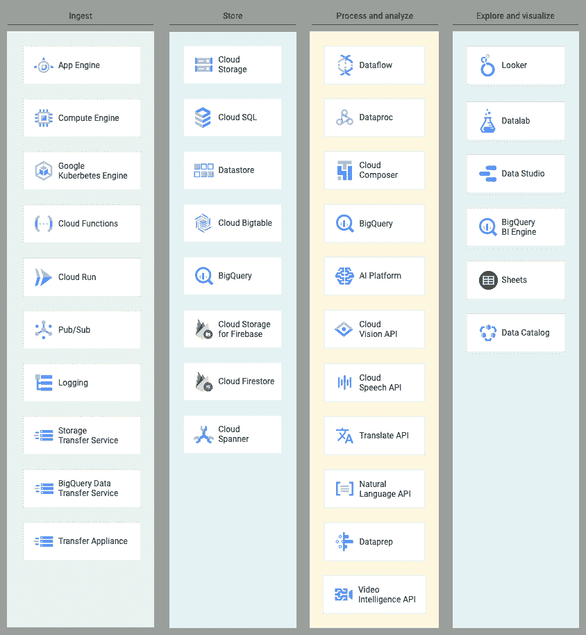
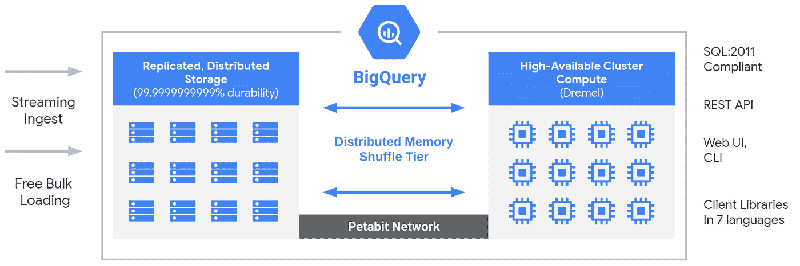
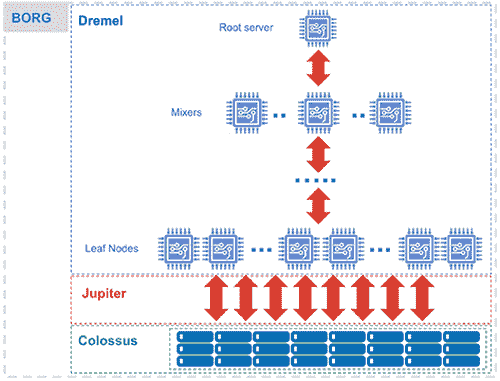
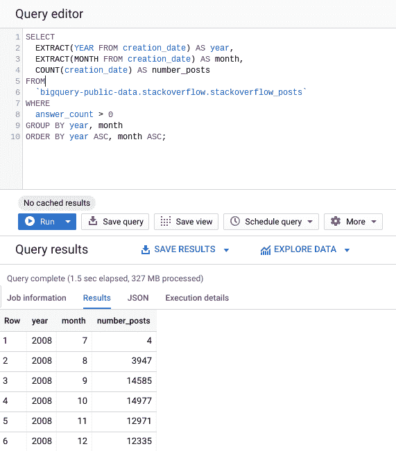

# 新博客系列- BigQuery 解释:概述

> 原文：<https://medium.com/google-cloud/bigquery-explained-overview-357055ecfda3?source=collection_archive---------0----------------------->

> 在谷歌云博客上关注 BigQuery 解释系列[。有问题或者想聊天？在](https://cloud.google.com/blog/topics/developers-practitioners/bigquery-explained-blog-series)[推特](https://twitter.com/rajesh_thallam)或 [LinkedIn](https://www.linkedin.com/in/rajeshthallam/) 上联系。

Google BigQuery 于 2011 年发布，此后一直被定位为一种独特的分析数据仓库服务。它的无服务器体系结构允许它以一定的规模和速度运行，以便在大型数据集上提供令人难以置信的快速 SQL 分析。自其问世以来，已经进行了大量的特性和改进，以提高性能、安全性和可靠性，并使用户更容易发现真知灼见。

在这第一篇文章中，我们将看看数据仓库如何改变业务决策，BigQuery 如何解决传统数据仓库的问题，并深入探讨 BigQuery 架构的高级概述以及如何快速入门 BigQuery。

# 数据仓库如何驱动业务决策？

数据仓库整合来自不同来源的数据，并对汇总的数据进行分析，通过提供洞察力为业务运营增值。在过去二十年中，数据仓库是企业中最重要的业务数据的保管者。随着企业日益成为数据驱动型企业，数据仓库在其数字化转型之旅中扮演着越来越重要的角色。根据 Gartner 的报告，数据仓库通常是企业分析战略的基础。数据仓库用例已经超越了传统的运营报告。如今，企业需要:

1.  从 360⁰的角度看待他们的业务:数据是有价值的。随着存储和数据处理成本的降低，企业希望处理、存储和分析组织内部和外部的所有相关数据集。
2.  **根据情况了解并响应实时业务事件:**企业需要从实时事件中获得洞察力，而不是等待几天或几周来分析数据。数据仓库需要随时反映业务的当前状态
3.  **缩短洞察时间:**企业需要快速启动并运行，而无需等待数天或数月。用于安装或配置硬件或软件。
4.  **为业务用户提供洞察，以支持整个企业的数据驱动决策:**为了拥抱数据驱动的文化，企业需要实现数据访问的民主化。
5.  **保护他们的数据并管理其使用:**数据需要是安全的，并且可以被企业内外的相关人员访问。

随着数据量的增长，企业希望扩大对传统数据仓库的使用，他们面临着巨大的挑战，因为由于[更高的 TCO(总拥有成本)](https://cloud.google.com/blog/products/data-analytics/migrating-your-traditional-data-warehouse-platform-to-bigquery-announcing-the-data-warehouse-migration-offer)，他们的成本继续失控。传统的数据仓库不是为处理数据的爆炸式增长而设计的，当然也不是为新兴的数据处理模式而构建的。

# BigQuery -云数据仓库

Google BigQuery 被设计成一个“云原生”数据仓库。它旨在满足云优先世界中数据驱动型组织的需求。

BigQuery 是 GCP 的无服务器、高度可扩展且经济高效的云数据仓库。它允许使用谷歌基础设施的处理能力进行 Pb 级的超快速查询。因为没有可供客户管理的基础架构，他们可以使用熟悉的 SQL 专注于发现有意义的见解，而不需要数据库管理员。这也很经济，因为他们只为他们使用的处理和存储付费。

# BigQuery 在数据生命周期中处于什么位置？

BigQuery 是谷歌云综合数据分析平台的一部分，该平台覆盖了整个分析价值链，包括摄取、处理和存储数据，以及高级分析和协作。BigQuery 与 GCP 分析和数据处理产品深度集成，允许客户建立企业级云原生数据仓库。

在数据生命周期的每个阶段，GCP 提供多种服务来管理数据。这意味着客户可以选择一套适合其数据和工作流的服务。

**图:**数据生命周期中的 big query[[来源](https://cloud.google.com/solutions/data-lifecycle-cloud-platform)

# 将数据接收到 BigQuery 中

BigQuery 支持多种方式将数据接收到其管理的存储中。具体的摄取方法取决于数据的来源。例如，GCP 的一些数据源，如 Cloud [Logging](https://cloud.google.com/logging/docs/export/configure_export_v2) 和 [Google Analytics](https://support.google.com/analytics/answer/3416092) ，支持直接导出到 BigQuery。

[BigQuery 数据传输服务](https://cloud.google.com/bigquery-transfer/docs/transfer-service-overview)支持从谷歌 SaaS 应用程序(谷歌广告、云存储)、亚马逊 S3 和其他数据仓库(Teradata、Redshift)向 BigQuery 传输数据。

流数据，如日志或物联网设备数据，可以使用[云数据流](https://cloud.google.com/dataflow/docs/guides/templates/provided-streaming#cloudpubsubtobigquery)管道、[云数据链](https://cloud.google.com/solutions/using-apache-spark-dstreams-with-dataproc-and-pubsub)作业或直接使用 [BigQuery 流摄取 API](https://cloud.google.com/bigquery/streaming-data-into-bigquery) 写入 BigQuery。

# 大查询架构

BigQuery 的无服务器架构将存储和计算分离，允许它们按需独立扩展。这种结构为客户提供了巨大的灵活性和成本控制，因为他们不需要让昂贵的计算资源一直保持运行。这与传统的基于节点的云数据仓库解决方案或本地大规模并行处理(MPP)系统非常不同。这种方法还允许任何规模的客户将他们的数据放入数据仓库，并开始使用标准 SQL 分析他们的数据，而不用担心数据库操作和系统工程。

大查询架构

在幕后，BigQuery 采用了大量由底层谷歌基础设施技术驱动的多租户服务，如 Dremel、Colossus、Jupiter 和 Borg。

BigQuery:引擎盖下[ [来源](https://cloud.google.com/blog/big-data/2016/01/bigquery-under-the-hood)

> Compute 是 [Dremel](https://research.google.com/pubs/pub36632.html) ，一个执行 SQL 查询的大型多租户集群。

*   Dremel 将 SQL 查询转换成执行树。树叶被称为插槽，负责从存储器中读取数据和任何必要的计算。树的分支是“混合器”，它执行聚合。
*   Dremel 根据需要动态地为查询分配插槽，为来自多个用户的并发查询保持公平性。单个用户可以获得数千个槽来运行他们的查询。

> 存储是谷歌的全球存储系统。

*   BigQuery 利用[列存储格式](https://cloud.google.com/blog/products/gcp/inside-capacitor-bigquerys-next-generation-columnar-storage-format)和压缩算法在 Colossus 中存储数据，为读取大量结构化数据进行了优化。
*   Colossus 还处理复制、恢复(当磁盘崩溃时)和分布式管理(因此没有单点故障)。Colossus 允许 BigQuery 用户无缝扩展到数十 Pb 的数据存储，而无需像在传统数据仓库中那样附加昂贵得多的计算资源。

> 计算和存储通过千兆比特[木星](https://cloudplatform.googleblog.com/2015/06/A-Look-Inside-Googles-Data-Center-Networks.html)网络相互交流。

*   介于存储和计算之间的是“shuffle ”,它利用谷歌的 Jupiter 网络以极快的速度将数据从一个地方转移到另一个地方。

> BigQuery 是通过谷歌的前身 [Kubernetes](https://kubernetes.io/) 的 [Borg](https://research.google.com/pubs/pub43438.html) 编排的。

*   混音器和插槽都由 Borg 运行，它分配硬件资源。

谷歌非常重视不断改进这些技术。BigQuery 用户受益于性能、耐用性、效率和可伸缩性的持续改进，而没有与传统技术相关的停机和升级。如果您对 BigQuery 架构的更多细节感兴趣，请查看这篇文章[中更完整的 BigQuery 拓扑图。](/google-cloud/the-12-components-of-google-bigquery-c2b49829a7c7)

# 如何开始使用 BigQuery？

只需加载数据并运行 SQL 命令，就可以开始使用 BigQuery。不需要构建、部署或供应集群；无需调整虚拟机、存储或硬件资源的规模；无需设置磁盘、定义复制、配置压缩和加密，或者构建传统数据仓库所需的任何其他设置或配置工作..

为了帮助您开始使用 BigQuery， [**BigQuery 沙盒**](https://cloud.google.com/bigquery/docs/sandbox) **让您免费使用 BigQuery** 的强大功能，它提供 10GB 的免费存储空间和每月 1TB 的查询数据分析。观看这一集的 [BigQuery Spotlight](https://www.youtube.com/playlist?list=PLIivdWyY5sqLAbIdmcMwsxWg-w8Px34MS) 来了解如何建立一个 BigQuery 沙箱，允许您在不需要信用卡的情况下运行查询。

[BigQuery Spotlight:使用 BigQuery 沙箱](https://www.youtube.com/watch?v=StEuT-pntZQ)

您可以通过多种方式访问 BigQuery:

*   使用 [GCP 控制台](https://cloud.google.com/bigquery/docs/quickstarts/quickstart-web-ui)
*   使用[命令行工具](https://cloud.google.com/bigquery/docs/quickstarts/quickstart-command-line) `bq`
*   调用 [BigQuery REST API](https://cloud.google.com/bigquery/docs/reference/rest/)
*   使用各种[客户端库](https://cloud.google.com/bigquery/docs/quickstarts/quickstart-client-libraries)如 Java、。NET 还是 Python

让我们现在试一试。导航到 Google Cloud 控制台上的 [BigQuery web UI](https://console.cloud.google.com/bigquery) ，复制并粘贴以下查询，然后点击“运行”按钮。

该查询处理从 2008 年到 2016 年在 [public BigQuery datasets，](https://cloud.google.com/bigquery/public-data/)中可用的约 30GB stack overflow 帖子，以找到至少发布了一个答案的帖子的数量，按年份和月份分组。

从查询结果可以看出，分析 28GB 的数据并返回结果只需要不到 2 秒的时间。BigQuery 引擎很聪明，它只读取执行查询所需的列，并且只处理整个 28GB 数据集中的 327MB 数据。

用户能够无缝扩展到数十 Pb，因为 BigQuery 工程师已经部署了达到这一规模所需的资源。因此，扩展只是更多地使用 BigQuery，而不是提供更大的集群。当然，您需要记住最佳实践和使用配额，我们将在本系列的后面讨论这些。

# 对大型数据集使用 BigQuery

为了演示 BigQuery 如何处理一个非常大的数据集，[请观看 Jordan Tigani](https://www.youtube.com/watch?time_continue=342&v=eOQ3YJKgvHE&feature=emb_logo)[的演讲](https://twitter.com/jrdntgn?lang=en)，他在几秒钟内分析了 BigQuery 中大约 1PB 的数据集，以及多年来为提高 BigQuery 性能所做的改进。

[使用 BigQuery 的现代数据仓库(Cloud Next’19)](https://www.youtube.com/watch?v=eOQ3YJKgvHE)

# 下一步是什么？

在本文中，我们回顾了 BigQuery 在数据生命周期中的位置，是什么使得 BigQuery 快速且可伸缩，以及如何开始使用 BigQuery。

*   [开始使用 BigQuery 沙箱](https://cloud.google.com/bigquery/docs/sandbox)
*   用你的 BigQuery 沙箱来试试这个 codelab，使用 BigQuery 来[查询 github 数据](https://codelabs.developers.google.com/codelabs/bigquery-github/index.html)

在即将发布的这一系列帖子中，我们将探讨 BigQuery 存储和接收选项、基本和高级查询、可视化查询结果、保护数据、管理成本、BigQuery 优化和性能最佳实践以及新的 BigQuery 特性。

敬请关注。感谢您的阅读！有问题或者想聊天？在[推特](https://twitter.com/rajesh_thallam)或 [LinkedIn](https://www.linkedin.com/in/rajeshthallam/) 上找到我。

*感谢* [*尤里*](/@thegrinch) *和* [*艾丽西娅·威廉姆斯*](/@presactlyalicia) *对帖子的帮助。*