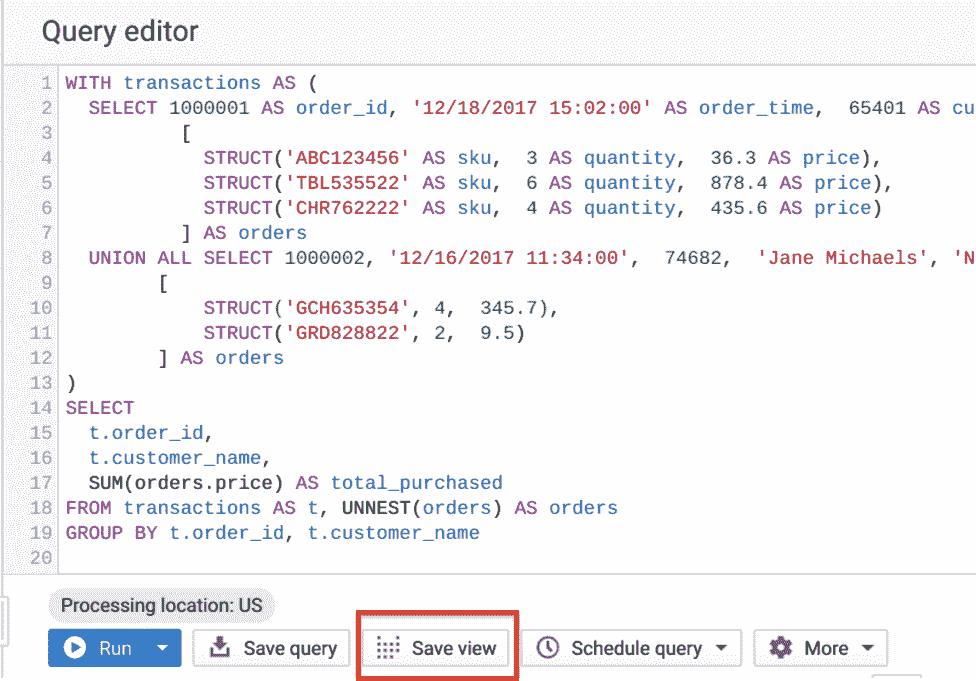

# BigQuery 解释:查询您的数据

> 原文：<https://medium.com/google-cloud/bigquery-explained-querying-your-data-9e017f2714a3?source=collection_archive---------0----------------------->

> 在谷歌云博客上关注 BigQuery 解释系列[。有问题或者想聊天？在](https://cloud.google.com/blog/topics/developers-practitioners/bigquery-explained-blog-series)[推特](https://twitter.com/rajesh_thallam)或 [LinkedIn](https://www.linkedin.com/in/rajeshthallam/) 上联系。

在之前的 BigQuery 解释中，我们回顾了 [BigQuery 架构](/google-cloud/bigquery-explained-overview-357055ecfda3)、[存储管理](/google-cloud/bigquery-explained-storage-overview-70cac32251fa)和[将数据接收到 BigQuery](/google-cloud/bigquery-explained-data-ingestion-cdc26a588d0) 。在这篇文章中，我们将介绍使用 [SQL](https://en.wikipedia.org/wiki/SQL) 在 BigQuery 中查询数据集，保存和共享查询，创建视图和物化视图。我们开始吧！

# 标准 SQL

BigQuery 支持两种 SQL 方言:[标准 SQL](https://cloud.google.com/bigquery/sql-reference/index?hl=sv) 和[遗留 SQL](https://cloud.google.com/bigquery/query-reference?hl=sv) 。标准 SQL 是查询存储在 BigQuery 中的数据的首选，因为它符合 ANSI SQL 2011 标准。与传统 SQL 相比，它还有其他优势，比如针对连接操作的自动谓词下推和对相关子查询的支持。更多信息，请参考[标准 SQL 突出显示](https://cloud.google.com/bigquery/docs/reference/standard-sql/migrating-from-legacy-sql?hl=sv#standard_sql_highlights)。

当您在 BigQuery 中运行 SQL 查询时，它会自动创建、调度和运行查询作业。BigQuery 以两种模式运行查询作业:*交互式*(默认)和*批处理*。

*   [***交互(按需)查询***](https://cloud.google.com/bigquery/docs/running-queries#queries) 尽快执行，这些查询计入[并发率限额和每日限额](https://cloud.google.com/bigquery/quotas#query_jobs)。
*   [***批处理查询***](https://cloud.google.com/bigquery/docs/running-queries#batch) 一旦 BigQuery 共享资源池中有空闲资源，就会排队并启动，这通常发生在几分钟之内。如果 BigQuery 在 24 小时内没有启动查询，作业优先级将更改为交互式。批量查询不计入您的并发率限制。它们使用与交互式查询相同的资源。

除非另有说明，本文中的查询遵循标准 SQL 方言，并以交互模式运行。

## BigQuery 表类型

BigQuery 中的每个表都由描述列名、数据类型和其他元数据的模式定义。BigQuery 支持以下表类型:


BigQuery 表类型

## 大查询模式

在 BigQuery 中，模式是在表级别定义的，并为数据提供结构。模式描述列定义及其名称、数据类型、描述和模式。

*   [数据类型](https://cloud.google.com/bigquery/docs/reference/standard-sql/data-types)可以是简单的数据类型，比如整数，也可以是更复杂的，比如`ARRAY`和`STRUCT`用于嵌套和重复的值。
*   [列模式](https://cloud.google.com/bigquery/docs/schemas#modes)可以是`NULLABLE`、`REQUIRED`或`REPEATED`。

将数据加载到表中或创建空表时，会指定表架构。或者，在加载数据时，您可以使用模式[自动检测](https://cloud.google.com/bigquery/docs/schema-detect#auto-detect)用于[自描述源数据格式](https://cloud.google.com/bigquery/docs/loading-data-cloud-storage-parquet#parquet_schemas)，例如 Avro、Parquet、ORC、Cloud Firestore 或 Cloud Datastore 导出文件。模式可以手动定义[或者在如图所示的](https://cloud.google.com/bigquery/docs/schemas#manually_specifying_schemas) [JSON 文件](https://cloud.google.com/bigquery/docs/schemas#specifying_a_json_schema_file)中定义。

```
[
 {
   "description": "[DESCRIPTION]",
   "name": "[NAME]",
   "type": "[TYPE]",
   "mode": "[MODE]"
 },
 {
   "description": "[DESCRIPTION]",
   "name": "[NAME]",
   "type": "[TYPE]",
   "mode": "[MODE]"
 }
]
```

# 使用 SQL 进行分析

现在让我们使用 SQL 分析一个与 NCAA 篮球比赛和球员相关的公共 BigQuery 数据集。游戏数据涵盖了自 2009 年以来的每一场比赛和票房成绩。我们将关注 2014 赛季肯塔基野猫队和圣母大学战斗爱尔兰队之间的一场具体比赛。这场比赛有一个激动人心的结局。让我们来看看是什么让它如此激动人心！

在你的 [BigQuery 沙箱](https://cloud.google.com/bigquery/docs/sandbox)上，从公共数据集中打开 [NCAA 篮球数据集](https://console.cloud.google.com/marketplace/details/ncaa-bb-public/ncaa-basketball)。单击“查看数据集”按钮，在 BigQuery web UI 中打开数据集。


导航到`**ncaa_basketball**`数据集下的表`**mbb_pbp_sr**`以查看模式。此表包含 2013–2014 赛季所有男子篮球比赛的详细信息，表中的每一行代表一场比赛中的单个事件。


导航 BigQuery UI

查看`**mbb_pbp_sr**`表的细节部分。大约有 400 万个游戏事件，总容量大约为 3GB。


让我们运行一个查询来过滤我们感兴趣的游戏的事件。该查询从`**mbb_pbp_sr**`表中选择以下列:

*   `game_clock`:比赛结束前剩余的时间
*   `points_scored`:在一个事件中得分
*   `team_name`:得分队伍名称
*   `event_description`:事件描述
*   `timestamp`:事件发生的时间

该查询所做工作的明细:

*   `**SELECT**`语句检索表中的行和指定的列`**FROM**`
*   `**WHERE**`子句过滤由`SELECT`返回的行。该查询过滤返回我们感兴趣的特定游戏的行。
*   `**ORDER BY**` 语句控制结果集中各行的顺序。这个查询按照时间戳以降序对来自`SELECT`的行进行排序。
*   最后，`**LIMIT**`限制了查询返回的数据量。对行进行排序后，该查询从结果集中返回 10 个事件。注意，添加`[LIMIT](https://cloud.google.com/bigquery/docs/best-practices-costs#limit_doesn%E2%80%99t_affect_cost)` [不会减少查询引擎处理的数据量](https://cloud.google.com/bigquery/docs/best-practices-costs#limit_doesn%E2%80%99t_affect_cost)。

现在让我们看看结果。


从分析中查询结果

从结果来看，在比赛还剩 6 秒的时候，球员安德鲁·哈里森两罚全中，得了 2 分。这并不能告诉我们太多，除了在比赛快结束时有得分。

T ***ip:避免在查询中使用*** `**SELECT ***` ***。相反，只查询所需的列。要仅排除某些列，请使用*** `[**SELECT * EXCEPT**](https://cloud.google.com/bigquery/docs/reference/standard-sql/query-syntax#select_except)` ***。***

让我们使用[分析(窗口)函数](https://cloud.google.com/bigquery/docs/reference/standard-sql/analytic-function-concepts)来修改查询，以包括截止到事件时间的每个团队的累积分数总和。分析函数在由窗口定义的一组行上为每一行计算聚合*，而[聚合函数](https://cloud.google.com/bigquery/docs/reference/standard-sql/aggregate_functions)在一组行上计算单个聚合值。*

运行下面的查询，添加两个新列— `**wildcats_score**`和`**fighting_irish_score**`，使用`**points_scored**`列动态计算。

该查询所做工作的明细:

*   计算游戏中每支队伍的累积分数`**SUM**`—由`**CASE**`语句指定
*   `**SUM**`是在`**OVER**` 子句内定义的窗口中计算分数
*   `**OVER**`子句引用一个窗口(一组行)来使用`SUM`
*   `**ORDER BY**`是窗口规范的一部分，定义了分区内的排序顺序。该查询按`timestamp`对行进行排序
*   定义从`**UNBOUNDED PRECEDING**`指定的游戏开始到`**CURRENT ROW**`的窗口框架，在此框架上分析函数`SUM()`被评估。


从结果可以看出比赛是如何结束的。斗志昂扬的爱尔兰队在比赛还剩下 4 分钟时领先。野猫队的卡尔-安东尼·唐斯在比赛还剩`**01:12**`分钟时上篮扳平比分，安德鲁·哈里森在比赛还剩`**00:06**`秒时两罚全中，为野猫队的胜利奠定了基础。那真是一场扣人心弦的比赛！

除了聚合和分析函数，BigQuery 还支持字符串操作、日期/时间、数学函数、JSON 提取等函数和操作符，如图所示。


BigQuery SQL 函数

***完整列表请参考***[***big query SQL 函数参考***](https://cloud.google.com/bigquery/docs/reference/standard-sql/functions-and-operators) ***。在接下来的文章中，我们将介绍 BigQuery 中的其他高级查询特性，如用户定义函数、空间函数等等。***

# BigQuery SQL 查询的生命

在运行 SQL 查询时，它会执行以下操作:

*   一个 [QueryJob](https://cloud.google.com/bigquery/docs/reference/rest/v2/jobs/query) 被提交给 BigQuery 服务。正如在 [BigQuery 架构](/google-cloud/bigquery-explained-overview-357055ecfda3#50f0)中所回顾的，BigQuery 计算与 BigQuery 存储是分离的，它们被设计为协同工作来组织数据，以使对大型数据集的查询更加高效。
*   执行的每个查询都被分成几个阶段，然后由工作线程(插槽)处理，并写回 Shuffle。Shuffle 提供了对工人内部故障的恢复能力，比如说工人在查询处理过程中遇到了问题。


BigQuery SQL 查询的生命

*   BigQuery 引擎利用 BigQuery 的[列存储格式](/google-cloud/bigquery-explained-storage-overview-70cac32251fa)只扫描所需的列来运行查询。控制成本的最佳实践之一是[只查询您需要的列](https://cloud.google.com/bigquery/docs/best-practices-costs#avoid_select_)。
*   查询执行完成后，查询服务将结果保存到一个临时表中，web UI 显示该数据。您还可以请求将结果写入永久表中。

# 保存和共享查询

## 保存查询

现在您已经运行了 SQL 查询来执行分析，您将如何保存这些结果呢？BigQuery 将所有查询结果写入一个表中。该表由用户明确标识为目的表或临时缓存的结果表。这个临时表存储 24 小时，所以如果您再次运行完全相同的查询(完全字符串匹配)，并且如果结果没有不同，那么 BigQuery 将简单地返回一个指向缓存结果的指针。可以从缓存提供服务的查询不会产生任何费用。*参考* [*文档*](https://cloud.google.com/bigquery/docs/cached-results) *了解查询缓存的限制和例外。*

您可以从 BigQuery UI 上的查询历史选项卡中查看缓存的查询结果。该历史包括您向服务提交的所有查询，而不仅仅是通过 web UI 提交的查询。


查询历史

在执行查询时，您可以从[查询设置](https://cloud.google.com/bigquery/docs/cached-results)中禁用缓存结果的检索。这需要 BigQuery 来计算查询结果，这将导致执行查询的费用。这通常用在基准测试场景中，比如在[前一篇文章](/google-cloud/bigquery-explained-storage-overview-70cac32251fa)中，比较分区表和聚簇表与非分区表的性能。

您还可以请求将查询[写入目标表](https://cloud.google.com/bigquery/docs/writing-results#permanent-table)。您可以控制何时删除该表。因为目标表是永久的，所以存储结果需要付费。

## 共享查询

BigQuery 允许您[与他人共享查询](https://cloud.google.com/bigquery/docs/saving-sharing-queries#sharing_a_saved_query)。保存查询时，它可以是私有的(只有您可以看到)、在项目级别共享的(项目成员可以看到)或公共的(任何人都可以查看)。

***查看此视频，了解如何在 BigQuery 中保存和分享您的查询。***

在 BigQuery 中保存和共享查询

# 标准视图

视图是由 SQL 查询定义的虚拟表。视图具有类似于表的属性，可以作为表进行查询。视图的架构是运行查询产生的架构。视图的查询结果只包含定义视图的查询中指定的表和字段中的数据。

您可以通过使用“保存视图”按钮或使用 BigQuery DDL — `[CREATE VIEW](https://cloud.google.com/bigquery/docs/reference/standard-sql/data-definition-language#create_view_statement)` [语句](https://cloud.google.com/bigquery/docs/reference/standard-sql/data-definition-language#create_view_statement)从 BigQuery UI 保存查询来[创建视图](https://cloud.google.com/bigquery/docs/views#creating_a_view)。将查询保存为视图除了将结果缓存到一个临时表之外，不会将结果持久化，该临时表将在 24 小时内过期。其行为类似于对表执行的查询。



将查询另存为视图

## 何时使用标准视图？

*   假设您想要向用户公开具有复杂逻辑的查询，并且您想要避免用户需要记住逻辑，那么您可以将这些查询滚动到一个视图中。
*   另一个用例是，视图可以放入数据集中，并提供细粒度的访问控制，以便与特定用户和组共享数据集，而无需授予他们对底层表的访问权限。这些视图被称为[授权视图](https://cloud.google.com/bigquery/docs/share-access-views)。我们将在以后的文章中详细研究保护和访问数据集。

***创建和管理标准视图请参考 BigQuery*** [***文档***](https://cloud.google.com/bigquery/docs/views-intro) ***。***

# 物化视图

BigQuery 支持[物化视图](https://en.wikipedia.org/wiki/Materialized_view)(MV)——*一个 beta 特性*。MV 是预先计算的视图，定期缓存查询结果以提高性能和效率。与只从基表中检索相同数据的查询相比，使用 MV 的查询通常速度更快，消耗的资源更少。它们可以显著提高具有常见和重复查询的工作负载的性能。


BigQuery 物化视图

以下是实体化视图的主要功能:

> ***零点维护***

*   BigQuery 利用 MV 的预计算结果，并尽可能只读取基表中的增量变化来计算最新结果。它自动将数据刷新与基表中的数据更改同步。不需要用户输入。您还可以选择触发[手动刷新](https://cloud.google.com/bigquery/docs/materialized-views#manual_refresh)视图来控制刷新作业的成本。

> ***永远新鲜***

*   MV 始终与源表一致。它们可以被直接查询，也可以被 BigQuery 优化器用来处理对基表的查询。

> ***智能调优***

*   MV 支持查询重写。如果对源表的查询可以通过查询 MV 来解决，那么 BigQuery 会将查询重写(重新路由)到 MV，以获得更好的性能和/或效率。

您使用 BigQuery DDL — `[CREATE MATERIALIZED VIEW](https://cloud.google.com/bigquery/docs/reference/standard-sql/data-definition-language#create_materialized_view_statement)` [语句](https://cloud.google.com/bigquery/docs/reference/standard-sql/data-definition-language#create_materialized_view_statement)创建 MV。

## 何时使用物化视图？

*   MV 适用于需要查询最新数据，同时通过重用先前计算的结果来减少延迟和成本的情况。MV 充当*伪索引*，在不更新任何现有工作流的情况下加速对基表的查询。

## 物化视图的局限性

*   在撰写本文时，MV 中目前还不支持连接。但是，您可以在查询中利用 MV 在连接之上进行聚合。这降低了查询的成本和延迟。
*   MV 支持一组有限的聚合函数和受限的 SQL。引用物化视图支持的查询模式..

***参考 BigQuery*** [***文档***](https://cloud.google.com/bigquery/docs/materialized-views-intro) ***了解如何使用物化视图，以及最佳实践。***

# 接下来呢？

在这篇文章中，我们回顾了 BigQuery 中 SQL 查询的生命周期，使用窗口函数，创建标准和物化视图，保存和共享查询。

> **参考文献**

*   [BigQuery 函数](https://cloud.google.com/bigquery/docs/reference/standard-sql/functions-and-operators)引用
*   [big query 中的分析(窗口)函数](https://cloud.google.com/bigquery/docs/reference/standard-sql/analytic-function-concepts)
*   BigQuery [ [Docs](https://cloud.google.com/bigquery/docs/views) ]中的标准视图
*   BigQuery [ [Docs](https://cloud.google.com/bigquery/docs/materialized-views-intro) ]中的物化视图
*   保存和共享查询[ [视频](https://www.youtube.com/watch?v=AYmoUQ_lyeg) ] [ [文档](https://cloud.google.com/bigquery/docs/saving-sharing-queries) ]
*   BigQuery [查询性能的最佳实践](https://cloud.google.com/bigquery/docs/best-practices-performance-overview)

> C **odelab**

*   试试这个 [codelab](https://codelabs.developers.google.com/codelabs/bigquery-github/index.html) 基于 Github 档案查询大型公共数据集。

在下一篇文章中，我们将深入研究连接，优化连接模式，并用嵌套和重复的数据结构去规范化数据。

敬请关注。感谢您的阅读！有问题或者想聊天？在[推特](https://twitter.com/rajesh_thallam)或 [LinkedIn](https://www.linkedin.com/in/rajeshthallam/) 上找到我。

*感谢* [*尤里*](/@thegrinch) *和* [*艾丽西娅·威廉姆斯*](/@presactlyalicia) *对帖子的帮助。*