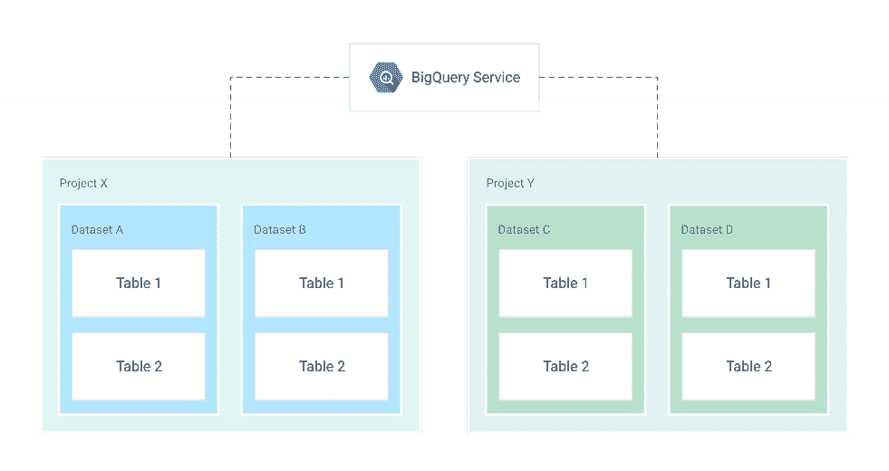
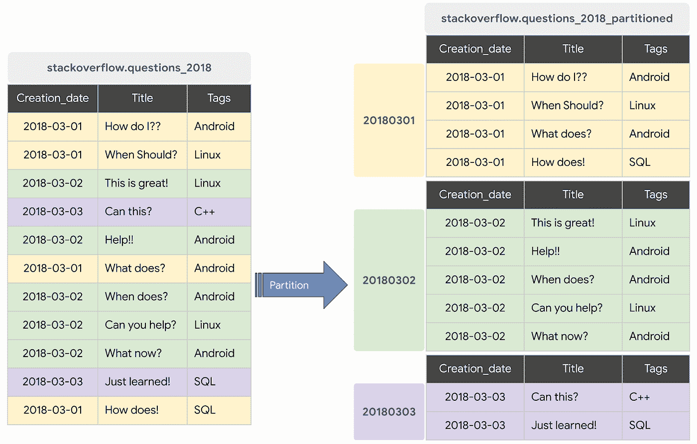
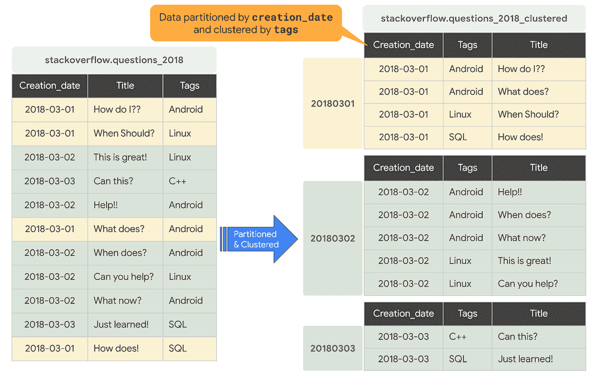

# BigQuery 解释:存储概述

> 原文：<https://medium.com/google-cloud/bigquery-explained-storage-overview-70cac32251fa?source=collection_archive---------0----------------------->

> 在谷歌云博客上关注 BigQuery 解释系列[。有问题或者想聊天？在](https://cloud.google.com/blog/topics/developers-practitioners/bigquery-explained-blog-series)[推特](https://twitter.com/rajesh_thallam)或 [LinkedIn](https://www.linkedin.com/in/rajeshthallam/) 上联系。

在 BigQuery 解释系列的[上一篇文章](/google-cloud/bigquery-explained-overview-357055ecfda3)中，我们回顾了 BigQuery 的高级架构，并展示了如何开始使用 BigQuery。在本帖中，我们将探讨 BigQuery 存储组织、存储格式，并介绍 BigQuery 的最佳实践之一，对您的数据进行分区和集群，以获得最佳性能。让我们开始吧！

# 大查询资源模型

BigQuery 将数据表组织成称为数据集的单元。这些数据集的范围是您的 GCP 项目。这些多重范围(项目、数据集和表)有助于您以逻辑方式组织信息。您可以使用多个数据集来分隔属于不同分析域的表，并且可以根据您的业务需求使用项目级范围来隔离数据集。



**图:BigQuery 资源[** [**来源**](https://cloud.google.com/solutions/bigquery-data-warehouse)**】**的结构概述

> *项目*

*   对象的根命名空间
*   包含多个数据集、作业、访问控制列表和 IAM 角色
*   控制计费、用户和用户权限

> *数据集*

*   “相关”表/视图以及标签和描述的集合
*   允许数据集级别的存储访问控制
*   定义数据的位置，即多区域(美国、欧盟)或区域(亚洲-东北 1)

> *表格*

*   存储在托管存储中的列和行的集合
*   由具有强类型值列的架构定义
*   允许[表级](https://cloud.google.com/bigquery/docs/table-access-controls-intro)和[列级](https://cloud.google.com/bigquery/docs/column-level-security-intro)的访问控制

> *观点*

*   由 SQL 查询定义的虚拟表
*   允许视图级别的访问控制

> *工作岗位*

*   BigQuery 代表您运行的操作—加载数据、导出数据、复制数据或查询数据
*   作业是异步执行的

当您从命令行、SQL 查询或代码中引用一个表时，您可以使用下面的构造来引用它:`project.dataset.table`。

# 存储管理

现在让我们回顾一下 BigQuery 如何管理保存数据的存储。传统的关系数据库，如 MySQL，逐行存储数据([面向记录的存储](http://publications.csail.mit.edu/abstracts/abstracts06/dna/dna.html))。这使他们擅长事务性更新和 [OLTP](https://en.wikipedia.org/wiki/Online_transaction_processing) (在线事务处理)用例。另一方面，BigQuery 使用列存储，其中每一列都存储在一个单独的文件块中。这使得 BigQuery 成为 [OLAP](https://en.wikipedia.org/wiki/Online_analytical_processing) (在线分析处理)用例的理想解决方案。您可以轻松地将数据流式传输(追加)到 BigQuery 表中，并更新或删除现有值。BigQuery [支持无限制的突变](https://cloud.google.com/blog/products/data-analytics/dml-without-limits-now-in-bigquery)(插入、更新、合并、删除)。


BigQuery 使用了列存储的变体和改进。在内部，BigQuery 以一种称为[电容器](https://cloud.google.com/blog/products/gcp/inside-capacitor-bigquerys-next-generation-columnar-storage-format)的专有列格式存储数据，这对数据仓库工作负载有很多好处。BigQuery 使用专有格式，因为存储引擎可以与查询引擎协同发展，从而利用对数据布局的深入了解来优化查询执行。表中的每一列都存储在一个单独的文件块中，所有列都存储在一个电容器文件中，该文件在磁盘上被压缩和加密。BigQuery 使用查询访问模式来确定物理碎片的最佳数量以及数据的编码方式。


实际的持久层是由 Google 的分布式文件系统 [Colossus](https://cloud.google.com/files/storage_architecture_and_challenges.pdf) 提供的，其中数据被自动压缩、加密、复制和分发。Colossus 使用擦除编码在多个物理磁盘上存储冗余数据块，从而确保耐用性。所有这些都是在不影响查询的计算能力的情况下完成的。将存储与计算分离，使您能够无缝扩展到数 Pb 的存储容量，而无需额外的昂贵计算资源。将计算和存储分离还有许多其他的[好处](https://cloud.google.com/blog/products/gcp/separation-of-compute-and-state-in-google-bigquery-and-cloud-dataflow-and-why-it-matters)。

# 利用长期储存的优势

您可以在[免费](https://cloud.google.com/bigquery/pricing#free)将数据加载到 BigQuery 中(对于批量加载)，因为 [BigQuery 存储成本](https://cloud.google.com/bigquery/pricing#storage)基于存储的数据量(每月前 10 GB 是免费的)以及存储是活动的还是长期的。

*   如果您在过去 90 天内修改了一个表或分区，它将被视为活动存储，并会对以 BigQuery 存储速率存储的数据产生月费。
*   如果您有一个连续 90 天没有修改的表或分区，它将被视为长期存储，该表的存储价格[将自动下降 50%](https://cloud.google.com/bigquery/pricing#long-term-storage) ，与[云存储近线](https://cloud.google.com/storage/pricing#storage-pricing)的成本相同。折扣是以每个表、每个分区为基础的。如果修改表中的数据，90 天计数器将重置。


优化成本的最佳实践是将数据保存在 BigQuery 中。利用 BigQuery 的长期存储价格，而不是将您的旧数据导出到另一个存储选项(如云存储)。这意味着不必删除旧数据或设计数据归档流程。因为数据保留在 BigQuery 中，所以您也可以使用相同的接口、相同的成本水平和相同的性能特征来查询较旧的数据。

# 分区和聚类

如果您希望优化成本和性能，将数据保存在 BigQuery 中是最佳实践。另一个最佳实践是使用 BigQuery 的表分区和集群特性来组织数据，以匹配常见的数据访问模式。

# 分割

分区表是一种特殊的表，它被划分为称为分区的多个段，这使得管理和查询数据变得更加容易。您通常可以使用数据摄取时间或`TIMESTAMP` / `DATE`列或`INTEGER`列将大型表分割成许多较小的分区。BigQuery 的解耦存储和计算架构利用基于列的分区来最小化插槽工作器从磁盘读取的数据量。一旦 slot workers 从磁盘中读取数据，BigQuery 就可以自动确定更优的数据分片，并使用 BigQuery 的内存洗牌服务快速对数据进行重新分区。



写入基于列的时间分区表的数据会根据数据的值自动传递到适当的分区。类似地，在分区列上表达筛选器的查询可以减少扫描的总数据，这可以提高性能并降低按需查询的查询成本。

BigQuery 支持以下创建分区表的方法

> 摄取时间分区表

*   根据数据的接收时间或到达时间进行分区。
*   BigQuery 自动将数据加载到基于日期的每日分区中，以反映数据的接收或到达时间。
*   BigQuery 向摄取时间分区表添加了两个伪列——一个`_PARTITIONTIME`伪列包含基于日期的数据时间戳，一个`_PARTITIONDATE`伪列包含日期表示。

> `DATE` / `TIMESTAMP`列分区表

*   基于`TIMESTAMP`或`DATE`列进行分区。
*   BigQuery 根据分区列中的日期值(用 UTC 表示)将数据路由到适当的分区。
*   BigQuery 创建了两个特殊的分区:用于捕获分区列中的行 NULL 值的`__NULL__`分区和用于允许的日期范围之外的数据的`__UNPARTITIONED__`分区。
*   您可以从每小时分区开始创建具有一定粒度的分区。

> `INTEGER`范围分区表

*   基于具有开始、结束和间隔值的整数列进行分区。
*   BigQuery 创建了两个特殊的分区:用于捕获分区列中具有空值的行的`__NULL__`分区和用于超出允许的整数范围的数据的`__UNPARTITIONED__`分区。

让我们来看看分区的作用。为了查看非分区表和分区表之间的性能差异，我们将使用相同的数据集创建非分区表和分区表，并检查查询性能。

## **分区前**

通过运行下面的 SQL 查询，我们将创建一个非分区表，其中的数据是从一个基于 StackOverflow posts 的[公共数据集](https://console.cloud.google.com/marketplace/browse?filter=solution-type:dataset&_ga=2.99891288.755387171.1599359331-1764086539.1598401521)中加载的，方法是[从一个现有的表](https://cloud.google.com/bigquery/docs/reference/standard-sql/data-definition-language#creating_a_new_table_from_an_existing_table)中创建一个新表。此表将包含 2018 年创建的 StackOverflow 帖子。

```
CREATE OR REPLACE TABLE `stackoverflow.questions_2018` AS
SELECT *
FROM `bigquery-public-data.stackoverflow.posts_questions`
WHERE creation_date BETWEEN '2018-01-01' AND '2018-07-01'
```

让我们**查询未分区表**以获取 2018 年 1 月所有标记为‘Android’的 StackOverflow 问题。

```
SELECT
  id,
  title,
  body,
  accepted_answer_id,
  creation_date,
  answer_count,
  comment_count,
  favorite_count,
  view_count
FROM
  `stackoverflow.questions_2018`
WHERE
  creation_date BETWEEN '2018-01-01' AND '2018-02-01'
  AND tags = 'android';
```

在查询运行之前，为了公平起见，在与分区表和聚簇表进行性能比较时，[缓存被禁用。](https://cloud.google.com/bigquery/docs/cached-results#console)


从查询结果中可以看到，对一个 ***非分区表的查询，用了 5.6s 扫描了整个 3.2GB 的数据*** ，用的是 2018 年创建的 StackOverflow posts。

## **对表格进行分区**

现在让我们看看分区表是否能做得更好。您可以通过多种方式在[中创建分区表。我们将使用](https://cloud.google.com/bigquery/docs/creating-partitioned-tables#creating_ingestion-time_partitioned_tables) [BigQuery DDL 语句](https://cloud.google.com/bigquery/docs/reference/standard-sql/data-definition-language)创建一个`DATE` / `TIMESTAMP`分区表。基于查询访问模式，我们选择分区列为`creation_date`。

```
CREATE OR REPLACE TABLE `stackoverflow.questions_2018_partitioned`
PARTITION BY
  DATE(creation_date) AS
SELECT
  *
FROM
  `bigquery-public-data.stackoverflow.posts_questions`
WHERE
  creation_date BETWEEN '2018-01-01' AND '2018-07-01';
```

现在让我们在禁用缓存的情况下对分区表运行前面的**查询，以获取 2018 年 1 月标记为“android”的所有 StackOverflow 问题。**

```
SELECT
  id,
  title,
  body,
  accepted_answer_id,
  creation_date,
  answer_count,
  comment_count,
  favorite_count,
  view_count
FROM
  `stackoverflow.questions_2018_partitioned`
WHERE
  creation_date BETWEEN '2018-01-01' AND '2018-02-01'
  AND tags = 'android';
```


***带分区表的查询在< 2s 处理中只扫描了所需的分区~290MB 数据*** 相比之下，带非分区表的查询运行处理 3.2GB。

在特定范围内进行查询时，分区管理是充分最大化 BigQuery 性能和成本的关键—它导致每次查询扫描的数据更少，并且在查询开始之前就确定了修剪。虽然分区降低了成本并提高了性能，但它也防止了由于用户意外查询非常大的整个表而导致的成本爆炸。

> **提示:**您可以通过[配置表过期](https://cloud.google.com/bigquery/docs/best-practices-storage#use_the_expiration_settings_to_remove_unneeded_tables_and_partitions)来删除不需要的表和分区，从而控制和优化存储成本。

**在这里** **了解更多关于分区表** [**。**](https://cloud.google.com/bigquery/docs/partitioned-tables)

# 使聚集

当在 BigQuery 中对表进行聚集时，表数据会根据表模式中一个或多个列的内容自动组织。您指定的列用于排列相关数据。通常高基数和非时态列是集群的首选。

当数据写入聚集表时，BigQuery 使用聚集列中的值对数据进行排序。这些值用于将数据组织到 BigQuery 存储中的多个块中。聚集列的顺序决定了数据的排序顺序。当新数据被添加到表或特定分区时，BigQuery 在后台执行[自动重新聚类](https://cloud.google.com/blog/products/data-analytics/skip-the-maintenance-speed-up-queries-with-bigquerys-clustering)以恢复表或分区的排序属性。*自动重新聚类对用户来说是完全免费和自主的。*



群集可以提高某些类型的查询的性能，例如使用筛选子句的查询和聚合数据的查询。

*   当包含 filter 子句的查询根据聚类列筛选数据时，BigQuery 使用已排序的块来消除对不必要数据的扫描。
*   当查询基于聚类分析列中的值聚合数据时，性能会得到提高，因为排序后的块将具有相似值的行放在一起。

BigQuery 支持对已分区表和未分区表进行聚类。当您同时使用集群和分区时，您的数据可以通过一个`DATE`或`TIMESTAMP`列进行分区，然后在一组不同的列(最多四列)上进行集群。

回到上一个查询，让我们看看使用聚簇表的查询是如何执行的。

## **集群表**

您可以在[中以多种方式](https://cloud.google.com/bigquery/docs/creating-clustered-tables#creating_clustered_tables)创建集群表。我们将使用 [BigQuery DDL 语句](https://cloud.google.com/bigquery/docs/reference/standard-sql/data-definition-language#creating_a_clustered_table)创建一个新的`DATE` / `TIMESTAMP`分区和集群表。基于查询访问模式，我们选择分区列为`creation_date`，集群键为`tag`。

```
CREATE OR REPLACE TABLE `stackoverflow.questions_2018_clustered`
PARTITION BY
  DATE(creation_date)
CLUSTER BY
  tags AS
SELECT
  *
FROM
  `bigquery-public-data.stackoverflow.posts_questions`
WHERE
  creation_date BETWEEN '2018-01-01' AND '2018-07-01';
```

现在，让我们在禁用缓存的情况下对分区和聚集表运行**查询，以获取 2018 年 1 月标记为“android”的所有 StackOverflow 问题。**

```
SELECT
  id,
  title,
  body,
  accepted_answer_id,
  creation_date,
  answer_count,
  comment_count,
  favorite_count,
  view_count
FROM
  `stackoverflow.questions_2018_clustered`
WHERE
  creation_date BETWEEN '2018-01-01'
  AND '2018-02-01'
  AND tags = 'android';
```


***使用分区和聚集表，查询在不到 1s 的时间内扫描了约 275MB 的数据，*** 这比分区表好。通过分区和聚类来组织数据的方式最大限度地减少了插槽工作线程扫描的数据量，从而提高了查询性能并优化了成本。

使用集群时需要注意的几件事:

*   在运行查询之前，群集不提供严格的成本保证。请注意，在上面的聚类结果中，查询验证报告处理了 286.1MB 的数据，但实际上查询只处理了 275.2MB 的数据。
*   仅当您需要比单独分区所允许的粒度更大的粒度时，才使用集群。

**在这里** **了解更多关于使用聚集表** [**的信息。**](https://cloud.google.com/bigquery/docs/clustered-tables)

# 接下来呢？

在本文中，我们学习了 BigQuery 如何组织和管理保存数据的存储，如何通过对表进行分区和聚类来提高查询性能，以及如何在 BigQuery 中为非活动数据保留长期存储价格的数据。

*   查看使用 BigQuery 的[分区和集群的演示](https://youtu.be/wapi0aR4BZE)
*   了解何时使用集群和分区
*   [Codelab](https://codelabs.developers.google.com/codelabs/gcp-bq-partitioning-and-clustering/#0) 在您的 [BigQuery 沙箱](https://cloud.google.com/bigquery/docs/sandbox)上尝试 BigQuery 分区和集群

在下一篇文章中，我们将探讨如何将数据导入 BigQuery 并分析数据。

敬请关注。感谢您的阅读！有问题或者想聊天？在[推特](https://twitter.com/rajesh_thallam)或 [LinkedIn](https://www.linkedin.com/in/rajeshthallam/) 上找到我。

*感谢* [*尤里*](/@thegrinch) *和* [*艾丽西娅·威廉姆斯*](/@presactlyalicia) *对帖子的帮助。*