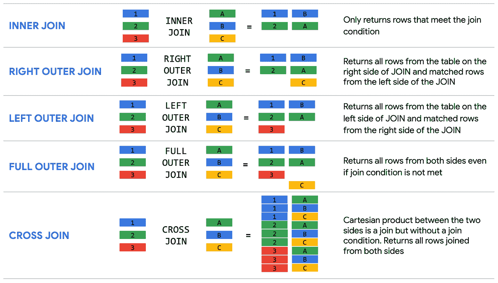
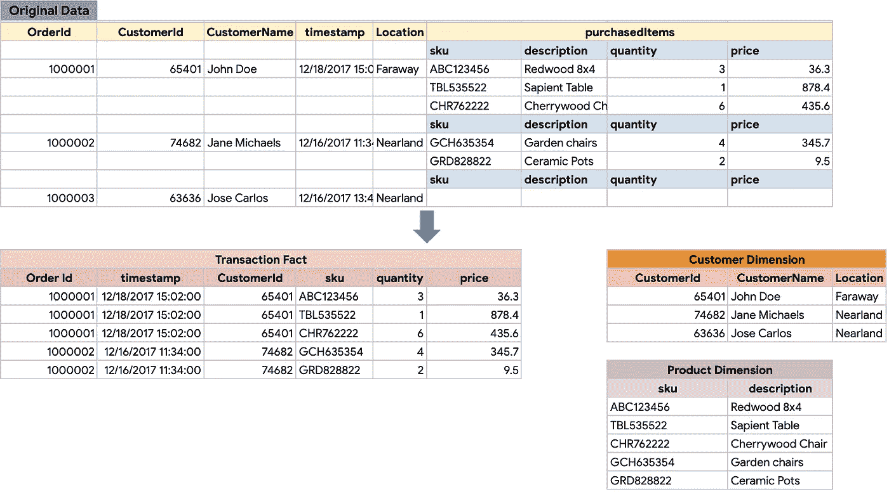
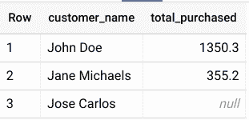
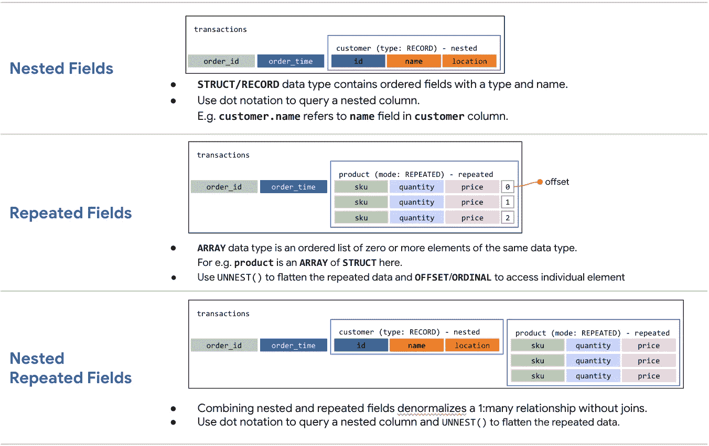
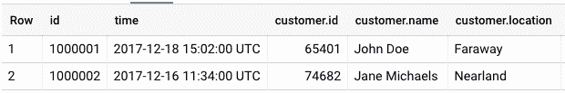
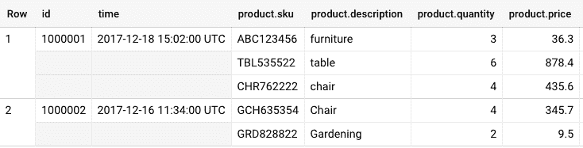
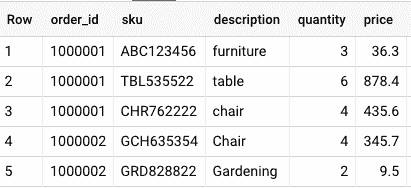
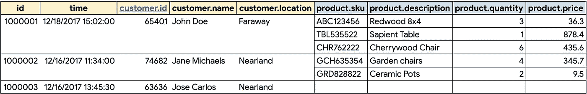
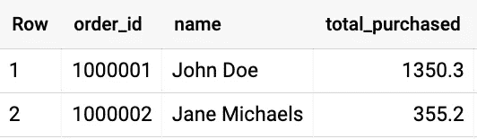

# BigQuery 解释:使用连接、嵌套和重复数据

> 原文：<https://medium.com/google-cloud/bigquery-explained-working-with-joins-nested-repeated-data-1941646ccb5b?source=collection_archive---------0----------------------->

> 在谷歌云博客上关注 BigQuery 解释系列[。有问题或者想聊天？在](https://cloud.google.com/blog/topics/developers-practitioners/bigquery-explained-blog-series)[推特](https://twitter.com/rajesh_thallam)或 [LinkedIn](https://www.linkedin.com/in/rajeshthallam/) 上联系。

在 BigQuery 解释系列文章的[中，我们研究了使用 SQL 在 BigQuery 中查询数据集，如何保存和共享查询，以及管理标准视图和物化视图。在本帖中，我们将重点关注嵌套和重复字段的连接和数据反规范化。让我们开始吧！](/google-cloud/bigquery-explained-querying-your-data-9e017f2714a3)

# 连接

通常，数据仓库模式遵循一个[星形](https://en.wikipedia.org/wiki/Star_schema)或[雪花形](https://en.wikipedia.org/wiki/Snowflake_schema)模式，其中一个包含事件的集中式“事实”表被称为“维度”的附属表包围，这些附属表具有与事实表相关的描述性属性。事实表被[反规范化](https://en.wikipedia.org/wiki/Denormalization)，维度表被[规范化](https://en.wikipedia.org/wiki/Database_normalization)。星型模式[支持数据仓库中的](https://en.wikipedia.org/wiki/Star_schema#Benefits)分析查询，允许在连接数量有限的情况下运行更简单的查询，执行更快的聚合并提高查询性能。

这与在线事务处理系统(OLTP)形成对比，在 OLTP 中，模式是高度规范化的，并且广泛地执行连接来获得结果。数据仓库中的大多数分析查询仍然需要执行连接操作来将事实数据与维度属性或另一个事实表相结合。

让我们看看 BigQuery 中的连接是如何工作的。BigQuery 支持 ANSI SQL 联接类型。根据[连接条件](https://cloud.google.com/bigquery/docs/reference/standard-sql/query-syntax#on_clause)和[连接类型](https://cloud.google.com/bigquery/docs/reference/standard-sql/query-syntax#join_types)对两个项目进行连接操作。`JOIN`操作中的项可以是大查询表、[子查询](https://cloud.google.com/bigquery/docs/reference/standard-sql/subqueries)、`[WITH](https://cloud.google.com/bigquery/docs/reference/standard-sql/query-syntax#with_clause)`语句或`[ARRAYs](https://cloud.google.com/bigquery/docs/reference/standard-sql/arrays)`(具有零个或多个相同数据类型值的有序列表)。

BigQuery 支持以下[连接类型](https://cloud.google.com/bigquery/docs/reference/standard-sql/query-syntax#join_types):



BigQuery 联接类型

让我们来看一个零售商店的示例数据仓库模式，如下所示。顶部有零售交易的原始数据表被转换为数据仓库模式，订单详细信息存储在一个`**Transactions**`事实表中，而`**Product**`和`**Customer**`信息作为维度表。



零售店的数据仓库模式

为了找出每个客户在一个月里花了多少钱，您可以在`**Transactions**`事实表和`**Customer**`维度表之间执行`OUTER JOIN`来获得结果。我们将使用`WITH`子句动态生成示例交易和客户数据，并查看`JOIN`的运行情况。运行以下查询:

使用`[WITH](https://cloud.google.com/bigquery/docs/reference/standard-sql/query-syntax#with-clause)`子句允许命名子查询并在后续查询中使用它，例如这里的`SELECT`语句(也称为[公共表表达式](https://en.wikipedia.org/wiki/Hierarchical_and_recursive_queries_in_SQL#Common_table_expression))。我们使用`Customer`和`Transactions`之间的`RIGHT OUTER JOIN`来获得所有客户及其总消费的列表。



**注意***:*`WITH`子句主要用于可读性，因为它们没有具体化。如果一个查询出现在多个`WITH`子句中，它将在每个子句中执行。

## 优化连接模式

> **广播加入**

*   当将一个大表连接到一个小表时，BigQuery 创建一个广播连接，其中小表被发送到处理大表的每个槽。
*   尽管 SQL 查询优化器可以确定哪个表应该位于连接的哪一侧，但是建议对连接的表进行适当的排序。最佳实践是首先放置最大的表，其次是最小的表，然后依次减小大小。

> **散列连接**

*   当连接两个大表时，BigQuery 使用 hash 和 shuffle 操作来混合左表和右表，以便匹配的键在同一个槽中结束，从而执行本地连接。这是一个昂贵的操作，因为需要移动数据。
*   在某些情况下，群集可能会加快散列连接的速度。正如在[上一篇文章](/google-cloud/bigquery-explained-storage-overview-70cac32251fa#1539)中提到的，集群倾向于将数据放在同一个列文件中，从而提高混排数据的整体效率，尤其是在查询执行计划中有一些预聚合部分的情况下。

> **自加入**

*   在自联接中，表与其自身相联接。这通常是一个 SQL 反模式，对于大型表来说，这可能是一个开销很大的操作，并且可能需要不止一次地获取数据。
*   相反，建议避免自连接，而是使用[分析(窗口)函数](https://cloud.google.com/bigquery/docs/reference/standard-sql/analytic-function-concepts)来减少查询产生的字节。

> **交叉连接**

*   [交叉连接](https://en.wikipedia.org/wiki/Join_(SQL)#Cross_join)是一种 SQL 反模式，会导致严重的性能问题，因为它们生成的输出数据比输入数据大，在某些情况下查询可能永远不会完成。
*   为了避免交叉连接的性能问题，请使用聚合函数来预聚合数据，或者使用通常比交叉连接性能更好的分析函数。

> **倾斜连接**

*   当表中的数据被划分为大小不等的分区时，可能会发生数据倾斜。当连接需要混洗数据的大型表时，偏斜会导致插槽之间发送的数据量极度不平衡。
*   为了避免与偏斜联接(或不平衡联接)相关的性能问题，请尽可能早地预筛选表中的数据，或者将查询拆分为两个或多个查询。

***参考 big query***[***最佳实践***](https://cloud.google.com/bigquery/docs/best-practices-performance-patterns) ***文档，了解更多此类优化查询性能的建议。***

# 具有嵌套和重复结构的非规范化数据

当对部分规范化的模式(如数据仓库中的星型或雪花型模式)执行分析操作时，必须连接多个表才能执行所需的聚合。但是，连接的性能通常不如非规范化结构。查询性能[显示](https://cloud.google.com/solutions/bigquery-data-warehouse#denormalization)在存在连接的情况下会有更急剧的下降。

非规范化数据的传统方法包括将一个事实及其所有维度写入一个扁平结构。相比之下，反规范化数据的首选方法是利用 BigQuery 对 JSON 或 Avro 输入数据中的[嵌套和重复](https://cloud.google.com/bigquery/docs/nested-repeated)结构的本机支持。使用嵌套和重复的结构来表示记录可以提供更自然的底层数据表示。

继续使用零售商店的相同数据仓库模式，以下是需要注意的关键事项:

*   `Transactions`中的一个订单属于单个`Customer`并且
*   `Transactions`中的一个订单可以有多个`Product`(或项目)。

前面，我们看到这个模式被组织到多个表中。另一种方法是使用嵌套和重复的字段将所有信息组织在一个表中。

## 嵌套和重复字段的初级读本

BigQuery 支持从支持基于对象的模式的源格式加载嵌套和重复的数据，如 JSON、Avro、Firestore 和 Datastore 导出文件。`**ARRAY**``**STRUCT**`**或`**RECORD**` 是复杂的数据类型，用来表示嵌套和重复的字段。**

****

**BigQuery 嵌套和重复字段**

> *****嵌套字段*****

*   **一个`**STRUCT**` **或** `**RECORD**`包含有序字段，每个字段都有类型和字段名。您可以将一个或多个子列定义为`STRUCT`类型，称为嵌套`STRUCT` s ( [*到 15 层嵌套*](https://cloud.google.com/bigquery/docs/nested-repeated#limitations) )。**
*   **让我们把`Transactions`和`Customer`数据放入嵌套结构中。注意`Transactions`中的一个订单属于一个`Customer`。这可以表示为下面的模式:**

```
[
  {"name": "id", "type": "INTEGER", "mode": "REQUIRED"},
  {"name": "time", "type": "TIMESTAMP", "mode": "REQUIRED"},
  {"name": "customer", "type": "**RECORD**", "fields":
    [
      {"name": "id", "type": "INTEGER", "mode": "REQUIRED"},
      {"name": "name",  "type": "STRING", "mode": "REQUIRED"},
      {"name": "location",  "type": "STRING"}
    ]
  }
]
```

*   **注意`customer`列属于`RECORD`类型，有序字段与`Transactions`字段— `id`和`time`一起嵌套在主模式中。**
*   **BigQuery 在查询时自动展平嵌套字段。若要查询包含嵌套数据的列，每个字段都必须在包含它的列的上下文中进行标识。例如:`customer.id` 是指`customer`列中的`id`字段。**

****

**嵌套字段**

> *****重复字段*****

*   **一个`**ARRAY**`是相同数据类型的零个或多个元素的有序列表。不支持数组的数组。重复字段在单个字段或`RECORD`中添加一组数据。**
*   **我们来考虑一下`Transactions`和`Product`的数据。`Transactions`中的一个订单可以有多个`Product`(或项目)。当将列`Product`指定为模式中的重复字段时，可以将`**product**`列的模式定义为`**REPEATED**`。具有重复字段的模式如下所示:**

```
[
  {"name": "id", "type": "INTEGER", "mode": "REQUIRED"},
  {"name": "time", "type": "TIMESTAMP", "mode": "REQUIRED"},
  {"name": "product", "type": "RECORD", "mode": "**REPEATED**", "fields":
    [
      {"name": "sku", "type": "STRING", "mode": "REQUIRED"},
      {"name": "description",  "type": "STRING"},
      {"name": "quantity",  "type": "INTEGER"},
      {"name": "price",  "type": "FLOAT", "mode": "REQUIRED"}
    ]
  }
]
```

*   **重复字段中的每个条目都是一个`ARRAY`。例如，订单的`product`列中的每一项都是具有`sku`、`description`、`quantity`和`price`字段的`STRUCT`或`RECORD`类型。**
*   **当查询一个或多个重复字段时，BigQuery 自动按“行”对数据进行分组。**

****

**重复字段**

*   **为了展平重复的(和分组的)数据，您将使用带有重复列名称的`[**UNNEST()**](https://cloud.google.com/bigquery/docs/reference/standard-sql/query-syntax#unnest)`函数。只能在`FROM`子句或`[IN](https://cloud.google.com/bigquery/docs/reference/standard-sql/operators#in_operators)`T21 运算符中使用`**UNNEST**`函数。**

****

**使用 UNNEST()展平嵌套元素**

*****阅读更多关于处理*** `**ARRAY**` ***s 和******s***[***这里***](https://cloud.google.com/bigquery/docs/reference/standard-sql/arrays) ***。*****

## **具有嵌套重复字段的非规范化模式**

**让我们把所有这些放在一起，看看在单个表中组合了嵌套和重复元素以及`Customer`和`Product`信息的`Transactions`模式的另一种表示。该模式表示如下:**

```
[
  {"name": "id", "type": "INTEGER", "mode": "REQUIRED"},
  {"name": "time", "type": "TIMESTAMP", "mode": "REQUIRED"},
  {"name": "customer", "type": "**RECORD**", "fields":
    [
      {"name": "id", "type": "INTEGER", "mode": "REQUIRED"},
      {"name": "name",  "type": "STRING", "mode": "REQUIRED"},
      {"name": "location",  "type": "STRING"}
    ]
  },
  {"name": "product", "type": "RECORD", "mode": "**REPEATED**", "fields":
      [
        {"name": "sku", "type": "STRING", "mode": "REQUIRED"},
        {"name": "description",  "type": "STRING"},
        {"name": "quantity",  "type": "INTEGER"},
        {"name": "price",  "type": "FLOAT", "mode": "REQUIRED"}
      ]
    }
]
```

****

**零售店的非规范化模式——另一种表示法**

**在`**Transactions**`表中，外部包含`**order**`和`**customer**`信息，内部包含`**order**`的行项目，它们被表示为嵌套的、重复的元素。通过使用嵌套和重复的字段来表达记录简化了使用 JSON 或 Avro 文件的[数据加载。在创建了这样一个模式之后，您可以使用点符号对任何单个字段执行`SELECT`、`INSERT`、`UPDATE`和`DELETE`操作，例如`Order.sku`。](https://cloud.google.com/bigquery/docs/nested-repeated)**

**我们将再次动态生成交易数据，并在具有嵌套和重复字段的`**Transactions**`模式上运行该查询，以查找订单上的总购买量以及客户姓名。**

**让我们解开这个查询，了解数据是如何反规范化的。**

> *****非规格化数据表示*****

*   **使用`[WITH](https://cloud.google.com/bigquery/docs/reference/standard-sql/query-syntax#with-clause)`语句生成交易数据，每一行由`**order**`信息、`**customer**`信息和一个嵌套字段组成，该嵌套字段包含表示为代表— `sku`、`quantity`和`price`的`[STRUCT](https://cloud.google.com/bigquery/docs/reference/standard-sql/data-types#struct-type)`的一个`[ARRAY](https://cloud.google.com/bigquery/docs/reference/standard-sql/data-types#array-type)`的各个项目。**
*   **使用`STRUCTs`的`ARRAY`，我们通过避免表`JOIN`获得了显著的性能优势。`STRUCT`的`ARRAY`可以被视为保留数据结构的预连接表。嵌套记录中的单个元素只能在需要时检索。与管理`JOIN`键和相关表相比，将所有业务上下文放在一个表中还有额外的好处。**

> *****归一化数据用于分析*****

*   **在`SELECT`查询中，我们使用`[UNNEST()](https://cloud.google.com/bigquery/docs/reference/standard-sql/query-syntax#unnest)`函数和点符号从嵌套记录中读取字段，如`price`。例如`orders.price`**
*   **`UNNEST()`帮助将数组元素放回到行中**
*   **`UNNEST()`总是跟在`FROM`子句中的表名后面(概念上类似于预连接的表)**

**运行上面的查询将返回包含订单、客户和订单总额的结果。**

****

## **设计非规范化模式的准则**

**以下是[在 BigQuery 中设计非规范化模式](https://cloud.google.com/solutions/bigquery-data-warehouse#designing_schema)的一般准则:**

*   **对大于 10GB 的维度表进行反规范化，除非有强有力的证据表明数据操作(如`UPDATE`和`DELETE`操作)的成本超过了优化查询的好处。**
*   **保持小于 10GB 的维度表规范化，除非该表很少经过`UPDATE`和`DELETE`操作。**
*   **充分利用非规范化表中的[嵌套和重复字段](https://cloud.google.com/bigquery/docs/nested-repeated)。**

*****参考这篇*** [***文章***](https://cloud.google.com/solutions/bigquery-data-warehouse#designing_schema) ***了解更多关于数据仓库中非规范化和设计模式的信息。*****

# **接下来呢？**

**在这篇文章中，我们使用了连接，回顾了优化连接模式和使用嵌套和重复字段的反规范化数据。**

*   **在 BigQuery 中使用[连接](https://cloud.google.com/bigquery/docs/reference/standard-sql/query-syntax#join_types)**
*   **在 BigQuery 中使用[分析(窗口)函数](https://cloud.google.com/bigquery/docs/reference/standard-sql/analytic-function-concepts)**
*   **在 BigQuery [ [视频](https://www.youtube.com/watch?v=3TVeG_dpGxk) ] [ [文档](https://cloud.google.com/bigquery/docs/nested-repeated)中处理嵌套和重复的数据**
*   **BigQuery [查询性能的最佳实践](https://cloud.google.com/bigquery/docs/best-practices-performance-overview)包括连接等等**
*   **[在您的](https://github.com/GoogleCloudPlatform/training-data-analyst/blob/master/courses/data-engineering/demos/nested.md) [BigQuery 沙箱](https://cloud.google.com/bigquery/docs/sandbox)上查询带有嵌套和重复字段的 BigQuery 公共数据集——*感谢* [*伊万·琼斯*](https://github.com/jonesevan) *的演示*！( *Codelab 即将推出！*)**

**在下一篇文章中，我们将看到 BigQuery 中的数据操作以及脚本、存储过程等等。**

**敬请关注。感谢您的阅读！有问题或者想聊天？在 [Twitter](https://twitter.com/rajesh_thallam) 或 [LinkedIn](https://www.linkedin.com/in/rajeshthallam/) 上找到我。**

**感谢艾丽西娅·威廉姆斯对这篇文章的帮助。**