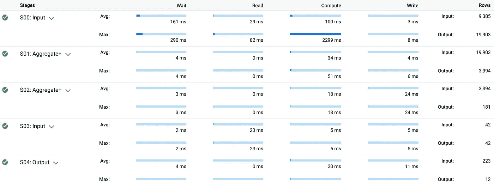
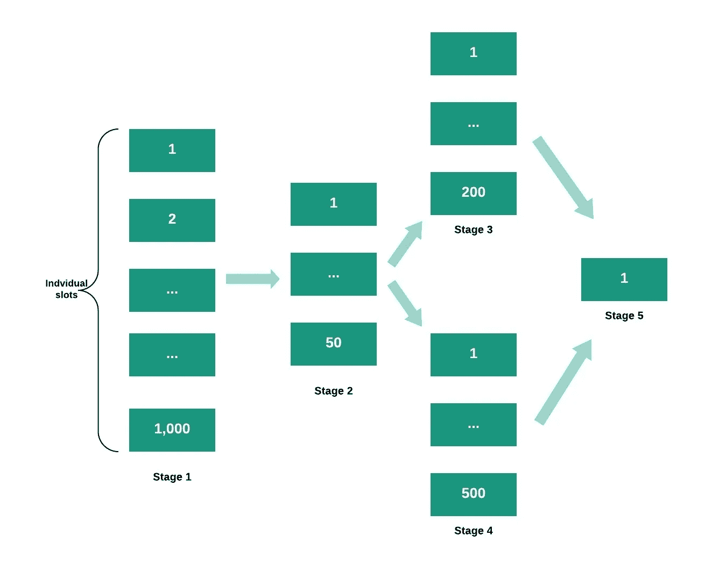
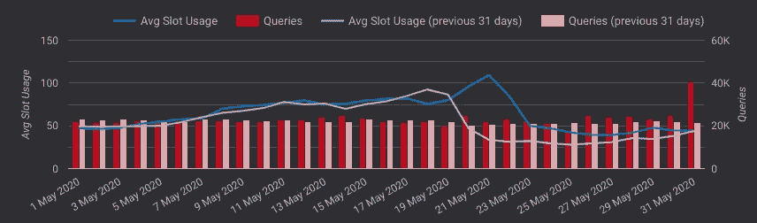
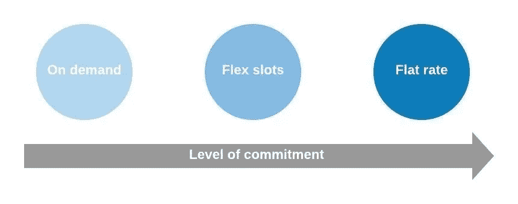
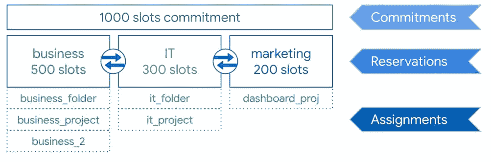
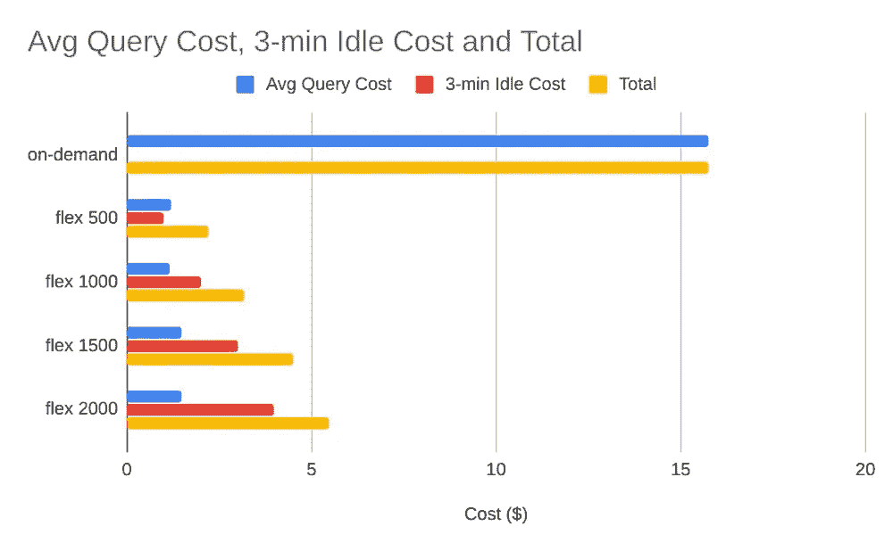

# BigQuery Flex Slots 定价:一种编程方法

> 原文：<https://medium.com/google-cloud/bigquery-flex-slots-pricing-a-programmatic-approach-a388e81a466c?source=collection_archive---------0----------------------->

Google 最近为 BigQuery 推出了一个新的定价模型，名为“BigQuery flex slots”。这种新的定价方法是什么？您应该在什么时候选择它？本文将重点介绍这种新的定价，以及如何以编程方式获取插槽并将其分配给项目。这里可用的代码将为您提供两个云函数，可以用所需的槽数、预订名称和分配项目进行参数化。

> 价格是你付出的。价值是你得到的。” *—沃伦·巴菲特*

重要的事情先来。在深入研究 BigQuery Flex Slots 的代码实现之前，我将首先介绍两个重要的概念。这两个概念是 BigQuery 插槽和 BigQuery 定价模型。

# BigQuery 插槽。这是什么？

什么是大查询槽？一个[大查询槽](https://cloud.google.com/bigquery/docs/slots)是执行 SQL 查询所需的计算能力单位。你可以把它看成是 CPU、内存和网络的混合体。BigQuery 根据查询的大小和复杂程度，自动计算每个查询需要多少个槽。

# 最大插槽数

**对于“随需应变”的 BigQuery 定价模型(我将在后面详细解释不同的定价模型)，每个项目最多有 2，000 个名额。**这意味着在任何时候，在您的所有查询中，您将拥有最大 2，000 个插槽。这可能不够，具体取决于您的查询工作负载。在这种情况下，您可以切换到统一费率定价或新的弹性时段定价。我们将在下一点回到选择什么样的定价结构。

**当 BigQuery 执行查询作业时，它会将声明性 SQL 语句转换为执行图，并分解为一系列查询阶段。**这些步骤本身由更细粒度的执行步骤组成。BigQuery 利用高度分布式的并行架构来运行这些查询，每个阶段由一个或多个工作器执行。然后，这些工作人员使用快速分布式 shuffle 架构相互通信。查询的“执行细节”如下所示:

**这可以被可视化为**有向非循环图(DAG ),其中每个阶段基于 BigQuery 优化因子被分配一些槽(利用[推测执行](https://en.wikipedia.org/wiki/Speculative_execution)和[阶段的动态工作再平衡](https://cloud.google.com/blog/products/gcp/no-shard-left-behind-dynamic-work-rebalancing-in-google-cloud-dataflow))。

如果查询请求的槽多于当前可用的槽，一些工作单元将排队等待，直到有更多的槽可用。

# 大查询定价模型

**BigQuery 在定价方面有三种风格:**按需、统一费率和新的灵活时段定价模式。让我们深入了解这些选项，以便您可以决定哪一个最适合您。

# 按需定价

**这是你默认得到的 BigQuery 定价模型，**，它是一个“现收现付”的模型。可以分配给查询的 BigQuery 槽的数量限制为 2000 个。当您的查询执行时，这些槽被自动调度。

您将按照查询扫描的字节数付费(撰写本文时为 5 美元/TB)。

# 统一定价

**一旦您开始运行许多工作负载，并且您的“按需”成本开始飙升**，是时候考虑转向更具企业级的定价模式了。统一费率定价为您提供了以每 500 个插槽 10，000 美元的价格承诺一定数量的插槽(从 500 个开始)的可能性。

**在您组织内的所有项目都有接近一定数量的固定工作量的情况下，这是非常理想的。**然后，统一费率定价模式允许您利用固定数量的位置，以固定价格由您组织下的所有项目共享。

**建议首先使用按需定价模式监控您的工作负载，以充分掌握您的插槽利用率。**例如，通过导出您的 BigQuery 日志，您可以构建一个 Data Studio 仪表板，为您提供所需的洞察力(Stackdriver Monitoring 中存在显示插槽使用情况的默认图表)。

下面的示例显示了查询总数下的平均插槽消耗。在这种情况下，显然没有理由脱离“按需”定价模式。

# 灵活插槽或“灵活插槽”定价

在这两种定价模式之间，现在出现了一种适合许多使用情形的新模式:灵活插槽或“灵活插槽”。

**什么是“灵活插槽”定价？**这种新推出的 flex slots BigQuery 定价模型非常适合周期性工作负载或临时查询，这些工作负载或临时查询在一定的可预测时间内需要一些额外的功能。

**BigQuery flex slots 使您能够通过预订将**提交给一定数量的插槽，持续时间短至 60 秒(在撰写本文时，收费为每小时每个插槽 0.04 美元)。

**使用 flex slots 的理想场景是**如果您每天早上运行刷新一些数据集市的日常查询，并且这些查询需要 20 分钟才能运行。然后，你可以在每天这段短暂的时间里购买 2000 个老虎机。这将大大降低您的成本，因为与按需定价相比，弹性插槽更便宜:见下图。

flex 插槽的一个有价值的好处是你可以在项目和文件夹之间共享它们。假设您有多个部门，您希望根据每个部门的活动为其分配一定数量的查询。

**如您所见，您购买了承付款，然后将其分配给预订部。**之后，您最终将预订分配给组织、文件夹或特定项目。虽然在这些部门之间划分了时段，但是例如，仅保留了 200 个时段的营销部门可以使用多达 1000 个时段，以防其他两个部门不处理任何查询，并且他们的 800 个时段因此被闲置。

**通过 BigQuery flex slots 定价节省成本**

“灵活老虎机”是一个真正的游戏规则改变者，因为它**让你在成本上完全灵活，**因为你可以随时购买和释放老虎机。如果使用得当，它可以大大降低大查询的成本。下面是来自 Google [帖子](https://cloud.google.com/blog/products/data-analytics/optimize-bigquery-costs-with-flex-slots?utm_source=feedburner&utm_medium=email&utm_campaign=Feed:%2Bgoogleblog%2FCNkG%2B(Google%2BCloud%2BPlatform%2BBlog))的图表，描绘了 5 TB 查询的成本:

对于按需定价，您将花费 15 美元(每 TB 5 美元)，而通过 flex slots 保留相同数量的插槽的相同查询将花费三分之一的费用。

然而，值得注意的是，购买少于 2，000 个插槽的**在大多数情况下会使您的性能**比按需定价慢，后者默认有 2，000 个插槽。

# **帮助您开始使用灵活插槽的代码**

为了最大限度地发挥灵活时段定价的优势，您需要能够轻松地启动和停止它们。这个[公共 github 库](https://github.com/Fourcast/bq_flex_slots)上的代码将带你开始。

**它提供了两个云函数:**一个用于创建 BigQuery flex slots commitment、reservation 和 assignment，另一个用于删除这些资源。创建功能接受参数，这将允许您组织您的预订和分配。

**一旦您使用 Terraform 在项目上部署了函数，您就可以轻松地在代码中调用它们。**例如，您可以在运行一批查询之前调用“start_bq_flex”函数，并在查询完成后调用“stop_bq_flex”函数。

**你也可以通过云调度器**调用这些函数，以防你希望在某个时间段总是预定一定数量的槽位(为了调用带认证的云调度器，参见此[链接](https://cloud.google.com/scheduler/docs/http-target-auth))。此时“stop_bq_flex”功能删除所有的分配、预订和承诺；在以要删除的资源为目标的更细粒度上，肯定有改进的空间。

请仔细阅读 [README.md](https://github.com/Fourcast/bq_flex_slots/blob/master/README.md) ，因为这将为您提供开始编写代码所需的所有信息。

**总之:BigQuery flex slots 在*按需*和*统一费率*定价之间增加了一个战略定价模型。这种新的定价模式无疑将在面向中小型公司的 BigQuery 大数据分析民主化中发挥至关重要的作用。与按需定价模式相比，通过完善的监控系统来确定周期性工作负载以及启动和停止灵活插槽的编程方式，您可以节省高达 60%的成本。希望本文能帮助您掌握 BigQuery flex 插槽。**

**有什么问题吗？需要指导来优化您的 BigQuery 支出吗？联系我们！**

*最初发布于*[*https://www . fourcast . io*](https://www.fourcast.io/blog/bigquery-flex-slots-pricing-a-programmatic-approach)*。*