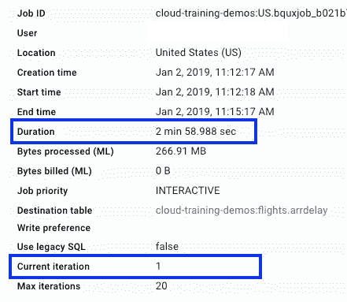

# BigQuery ML 通过计算封闭形式的解(有时)变得更快

> 原文：<https://medium.com/google-cloud/bigquery-ml-gets-faster-by-computing-a-closed-form-solution-sometimes-1baa5a838eb6?source=collection_archive---------2----------------------->

## 我如何在不损失准确性的情况下获得 50%的加速

在[之前的一篇文章](https://towardsdatascience.com/how-to-do-online-prediction-with-bigquery-ml-db2248c0ae5)中，我向您展示了如何在 BigQuery 中仅使用 SQL 来训练机器学习模型:

```
CREATE OR REPLACE MODEL flights.arrdelay
OPTIONS
  (model_type='linear_reg', input_label_cols=['arr_delay']) AS
SELECT
  arr_delay,
  carrier,
  origin,
  dest,
  dep_delay,
  taxi_out,
  distance
FROM
  `cloud-training-demos.flights.tzcorr`
WHERE
  arr_delay IS NOT NULL
```

这花了我大约 6 分钟。但是当我现在在 BigQuery 上运行它时，它只花了我 3 分钟的时间，并且在一次迭代中就完成了:



BigQuery ML 只需一次迭代就可以训练航班模型！

怎么了？为什么 BigQuery ML 突然变快了？发生了什么事？你会一直这样加速吗？得到的模型准确吗？

答:(a)它变得更快的主要原因是因为它使用了更快的算法(即，不是因为计算基础设施的改进)。(b)更快的算法包括通过计算“伪逆”来寻找封闭形式的解。(c)伪逆将仅对机器学习问题的子集起作用。(d)这个模型和你通过多次迭代得到的一样好。

在这篇文章中，我将进一步解释这些答案。随意浏览下一部分(伪逆背后的数学)，因为细节并不重要。

## 伪逆(数学)

进行线性回归时，实际上是在给定各种要素(X)及其对应的标注列(Y)的情况下，求解矩阵方程 XW = Y 以获得 W 的最佳值。

如果 X 由 N 行 m 个特征组成，那么 X 是一个 *N×m* 矩阵，W 是一个 *m×1* 矩阵，Y 是一个 *N×1* 矩阵。

如果我们正好有 *m* 行和 *m* 个特征，并且如果这些行都是线性独立的，那么这是一个线性方程组，您可以通过计算 X 的逆矩阵并将两边相乘来计算 W 的正确答案:

x⁻x w =*x⁻y*

矩阵与其逆矩阵的乘积是一个单位矩阵，所以你得到 W 的封闭解:

X⁻

但是通常你会有更多的数据，所以 X 不是一个方阵，你不能直接计算 X 的逆矩阵。相反，您可以通过将 X 乘以其自身的转置来得到 X 的平方:

( *Xᵀ* X) W = *Xᵀ* Y

现在，如果我们对平方矩阵求逆，我们可以直接求解权重:

w =(*xᵀ*x)*⁻*t26】xᵀy

这个东西:(*xᵀ*x)*⁻**xᵀ*叫做 x 的 [Moore-Penrose 伪逆](https://en.wikipedia.org/wiki/Moore%E2%80%93Penrose_inverse)，这就是 bigquery 正在计算的直接求权值。

## 这会导致精确的解决方案吗？

线性回归模型属于“[凸优化](https://en.wikipedia.org/wiki/Convex_optimization)类问题。这意味着只有全局最小值，没有局部最小值。BigQuery 使用的称为[小批量梯度下降](https://en.wikipedia.org/wiki/Stochastic_gradient_descent#Iterative_method)的常规迭代方法收敛于这个全局最小值，伪逆直接求解它。因此，这两种方法将产生等效的模型(而不是相同的模型，因为如果您的一些要素是线性相关的，则解决方案不是唯一的)。只要你让迭代方法运行到收敛，在精度方面没有折衷。

## 可能的速度提升是多少？

如果表达式(*xᵀ*x)*⁻*t8】xᵀ能够被快速有效地计算，那么直接求解该解比使用迭代的梯度下降方法更好。这就是 BigQuery 现在所做的。

在航班问题中，行数是 600 万，功能数是 660，我们得到了 50%的加速。如果您有更大的数据集，您应该会看到更多的加速。这是因为计算 *Xᵀ* X 可以以令人尴尬的并行方式完成，BigQuery 擅长在非常大的数据集上并行化这种计算。因此，行数越多，相对于梯度下降法，加速就越快。此外，特征数量越少，要求逆的矩阵就越小，加速就越快。

一般来说，行数/特征数的比值越大，伪逆就越快。

## BigQuery 什么时候可以计算伪逆？

只有当您要最小化的误差是均方误差时，伪逆才能帮助您找到最佳权重。这是线性回归的情况，但仅当不修改误差函数时，例如通过使用 L1 正则化。多类逻辑回归(误差函数是交叉熵)就不是这样了。有一种方法可以将一个二元分类问题转化为线性回归问题，但是目前 BigQuery 没有实现这一点。

其次，考虑我们要求逆的矩阵的大小。x 的大小为 *N×m* ，其中 m 是在对分类变量进行一次性编码后的基数或特征数。因此， *Xᵀ* 的大小为 *m×N* 而 *Xᵀ* X 的大小为 *m×m* 。这意味着当你计算伪逆时，你需要对一个大小为 *m×m* 的矩阵求逆。这是一个内存操作，必须在单个 BigQuery 工作线程上进行。因此，只有在单个 worker 上计算一个 *m×m* 矩阵的逆矩阵比普通的分布式迭代方法更快时，BigQuery 才会选择这样做。在航班问题中，基数由三个分类特征(14 + 322 + 322(承运人、始发地、目的地))和三个数字特征组成。因此，总基数是 661，对一个 661x661 的矩阵求逆对于一个工人来说已经足够快了。目前，从伪逆方法翻转到迭代方法的特征数量阈值高达数千个，尽管这将随着硬件规格的变化而变化。

第三，考虑我在开始矩阵求逆时提出的警告——行必须是线性独立的，这样矩阵才能表现良好，足以让你求逆。因此，只有当数据集足够大时，BigQuery 才会计算伪逆。如果你的行数比你的特征数多一个数量级，那么你应该落入伪逆领域。

## 如果我不想呢？

您可以强制 BigQuery 不使用伪逆。通过明确指定优化策略，强制其使用迭代小批量梯度下降:

```
CREATE OR REPLACE MODEL flights.arrdelay
OPTIONS
  (model_type='linear_reg', input_label_cols=['arr_delay'], **optimize_strategy='batch_gradient_descent'**) AS
SELECT
  arr_delay,
  carrier,
  origin,
  dest,
  dep_delay,
  taxi_out,
  distance
FROM
  `cloud-training-demos.flights.tzcorr`
WHERE
  arr_delay IS NOT NULL
```

当我这样做时，模型花费了 6.5 分钟，并在 7 次迭代中收敛。

不过，如果可能的话，最好让 BigQuery 使用封闭形式的解决方案。为什么你会放弃减少 50%的训练时间而不损失准确性呢？我能想到的几乎唯一的原因是当你有一个可怕的数据集，其中许多行是相同的——这是因为这种不适定矩阵的[反演](https://www.google.com/search?q=ill+posed+matrix+inversion)仍然是一个研究问题，但你确实清理了你的数据集，不是吗？

## 摘要

BigQuery ML 现在将使用伪逆计算封闭形式的解决方案。这比普通的迭代方法更快，但只有在以下情况下才会选择:

*   您正在进行没有 L1 正则化的线性回归
*   您拥有不到几千个要素(考虑到分类要素的基数)
*   行数比要素数多一个数量级

得到的模型与 BigQuery 使用常规的、迭代的小批量梯度下降方法得到的模型具有相同的精度。

*   实际的加速取决于行数和特性数。行数越多，或者功能越少，速度就越快。
*   您可以通过显式指定*optimize _ strategy = ' batch _ gradient _ descent '***来关闭此功能。**不过不要。

如果您想知道这是否会是一个问题，请尝试对数据进行计数(DISTINCT ),看看有多少重复行。

*感谢明歌·邓、阿米尔·霍玛蒂和费利佩·霍法的有益反馈和指点。*