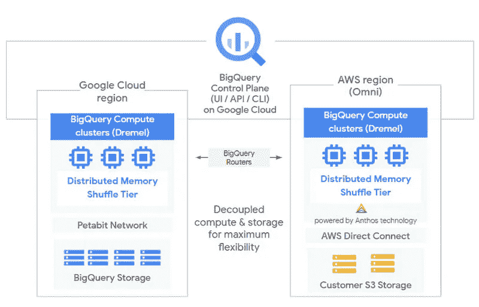
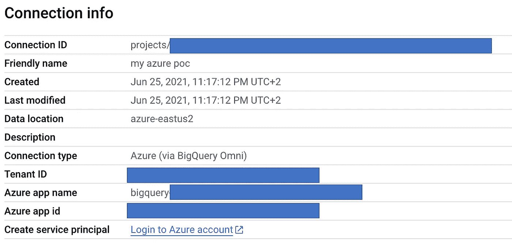
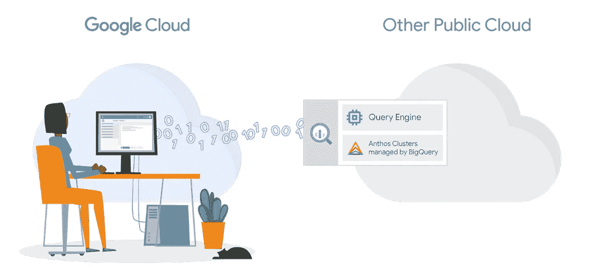
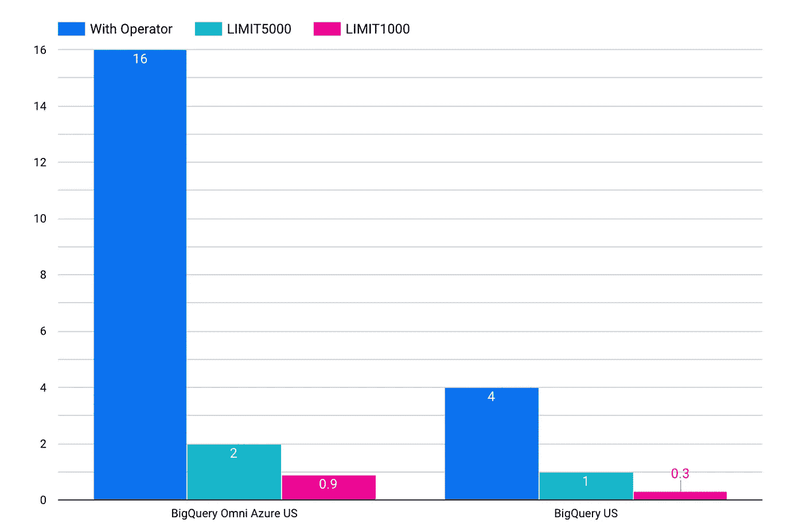
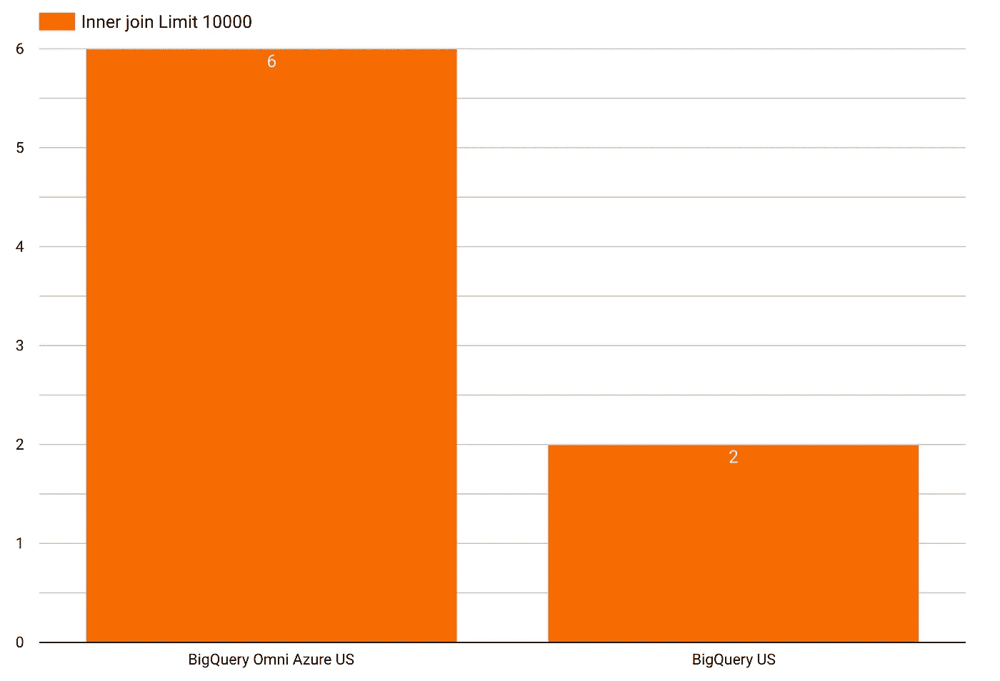

# BigQuery Omni 无处不在

> 原文：<https://medium.com/google-cloud/bigquery-omni-is-everywhere-afa2b5f64688?source=collection_archive---------0----------------------->

每次你喜欢使用一个工具时，你最终会需要尚未可用的特性…

这一次圣诞老人比预期的早到了！

我的公司在企业数据仓库中大量使用 BigQuery，但是像其他老公司一样，我们的遗留应用程序远离当前平台。

相信我，这就像试图在没有翻译的情况下讨论西班牙人和中国人一样，几乎是不可能的。

在这里，我们有 Omni(一年前在 Google Next 大会上宣布)来帮助我们完成这项任务。承诺是:

*   您的数据可以被**优先**
*   你的数据可以在另一个**云服务提供商**上
*   您的数据将可用于 **BigQuery**

听起来不错，因为我在世界各地的 Microsoft Azure 上托管了大量数据，有时 BigQuery 还不可用。

试试 Omni 能不能解决这个！

下面的例子是关于 AWS 的，但是我的例子是关于 Azure 的。

我必须上传或使用 Azure 区域上已经存储的数据，格式为 JSON、Parquet、Avro、ORC 或 CSV。

BigQuery 控制台的第一步是在两个世界之间建立连接(安全的外部连接)

现在魔法可以运作了

**现在是基准时间！**

SQL 是一个标准，不仅仅是在我的公司。我想看看我能做些什么，只要记住一个重要的事实:

*   在您选择托管 BigQuery 的 CSP 上有一个 Anthos 集群(由 Google 管理)
*   处理在 CSP 上完成，结果返回到控制台
*   Omni 的目标是帮助公司在 BigQuery 上提供数据，而不是在 GCP 之外提供 100%相同的 BigQuery 性能。因为它的运行位置可能会有所不同，并且您发送回控制台的数据量可能会受到网络等不同因素的影响。

**第一次基准测试(公共数据)**

我使用芝加哥出租车公共数据源来了解我的查询运行了多长时间:

*   77 GB 表
*   19，5856，374 行
*   没有分区
*   全扫描
*   使用运算符的最后测试意味着使用 AVG、提取日期、格式、组和顺序

我将限制从 1000 更改为 5000，只是为了在控制台中返回更大量的数据(不要太大，否则我会得到太大的错误输出，当前返回到控制台的数据限制为 2MB)

我也尝试过不在控制台而是直接将结果返回给源(Azure)，太费时间了，忘了那个想法吧…

**第二基准(公司数据)**

*   1 TB 表作为数据源+ 200MB 表
*   9172577750 行
*   与 Limit 10000 一起使用的内部联接函数(因为当前 Omni 对返回到控制台的数据的大小有限制)

**结论:**

性能没有那么差，那真的能解决问题！

现在等待更多的选项和功能可用。